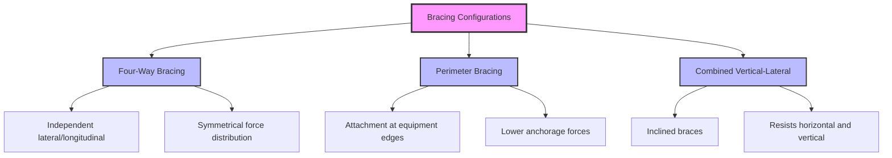
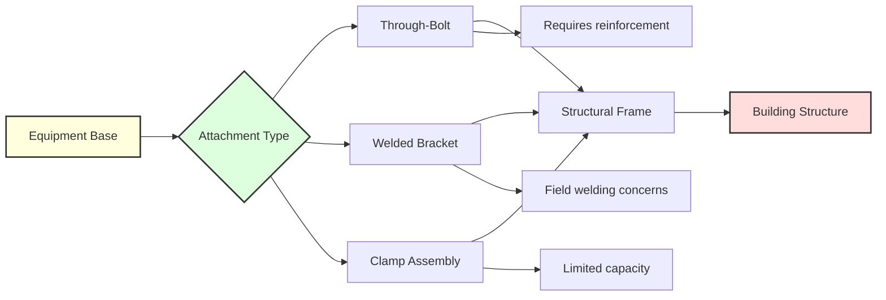

## Fundamental Bracing Principles

Lateral and longitudinal bracing systems protect HVAC equipment from horizontal seismic forces acting perpendicular to each other. Lateral bracing resists forces parallel to the equipment's width, while longitudinal bracing counters forces along its length. Effective seismic restraint requires both directional systems working independently to prevent equipment movement, overturning, or structural failure during seismic events.

The distinction between these bracing directions stems from the unpredictable nature of earthquake ground motion, which generates forces in all horizontal directions simultaneously. Equipment must resist these multidirectional forces through properly designed and installed bracing members that transfer seismic loads to the building structure.

## Horizontal Seismic Force Calculations

ASCE 7 establishes the design basis for horizontal seismic forces applied to nonstructural components, including HVAC equipment. The horizontal seismic force $F_p$ acts at the equipment's center of gravity:

$$F_p = \frac{0.4 a_p S_{DS} W_p}{R_p/I_p} \left(1 + 2\frac{z}{h}\right)$$

where:
- $F_p$ = horizontal seismic design force (lb or N)
- $a_p$ = component amplification factor (typically 2.5 for mechanical equipment)
- $S_{DS}$ = design spectral response acceleration at short periods
- $W_p$ = component operating weight (lb or N)
- $R_p$ = component response modification factor (typically 2.5 for HVAC equipment)
- $I_p$ = component importance factor (1.0 or 1.5)
- $z$ = height of attachment point above the base
- $h$ = average roof height of structure

The force is subject to minimum and maximum limits:

$$F_{p,min} = 0.3 S_{DS} I_p W_p$$

$$F_{p,max} = 1.6 S_{DS} I_p W_p$$

## Force Distribution to Bracing Members

The total horizontal force must be distributed to individual bracing members based on their orientation and geometry. For equipment with four attachment points, the force in each lateral or longitudinal direction divides among the bracing elements resisting that direction.

For symmetrically braced equipment with two braces per direction:

$$F_{brace} = \frac{F_p}{2 \cos \theta}$$

where $\theta$ is the angle of the brace from horizontal. Vertical braces ($\theta = 0°$) receive half the horizontal force, while inclined braces experience higher tension or compression forces.

## Center of Gravity Considerations

Equipment center of gravity (CG) location critically affects bracing design. The CG represents the point where the entire seismic mass can be considered concentrated. For rectangular equipment:

$$x_{CG} = \frac{\sum m_i x_i}{\sum m_i}, \quad y_{CG} = \frac{\sum m_i y_i}{\sum m_i}, \quad z_{CG} = \frac{\sum m_i z_i}{\sum m_i}$$

where $m_i$ represents individual component masses and $x_i$, $y_i$, $z_i$ are their coordinates.

Critical CG considerations include:

**Overturning Moment**: The horizontal force applied at the CG height creates an overturning moment:

$$M_{OT} = F_p \times h_{CG}$$

where $h_{CG}$ is the vertical distance from the base to the center of gravity.

**Restoring Moment**: The equipment weight provides a restoring moment:

$$M_R = W_p \times \frac{b}{2}$$

where $b$ is the base width in the direction of analysis. The safety factor against overturning is:

$$SF = \frac{M_R}{M_{OT}} \geq 1.5$$

**Eccentric Loading**: When CG does not align with geometric center, bracing members experience unequal forces requiring individual analysis.

## Bracing Configuration Types

### Four-Way Bracing System

Four-way bracing uses separate members in each orthogonal horizontal direction. This configuration provides:

- Clear load paths for each direction
- Independent resistance to lateral and longitudinal forces
- Simplified force distribution calculations
- Redundancy if one member fails

### Perimeter Bracing Approach

Perimeter bracing attaches restraints at equipment corners or edges rather than at the base center. This method:

- Reduces overturning moments by lowering effective CG
- Distributes anchorage forces across multiple points
- Accommodates equipment with limited base accessibility
- Requires coordination with equipment structural capability

### Combined Vertical-Lateral Systems

Inclined bracing members resist both horizontal and vertical seismic forces simultaneously:

$$F_{h,brace} = F_p \cos \alpha$$

$$F_{v,brace} = 0.2 S_{DS} W_p \cos \beta$$

where $\alpha$ and $\beta$ represent brace inclination angles in horizontal and vertical planes.

## Attachment Point Design

Attachment points must transfer calculated forces from bracing members into equipment structure without causing local failure. Critical factors include:

**Base Material Strength**: Equipment bases must resist concentrated loads at attachment points. Minimum base thickness and reinforcement requirements depend on material yield strength and applied forces.

**Edge Distance Requirements**: Bolted connections require minimum edge distances to prevent tearing:

$$d_e \geq 1.5d_b$$

where $d_e$ is edge distance and $d_b$ is bolt diameter.

**Connection Capacity**: Each attachment point must resist the maximum anticipated force with appropriate safety factors, typically 2.5 for seismic applications.

## Installation and Inspection Criteria

Proper installation ensures bracing system performance:

- Verify equipment weight matches design calculations
- Confirm CG location for top-heavy equipment
- Ensure bracing members align with intended directions
- Tighten all connections to specified torque values
- Inspect for interference with thermal expansion
- Document as-built brace angles and dimensions
- Test anchorage per ASTM E488 or equivalent

Quality control inspections should verify bracing member size, material grade, connection details, and structural adequacy of attachment points before final approval.

## Common Design Errors

Frequent mistakes in lateral and longitudinal bracing design include:

- Using single-direction bracing assuming symmetric equipment response
- Ignoring vertical CG location in overturning calculations
- Applying horizontal force at equipment base rather than CG
- Undersizing connections due to brace angle geometry
- Failing to account for eccentric mass distribution
- Inadequate anchorage into building structure
- Neglecting equipment flexibility and dynamic amplification

These errors can result in bracing system failure during seismic events, potentially causing equipment damage, building structural damage, or safety hazards.
