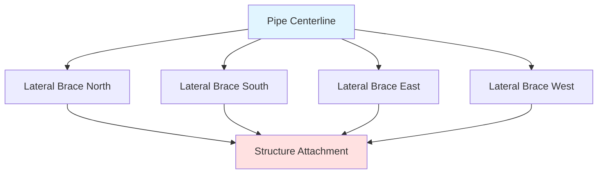
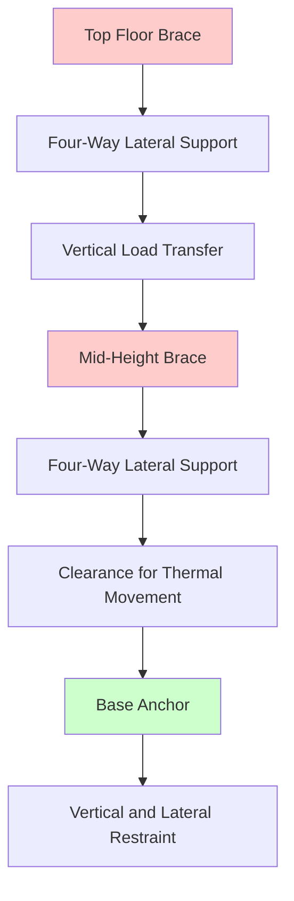

Seismic bracing of piping systems protects HVAC infrastructure from earthquake-induced damage by restraining pipe movement in both horizontal and vertical directions. Proper bracing design follows MSS SP-127 and NFPA 13 standards, which establish requirements for support spacing, load calculations, and installation details.

## Seismic Design Principles

Piping systems experience both inertial forces from their own mass and differential displacement between support points during seismic events. The fundamental design approach restrains pipes against these forces using lateral braces and longitudinal braces that transfer loads to the building structure.

**Seismic Force Calculation**

The horizontal seismic force on a piping system is determined by:

$$F_p = 0.4 a_p S_{DS} W_p \frac{1 + 2\frac{z}{h}}{R_p / I_p}$$

Where:
- $F_p$ = horizontal seismic force (lb)
- $a_p$ = component amplification factor (2.5 for piping)
- $S_{DS}$ = design spectral response acceleration
- $W_p$ = weight of pipe, fluid, and insulation (lb)
- $z$ = height of attachment point above grade (ft)
- $h$ = building height (ft)
- $R_p$ = component response modification factor (12 for piping)
- $I_p$ = component importance factor (1.0 or 1.5)

The minimum design force must not be less than:

$$F_{p,min} = 0.3 S_{DS} I_p W_p$$

## MSS SP-127 Requirements

MSS SP-127 (Bracing for Piping Systems Seismic) establishes maximum brace spacing and minimum load requirements. The standard applies to piping 1/2 inch and larger with fluid-filled weight exceeding 25 lb per linear foot.

**Maximum Brace Spacing**

Lateral braces resist horizontal forces perpendicular to the pipe axis. Maximum spacing depends on pipe diameter:

| Pipe Diameter | Maximum Lateral Brace Spacing |
|---------------|-------------------------------|
| 1/2" - 1" | 40 ft |
| 1-1/4" - 2" | 50 ft |
| 2-1/2" - 3-1/2" | 60 ft |
| 4" - 5" | 70 ft |
| 6" - 8" | 80 ft |
| 10" and larger | Calculate per equation |

For pipes 10 inches and larger, calculate maximum spacing:

$$L_{max} = 0.75 \sqrt{\frac{E I}{W_p}}$$

Where:
- $L_{max}$ = maximum brace spacing (ft)
- $E$ = modulus of elasticity (psi)
- $I$ = moment of inertia (in⁴)
- $W_p$ = pipe weight per foot (lb/ft)

**Longitudinal Braces**

Longitudinal braces resist forces parallel to the pipe axis. Install at changes in direction exceeding 12 feet of offset or every 80 feet on straight runs.

## Four-Way Bracing Configuration

Four-way bracing provides lateral restraint in two orthogonal horizontal directions. This configuration is required at critical locations including:

- Within 2 feet of changes in direction
- At branch connections exceeding 2 inches
- At riser tops and bottoms
- Near flexible couplings and expansion joints

**Brace Angle Requirements**

Braces must connect to the structure at angles between 30° and 60° from horizontal for optimal load transfer. The effective load capacity adjusts based on brace angle:

$$F_{eff} = \frac{F_p}{\sin(\theta)}$$

Where $\theta$ is the brace angle from horizontal.

## Riser Support Requirements

Vertical pipe risers require special consideration due to their height and potential for lateral sway. Install riser restraints meeting these criteria:

**Riser Bracing Configuration**

**Maximum Riser Height Without Intermediate Bracing**

$$H_{max} = 5 \sqrt{\frac{E I}{W_p}}$$

For risers exceeding this height, install intermediate four-way braces. Space intermediate braces at:

$$L_{riser} = 0.5 H_{max}$$

Top of riser bracing must occur within 12 inches of the highest point to prevent cantilever action.

## NFPA 13 Fire Sprinkler Requirements

NFPA 13 Section 9.3 establishes specific seismic bracing requirements for fire protection piping in Seismic Design Categories D, E, and F. These requirements often govern HVAC piping when routed together.

**Branch Line Bracing**

Branch lines with 4 or more sprinklers require lateral bracing. Maximum spacing:
- Branch lines 2-1/2" and smaller: 40 ft
- Branch lines 3" and larger: 50 ft

**Main and Riser Bracing**

Mains and risers require four-way bracing with closer spacing than MSS SP-127 in high seismic areas. Install braces at:
- Each change in direction
- Every 40 feet on straight runs for 2-1/2" and smaller
- Every 50 feet on straight runs for 3" and larger

## Support Design Loads

Brace assemblies must resist both vertical and horizontal loads. The combined stress check is:

$$\frac{f_a}{F_a} + \frac{f_b}{F_b} \leq 1.0$$

Where:
- $f_a$ = actual axial stress
- $F_a$ = allowable axial stress
- $f_b$ = actual bending stress
- $F_b$ = allowable bending stress

Hardware including clamps, fasteners, and structural attachments must have load ratings exceeding the design force by a minimum safety factor of 2.0.

## Installation Considerations

**Clearance Requirements**

Provide minimum clearances around pipes for thermal expansion:
- 1/2" to 2" pipes: 1/2" clearance
- 2-1/2" to 6" pipes: 1" clearance
- 8" and larger pipes: 2" clearance

**Attachment to Structure**

Braces must attach to structural elements capable of resisting the seismic loads. Acceptable attachment points include:
- Structural steel beams and columns
- Concrete columns and walls (minimum 4000 psi)
- Wood framing (Douglas Fir or better)

Do not attach braces to:
- Ceiling suspension systems
- Non-structural partitions
- Architectural finishes
- Other piping systems

**Documentation**

Maintain seismic bracing documentation including:
- Calculations showing force determination
- Brace spacing layouts on drawings
- Hardware load ratings and approvals
- Installation inspection records

Proper seismic bracing design and installation ensures piping system integrity during earthquake events, preventing catastrophic failures and maintaining critical HVAC and fire protection functions when most needed.

---

