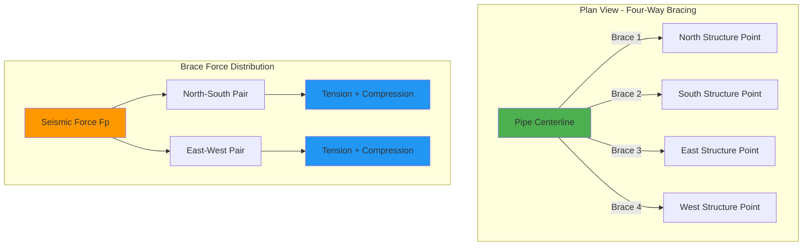
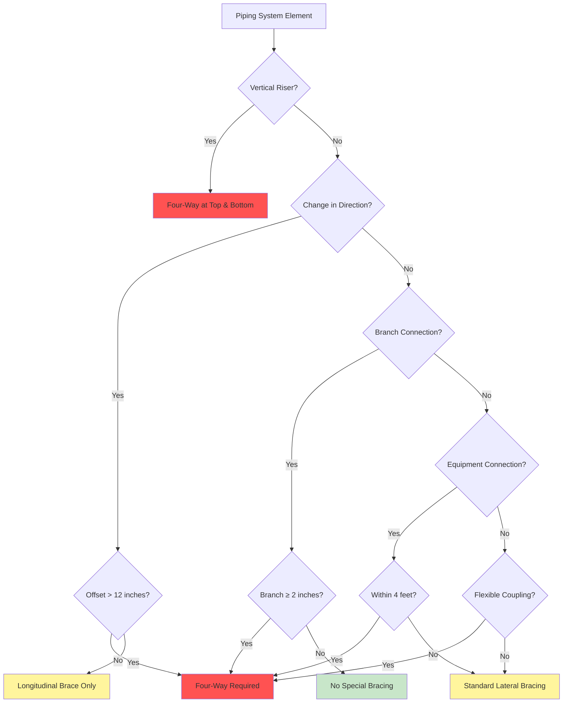
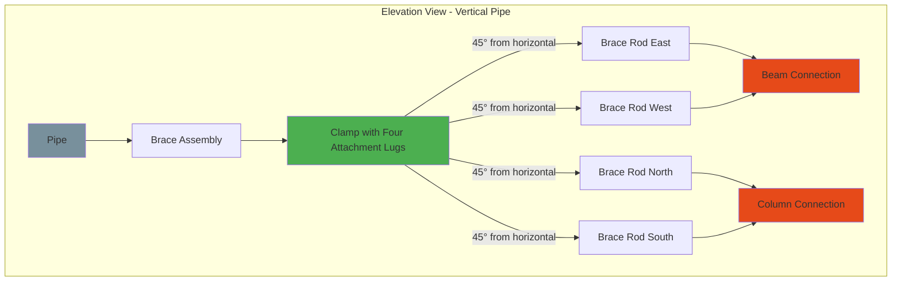
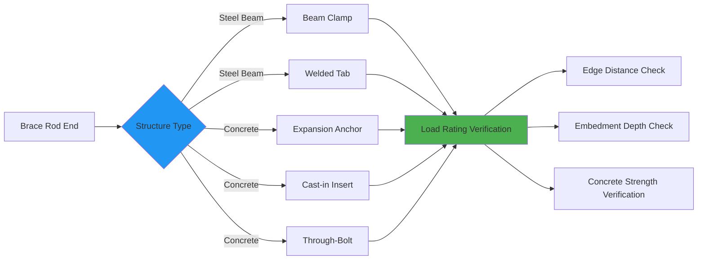

Four-way bracing provides complete lateral seismic restraint for HVAC piping by restraining horizontal movement in two orthogonal directions. This configuration is mandated at critical piping locations where unrestrained lateral displacement would compromise system integrity or create excessive stress on connections and equipment.

## Four-Way Bracing Configuration

Four-way bracing consists of two pairs of lateral braces oriented perpendicular to each other, each pair resisting horizontal seismic forces in one principal direction. The configuration creates a stable restraint system that prevents pipe displacement regardless of earthquake motion direction.

**Key Configuration Requirements**

The four braces must be positioned to create two orthogonal restraint axes, typically aligned with building structural grids or primary seismic force directions. Proper geometry ensures balanced load distribution and prevents torsional rotation of the pipe about its longitudinal axis.

Optimal brace arrangement places opposite braces at 180° separation and adjacent braces at 90° separation. Deviation from ideal geometry requires adjustment of brace capacity calculations to account for force vector resolution.

## When Four-Way Bracing Is Required

MSS SP-127 and NFPA 13 mandate four-way bracing at specific piping locations where lateral forces converge or where pipe system vulnerability increases:

**Critical Locations Requiring Four-Way Bracing**

- **Changes in Direction:** Within 2 feet of elbows, tees, and crosses where branch offset exceeds 12 inches
- **Riser Connections:** At top and bottom of vertical risers exceeding 8 feet in height
- **Branch Connections:** At branch takeoffs 2 inches and larger connecting to mains
- **Equipment Connections:** Within 4 feet of equipment nozzles including pumps, air separators, expansion tanks
- **Flexible Couplings:** Adjacent to expansion joints, flexible connectors, and seismic separations
- **Main and Header Transitions:** Where pipe size changes by 2 inches or more
- **Building Separations:** At seismic joints where differential building movement occurs

**NFPA 13 Additional Requirements**

For fire protection systems in Seismic Design Categories D, E, and F:

- Four-way bracing required at every change in direction on mains and risers
- Branch lines with 4 or more sprinklers require lateral bracing every 40 feet
- Armover configurations require four-way bracing at the vertical-to-horizontal transition

## Brace Capacity and Load Calculations

Each brace in a four-way configuration must resist the component of seismic force resolved along its axis. The horizontal seismic force is distributed between opposing brace pairs based on orthogonal force components.

**Horizontal Seismic Force**

The total horizontal seismic force on the pipe segment is:

$$F_p = 0.4 a_p S_{DS} W_p \frac{1 + 2\frac{z}{h}}{R_p / I_p}$$

Where:
- $F_p$ = horizontal seismic force (lb)
- $a_p$ = component amplification factor (2.5 for piping)
- $S_{DS}$ = design spectral response acceleration at short period (g)
- $W_p$ = weight of pipe, fluid, and insulation (lb)
- $z$ = height of attachment above base (ft)
- $h$ = mean roof height of structure (ft)
- $R_p$ = component response modification factor (12 for piping)
- $I_p$ = component importance factor (1.0 or 1.5)

Minimum force requirement:

$$F_{p,min} = 0.3 S_{DS} I_p W_p$$

**Force Distribution in Four-Way System**

When earthquake motion occurs at angle $\alpha$ to the principal brace axes, the force components in each orthogonal direction are:

$$F_x = F_p \cos(\alpha)$$

$$F_y = F_p \sin(\alpha)$$

For design purposes, assume maximum force acts simultaneously in both directions with 100% in one direction and 30% orthogonal:

$$F_{design,x} = F_p$$

$$F_{design,y} = 0.3 F_p$$

Or vice versa, whichever produces maximum brace loads.

**Individual Brace Load with Angle Adjustment**

Each brace connects to the pipe at angle $\theta$ from horizontal. The required brace tension/compression capacity is:

$$T_{brace} = \frac{F_{design}}{\sin(\theta)}$$

Where $\theta$ is measured from horizontal plane to brace centerline. Optimal brace angle range is 30° to 60° from horizontal.

**Brace Capacity Design Equation**

The brace member must satisfy:

$$T_{brace} \leq \phi T_{allowable}$$

Where:
- $T_{allowable}$ = tensile or compressive capacity of brace rod or strut
- $\phi$ = resistance factor (0.9 for tension, varies for compression based on slenderness)

For compression members, check slenderness ratio:

$$\frac{KL}{r} \leq 200$$

Where:
- $K$ = effective length factor (1.0 for pinned-pinned)
- $L$ = unbraced length (ft)
- $r$ = radius of gyration (in)

**Example Calculation**

Given:
- Pipe: 6-inch Schedule 40 steel, insulated
- $W_p = 450$ lb (tributary weight between braces)
- $S_{DS} = 1.0g$
- $I_p = 1.5$ (critical system)
- $z/h = 0.75$ (near roof)
- Brace angle $\theta = 45°$

Calculate seismic force:

$$F_p = 0.4(2.5)(1.0)(450) \frac{1 + 2(0.75)}{12/1.5} = 0.4(2.5)(1.0)(450) \frac{2.5}{8}$$

$$F_p = 450 \times 0.3125 = 140.6 \text{ lb}$$

Check minimum:

$$F_{p,min} = 0.3(1.0)(1.5)(450) = 202.5 \text{ lb} \rightarrow \text{governs}$$

Brace load (assuming force acts along one axis):

$$T_{brace} = \frac{202.5}{\sin(45°)} = \frac{202.5}{0.707} = 286 \text{ lb}$$

Design brace capacity with safety factor:

$$T_{design} = 286 \times 2.0 = 572 \text{ lb minimum}$$

## Orthogonal Brace Arrangement

Proper geometric arrangement of the four braces ensures balanced load transfer and prevents eccentric loading that could induce pipe rotation or bending.

**Geometric Requirements**

1. **Angular Spacing:** Maintain 90° ± 15° between adjacent braces in plan view
2. **Elevation Angle:** All four braces should terminate at same vertical distance from pipe, typically 30° to 60° from horizontal
3. **Symmetry:** Opposite braces in each pair should have equal angles and lengths when possible
4. **Clearance:** Minimum 2-inch clearance between brace hardware and adjacent pipes, ducts, or structure

**Attachment Point Selection**

Brace connection to building structure must meet load path requirements:

- Steel structure: Beam flanges, web connections, or column faces
- Concrete structure: Embedded plates, expansion anchors (minimum 3/8-inch diameter)
- Wood structure: Solid blocking, not less than 2×6 Douglas Fir-Larch (rare in commercial)

Verify structure can resist brace loads without overstressing or excessive deformation. Maximum attachment point displacement under seismic load should not exceed 1/4 inch.

## Brace Angle Considerations

Brace angle directly affects load magnitude and effectiveness of restraint. Shallow angles increase axial loads; steep angles reduce lateral load component.

**Brace Efficiency vs. Angle**

| Brace Angle θ | sin(θ) | Force Multiplier | Efficiency |
|---------------|--------|------------------|------------|
| 30° | 0.500 | 2.00 | Minimum acceptable |
| 45° | 0.707 | 1.41 | Optimal |
| 60° | 0.866 | 1.15 | Good |
| 75° | 0.966 | 1.04 | Inefficient lateral |
| 90° | 1.000 | 1.00 | No lateral component |

**Effective Horizontal Force Component**

The horizontal force component provided by an inclined brace under load $T$ is:

$$F_{horizontal} = T \sin(\theta)$$

Therefore, to provide required horizontal force $F_p$, the brace must carry:

$$T = \frac{F_p}{\sin(\theta)}$$

Angles less than 30° result in excessive brace loads and potential buckling in compression. Angles greater than 60° reduce lateral effectiveness and may not provide adequate restraint.

**Dual-Angle Optimization**

Where vertical space is limited, use combination of:
- Steeper braces (50°-60°) for lower brace loads
- Positioned to maintain orthogonal pairs in plan

Where vertical space is ample:
- Shallower braces (30°-45°) provide better lateral restraint per unit brace length
- Easier installation at standard beam elevations

## Installation Requirements Per MSS SP-127

**Pipe Clamp Selection**

Four-way brace assemblies require clamps with four attachment lugs positioned at 90° intervals. Clamp must:

- Match pipe outside diameter including insulation if present
- Provide minimum 240° contact with pipe surface
- Transfer load without crushing or deforming pipe
- Include thermal padding to prevent thermal bridging on chilled or hot pipes

**Hardware Specifications**

All brace components must meet or exceed:

- Brace rods: ASTM A36 steel minimum, 3/8-inch diameter minimum for pipes to 2 inches
- Larger pipes require 1/2-inch to 3/4-inch diameter rods based on load calculations
- Threaded connections: Minimum 3 threads engaged beyond nut
- Turnbuckles: Forged steel, load-rated for brace design load
- Structural attachments: Welded or bolted with capacity exceeding brace load by 2× minimum

**Installation Tolerances**

- Brace rod alignment: Within 5° of design angle
- Clamp tightness: Torque to manufacturer specification, verify no slippage
- Connection hardware: All nuts fully tightened, lock washers or thread locking compound applied
- Clearances: Verify no interference with thermal expansion movement

## NFPA 13 Fire Protection Bracing Standards

NFPA 13 Section 9.3 establishes specific four-way bracing requirements for sprinkler system piping in high seismic zones.

**Seismic Design Category Requirements**

| SDC | Four-Way Bracing Requirement |
|-----|------------------------------|
| A, B, C | Minimal requirements, primarily at risers |
| D | Four-way at direction changes, 50 ft max spacing |
| E, F | Four-way at all direction changes, 40 ft spacing, branch line bracing |

**Branch Line Special Provisions**

Branch lines in SDC D-F with 4 or more sprinklers:
- Lateral bracing required (two braces, orthogonal preferred)
- Maximum 40 feet spacing for 2.5-inch and smaller
- Braces must connect to structure, not mains
- Flexible couplings require four-way within 24 inches

**Differential Movement Accommodation**

At building seismic joints:
- Install flexible coupling
- Four-way bracing on each side of coupling within 2 feet
- Verify sufficient flexible coupling displacement capacity for anticipated differential movement
- Typical requirement: ±2 inches minimum

## Brace Connection Details

**Pipe Clamp Connection**

The clamp-to-pipe interface must distribute loads without point loading:

$$\sigma_{bearing} = \frac{T_{brace}}{A_{contact}}$$

Where:
- $\sigma_{bearing}$ = bearing stress on pipe wall (psi)
- $T_{brace}$ = brace load (lb)
- $A_{contact}$ = effective contact area (in²)

Maintain bearing stress below:
- Steel pipe: 20,000 psi
- Copper pipe: 10,000 psi
- CPVC pipe: 1,000 psi (rarely used for seismic-braced systems)

**Structure Connection Options**

**Concrete Anchor Design**

For expansion anchors in concrete:

$$T_{anchor} \leq \phi T_{nominal}$$

Check all failure modes:
- Steel failure of anchor
- Concrete breakout
- Pullout failure
- Side-face blowout (if near edge)

Minimum edge distance: 7× anchor diameter

Minimum embedment: 4 inches for 3/8-inch anchors, 5 inches for 1/2-inch anchors

## Quality Control and Inspection

**Pre-Installation Verification**

- Review calculations confirming brace size and spacing
- Verify hardware load ratings match or exceed design requirements
- Confirm attachment points identified on structural drawings
- Check clearances for pipe thermal expansion

**Installation Inspection**

- Verify clamp orientation places lugs at 90° increments
- Confirm brace angles within tolerance of design (±5°)
- Check all connections tight and secure
- Verify no interference with adjacent systems
- Photograph completed installations at critical locations

**Certification and Documentation**

- Installer certification that work complies with MSS SP-127 or NFPA 13
- Load rating documentation for all hardware components
- As-built drawings showing actual brace locations
- Inspection reports by authority having jurisdiction

Proper four-way bracing design and installation protects HVAC piping systems from seismic damage, maintaining system integrity and preventing cascading failures during earthquake events. Adherence to MSS SP-127, NFPA 13, and ASCE 7 requirements ensures code compliance and optimal seismic performance.
