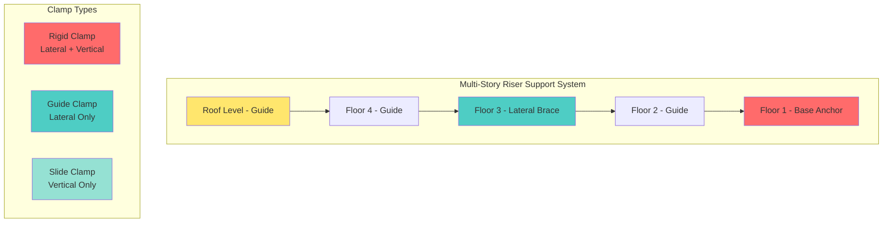
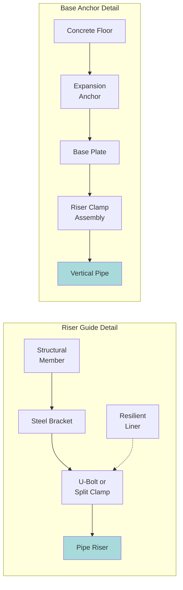

Vertical piping systems (risers) require specialized seismic restraint approaches that differ fundamentally from horizontal piping. Riser supports must resist both lateral seismic forces and vertical loads while accommodating thermal expansion and providing structural continuity through multiple floors.

## Riser Support Fundamentals

Vertical piping experiences unique seismic demands due to its orientation and multi-floor span. The primary challenge involves transferring lateral forces at strategic locations while maintaining vertical load support and allowing controlled movement at intermediate floors.

**Critical design considerations:**
- Lateral force distribution along riser height
- Vertical load path to structural supports
- Thermal expansion accommodation
- Floor penetration detailing
- Differential building movement

## Seismic Load Calculations for Risers

The lateral seismic force at each support point depends on the tributary weight and seismic response characteristics.

**Lateral force per support:**

$$F_p = 0.4 a_p S_{DS} I_p W_p \left(\frac{1 + 2\frac{z}{h}}{R_p / I_p}\right)$$

Where:
- $F_p$ = lateral seismic force on riser segment (lb)
- $a_p$ = component amplification factor (1.0 for rigid, 2.5 for flexible)
- $S_{DS}$ = design spectral response acceleration
- $I_p$ = component importance factor (1.0 or 1.5)
- $W_p$ = operating weight of riser segment (lb)
- $z$ = height of support above base (ft)
- $h$ = building height (ft)
- $R_p$ = component response modification factor (typically 12 for piping)

**Vertical load at base anchor:**

$$P_{base} = W_{total} \pm F_p \left(\frac{e}{d}\right)$$

Where:
- $W_{total}$ = total weight of riser including fluid (lb)
- $e$ = eccentricity of lateral force application (in)
- $d$ = distance from anchor to furthest clamp (in)

The base anchor must resist combined vertical load from pipe weight and overturning moment from lateral forces.

## Riser Clamp Configurations

**Clamp type selection:**

| Support Type | Lateral Restraint | Vertical Support | Thermal Movement | Application |
|--------------|-------------------|------------------|------------------|-------------|
| Base Anchor | Both directions | Full support | Fixed point | Lowest floor |
| Lateral Brace | Both directions | Partial/none | Allows vertical | Every 4-5 floors |
| Guide | Both directions | None | Allows vertical | Intermediate floors |
| Slide Support | None | Full support | Allows lateral | Not for seismic |

## Floor Penetration Details

Floor penetrations for risers must accommodate both seismic movement and prevent fire/smoke spread.

**Design requirements:**
- Oversized sleeve: minimum 2 inches clearance around pipe
- Sleeve extends 2 inches above finished floor
- Fire-rated packing material (mineral wool) fills annular space
- Firestop system rated for dynamic movement
- Clearance verification: $C_{min} = 2.0 + D_p \times 0.025$

Where $D_p$ is pipe diameter in inches.

**Seismic separation calculation:**

$$\Delta_{seismic} = \delta_x \sqrt{\left(\frac{h_x}{h}\right)^2 + \left(\frac{h_y}{h}\right)^2}$$

Where:
- $\delta_x$ = design story drift at level x
- $h_x$ = height of penetration above grade
- $h$ = total building height
- $h_y$ = height of floor above

## Guide and Anchor Configurations

**Guide spacing requirements:**

Maximum spacing between lateral supports:

$$L_{max} = 13.5 \sqrt{\frac{d}{p}}$$

Where:
- $L_{max}$ = maximum span between guides (ft)
- $d$ = pipe outside diameter (in)
- $p$ = design pressure (psi)

For seismic applications, reduce $L_{max}$ by 25% or use maximum 30 feet, whichever is less.

## Anchor Load Distribution

Base anchors must resist the most severe load combination. The critical anchor bolt tension:

$$T_{bolt} = \frac{4M}{n \times b} + \frac{W}{n}$$

Where:
- $M$ = overturning moment from lateral forces (lb-ft)
- $n$ = number of anchor bolts
- $b$ = bolt pattern dimension (ft)
- $W$ = vertical load (tension or compression) (lb)

**Anchor design factors:**
- Minimum 4 bolts per base plate
- Edge distance: $\geq 7 \times$ bolt diameter
- Bolt spacing: $\geq 4 \times$ bolt diameter
- Concrete strength: minimum 3,000 psi at 28 days
- Safety factor: 4.0 for seismic tension loads

## Construction Considerations

**Installation sequence:**
1. Verify structural support capacity at each support location
2. Install base anchor with surveyed alignment
3. Install guides at intermediate floors working upward
4. Verify vertical plumb tolerance (1/4 inch per 10 feet)
5. Install lateral braces at designated floors
6. Torque all connections per manufacturer specifications
7. Install firestop at all penetrations

**Common errors to avoid:**
- Undersized penetration sleeves causing binding
- Rigid attachment at all floors (prevents thermal expansion)
- Inadequate base anchor embedment depth
- Missing or improper firestop installation
- Failure to account for building drift in calculations

## Code References

Seismic riser design must comply with ASCE 7 Chapter 13, IBC Section 1621, and ASME B31.9. Additional requirements may apply for pressure piping under ASME B31.1. Local jurisdictions may impose more restrictive requirements in high seismic zones (SDC D, E, F).

Proper riser support design ensures vertical piping system integrity during seismic events while maintaining operational reliability and code compliance across the structure's full height.
