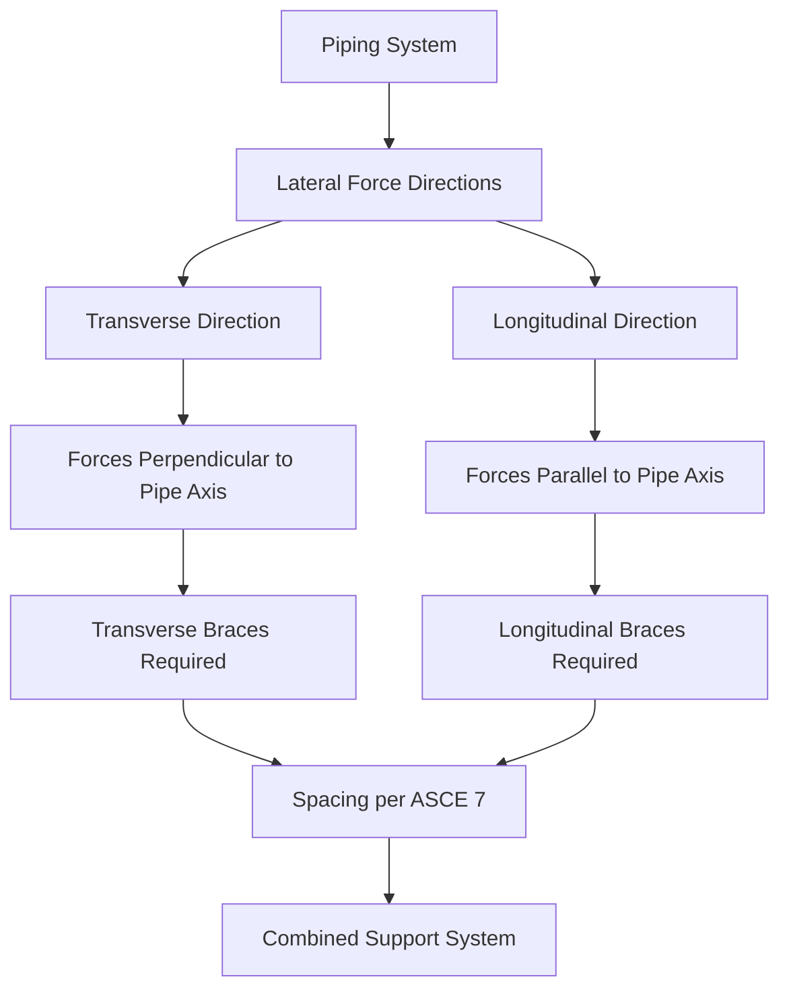
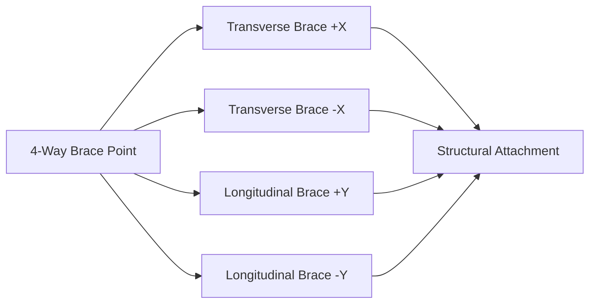

Seismic bracing of HVAC piping systems requires support elements oriented to resist lateral forces in multiple directions. Transverse and longitudinal supports form the foundation of a comprehensive seismic restraint system, with each type designed to resist forces perpendicular and parallel to the pipe axis respectively.

## Directional Definitions

**Transverse supports** resist lateral forces acting perpendicular to the longitudinal axis of the pipe. These forces result from ground motion occurring at right angles to the pipe run direction.

**Longitudinal supports** resist lateral forces acting parallel to the longitudinal axis of the pipe. These forces result from ground motion occurring along the pipe run direction.

Both support types must be designed to resist seismic forces in their respective directions while accommodating thermal expansion, normal operating loads, and dynamic effects during seismic events.

## Support Orientation Requirements

The orientation of support elements determines their effectiveness in resisting seismic forces. A complete bracing system requires supports in both directions, though some brace configurations can provide resistance in multiple directions simultaneously.

## Lateral Force Calculations

The design lateral force for seismic bracing of piping components is calculated according to ASCE 7 Chapter 13 (Nonstructural Components):

$$F_p = \frac{0.4 a_p S_{DS} W_p}{R_p / I_p} \left(1 + 2\frac{z}{h}\right)$$

Where:
- $F_p$ = seismic design force (lbs)
- $a_p$ = component amplification factor (2.5 for piping)
- $S_{DS}$ = design spectral response acceleration at short periods
- $W_p$ = component operating weight (lbs)
- $R_p$ = component response modification factor (12 for piping with joints, 6 for other)
- $I_p$ = component importance factor (1.0 to 1.5)
- $z$ = height of attachment point above base
- $h$ = average roof height of structure

The force $F_p$ must satisfy the bounds:

$$F_{p,min} = 0.3 S_{DS} I_p W_p$$

$$F_{p,max} = 1.6 S_{DS} I_p W_p$$

This total lateral force must be distributed between transverse and longitudinal support elements based on the direction of ground motion being analyzed.

## Transverse Support Design

Transverse supports typically consist of:

**Rigid braces**: Angled steel members connecting the pipe to structural elements, designed to resist tension and compression forces perpendicular to the pipe axis.

**Calculation for transverse brace force**:

$$F_T = F_p \cos(\theta)$$

Where $\theta$ is the angle between the brace and the horizontal plane. For a brace at 45°:

$$F_{brace} = \frac{F_T}{\sin(45°)} = 1.414 F_T$$

**Four-way bracing**: Combination of transverse braces in opposing directions provides redundancy and balanced restraint.

## Longitudinal Support Design

Longitudinal supports resist forces along the pipe axis through:

**Riser braces**: Vertical pipe runs require longitudinal supports at each floor penetration to prevent axial movement.

**Longitudinal sway braces**: Angled members oriented parallel to the pipe run direction.

The longitudinal force distribution:

$$F_L = F_p \sin(\alpha)$$

Where $\alpha$ is the angle of the longitudinal brace to the pipe axis.

## Support Spacing Requirements

ASCE 7 and NFPA 13 establish maximum spacing for seismic bracing based on pipe diameter and tributary weight:

| Pipe Diameter | Maximum Spacing (Transverse) | Maximum Spacing (Longitudinal) |
|---------------|------------------------------|--------------------------------|
| ≤ 2 in | 40 ft | 80 ft |
| 2.5 - 3.5 in | 40 ft | 80 ft |
| 4 - 5 in | 40 ft | 80 ft |
| 6 in | 40 ft | 50 ft |
| 8 - 12 in | 40 ft | 40 ft |

Spacing must be reduced when:
- Pipe weight exceeds standard limits
- Additional concentrated loads exist (valves, equipment)
- Intermediate flexible connections are present

## Combined Support Systems

Four-way bracing at a single point provides both transverse and longitudinal restraint. This configuration requires careful load distribution analysis to ensure each brace member is properly sized.

The force in each brace of a four-way system:

$$F_{brace,i} = \frac{F_p}{\sin(\theta_i)}$$

Where $\theta_i$ is the angle of the individual brace to the horizontal plane.

## Installation Considerations

**Clearance requirements**: Braces must not interfere with thermal expansion movements. Provide adequate clearance or use expansion joints near brace points.

**Structural attachment**: All braces must connect to structural elements capable of resisting the applied loads. Attachment to architectural finishes or non-structural elements is prohibited.

**Snubber applications**: Where thermal movement exceeds brace capacity, hydraulic or mechanical snubbers allow normal expansion while restraining seismic motion.

**Field verification**: Each installation requires verification that brace angles, attachment points, and support spacing match design documents.

## Analysis Methods

The equivalent static method (ESM) applies to most HVAC piping systems. For critical or complex installations, dynamic analysis may be required:

$$\ddot{u}(t) + 2\zeta\omega\dot{u}(t) + \omega^2 u(t) = -a_g(t)$$

Where:
- $u(t)$ = relative displacement
- $\zeta$ = damping ratio
- $\omega$ = natural frequency
- $a_g(t)$ = ground acceleration

This differential equation describes the dynamic response of the piping system to seismic ground motion.

## Compliance Standards

- **ASCE 7**: Minimum Design Loads for Buildings and Other Structures (Chapter 13)
- **NFPA 13**: Installation of Sprinkler Systems (seismic bracing requirements)
- **SMACNA**: Seismic Restraint Manual (piping support details)
- **ASME B31.1/B31.9**: Power Piping and Building Services Piping codes

Proper implementation of transverse and longitudinal supports ensures HVAC piping systems remain operational following seismic events and prevents catastrophic failures that could compromise building safety.
