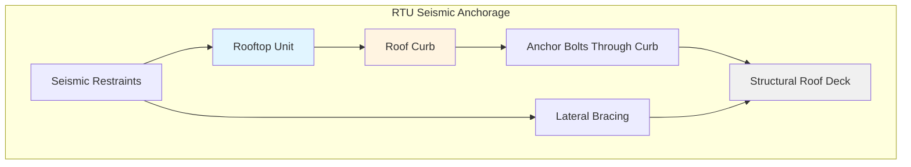
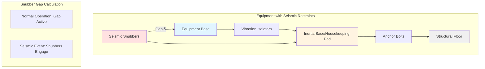
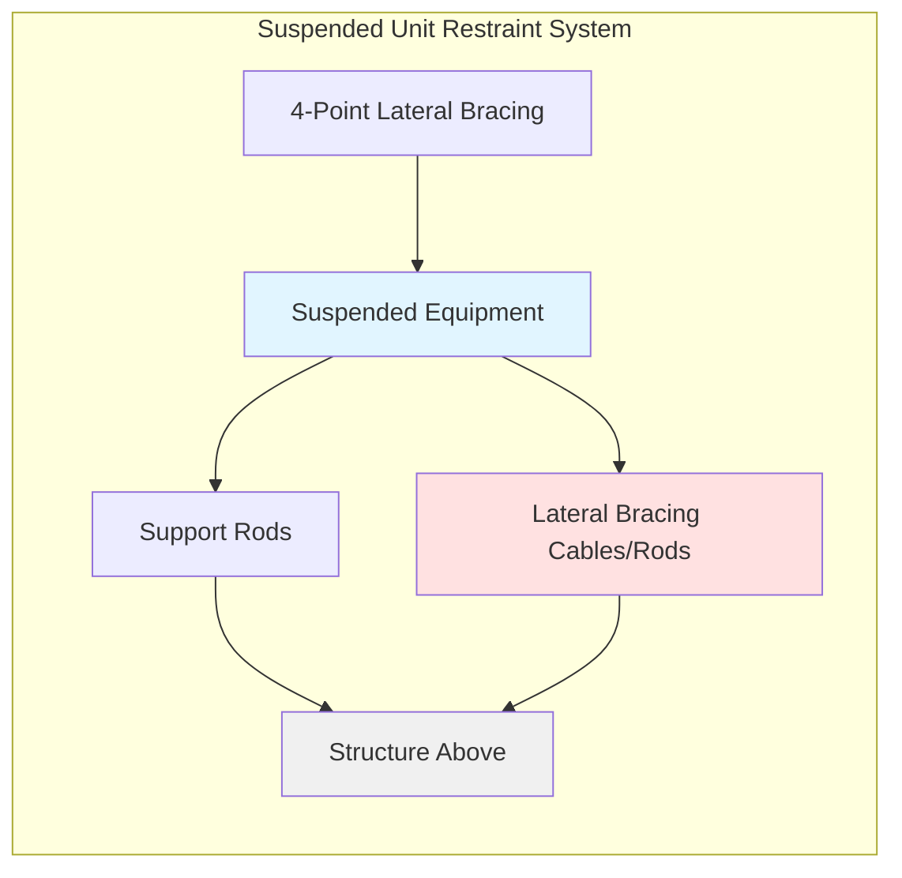

# Seismic Restraints for HVAC Equipment

Proper seismic restraint design protects HVAC equipment from earthquake-induced forces and prevents catastrophic failures. This guide covers force calculations, anchorage design, and installation requirements per IBC, ASCE 7, and SMACNA standards.

## Seismic Force Calculations

### Horizontal Seismic Force (Fp)

The horizontal seismic design force for nonstructural components is calculated using ASCE 7 equation 13.3-1:

$$F_p = \frac{0.4 a_p S_{DS} W_p}{(R_p/I_p)} \left(1 + 2\frac{z}{h}\right)$$

Subject to:

$$F_{p,\text{max}} = 1.6 S_{DS} I_p W_p$$

$$F_{p,\text{min}} = 0.3 S_{DS} I_p W_p$$

Where:
- $F_p$ = seismic design force applied to component (lbs or kN)
- $a_p$ = component amplification factor (typically 2.5 for mechanical equipment)
- $S_{DS}$ = design spectral response acceleration at short periods
- $W_p$ = component operating weight including contents
- $R_p$ = component response modification factor (varies by equipment type)
- $I_p$ = component importance factor (1.0 or 1.5)
- $z$ = height of attachment point above grade
- $h$ = average roof height of structure

### Equipment Response Modification Factors

| Equipment Type | Rp Value | Notes |
|----------------|----------|-------|
| Mechanical equipment | 2.5 | General HVAC equipment |
| Vibration isolated equipment | 2.5 | With seismic snubbers |
| Distributed systems | 2.5 | Ducts, piping below 12 in diameter |
| Equipment on vibration isolators | 2.5 | If Fp ≥ 1.6 times isolator restoring force |
| Tanks and vessels | 2.5 | Storage tanks, water heaters |
| Boilers and pressure vessels | 1.0 | High hazard equipment |

## Anchorage Design Requirements

### Minimum Anchorage Strength

Anchors must resist both horizontal and vertical seismic forces:

**Horizontal Force:**
$$F_h = F_p$$

**Vertical Force (concurrent):**
$$F_v = 0.2 S_{DS} W_p$$

### Anchorage Safety Factors

Anchor design strength must exceed applied loads with appropriate safety factors:

$$\phi R_n \geq \text{Required Strength}$$

Where:
- $\phi$ = strength reduction factor (0.65 for cast-in anchors, 0.55 for post-installed)
- $R_n$ = nominal anchor strength in tension or shear

## Equipment Anchorage Configurations

### Curb-Mounted Rooftop Units

**Design Criteria:**
- Minimum 4 anchor bolts per curb
- Bolt diameter ≥ 1/2 inch for units < 1000 lbs
- Bolt diameter ≥ 5/8 inch for units > 1000 lbs
- Embed depth per manufacturer and structural requirements
- Lateral restraints at 4 corners if Fp exceeds curb weight

### Floor-Mounted Equipment on Isolators

**Seismic Snubber Requirements:**
- Maximum clearance gap: 1/4 inch
- Snubber capacity must resist full Fp
- All-directional restraint (both horizontal axes)
- Vertical restraint if required by ASCE 7
- Minimum 4 snubbers per equipment base

### Suspended Equipment Bracing

For ceiling-hung equipment (fan coil units, air handlers), restraint consists of:

**Bracing Configuration:**
- Minimum 4-point lateral restraint
- Brace angle 45° from horizontal (30° to 60° acceptable)
- Brace capacity ≥ Fp/number of braces in direction
- No reliance on ceiling grid for seismic resistance
- Direct attachment to structural elements

## Code Compliance Requirements

### IBC Seismic Design Categories

| SDC | SDS Range | Equipment Anchoring Required |
|-----|-----------|------------------------------|
| A | SDS < 0.167g | No specific requirements |
| B | 0.167g ≤ SDS < 0.33g | Limited requirements |
| C | 0.33g ≤ SDS < 0.50g | Full anchorage and bracing |
| D, E, F | SDS ≥ 0.50g | Enhanced requirements, special inspections |

### ASHRAE Guideline 13 Provisions

**Equipment Weight Thresholds:**
- Equipment < 400 lbs: Simplified anchorage acceptable (SDC A-C)
- Equipment ≥ 400 lbs: Full seismic analysis required
- Equipment > 10,000 lbs: Enhanced design and special inspection

**Installation Height Considerations:**
- Ground-mounted: Standard analysis
- Roof-mounted: Amplification factor z/h applies
- Equipment > 30 ft above grade: Increased force coefficients

### SMACNA Seismic Restraint Manual

Key provisions from SMACNA guidelines:

**Duct Bracing:**
- Ducts ≥ 6 sq ft cross-section require lateral bracing
- Maximum brace spacing: 30 ft for longitudinal, 12 ft for transverse
- Brace capacity: 100 lbs minimum, or calculated seismic force

**Pipe Bracing:**
- Pipes ≥ 2.5 inch diameter require seismic bracing (SDC C-F)
- Maximum brace spacing: 40 ft for longitudinal, 12 ft for transverse
- Four-way bracing at changes in direction

**Equipment Installation:**
- Concrete housekeeping pads minimum 4 inches thick
- Grout or shim between equipment and mounting surface
- Anchor bolts installed per ACI 318 provisions
- Field verification of substrate strength

## Vibration Isolation with Seismic Restraint

### Restoring Force Check

For equipment on vibration isolators, verify:

$$F_p \geq 1.6 \times k \times \delta_{static}$$

Where:
- $k$ = isolator spring stiffness (lbs/inch)
- $\delta_{static}$ = static deflection under equipment weight (inches)

If this criterion is not satisfied, use Rp = 1.0 instead of 2.5.

### Snubber Gap Calculation

Maximum allowable gap between equipment and snubber:

$$\delta_{gap} = \min\left(\frac{1}{4}\text{ inch}, \frac{\delta_{static}}{2}\right)$$

This prevents equipment from gaining excessive momentum before engaging seismic restraints.

## Installation and Inspection

### Critical Installation Steps

1. **Substrate verification:** Confirm concrete strength (minimum 2500 psi) and thickness
2. **Anchor installation:** Follow manufacturer torque specifications
3. **Gap verification:** Measure and document snubber clearances
4. **Alignment:** Ensure equipment level and properly supported
5. **Documentation:** Record anchor types, embedment depths, torque values

### Special Inspection Requirements

SDC D, E, F require special inspection for:
- Equipment with Ip = 1.5 (essential facilities)
- Supports for equipment weighing > 400 lbs
- Post-installed anchors in concrete
- Field welding of seismic braces

### Common Installation Errors

- Insufficient embedment depth for anchors
- Oversized holes reducing anchor capacity
- Missing or improperly adjusted seismic snubbers
- Inadequate edge distance for concrete anchors
- Reliance on non-structural elements (architectural features, ceiling grid)
- Incorrect torque application to anchor bolts

## Design Calculation Example

**Given:**
- Rooftop air handler: Wp = 2,500 lbs
- Location: SDC D, SDS = 1.0g
- Height: z = 40 ft, h = 45 ft
- Importance factor: Ip = 1.0

**Calculation:**

$$F_p = \frac{0.4 \times 2.5 \times 1.0 \times 2500}{2.5/1.0} \left(1 + 2\frac{40}{45}\right) = 2,778 \text{ lbs}$$

Check maximum:
$$F_{p,max} = 1.6 \times 1.0 \times 1.0 \times 2500 = 4,000 \text{ lbs}$$ ✓

Check minimum:
$$F_{p,min} = 0.3 \times 1.0 \times 1.0 \times 2500 = 750 \text{ lbs}$$ ✓

**Design force: Fp = 2,778 lbs**

Required anchor shear strength (4 bolts):
$$V_{required} = \frac{2778}{4} = 695 \text{ lbs per bolt}$$

Select 5/8" diameter expansion anchor with φVn ≥ 695 lbs.

## Conclusion

Seismic restraint design requires careful attention to code-mandated force calculations, proper anchorage selection, and installation quality. Following ASCE 7 methodology, IBC requirements, and SMACNA guidelines ensures equipment remains functional and safe during seismic events. Proper documentation and special inspection provide verification that installed systems meet design intent and regulatory requirements.
