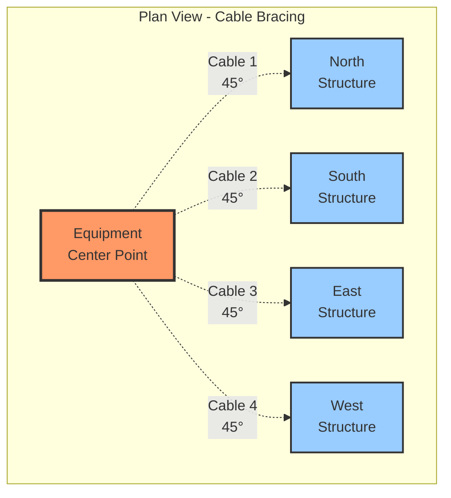
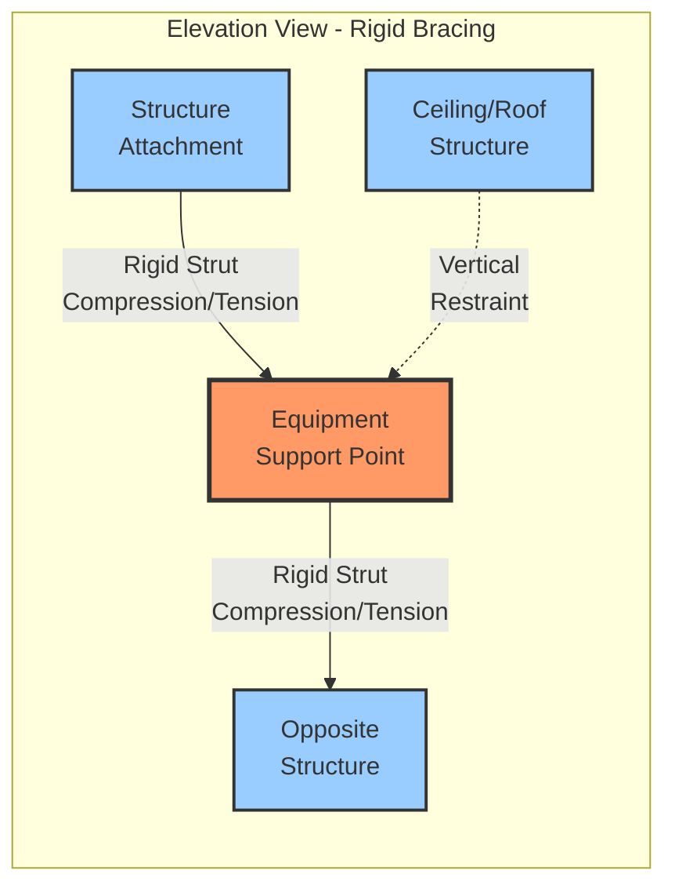
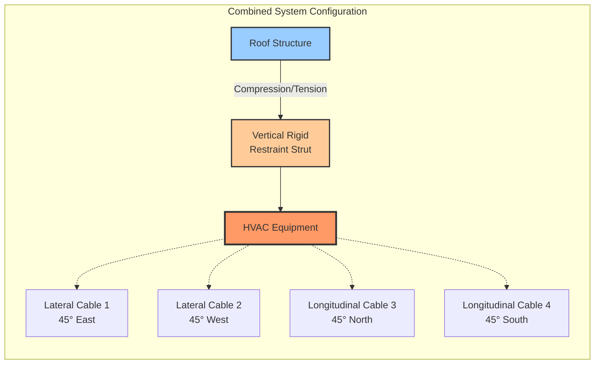

## Overview

Seismic bracing systems protect HVAC equipment and distribution components from earthquake-induced forces through properly designed and installed restraint assemblies. These systems must resist both horizontal (longitudinal and lateral) and vertical seismic forces while maintaining structural integrity during ground motion events.

## Bracing System Types

### Cable Bracing Systems

Cable bracing uses high-strength wire rope or aircraft cable to restrain equipment motion. This flexible bracing system accommodates thermal expansion while providing seismic resistance.

**Components:**
- 7x19 or 7x7 stranded aircraft cable (minimum 1/4" diameter)
- Swaged or mechanical cable fittings rated for full cable strength
- Turnbuckles for tension adjustment
- Beam clamps or concrete anchors at structure attachment points
- Equipment attachment brackets or clips

**Advantages:**
- Accommodates thermal movement
- Lightweight and less obtrusive
- Cost-effective for typical installations
- Field-adjustable tension

**Limitations:**
- Effective only in tension (requires diagonal orientation)
- Minimum 4 cables required per support point (45° angles)
- Not suitable for vertical seismic restraint alone
- May elongate under dynamic loading

### Rigid Bracing Systems

Rigid bracing employs steel struts, channels, or angles to provide stiff restraint against seismic forces. These systems offer superior performance in high seismic zones.

**Strut Channel Systems:**
- Steel strut channels (ASTM A1011 or A653)
- Engineered fittings and connectors
- Concrete anchors or beam attachments
- Rigid connections at equipment interface

**Structural Steel Systems:**
- Angle iron or wide-flange members
- Welded or bolted connections
- Custom-fabricated mounting brackets
- Heavy equipment applications

**Advantages:**
- Resists forces in compression and tension
- Provides vertical seismic restraint capability
- Minimal deflection under load
- Suitable for heavy equipment and high seismic demands

**Limitations:**
- Must accommodate thermal expansion through flexible couplings
- Higher material and installation costs
- More complex installation
- May require structural analysis

### Hybrid Systems

Combined cable and rigid bracing leverages advantages of both systems. Typical configurations use rigid bracing for vertical restraint and cable bracing for lateral motion control.

## Seismic Force Calculations

### Horizontal Force

The horizontal seismic force on equipment is calculated per ASCE 7:

$$F_p = \frac{0.4 \cdot a_p \cdot S_{DS} \cdot W_p}{R_p / I_p} \left(1 + 2 \frac{z}{h}\right)$$

Where:
- $F_p$ = horizontal seismic design force (lbs)
- $a_p$ = component amplification factor (1.0 to 2.5)
- $S_{DS}$ = design spectral response acceleration
- $W_p$ = component operating weight (lbs)
- $R_p$ = component response modification factor (1.5 to 12)
- $I_p$ = component importance factor (1.0 to 1.5)
- $z$ = height of attachment point above grade
- $h$ = average roof height of structure

**Force Limits:**

$$F_{p,max} = 1.6 \cdot S_{DS} \cdot I_p \cdot W_p$$

$$F_{p,min} = 0.3 \cdot S_{DS} \cdot I_p \cdot W_p$$

### Brace Force Distribution

For four-way bracing (longitudinal and lateral pairs):

$$F_{brace} = \frac{F_p}{2 \cos(\theta)}$$

Where $\theta$ = angle from horizontal (typically 45° for optimal efficiency)

**At 45° orientation:**

$$F_{brace} = 0.707 \cdot F_p$$

### Vertical Force

Vertical seismic force for rigidly attached equipment:

$$F_{pv} = 0.2 \cdot S_{DS} \cdot W_p$$

This force acts both upward and downward, requiring restraint in both directions.

## Bracing Configuration Diagrams

### Four-Point Cable Bracing

### Longitudinal and Lateral Restraint System

### Hybrid Bracing Assembly

## Design Considerations

### SMACNA Guidelines

SMACNA seismic restraint standards provide prescriptive requirements:

**Duct Bracing:**
- Lateral bracing: maximum 30 ft spacing (12 ft for Seismic Design Category D, E, F)
- Longitudinal bracing: maximum 60 ft spacing (24 ft for SDC D, E, F)
- Minimum 4-point restraint at each bracing location
- Bracing angle: 30° to 60° from horizontal (45° preferred)

**Pipe Bracing:**
- Similar spacing requirements based on pipe diameter and seismic category
- Consideration for fluid-filled weight
- Accommodation for thermal expansion/contraction

### Installation Requirements

**Cable Systems:**
1. Pre-tension cables to 50-100 lbs to eliminate slack
2. Use cable thimbles to prevent wire damage at terminations
3. Verify turnbuckle engagement (minimum 75% thread engagement)
4. Install cable guards where cables cross or are accessible

**Rigid Systems:**
1. Verify member orientation for axial loading
2. Use thread-locking compound on adjustable connections
3. Provide thermal relief through equipment isolation or expansion joints
4. Ensure full bearing at connection surfaces

**Structural Attachments:**
- Concrete anchors: minimum embedment per ICC-ES evaluation reports
- Steel structure: verify member capacity for concentrated loads
- Beam clamps: position to avoid flange deformation
- Verify edge distances and spacing requirements

### Quality Assurance

**Field Verification:**
- Confirm brace angles within design tolerances (±5°)
- Verify anchor torque values and embedment depths
- Check cable tension with calibrated gauge
- Document as-built conditions with photographs

**Load Testing:**
- Apply test load equal to 1.25 times design force
- Monitor deflection and permanent set
- Verify connection integrity under load
- Perform cyclic loading for critical equipment

## Code Compliance

### ASCE 7 Requirements

**Seismic Design Categories:**
- SDC A, B: Limited requirements, prescriptive solutions acceptable
- SDC C: Basic seismic restraint required
- SDC D, E, F: Engineered restraint systems mandatory

**Component Importance:**
- $I_p = 1.5$ for life-safety systems (smoke control, fire pumps)
- $I_p = 1.0$ for standard HVAC equipment

### Authority Having Jurisdiction

Special inspection requirements vary by jurisdiction:
- Structural observation during installation
- Testing and documentation protocols
- Certification of installers for seismic bracing
- Final approval procedures

## Conclusion

Proper seismic bracing system selection and installation is critical for earthquake resilience. Cable bracing provides cost-effective restraint for typical applications, while rigid bracing systems offer superior performance in high seismic zones or for heavy equipment. Hybrid approaches optimize performance and cost. All systems must comply with ASCE 7 force calculations and SMACNA installation standards to ensure life-safety protection and operational continuity during seismic events.
