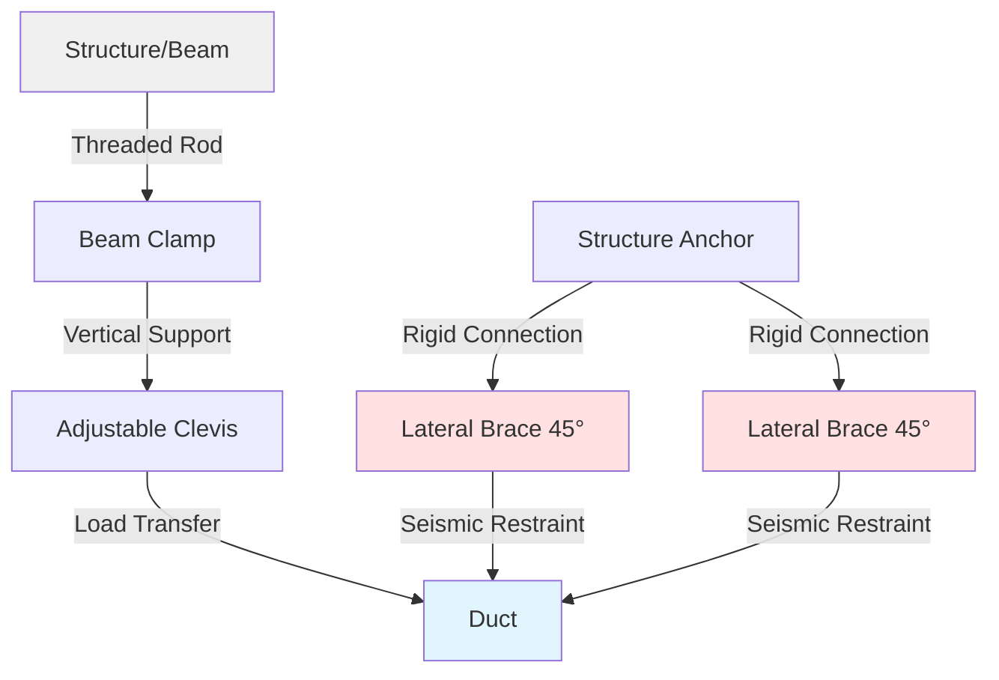
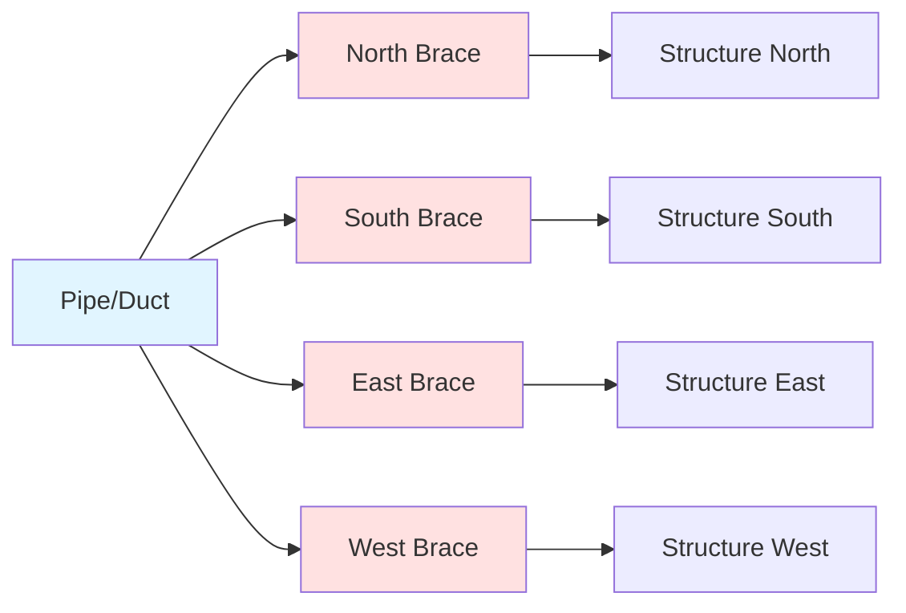
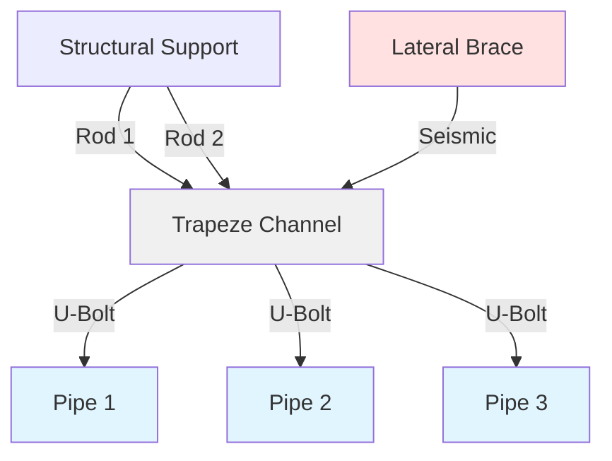

## Overview

Proper design and installation of ductwork and piping supports are critical components of seismic restraint systems. Support systems must resist both gravity loads and seismic forces while maintaining structural integrity during ground motion. SMACNA and MSS standards provide prescriptive methods for support spacing, rod sizing, and anchorage requirements.

## Support Spacing Requirements

### Ductwork Support Spacing

Maximum support spacing varies with duct size and seismic design category. SMACNA guidelines establish spacing limits based on duct weight and seismic forces.

**Standard support spacing for rectangular duct:**

| Duct Size (inches) | Maximum Spacing (feet) | Seismic SDC D-F (feet) |
|-------------------|------------------------|------------------------|
| ≤ 24 wide | 12 | 10 |
| 25-60 wide | 10 | 8 |
| 61-96 wide | 8 | 6 |
| > 96 wide | 6 | 5 |

**Round duct support spacing:**

$$
L_{max} = \min\left(12, \frac{240}{d}\right) \text{ feet}
$$

where $d$ is the duct diameter in inches. For seismic applications in SDC D-F, reduce spacing by 20%.

### Piping Support Spacing

MSS SP-58 establishes maximum span lengths for piping based on material, size, and operating conditions.

**Steel pipe maximum support spacing (water service):**

$$
L_{max} = K \cdot d^{0.5}
$$

where:
- $L_{max}$ = maximum span (feet)
- $K$ = support coefficient (10 for steel, 8 for copper)
- $d$ = nominal pipe diameter (inches)

For seismic zones, reduce spacing by 25% when pipe diameter exceeds 4 inches.

## Hanger Types and Applications

### Vertical Support Systems

**Adjustable clevis hangers** provide vertical support with limited lateral restraint. Used for both duct and pipe applications where vertical load transfer is primary concern.

**Riser clamps** support vertical runs at each floor penetration. Required spacing:

$$
L_{riser} = 15 \text{ feet (maximum)}
$$

For seismic applications, provide additional mid-floor supports for risers exceeding 20 feet.

**Trapeze hangers** distribute loads across multiple supports. Minimum rod sizing based on tributary load:

$$
A_{rod} = \frac{W \cdot SF}{F_{allow}}
$$

where:
- $A_{rod}$ = rod cross-sectional area (in²)
- $W$ = total supported weight (lb)
- $SF$ = safety factor (2.0 minimum)
- $F_{allow}$ = allowable rod stress (23,000 psi for ASTM A36)

### Lateral Restraint Systems

**Rigid bracing** resists lateral forces through axial compression and tension in rigid members. Angle calculation:

$$
\theta = \arctan\left(\frac{h}{L_{brace}}\right)
$$

where $\theta$ should be 30° to 60° for optimal efficiency.

**Four-way bracing** provides omni-directional restraint at intervals not exceeding:

$$
L_{4way} = \min(40 \text{ ft}, 4 \times L_{support})
$$

## Rod Sizing Calculations

### Gravity Load Sizing

Minimum hanger rod diameter for gravity loads:

$$
d_{min} = \sqrt{\frac{4W \cdot SF}{\pi \cdot F_{allow}}}
$$

**Standard rod capacities (ASTM A36):**

| Rod Diameter | Safe Working Load (lb) | Ultimate Load (lb) |
|--------------|------------------------|-------------------|
| 3/8" | 550 | 2,200 |
| 1/2" | 1,000 | 4,000 |
| 5/8" | 1,600 | 6,400 |
| 3/4" | 2,300 | 9,200 |
| 7/8" | 3,100 | 12,400 |

### Seismic Load Sizing

Combined gravity and seismic loading:

$$
F_{combined} = \sqrt{(W)^2 + (F_{seismic})^2}
$$

where seismic force:

$$
F_{seismic} = 0.4 \cdot S_{DS} \cdot W \cdot \frac{I_p}{R_p}
$$

Parameters:
- $S_{DS}$ = design spectral acceleration
- $I_p$ = component importance factor (1.0 to 1.5)
- $R_p$ = component response modification factor (2.5 for rigid, 6.0 for flexible)

## Anchorage Requirements

### Concrete Anchorage

**Post-installed anchors** must meet ICC-ES evaluation criteria. Minimum embedment depth:

$$
h_{ef} = \max\left(4d_a, 2.5 \text{ inches}\right)
$$

where $d_a$ is anchor diameter.

**Edge distance requirements:**

$$
c_{min} = \max\left(4h_{ef}, 12 \text{ inches}\right)
$$

### Steel Anchorage

**Beam clamps** transfer loads to structural steel without drilling. Load capacity depends on flange thickness and clamp design.

**Welded attachments** require structural steel grade verification. Weld sizing:

$$
L_{weld} = \frac{F_{applied}}{0.928 \cdot F_{allow} \cdot t_{weld}}
$$

where $t_{weld}$ is effective throat thickness.

## Mermaid Diagrams

### Typical Duct Support Configuration

### Four-Way Bracing System

### Trapeze Hanger Detail

## Installation Considerations

**Field verification requirements:**
- Confirm structural support capacity before installation
- Verify anchor embedment and edge distances
- Check rod thread engagement (minimum 1.5 times diameter)
- Ensure lateral braces achieve 30-60° angles
- Confirm clearance for thermal expansion

**Quality control checks:**
- Torque specifications for anchor bolts and connections
- Proper washers and lock nuts on threaded rods
- Correct hanger orientation and alignment
- Adequate clearance from electrical systems
- Documentation of as-built conditions

## Code Compliance

Support systems must comply with:
- **SMACNA Seismic Restraint Manual** (latest edition)
- **MSS SP-58** Pipe Hangers and Supports
- **ASCE 7** Minimum Design Loads and Associated Criteria
- **IBC Chapter 16** Structural Design
- **Local amendments** specific to jurisdiction

Regular inspection and maintenance ensure continued performance throughout the building service life.

## Conclusion

Proper support design and installation are fundamental to seismic resilience of HVAC systems. Adherence to SMACNA and MSS standards, correct rod sizing, appropriate support spacing, and adequate anchorage ensure systems withstand both operational and seismic loads. Engineering calculations must account for combined loading conditions with adequate safety factors.
