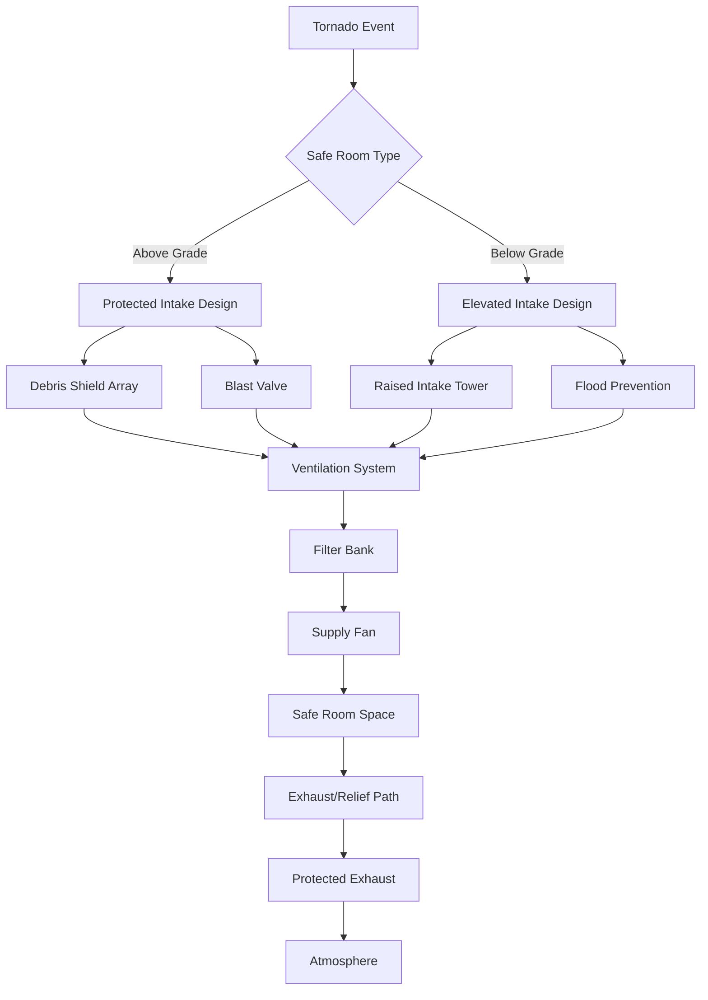
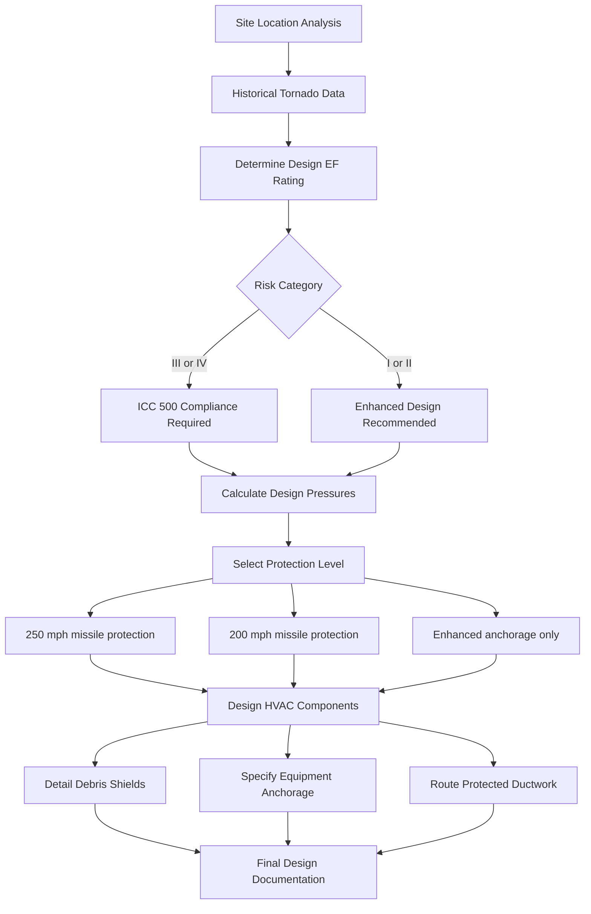

## Overview

Tornado-resistant HVAC design addresses the unique challenges posed by extreme wind events characterized by intense rotational winds, rapid pressure changes, and high-velocity debris. Systems serving tornado-safe rooms and critical facilities must maintain habitability during and immediately after tornado passage while protecting occupants from wind forces, pressure differentials, and projectile penetration.

The Enhanced Fujita (EF) Scale classifies tornadoes based on estimated wind speeds and observed damage. HVAC equipment and protective systems must be designed for the appropriate EF rating based on facility risk category and occupancy classification.

## Enhanced Fujita Scale and Design Criteria

### EF Scale Classification

| EF Rating | Wind Speed (mph) | Design Pressure (psf) | HVAC Design Implications |
|-----------|------------------|----------------------|--------------------------|
| EF0 | 65-85 | 15-25 | Standard equipment anchorage adequate |
| EF1 | 86-110 | 26-43 | Enhanced anchorage, protected intakes |
| EF2 | 111-135 | 44-65 | Impact-resistant louvers, reinforced ductwork |
| EF3 | 136-165 | 66-97 | Safe room provisions, debris shields |
| EF4 | 166-200 | 98-143 | Hardened equipment, underground routing |
| EF5 | >200 | >144 | Maximum protection, redundant systems |

### Design Wind Pressure Calculation

The design wind pressure for tornado-resistant construction follows:

$$P_d = 0.00256 \cdot K_z \cdot K_{zt} \cdot K_d \cdot V^2 \cdot I$$

Where:
- $P_d$ = design wind pressure (psf)
- $K_z$ = velocity pressure exposure coefficient
- $K_{zt}$ = topographic factor
- $K_d$ = directionality factor
- $V$ = basic wind speed (mph)
- $I$ = importance factor

For tornado shelter design per ICC 500, the effective wind speed is:

$$V_{eff} = V_{tornado} \cdot \sqrt{\frac{3}{t}}$$

Where $t$ is the exposure duration in seconds (typically 3 seconds for peak gust).

## Pressure Differential Considerations

### Rapid Pressure Drop Analysis

Tornadoes create extreme pressure differentials as the low-pressure core passes over structures. The pressure difference across the building envelope:

$$\Delta P = \frac{\rho V^2}{2} \cdot C_p$$

Where:
- $\Delta P$ = pressure differential (psf)
- $\rho$ = air density (0.075 lb/ft³ at standard conditions)
- $V$ = tornado wind speed (fps)
- $C_p$ = pressure coefficient (typically -2.0 to +1.0)

For an EF4 tornado with 180 mph winds:

$$\Delta P = \frac{0.075 \cdot (264)^2}{2} \cdot 2.0 = 5227 \text{ psf} \approx 36.3 \text{ psi}$$

### Pressure Equalization Systems

Safe rooms require pressure relief mechanisms to prevent structural failure:

$$Q_{relief} = C_d \cdot A \cdot \sqrt{\frac{2 \cdot \Delta P}{\rho}}$$

Where:
- $Q_{relief}$ = relief airflow (cfm)
- $C_d$ = discharge coefficient (0.6-0.8)
- $A$ = relief opening area (ft²)
- $\Delta P$ = design pressure differential (psf)

## ICC 500 and FEMA P-361 Requirements

### Safe Room HVAC Standards

ICC 500 (Storm Shelter Construction Standard) and FEMA P-361 (Safe Rooms for Tornadoes and Hurricanes) establish minimum requirements:

**Ventilation Requirements:**
- Minimum 5 cfm per occupant for shelters designed for <24 hour occupancy
- Minimum 15 cfm per occupant for extended occupancy (>24 hours)
- Natural or mechanical ventilation acceptable if debris impact-resistant

**Structural Protection:**
- Air intakes and exhausts must withstand 15 lb 2x4 wood stud at 100 mph (EF3-EF5)
- Louvers and grilles rated for 250 mph wind speeds
- Ductwork penetrations sealed with debris-resistant materials

### Debris Impact Protection

The 250 mph, 15 lb wood missile criterion:

$$E_{impact} = \frac{1}{2} m v^2 = \frac{1}{2} \cdot 15 \cdot (366.7)^2 = 1,008,750 \text{ ft-lbf}$$

Protection strategies include:
- Steel plate louvers (minimum 12 gauge)
- Reinforced concrete air intake structures
- Sacrificial debris screens with emergency bypass
- Below-grade intake wells with horizontal entry

## Safe Room HVAC Design

### Ventilation System Configuration

```mermaid
flowchart LR
    A[Protected Exterior<br/>Intake] --> B[Debris Screen<br/>12 ga steel mesh]
    B --> C[Blast/Tornado Valve<br/>Auto-close]
    C --> D[Duct Transition<br/>Reinforced concrete]
    D --> E[Pre-Filter<br/>MERV 8]
    E --> F[Supply Fan<br/>Backup power]
    F --> G[HEPA Filter<br/>Optional]
    G --> H[Safe Room<br/>Distribution]
    H --> I[Low Exhaust<br/>Grilles]
    I --> J[Pressure Relief<br/>Damper]
    J --> K[Protected Exhaust<br/>Path]

    style A fill:#ff9999
    style C fill:#ffcc99
    style F fill:#99ccff
    style H fill:#99ff99
```

### Equipment Specifications

**Protected Intake Assembly:**
- Steel-reinforced concrete structure (minimum 6-inch walls)
- Horizontal entry orientation to minimize direct impact
- Multiple debris screens in series
- Automated closure dampers (fail-safe closed)

**Ventilation Equipment:**
- Fans rated for continuous operation during shelter occupancy
- Backup power connection (generator or battery)
- Vibration-isolated mounting to prevent structural coupling
- Accessible service panels for emergency maintenance

**Ductwork Requirements:**
- Welded steel duct in exposed areas (minimum 16 gauge)
- Concrete-encased duct penetrations through shelter walls
- Flexible connections only within protected spaces
- All joints sealed for pressure resistance

## Design Process and Criteria

### Tornado Hazard Assessment

### Critical Design Parameters

1. **Occupancy Duration:** Determines ventilation rate requirements (5-15 cfm/person)

2. **Shelter Location:** Above-grade vs. below-grade affects intake design and flood protection needs

3. **Power Availability:** Generator backup sizing and battery duration calculations

4. **Structural Integration:** Coordination with structural engineer for duct penetrations and equipment anchorage

5. **Maintenance Access:** Emergency repairs during extended shelter occupancy

### Pressure Relief Sizing

For a 500 ft² safe room with 20 occupants and 3 psi design differential:

$$A_{relief} = \frac{Q}{ C_d \cdot 60 \cdot \sqrt{\frac{2 \cdot \Delta P \cdot 144}{\rho}}}$$

$$A_{relief} = \frac{300}{ 0.7 \cdot 60 \cdot \sqrt{\frac{2 \cdot 432}{0.075}}} = 0.167 \text{ ft}^2 = 24 \text{ in}^2$$

## Equipment Protection Strategies

### Rooftop Equipment Vulnerability

Standard rooftop HVAC units are highly vulnerable to tornado damage. Protection options:

**For EF0-EF2 Events:**
- Enhanced anchorage with seismic-rated curb adapters
- Wind-rated equipment screens
- Tie-down cables to structural elements

**For EF3-EF5 Events:**
- Relocate equipment to interior mechanical rooms
- Below-grade equipment vaults
- Sacrificial exterior units with protected backup systems

### Intake and Exhaust Protection Details

**Debris Screen Design:**
- Bar spacing: 4-6 inches to allow pressure relief while blocking large debris
- Material: ASTM A36 steel, minimum 1/2-inch diameter bars
- Orientation: Angled 45° to deflect impact forces
- Redundancy: Multiple screen layers with 12-inch spacing

**Blast Valve Integration:**
- Automatic closure on pressure surge detection
- Manual override from within shelter
- Fail-safe closed on power loss
- Rated for 10 psi differential hold

## Operational Considerations

### Pre-Storm Procedures

1. **System Verification:** Test automatic damper closure and backup power
2. **Filter Inspection:** Replace loaded filters to maximize post-event runtime
3. **Backup Power:** Verify generator fuel and battery charge levels
4. **Debris Clearance:** Remove potential projectiles near intake/exhaust openings

### Post-Storm Assessment

Following tornado passage:

- Inspect debris shields for damage and blockage
- Verify ductwork integrity, particularly at building penetrations
- Check equipment anchorage and structural connections
- Test ventilation system before re-occupancy

## Integration with Emergency Management

Tornado-resistant HVAC systems must coordinate with facility emergency operations:

- Automated shelter pressurization on tornado warning
- Integration with mass notification systems
- Real-time monitoring of safe room conditions (temperature, CO₂, pressure)
- Communication capability between shelter occupants and emergency management

## Cost-Benefit Analysis

Tornado protection costs vary significantly by design approach:

| Protection Level | Cost Premium | Facilities Justification |
|------------------|--------------|--------------------------|
| Enhanced Anchorage | 5-10% | All facilities in tornado-prone regions |
| EF3 Safe Room | 15-25% | Schools, hospitals, emergency operations |
| EF5 Hardened Shelter | 40-60% | Critical infrastructure, high-occupancy |

The incremental cost of designing tornado-resistant HVAC systems during new construction is substantially lower than retrofit applications, making early consideration essential for facilities in high-risk zones.

## Conclusion

Tornado-resistant HVAC design requires comprehensive understanding of extreme wind dynamics, pressure differentials, and debris impact mechanics. Compliance with ICC 500 and FEMA P-361 standards ensures safe room ventilation systems provide reliable protection during tornado events. The integration of structural hardening, debris impact resistance, and pressure relief mechanisms creates resilient systems capable of maintaining habitability under the most severe atmospheric conditions.

Successful implementation demands close coordination between mechanical, structural, and emergency management disciplines to create truly effective life-safety systems for tornado-prone regions.
