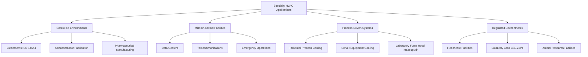

# Specialty HVAC Applications

Specialty HVAC applications represent engineering solutions for environments requiring precise control beyond standard comfort cooling. These systems address unique challenges in temperature stability, humidity control, contamination prevention, pressurization, and redundancy to support critical operations where system failure carries significant consequences.

## Core Categories of Specialty Applications

Specialty HVAC systems serve distinct operational requirements across multiple sectors:

## Unique Design Requirements

### Contamination Control

Cleanrooms and pharmaceutical manufacturing facilities demand particle concentration limits far exceeding typical building environments. ISO Class 5 cleanrooms require ≤3,520 particles ≥0.5 μm per cubic meter, necessitating HEPA or ULPA filtration with terminal filters achieving 99.97% to 99.9995% efficiency. Airflow patterns utilize unidirectional (laminar) flow at 0.3-0.5 m/s for critical zones, with air change rates reaching 300-600 ACH in ISO Class 5 spaces compared to 6-8 ACH in commercial buildings.

Pressurization cascades maintain contamination barriers through differential pressure control. Positive pressure protects product integrity in manufacturing suites, while negative pressure contains hazardous materials in biosafety laboratories. Pressure differentials of 0.02-0.05 in. w.g. (5-12 Pa) between adjacent spaces require precise supply-exhaust balancing and dedicated pressure monitoring systems per ASHRAE Standard 170.

### Thermal Load Management

Data centers present extreme sensible heat densities from IT equipment. Modern high-density server racks generate 10-30 kW per rack, with power densities reaching 300-500 W/ft² (3,230-5,380 W/m²) in hyperscale facilities. Traditional cooling approaches using computer room air conditioners (CRACs) with raised floor distribution give way to in-row cooling, rear-door heat exchangers, and direct liquid cooling for loads exceeding 15 kW/rack.

The sensible heat ratio (SHR) in data centers approaches 0.95-1.0, requiring systems optimized for sensible cooling rather than dehumidification. ASHRAE TC 9.9 thermal guidelines recommend inlet temperatures of 18-27°C (64.4-80.6°F) with allowable ranges up to 15-32°C, enabling economizer operation and reduced mechanical cooling hours.

### Laboratory Ventilation Dynamics

Research laboratories require 100% outdoor air systems with no recirculation due to chemical fume hoods, biological safety cabinets, and hazardous material handling. Fume hood face velocities of 0.4-0.5 m/s (80-100 fpm) per ANSI Z9.5 create variable exhaust demands as sashes open and close. Constant volume systems waste energy maintaining maximum exhaust continuously, while variable air volume (VAV) systems with pressure-independent controls reduce energy consumption by 40-60% through airflow tracking.

### Healthcare-Specific Requirements

Healthcare facilities follow stringent ventilation requirements under ASHRAE Standard 170 and FGI Guidelines for Design and Construction of Hospitals. Operating rooms require minimum 20 ACH with 4 ACH outdoor air, positive pressure relative to corridors, and HEPA filtration for orthopedic and transplant surgeries. Conversely, airborne infection isolation (AII) rooms maintain negative pressure with minimum 12 ACH and exhaust air discharged outdoors or through HEPA filtration.

## Application Comparison Matrix

| Application Type | ACH Range | Filtration | Pressure Control | Temperature Tolerance | Humidity Control | Redundancy Level |
|------------------|-----------|------------|------------------|----------------------|------------------|------------------|
| ISO 5 Cleanroom | 300-600 | HEPA 99.97% | +0.02-0.05 in. w.g. | ±0.5°C | ±2% RH | N+1 minimum |
| Data Center | 20-40 | MERV 13-14 | Neutral/slight + | ±2°C allowable | 40-60% RH | 2N for Tier IV |
| BSL-3 Laboratory | 12-15 | HEPA exhaust | -0.03 in. w.g. minimum | ±2°C | 30-60% RH | N+1 with backup |
| Operating Room | 20-25 | HEPA optional | +0.01-0.03 in. w.g. | ±2°C | 20-60% RH | Emergency power |
| Pharmaceutical Mfg | 20-60 | HEPA terminal | Cascading zones | ±1°C | ±5% RH | N+1 minimum |
| Vivarium | 15-20 | HEPA supply/exhaust | Negative (animal rooms) | ±1°C | 30-70% RH | N+1 recommended |

## Critical System Design Elements

**Redundancy Architecture**: Mission-critical applications implement N+1 (one backup unit) or 2N (fully redundant systems) configurations. Data center Tier III standards require N+1 for all components with concurrent maintainability, while Tier IV demands 2N architecture with fault tolerance during maintenance or component failure.

**Control System Sophistication**: Specialty applications utilize direct digital control (DDC) systems with granular monitoring of temperature, humidity, pressure differentials, airflow, and filter pressure drops. Critical parameters trigger alarms at 0.1°C increments or 1 Pa pressure deviations, with data logging for validation protocols and regulatory compliance.

**Energy Recovery Limitations**: While energy recovery ventilators (ERVs) achieve 60-80% sensible effectiveness in commercial applications, contamination control requirements restrict their use. Cross-contamination through leakage or carryover in rotary wheels eliminates ERVs from pharmaceutical and biosafety applications. Laboratory systems employ runaround loops with separate coils or plate heat exchangers maintaining complete airstream separation.

**Validation and Commissioning**: Specialty systems undergo extensive functional performance testing beyond standard commissioning. Cleanrooms require particle count testing per ISO 14644-3, airflow visualization using smoke studies, and filter leak testing with DOP or PAO aerosols. Healthcare facilities undergo room pressurization testing per ASHRAE 170, and data centers validate cooling capacity under simulated IT loads.

## Applicable Standards and Guidelines

- **ASHRAE Standard 170**: Ventilation of Healthcare Facilities
- **ISO 14644**: Cleanrooms and Associated Controlled Environments
- **ANSI/ISA-S71.04**: Environmental Conditions for Process Measurement and Control Systems
- **ASHRAE TC 9.9**: Data Center Thermal Guidelines
- **ANSI Z9.5**: Laboratory Ventilation Standard
- **USP <797>**: Pharmaceutical Compounding—Sterile Preparations
- **TIA-942**: Telecommunications Infrastructure Standard for Data Centers

## Future Trajectory

Specialty HVAC applications increasingly incorporate predictive maintenance through machine learning algorithms analyzing equipment performance trends. Liquid cooling adoption accelerates as AI and high-performance computing push rack densities beyond 50 kW. Modular cleanroom construction reduces installation time by 30-40% compared to stick-built systems, while maintaining contamination control performance through prefabricated ceiling grid-filter-fan modules.

The convergence of IoT sensors, cloud-based analytics, and digital twin modeling enables real-time optimization of complex specialty systems, balancing operational requirements against energy consumption in environments where performance historically superseded efficiency considerations.
