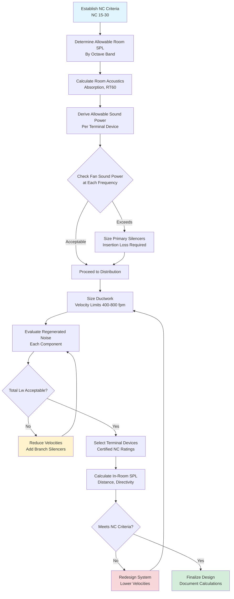

## Overview

Air distribution systems generate noise through two fundamental mechanisms: transmitted noise from mechanical equipment and regenerated noise produced by airflow turbulence within the distribution system itself. In assembly spaces requiring NC 15-25 performance, regenerated noise often dominates the acoustic signature once fan-generated noise is attenuated through silencers and vibration isolation.

The physics governing regenerated noise involves turbulent boundary layer interactions, vortex shedding at geometric discontinuities, and flow separation at obstructions. These phenomena convert kinetic energy in the airstream into acoustic energy across a broad frequency spectrum, with peak generation typically occurring in the 500-2000 Hz octave bands where human hearing is most sensitive.

## Regenerated Noise Fundamentals

### Sound Power Generation Mechanisms

Regenerated noise originates from four primary sources within air distribution systems:

**1. Turbulent Boundary Layer Noise**

Airflow along duct walls creates a turbulent boundary layer with velocity fluctuations that radiate sound. The sound power level increases with the sixth power of velocity:

$$L_w = K_1 + 60\log_{10}(V) + 10\log_{10}(A)$$

Where:
- $L_w$ = sound power level (dB re $10^{-12}$ W)
- $K_1$ = empirical constant (depends on duct roughness and geometry)
- $V$ = air velocity (ft/min)
- $A$ = duct surface area (ft²)

This relationship explains why doubling air velocity increases sound power by approximately 18 dB, making velocity reduction the most effective noise control strategy.

**2. Vortex Shedding at Obstacles**

Flow past damper blades, turning vanes, and duct transitions generates periodic vortex shedding at frequencies determined by:

$$f_s = \frac{St \cdot V}{D}$$

Where:
- $f_s$ = vortex shedding frequency (Hz)
- $St$ = Strouhal number (typically 0.2-0.3 for bluff bodies)
- $V$ = flow velocity (ft/s)
- $D$ = characteristic dimension (ft)

When shedding frequencies coincide with duct acoustic resonances, tonal noise amplification occurs, creating objectionable pure-tone components.

**3. Flow Separation Noise**

Abrupt area changes, sharp elbows, and poorly designed transitions cause flow separation with associated broadband noise generation:

$$L_w = K_2 + 50\log_{10}(V) + 10\log_{10}(Q) + C_f$$

Where:
- $K_2$ = baseline constant for fitting type
- $Q$ = volumetric flow rate (CFM)
- $C_f$ = correction factor for geometry (0-15 dB)

**4. Terminal Device Discharge Noise**

Diffusers and grilles generate noise as high-velocity jets expand into room space. Manufacturers provide sound power data as a function of flow rate and discharge velocity.

### Acoustic Design Process

## Terminal Device Acoustic Performance

### Diffuser Sound Power Prediction

Terminal device manufacturers provide sound power data based on standardized testing per AHRI Standard 885. The general relationship follows:

$$L_w = L_{w,ref} + 10n\log_{10}\left(\frac{Q}{Q_{ref}}\right)$$

Where:
- $L_{w,ref}$ = reference sound power at reference flow
- $n$ = exponent (typically 5-6 for diffusers)
- $Q$ = actual volumetric flow
- $Q_{ref}$ = reference flow (usually 100 CFM)

### Terminal Device Comparison

| Device Type | Typical NC Rating @ 400 CFM | Max Velocity (fpm) | Applications | Advantages | Limitations |
|-------------|----------------------------|-------------------|--------------|------------|-------------|
| Linear slot diffusers | NC 20-25 | 300 | Concert halls, theaters | Low profile, architectural integration | Requires low static pressure |
| Perforated face diffusers | NC 25-30 | 400 | Lecture halls, auditoriums | Good throw, moderate cost | Larger face area needed |
| Displacement terminals | NC 15-20 | 200 | High-ceiling theaters | Excellent acoustic performance | Height requirement >12 ft |
| Radial diffusers | NC 25-30 | 350 | General assembly | 360° distribution pattern | Moderate noise generation |
| Fabric duct systems | NC 20-25 | 250 | Multi-purpose halls | Uniform distribution, cleanable | Custom fabrication required |
| Nozzle diffusers | NC 30-35 | 600 | Large venues (>20 ft ceiling) | Long throw capability | Higher noise at source |

### Selection Methodology

**Step 1: Determine Required Airflow**

Calculate sensible and latent cooling loads, then derive required supply airflow:

$$Q = \frac{Q_s}{1.08 \times \Delta T}$$

Where:
- $Q$ = supply airflow (CFM)
- $Q_s$ = sensible cooling load (BTU/hr)
- $\Delta T$ = supply-to-room temperature difference (°F)

**Step 2: Establish Allowable Sound Power**

Working backward from NC criteria, determine maximum allowable sound power per diffuser. For $N$ identical diffusers:

$$L_{w,max} = L_{p,target} - 10\log_{10}\left(\frac{Q_{total}}{4\pi r^2}\right) - 10\log_{10}\left(\frac{4}{R}\right) + 10\log_{10}(N)$$

Where:
- $L_{p,target}$ = target sound pressure level from NC curve
- $r$ = distance from diffuser to receiver
- $R$ = room constant
- $N$ = number of diffusers

**Step 3: Select Device from Catalog**

Choose a terminal device with certified sound power ratings at least 5 dB below calculated $L_{w,max}$ to provide design margin. Verify performance across all octave bands, not just A-weighted levels.

## Duct Design for Acoustic Performance

### Velocity Limits by System Location

Regenerated noise control requires strict velocity limits throughout the distribution system:

| System Component | NC 15-20 | NC 20-25 | NC 25-30 | Conventional |
|------------------|----------|----------|----------|--------------|
| Main trunk ducts | 600-800 fpm | 800-1000 fpm | 1000-1200 fpm | 2000-2500 fpm |
| Branch ducts | 400-600 fpm | 600-800 fpm | 800-1000 fpm | 1200-1800 fpm |
| Runouts to terminals | 300-400 fpm | 400-500 fpm | 500-600 fpm | 600-900 fpm |
| Terminal device necks | 200-300 fpm | 300-400 fpm | 400-500 fpm | 500-700 fpm |

These limits result in ductwork cross-sections 2.5-4 times larger than conventional design, with corresponding increases in material cost and space requirements.

### Duct Configuration Impact

Different duct configurations exhibit varying regenerated noise characteristics:

**Round vs. Rectangular Ducts**

Round ducts produce 3-5 dB less regenerated noise than rectangular ducts of equivalent area due to:
- Lower surface area-to-flow ratio
- Absence of corner turbulence
- More uniform velocity distribution

For critical applications, spiral round duct with standing seams provides superior acoustic performance compared to longitudinal seam construction.

**Acoustic Lining Effectiveness**

Internal duct lining with 1-2 inch fiberglass provides:
- 5-10 dB attenuation in 500-4000 Hz octave bands
- Minimal effect on low-frequency (<250 Hz) propagation
- Reduced regenerated noise from boundary layer damping

Apply lining for minimum 10 ft upstream of critical discharge points and throughout final branch runs.

### Fitting Losses and Noise Generation

Duct fittings generate both pressure loss and acoustic noise. The relationship between dynamic pressure and sound power for various fittings:

| Fitting Type | Pressure Loss Coefficient $C_p$ | Noise Generation (dB above straight duct) | Design Recommendations |
|--------------|--------------------------------|------------------------------------------|----------------------|
| Straight duct (baseline) | 0.01 per ft | 0 | Maximize straight runs |
| Gradual elbow (R/D = 1.5) | 0.15 | +2 to +4 | Preferred for critical areas |
| Sharp elbow (R/D = 0.75) | 0.40 | +8 to +12 | Avoid in assembly space systems |
| Branch takeoff (45° wye) | 0.20 | +5 to +7 | Use smooth transitions |
| Branch takeoff (90° tap) | 0.60 | +10 to +15 | Avoid entirely in low-NC systems |
| Volume damper (50% open) | 2.5 | +15 to +20 | Use balancing dampers remotely |
| Transition (30° expansion) | 0.10 | +3 to +5 | Limit area changes to 2:1 |
| Diffuser boot | 0.25 | +6 to +10 | Specify acoustic boots |

### Regenerated Noise Calculation Example

For a 1000 CFM branch duct serving a concert hall diffuser:

**Given:**
- Required NC: 20
- Duct size: 16" × 12" (1.33 ft²)
- Velocity: 751 fpm (12.5 ft/s)
- Duct length: 20 ft

**Calculate straight duct sound power (500 Hz octave):**

$$L_w = 10\log_{10}(A) + 50\log_{10}(V) - K$$

Using empirical constant $K = 45$ for lined rectangular duct:

$$L_w = 10\log_{10}(1.33 \times 20) + 50\log_{10}(12.5) - 45$$

$$L_w = 10(1.43) + 50(1.10) - 45 = 14.3 + 55.0 - 45 = 24.3 \text{ dB}$$

**Add fitting contribution** (one gradual elbow):

$$L_{w,fitting} = L_w + 4 = 28.3 \text{ dB}$$

This sound power must be combined with terminal device sound power and compared against allowable levels derived from NC 20 criteria.

## Distribution Strategy Comparison

### System Architecture Options

| Strategy | Air Change Rate | Duct Sizing Factor | Ceiling Space | Energy Use | Acoustic Performance | Capital Cost |
|----------|----------------|-------------------|---------------|------------|---------------------|--------------|
| **Conventional VAV** | 4-6 ACH | 1.0× | Standard | Baseline | Poor (NC 35-40) | Baseline |
| **Low-velocity VAV** | 4-6 ACH | 2.5× | +30% | +5% (lower ΔP) | Good (NC 25-30) | +25% |
| **Ultra-low velocity CAV** | 6-8 ACH | 3.5× | +50% | +15% (no VAV savings) | Excellent (NC 20-25) | +40% |
| **Displacement ventilation** | 3-5 ACH | 4.0× | Minimal (low-level supply) | -10% (higher ΔT) | Excellent (NC 15-20) | +30% |
| **Underfloor air distribution** | 4-6 ACH | 3.0× | None (raised floor) | -5% | Very Good (NC 20-25) | +35% |
| **Dedicated outdoor air + radiant** | 2-3 ACH | 1.5× | Minimal | -20% (decoupled loads) | Excellent (NC 15-20) | +50% |

### Performance Trade-offs

**Low-Velocity VAV Systems**

Advantages:
- Maintains energy-saving potential of VAV operation
- Acceptable acoustic performance for NC 25-30 applications
- Moderate cost premium

Disadvantages:
- VAV terminal boxes generate regenerated noise at low flows
- Requires careful low-flow diffuser selection
- Minimum flow settings limit acoustic benefits

**Ultra-Low Velocity CAV Systems**

Advantages:
- Predictable, consistent acoustic performance
- Eliminates VAV box noise sources
- Simpler control sequences

Disadvantages:
- No load-based energy reduction
- Requires zone-level reheat for temperature control
- Higher operating cost in most climates

**Displacement Ventilation**

Advantages:
- Superior acoustic performance (NC 15-20 achievable)
- Improved indoor air quality through stratification
- Reduced mixing energy requirements

Disadvantages:
- Ceiling height requirement (minimum 12 ft, preferably 15+ ft)
- Limited applicability in cooling-dominated climates
- Supply air temperature constraints (63-68°F)

## Design Documentation Requirements

Comprehensive acoustic design documentation should include:

1. **Room acoustic analysis** - Reverberation time, absorption coefficients, room constant calculation
2. **NC compliance calculations** - Octave band analysis demonstrating compliance margins
3. **Equipment sound power data** - Certified manufacturer data for all noise-generating components
4. **Regenerated noise predictions** - Component-by-component analysis using ASHRAE methods
5. **Silencer specifications** - Required insertion loss by octave band
6. **Commissioning criteria** - Acceptance sound pressure level measurements

Reference ASHRAE Handbook—Fundamentals, Chapter 8 (Sound and Vibration) for calculation methodologies and acoustic properties of building materials. ASHRAE Handbook—HVAC Applications, Chapter 49 provides detailed guidance on system-specific noise control strategies.

## Practical Implementation Considerations

### Coordination with Architectural Acoustics

HVAC acoustic design cannot succeed independently of room acoustic design. Critical coordination points:

- Ensure architectural finishes provide adequate absorption (RT60 <1.5 seconds for speech, <2.0 for music)
- Integrate duct penetrations with acoustic ceiling construction to prevent flanking paths
- Coordinate diffuser locations with architectural ceiling design and lighting
- Specify acoustically rated access panels for duct access in performance spaces

### Balancing and Commissioning

Acoustic systems require specialized commissioning:

- Perform TAB work during off-hours to permit sound level measurements
- Document sound pressure levels at representative audience positions with all equipment operating
- Verify compliance with NC criteria using 1/3 octave-band analysis
- Adjust system operation to minimize noise while maintaining thermal performance

### Operational Strategies

Maximize acoustic performance through intelligent operational sequences:

- Stage equipment operation to run minimum necessary fans during performances
- Implement quiet mode setpoints that prioritize acoustics over tight temperature control
- Use demand-controlled ventilation to reduce airflow during low-occupancy periods
- Schedule equipment maintenance during non-performance times to maintain peak efficiency

The integration of low-velocity air distribution principles with careful terminal device selection and meticulous duct design enables achievement of NC 15-25 performance levels required for premier assembly spaces. The approximately 30-40% cost premium represents an essential investment in acoustic quality that defines the success of performance venues.
