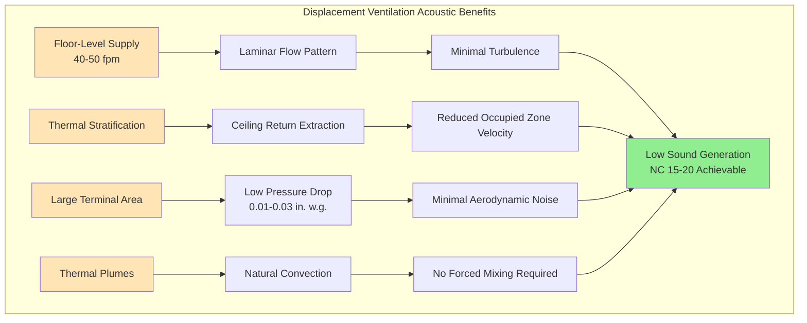

## Overview

Displacement ventilation represents the optimal air distribution strategy for acoustically sensitive assembly spaces, leveraging fundamental principles of fluid mechanics and thermal stratification to achieve superior acoustic performance compared to conventional overhead mixing systems. By introducing conditioned air at floor level with velocities below 50 fpm, displacement systems eliminate the turbulent mixing and high-velocity discharge that generate objectionable noise in traditional designs.

The acoustic advantages of displacement ventilation stem directly from the physics of low-velocity laminar flow. Sound power generated by air movement through terminals scales approximately with velocity to the sixth power for turbulent flow. Reducing discharge velocity from 400 fpm (conventional diffuser) to 40 fpm (displacement terminal) theoretically reduces sound power by 60 dB, transforming an intrusive noise source into an imperceptible one.

## Fundamental Acoustic Principles

### Velocity-Dependent Sound Generation

The relationship between air velocity and generated sound power follows aeroacoustic principles established by Lighthill's acoustic analogy. For turbulent flow through orifices and grilles, the sound power level increases dramatically with velocity:

$$L_w = L_{w,ref} + 60 \log_{10}\left(\frac{V}{V_{ref}}\right)$$

Where:
- $L_w$ = sound power level (dB re $10^{-12}$ W)
- $L_{w,ref}$ = reference sound power level at reference velocity
- $V$ = actual air velocity (fpm)
- $V_{ref}$ = reference velocity (typically 100 fpm)

This sixth-power relationship explains why halving velocity reduces sound power by 18 dB—a dramatic improvement easily perceived by listeners.

### Terminal Discharge Characteristics

Conventional overhead diffusers achieve room air distribution through high-velocity discharge (300-600 fpm) and entrainment of room air at ratios of 20:1 to 40:1. This entrainment process creates turbulent mixing zones with associated noise generation. The sound power generated includes:

$$L_w = 10 + 50 \log_{10}(Q) + 10 \log_{10}(\Delta P)$$

Where:
- $Q$ = airflow rate (CFM)
- $\Delta P$ = pressure drop across terminal device (in. w.g.)

Displacement terminals eliminate high-velocity discharge and pressure drop, reducing both terms substantially. Typical displacement terminals operate at 0.01-0.03 in. w.g., compared to 0.05-0.15 in. w.g. for mixing diffusers.

## Displacement Ventilation System Characteristics

### Operating Principles

Displacement ventilation introduces cool supply air (60-65°F) at floor level through large-area, low-velocity terminals. The supply air remains stratified at floor level until heated by occupants, equipment, and lighting. As air absorbs heat, buoyancy forces drive upward movement in thermal plumes above each heat source. These plumes rise to the ceiling, where return grilles extract warmed air.

The system creates a vertical temperature gradient of 5-9°F from floor to ceiling, with the occupied zone (0-6 ft height) maintained within comfort parameters. This stratification proves beneficial for assembly spaces with high ceilings, as it concentrates cooling where occupants reside rather than conditioning the entire volume.

### Air Distribution Patterns

Unlike mixing systems that create recirculation throughout the space, displacement systems establish three distinct zones:

1. **Supply zone** (0-2 ft) - Cool air layer with minimal vertical movement, temperature 2-4°F below setpoint
2. **Occupied zone** (2-6 ft) - Gradual temperature rise through thermal plumes, target setpoint conditions
3. **Extraction zone** (6 ft to ceiling) - Warmed air accumulation, temperature 3-5°F above setpoint

This stratification pattern eliminates high-velocity air movement in the occupied zone, the primary source of objectionable noise in conventional systems.

## Acoustic Performance Comparison

### Sound Power Level Analysis

Direct measurement of installed displacement and conventional systems in comparable assembly spaces demonstrates the acoustic superiority of displacement ventilation:

| System Type | Terminal Velocity | Pressure Drop | Sound Power (Lw) | Space NC Level |
|-------------|------------------|---------------|------------------|----------------|
| Conventional slot diffuser | 400 fpm | 0.08 in. w.g. | 45 dB | NC 30-35 |
| Conventional perforated face | 300 fpm | 0.06 in. w.g. | 40 dB | NC 25-30 |
| Linear displacement grille | 50 fpm | 0.02 in. w.g. | 22 dB | NC 20-25 |
| Floor swirl diffuser | 40 fpm | 0.015 in. w.g. | 18 dB | NC 15-20 |

The 20-25 dB reduction in terminal sound power directly translates to quieter occupied spaces. For a theater with 40 diffusers, the combined sound power from terminals drops from Lw = 61 dB (conventional) to Lw = 38 dB (displacement), enabling NC 20 compliance without supplemental silencing.

### Octave-Band Performance

Displacement systems provide particularly effective noise control in mid-to-high frequency bands (500-4000 Hz) where speech and musical content resides:

| Frequency (Hz) | Conventional Lw | Displacement Lw | Advantage |
|----------------|-----------------|-----------------|-----------|
| 63 | 38 dB | 28 dB | 10 dB |
| 125 | 42 dB | 30 dB | 12 dB |
| 250 | 45 dB | 28 dB | 17 dB |
| 500 | 44 dB | 24 dB | 20 dB |
| 1000 | 42 dB | 20 dB | 22 dB |
| 2000 | 38 dB | 16 dB | 22 dB |
| 4000 | 33 dB | 12 dB | 21 dB |

This spectral advantage proves critical for speech intelligibility and musical clarity, as these applications demand minimal background noise in the 500-2000 Hz range.

## Design Considerations for Assembly Spaces

### Terminal Device Selection

Displacement terminals for assembly applications require careful selection based on acoustic, thermal, and aesthetic criteria:

**Floor-mounted swirl diffusers:**
- Circular pattern, 18-36" diameter
- Supply velocity 30-50 fpm
- Airflow capacity 50-200 CFM per terminal
- Sound power Lw = 15-20 dB at design flow
- Requires raised floor or underfloor plenum

**Linear floor grilles:**
- Continuous slot configuration
- Supply velocity 40-60 fpm
- Airflow capacity 100-400 CFM per linear foot
- Sound power Lw = 18-25 dB at design flow
- Integrates with architectural floor details

**Wall-mounted displacement terminals:**
- Low sidewall installation (12-18" above floor)
- Supply velocity 40-70 fpm
- Airflow capacity 200-600 CFM per terminal
- Sound power Lw = 20-28 dB at design flow
- Suitable for retrofit applications

### Thermal Stratification Acoustics

The vertical temperature gradient inherent to displacement ventilation affects sound propagation through the space. Warmer air at ceiling level creates a positive temperature gradient ($dT/dz > 0$), which refracts sound waves upward and away from the audience plane. This effect reduces sound pressure levels at listener positions by 1-3 dB compared to isothermal conditions.

The speed of sound increases with temperature according to:

$$c = 331.3\sqrt{1 + \frac{T}{273.15}}$$

Where $T$ is temperature in °C. The 5-9°F vertical gradient creates a sound speed gradient that bends sound rays upward, effectively "trapping" ceiling-level equipment noise away from the audience.

### Ceiling Height Requirements

Displacement ventilation requires sufficient ceiling height to develop stable thermal stratification. Minimum height recommendations for assembly spaces:

| Space Type | Minimum Ceiling Height | Optimal Height |
|------------|------------------------|----------------|
| Lecture halls | 12 ft | 14-16 ft |
| Theaters | 14 ft | 18-24 ft |
| Concert halls | 18 ft | 24-40 ft |
| Multi-purpose auditoriums | 14 ft | 16-20 ft |

Insufficient height prevents adequate stratification development, causing supply air to mix prematurely and negating acoustic benefits. Spaces below minimum height should employ alternative low-velocity strategies.

## System Sizing and Airflow Calculations

### Supply Airflow Determination

Calculate displacement ventilation supply airflow based on sensible cooling load and allowable temperature differential:

$$Q = \frac{q_s}{1.08 \times \Delta T}$$

Where:
- $Q$ = supply airflow (CFM)
- $q_s$ = sensible cooling load (Btuh)
- $\Delta T$ = supply-to-room temperature difference (°F)
- 1.08 = constant for standard air (0.075 lb/ft³ × 0.24 Btu/lb·°F × 60 min/hr)

Displacement systems typically operate with $\Delta T$ = 6-10°F, compared to 15-20°F for conventional overhead systems. This reduced differential requires 50-100% higher airflow for equivalent cooling capacity.

### Terminal Quantity Calculation

Determine the number of terminals based on individual terminal capacity and total airflow:

$$N = \frac{Q_{total}}{Q_{terminal}}$$

Space terminals uniformly throughout the floor area, maintaining maximum spacing of 12-15 ft to ensure complete floor coverage. For a 10,000 ft² theater requiring 20,000 CFM:

- Terminal capacity: 150 CFM at 45 fpm
- Number required: 20,000 / 150 = 134 terminals
- Spacing: $\sqrt{10,000/134}$ = 8.6 ft on center

This dense terminal array ensures low-velocity discharge while providing adequate cooling coverage.

## Integration with Building Systems

### Underfloor Air Distribution

Displacement ventilation integrates optimally with underfloor air distribution (UFAD) systems, using the structural floor plenum as a supply air chamber. This configuration offers:

- Elimination of overhead ductwork in audience areas
- Simplified terminal connections via flexible ducts
- Improved architectural ceiling aesthetics
- Enhanced flexibility for seating reconfigurations

The underfloor plenum operates at 0.05-0.10 in. w.g., barely perceptible to occupants and generating negligible acoustic output.

### Return Air Strategies

Extract return air at ceiling level through large grilles or continuous perforated ceilings. Design return systems for:

- Face velocity <400 fpm to avoid regenerated noise
- Acoustically lined plenums with 2" fiberglass lining
- Return fan isolation on 1.5" deflection spring mounts
- Dedicated return duct systems (avoid common plenums)

Position return grilles in ceiling areas rather than soffits to maximize extraction efficiency from the stratified warm layer.

### Humidity Control Considerations

Displacement systems introduce cool air (60-65°F) directly into the occupied zone, raising concerns about condensation on cold surfaces and draft discomfort. Maintain supply air dew point below 55°F to prevent condensation on floor terminals. For assembly spaces in humid climates, integrate dedicated outdoor air systems (DOAS) with displacement terminals to manage latent loads independently from sensible cooling.

## Performance Verification and Commissioning

### Acoustic Testing Procedures

Commission displacement ventilation systems with comprehensive acoustic verification:

1. **Background noise measurements** - Measure NC levels at multiple audience locations with system operating at design conditions
2. **Terminal sound power testing** - Verify individual terminal Lw values match manufacturer specifications
3. **Octave-band analysis** - Confirm compliance across all frequency bands (63-4000 Hz)
4. **Comparative analysis** - Document improvement versus conventional systems or baseline conditions

Conduct measurements per ANSI S12.2 (Criteria for Evaluating Room Noise) using precision sound level meters with octave-band filters.

### Temperature Stratification Verification

Document vertical temperature profiles at representative locations throughout the space:

- Measure at 4" (floor level), 42" (seated head height), 67" (standing height), and ceiling level
- Verify occupied zone (0-6 ft) maintains temperature within ±2°F of setpoint
- Confirm stratification gradient of 5-9°F floor-to-ceiling
- Validate that excessive supply airflow doesn't over-mix and collapse stratification

Use traversing temperature measurement systems or vertical thermocouple arrays for accurate profiling.

## Case Study Applications

### Symphony Hall Implementation

A 2,400-seat symphony hall in a temperate climate implemented displacement ventilation through underfloor distribution with 380 floor swirl diffusers. Design parameters:

- Sensible cooling load: 800,000 Btuh (high occupancy + lighting)
- Supply airflow: 95,000 CFM at 63°F
- Terminal discharge velocity: 42 fpm average
- Measured NC levels: NC 18 during performance (target NC 20)
- Temperature stratification: 8.2°F floor-to-ceiling

Acoustic measurements confirmed 24 dB improvement versus the original overhead VAV system, eliminating previous complaints about audible air movement during quiet musical passages.

### Theater Retrofit Project

A 600-seat legitimate theater converted from conventional overhead diffusers to wall-mounted displacement terminals. Performance comparison:

| Parameter | Original System | Displacement System |
|-----------|----------------|---------------------|
| Diffuser type | Linear slots | Wall displacement |
| Terminal quantity | 32 | 48 |
| Average velocity | 380 fpm | 55 fpm |
| Sound power (Lw) | 48 dB per diffuser | 24 dB per terminal |
| Measured NC level | NC 32 | NC 22 |
| Audience feedback | Noticeable hiss | Imperceptible |

The conversion required no major architectural modifications, using existing perimeter walls for terminal mounting and ceiling space for return air collection.

## Limitations and Alternatives

### Heat Load Constraints

Displacement ventilation proves most effective for cooling-dominated applications with moderate sensible heat loads (25-40 Btuh/ft²). Higher loads require excessive supply airflow that disrupts stratification. For assembly spaces exceeding 40 Btuh/ft² sensible density, consider:

- Radiant cooling panels to handle base load
- Hybrid systems combining displacement with overhead mixing
- Dedicated high-volume, low-speed (HVLS) fans to enhance mixing

### Cold Climate Heating

Displacement ventilation provides limited heating capacity, as warm air supplied at floor level rises immediately without occupant benefit. For heating-dominated climates, integrate supplemental systems:

- Perimeter radiant heating panels or baseboard convectors
- Overhead warm air distribution during heating mode
- Underfloor hydronic heating systems

Design controls to switch between displacement cooling mode and overhead heating mode based on seasonal requirements.

## ASHRAE References and Standards

Design displacement ventilation systems for assembly spaces in accordance with:

- **ASHRAE Handbook—HVAC Applications, Chapter 58**: Applies displacement ventilation principles to specific building types including assembly spaces
- **ASHRAE Handbook—Fundamentals, Chapter 8**: Provides acoustic theory and calculation methods for sound power analysis
- **ASHRAE Standard 55**: Thermal comfort requirements applicable to stratified environments
- **ASHRAE Guideline 36**: Control sequences for displacement systems including monitoring stratification

Consult manufacturer technical literature for certified acoustic performance data on specific displacement terminal products per AHRI Standard 885 test procedures.

## Conclusion

Displacement ventilation delivers unmatched acoustic performance for assembly spaces, achieving NC 15-20 levels through fundamental principles of low-velocity air distribution and thermal stratification. The 20-25 dB sound power reduction compared to conventional systems eliminates terminal noise as a significant contributor to background sound levels, allowing designers to focus attention on fan isolation and duct silencing.

The physics of velocity-dependent sound generation strongly favors displacement approaches. By reducing terminal velocities from 300-400 fpm to 40-50 fpm, sound power drops by 54-60 dB theoretically and 20-25 dB in practice. This acoustic advantage, combined with improved air quality through stratification and reduced energy consumption from thermal zoning, positions displacement ventilation as the preferred solution for demanding assembly applications where silence proves as critical as thermal comfort.
