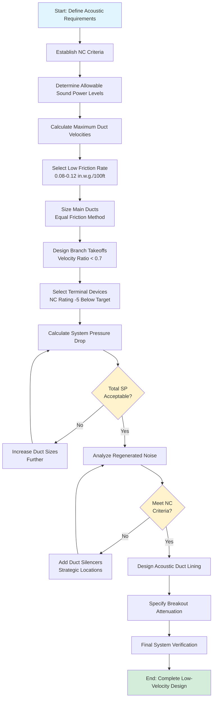

## Overview

Low-velocity air distribution represents the fundamental strategy for achieving stringent acoustic requirements in assembly spaces. By reducing air velocities to 30-50% of conventional design values, regenerated noise from air turbulence decreases dramatically, enabling HVAC systems to meet NC 15-25 criteria required for concert halls, theaters, and lecture halls.

The acoustic benefit of velocity reduction follows exponential relationships. Sound power generated by air turbulence in ducts scales approximately with the sixth power of velocity, meaning halving the velocity reduces sound power by 64 times (18 dB). This physical relationship makes velocity control the most effective noise reduction strategy available to HVAC designers.

Low-velocity design requires fundamental departure from conventional practice. Duct sizes increase by 100-200%, pressure drops decrease by 50-75%, and system installation costs rise by 20-30%. These tradeoffs are necessary to achieve background noise levels that preserve speech intelligibility and musical clarity in critical listening environments.

## Velocity-Sound Power Relationships

### Fundamental Acoustic Equations

The sound power level generated by airflow in ducts depends primarily on velocity, duct size, and turbulence characteristics. The relationship is expressed by:

$$L_w = 10 \log_{10} \left( \frac{V^6 \cdot A}{10^{12}} \right) + K$$

Where:
- $L_w$ = sound power level (dB re $10^{-12}$ W)
- $V$ = air velocity (fpm)
- $A$ = duct cross-sectional area (ft²)
- $K$ = empirical constant (typically 50-60 dB)

The sixth-power relationship demonstrates the dramatic acoustic impact of velocity changes. Reducing velocity from 2000 fpm to 1000 fpm decreases sound power by:

$$\Delta L_w = 60 \log_{10} \left( \frac{2000}{1000} \right) = 60 \log_{10}(2) = 18 \text{ dB}$$

This 18 dB reduction represents the difference between an audible system (NC 35) and an imperceptible system (NC 17).

### Regenerated Noise Mechanisms

Air turbulence generates noise through three primary mechanisms:

**Straight duct turbulence:**

$$L_w = K_s + 50 \log_{10}(V) + 10 \log_{10}(A)$$

Where $K_s$ = 17 for round ducts, 20 for rectangular ducts

**Elbow-generated noise:**

$$L_w = K_e + 60 \log_{10}(V) + 10 \log_{10}(A) - 15 \log_{10}(R/D)$$

Where:
- $K_e$ = empirical constant (35-45 dB)
- $R/D$ = radius-to-diameter ratio

**Branch takeoff noise:**

$$L_w = K_b + 50 \log_{10}(V_m) + 20 \log_{10}(V_b/V_m)$$

Where:
- $K_b$ = 30-40 dB
- $V_m$ = main duct velocity
- $V_b$ = branch duct velocity

These equations demonstrate that fittings generate significantly more noise than straight ducts, particularly when branch velocities differ substantially from main duct velocities.

## Velocity Limits by Application

### Assembly Space Velocity Standards

The following velocity limits ensure acoustic performance for various assembly space types:

| Space Type | NC Target | Main Duct (fpm) | Branch Duct (fpm) | Terminal Velocity (fpm) | Diffuser Face (fpm) |
|------------|-----------|-----------------|-------------------|-------------------------|---------------------|
| Concert halls | NC 15-20 | 600-900 | 300-600 | 150-300 | 100-200 |
| Legitimate theaters | NC 20-25 | 800-1200 | 400-800 | 200-400 | 150-300 |
| Movie theaters | NC 25-30 | 1000-1500 | 600-1000 | 300-500 | 200-400 |
| Large auditoriums | NC 25-30 | 1000-1500 | 600-1000 | 300-500 | 200-400 |
| Lecture halls | NC 25-30 | 1200-1600 | 700-1100 | 400-600 | 250-450 |
| Conference rooms | NC 30-35 | 1500-2000 | 900-1400 | 500-800 | 350-600 |

### Component-Specific Velocity Limits

**Main distribution ducts:**

Maximum velocities in primary distribution ducts should not exceed values that produce regenerated noise exceeding allowable duct sound power levels. For NC 20 spaces, limit main duct velocity to 800-1000 fpm using friction rates of 0.08-0.12 in. w.g. per 100 ft.

**Branch ducts:**

Branch takeoffs represent critical acoustic locations due to turbulence generation at velocity transitions. Limit branch velocities to 50-70% of main duct velocities and use conical or streamlined takeoffs rather than sharp-edge entries. For NC 20 applications, branch velocities should not exceed 600 fpm.

**Terminal devices:**

Sound power from diffusers and grilles follows manufacturer-specific performance curves, typically showing 5-8 dB increase per doubling of airflow. Select terminal devices with certified NC ratings at least 5 points below space requirements, and operate at 60-80% of maximum cataloged airflow.

**Diffuser neck velocity:**

The connection between duct and diffuser generates significant turbulence. Limit neck velocities to 200-300 fpm for NC 20 spaces, 300-400 fpm for NC 25 spaces. Use lined transition pieces to minimize noise breakout.

## Duct Sizing for Noise Reduction

### Equal Friction Method Application

Size ducts using the equal friction method with friction rates of 0.08-0.12 in. w.g. per 100 ft for NC 15-25 spaces, compared to conventional practice of 0.35-0.45 in. w.g. per 100 ft. This approach produces the following sizing relationships:

| Airflow (CFM) | Conventional Size | Conventional Velocity | Low-Velocity Size | Low-Velocity Velocity |
|---------------|-------------------|----------------------|-------------------|----------------------|
| 2,000 | 16" × 12" | 1,875 fpm | 26" × 18" | 720 fpm |
| 5,000 | 26" × 18" | 2,137 fpm | 42" × 30" | 794 fpm |
| 10,000 | 36" × 26" | 2,137 fpm | 60" × 40" | 833 fpm |
| 20,000 | 50" × 38" | 2,211 fpm | 84" × 60" | 794 fpm |
| 40,000 | 72" × 52" | 2,211 fpm | 120" × 84" | 794 fpm |

### Aspect Ratio Considerations

Rectangular duct aspect ratios affect both acoustic performance and installation efficiency:

**Acoustic performance:**
- Square ducts minimize perimeter-to-area ratio, reducing breakout noise
- High aspect ratios (>4:1) increase turbulent boundary layer development

**Practical considerations:**
- Aspect ratios of 1.5:1 to 2.5:1 optimize structural efficiency
- Maintain ratios below 3:1 for ease of fabrication and reduced leakage

For a 10,000 CFM low-velocity duct at 800 fpm:
- Square option: 56" × 56" (3136 in² area)
- 2:1 aspect ratio: 79" × 40" (3160 in² area) - **Preferred**
- 4:1 aspect ratio: 112" × 28" (3136 in² area)

### Velocity Pressure Relationships

Static regain in low-velocity systems follows the fundamental relationship:

$$\Delta P_s = P_{v1} - P_{v2} = \frac{\rho}{2} (V_1^2 - V_2^2)$$

At standard conditions (0.075 lb/ft³):

$$P_v = \left( \frac{V}{4005} \right)^2 \text{ in. w.g.}$$

The velocity pressure differential between conventional (2000 fpm) and low-velocity (800 fpm) design:

$$\Delta P_v = \left( \frac{2000}{4005} \right)^2 - \left( \frac{800}{4005} \right)^2 = 0.249 - 0.040 = 0.209 \text{ in. w.g.}$$

This reduced velocity pressure decreases total system static pressure by 30-50%, partially offsetting the increased friction from larger duct surface area.

## Low-Velocity System Design Methodology

### Design Sequence

**1. Establish acoustic criteria:**
- Define NC curve requirements for space
- Determine allowable octave-band sound pressure levels
- Calculate room constant and directivity factors

**2. Allocate sound power budget:**
- Assign sound power allowances to fans, ducts, and terminals
- Reserve 3-5 dB margin for calculation uncertainties
- Account for multiple source combinations

**3. Determine maximum velocities:**
- Calculate maximum duct velocity using regenerated noise equations
- Apply velocity limits from assembly space standards
- Establish velocity reduction schedule (main to branch to terminal)

**4. Size duct system:**
- Select friction rate (0.08-0.12 in. w.g./100 ft)
- Apply equal friction method to main distribution
- Size branches maintaining velocity ratios below 0.7
- Verify aspect ratios remain practical (1.5:1 to 3:1)

**5. Calculate system performance:**
- Sum friction losses, fitting losses, and terminal losses
- Include duct silencer pressure drops
- Verify total system static pressure remains below 3.5 in. w.g.

**6. Analyze acoustic performance:**
- Calculate regenerated noise at elbows, takeoffs, and terminals
- Add sound power levels logarithmically
- Compare to allowable duct sound power levels

**7. Add acoustic treatment:**
- Specify duct silencers where calculated levels exceed allowables
- Apply internal duct lining for breakout noise control
- Design acoustically lined plenums at terminal connections

## Pressure Drop Minimization Strategies

### Friction Loss Reduction

Low-velocity design inherently reduces friction losses through reduced velocity pressure, but increased duct surface area partially offsets this benefit. The net effect on friction loss:

**Conventional design (2000 fpm, 36" × 26" duct):**
- Friction rate: 0.35 in. w.g./100 ft
- Hydraulic diameter: 30.2 inches
- Surface area per linear foot: 10.3 ft²

**Low-velocity design (800 fpm, 60" × 40" duct):**
- Friction rate: 0.10 in. w.g./100 ft
- Hydraulic diameter: 48 inches
- Surface area per linear foot: 16.7 ft²

For a 200 ft duct run:
- Conventional friction loss: 0.70 in. w.g.
- Low-velocity friction loss: 0.20 in. w.g.
- Net reduction: 0.50 in. w.g. (71%)

### Fitting Loss Optimization

Fittings represent 40-60% of total system pressure drop and are significant regenerated noise sources. Minimize fitting losses through:

**Elbow design:**
- Use radius elbows with R/D ≥ 1.5
- Specify turning vanes for R/D < 1.5 or large rectangular ducts
- Limit single-elbow pressure drop to 0.05 in. w.g.

**Branch takeoffs:**
- Use conical taps with 15-30° entry angles
- Maintain minimum 45° takeoff angles to main duct
- Size takeoff velocity 50-70% of main duct velocity

**Transitions:**
- Limit expansion/contraction angles to 15° for expansions, 30° for contractions
- Use multi-section transitions for large area changes
- Specify streamlined transitions at critical acoustic locations

### Terminal Device Selection

Terminal device pressure drops in low-velocity systems remain significant because diffusers operate at reduced velocities but must maintain throw and mixing characteristics:

| Diffuser Type | Conventional ΔP | Low-Velocity ΔP | Acoustic Advantage |
|---------------|-----------------|-----------------|-------------------|
| Linear slot | 0.15-0.25 in. w.g. | 0.05-0.10 in. w.g. | NC rating -8 to -12 dB |
| Perforated face | 0.20-0.30 in. w.g. | 0.08-0.15 in. w.g. | NC rating -6 to -10 dB |
| Displacement | 0.05-0.10 in. w.g. | 0.02-0.05 in. w.g. | NC rating -10 to -15 dB |
| Standard VAV | 0.25-0.40 in. w.g. | Not recommended | Variable NC performance |

Select diffusers certified to AHRI Standard 885 with documented NC ratings at design airflow rates.

## Installation and Verification

### Critical Construction Details

**Duct sealing requirements:**
- Seal class C per SMACNA HVAC Duct Construction Standards
- Mastic seal all transverse joints and longitudinal seams
- Test leakage to verify <3 CFM/100 ft² at 1 in. w.g.

**Acoustic lining application:**
- Apply 1-2 inch fiberglass duct liner with minimum density 1.5 lb/ft³
- Line minimum 50 ft of duct upstream and downstream of each silencer
- Use mechanically fastened liner with coated surfaces in high-velocity locations

**Support and hanger details:**
- Provide vibration isolation at all equipment connections
- Use neoprene-lined hangers at 8-10 ft spacing
- Isolate duct penetrations through sound-rated walls with flexible boots

### Commissioning and Testing

**Airflow verification:**
- Traverse ducts per ASHRAE Standard 111 at main/branch locations
- Verify velocities within ±10% of design values
- Document terminal device airflows at each diffuser

**Acoustic measurement:**
- Measure background noise levels per ASTM E1574
- Document octave-band levels at representative seating locations
- Verify compliance with NC criteria during system operation
- Conduct measurements with all HVAC equipment operating and building unoccupied

## Conclusion

Low-velocity air distribution design enables HVAC systems to meet the stringent acoustic requirements of assembly spaces through systematic application of velocity reduction principles. The exponential relationship between velocity and sound power generation makes velocity control the most effective noise reduction strategy. While low-velocity systems require 100-200% larger duct sizes and increase installation costs by 20-30%, these investments are essential for achieving NC 15-25 performance levels.

Design verification must include regenerated noise calculations at all fittings, acoustic analysis of duct breakout, and comprehensive commissioning measurements to confirm performance. When properly designed and installed, low-velocity systems provide imperceptible HVAC operation that preserves the acoustic integrity of concert halls, theaters, and other critical listening environments.

Reference ASHRAE Handbook—Fundamentals, Chapter 21 (Duct Design) for detailed duct sizing procedures, and ASHRAE Handbook—HVAC Applications, Chapter 49 (Noise and Vibration Control) for acoustic calculation methodologies and performance criteria.
