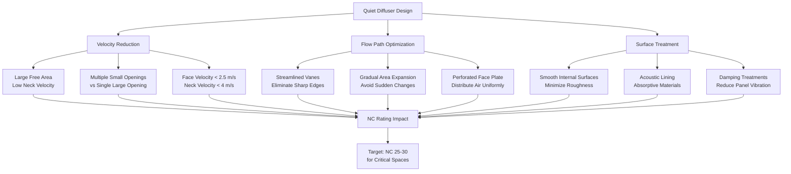

Air distribution terminal devices generate noise through turbulent airflow, surface interaction, and pressure drop mechanisms. Quiet diffusers employ specific design features to minimize sound generation while maintaining effective air distribution, making them critical for noise-sensitive environments such as theaters, recording studios, classrooms, and healthcare facilities.

## Noise Generation Mechanisms

Diffuser-generated noise originates from three primary sources that must be controlled through design.

**Turbulent Mixing Noise**

High-velocity air exiting the diffuser creates turbulent eddies as it mixes with room air. Sound power generated by turbulent mixing follows:

$$L_w = 10 \log_{10}\left(\frac{V^6 A}{10^{12}}\right) + K$$

where $L_w$ is sound power level (dB), $V$ is discharge velocity (m/s), $A$ is discharge area (m²), and $K$ is a constant dependent on diffuser geometry (typically 50-70 for conventional diffusers).

The sixth-power relationship demonstrates that halving velocity reduces sound power by 18 dB, making velocity reduction the most effective noise control strategy.

**Vortex Shedding**

Air flowing across diffuser vanes and edges creates periodic vortex shedding at a frequency:

$$f = \frac{S \cdot V}{d}$$

where $f$ is shedding frequency (Hz), $S$ is Strouhal number (0.2 for bluff bodies), $V$ is air velocity (m/s), and $d$ is characteristic dimension (m). Quiet diffusers minimize vortex shedding through streamlined blade profiles and perforated faces.

**Boundary Layer Noise**

Turbulent boundary layer development on diffuser surfaces generates broadband noise. The sound power from boundary layer turbulence scales with:

$$L_w \propto 50 \log_{10}(V) + 10 \log_{10}(A_s)$$

where $A_s$ is wetted surface area. Smooth internal surfaces and gradual area transitions reduce boundary layer noise.

## Critical Velocity Limits

Velocity at key diffuser locations directly determines acoustic performance. ASHRAE Handbook establishes maximum velocities for specific NC ratings.

| NC Rating | Face Velocity | Neck Velocity | Typical Application |
|-----------|---------------|---------------|---------------------|
| NC-15 | 1.0 m/s (200 fpm) | 2.0 m/s (400 fpm) | Recording studios, concert halls |
| NC-20 | 1.5 m/s (300 fpm) | 2.5 m/s (500 fpm) | Theaters, private offices |
| NC-25 | 2.0 m/s (400 fpm) | 3.0 m/s (600 fpm) | Classrooms, libraries |
| NC-30 | 2.5 m/s (500 fpm) | 4.0 m/s (800 fpm) | Conference rooms, open offices |
| NC-35 | 3.0 m/s (600 fpm) | 5.0 m/s (1000 fpm) | Retail spaces, lobbies |

Face velocity represents average velocity through the visible diffuser face, while neck velocity measures airflow speed at the diffuser inlet connection. Neck velocity typically governs noise generation due to higher velocity and smaller area.

## Diffuser Selection for Acoustic Performance

Manufacturers provide sound power level ratings tested per ASHRAE Standard 130 and ARI Standard 890. The sound power rating accounts for both radiated and regenerated noise.

**Sound Power Level Rating**

Diffuser sound power data specifies:

$$L_{w,total} = 10 \log_{10}\left(\sum_{i=1}^{8} 10^{L_{w,i}/10}\right)$$

where $L_{w,i}$ represents sound power in each octave band (63 Hz to 8 kHz). Total sound power combines all octave bands logarithmically.

Room-reverberant sound pressure level resulting from diffuser noise:

$$L_p = L_w - 10 \log_{10}(R) + 6$$

where $L_p$ is sound pressure level (dB), and $R$ is room constant (m²). For absorptive spaces, $R = S\alpha/(1-\alpha)$ where $S$ is surface area and $\alpha$ is average absorption coefficient.

**Aspect Ratio Considerations**

Diffuser aspect ratio (length/width) affects noise generation. Slot diffusers with high aspect ratios (>10:1) concentrate airflow, increasing velocity and noise. Square or low-aspect-ratio diffusers (<4:1) distribute air more uniformly, reducing peak velocities.

## Quiet Diffuser Design Features

Specialized quiet diffusers incorporate multiple noise reduction technologies.

**Perforated Face Diffusers**

Perforated face plates divide airflow into numerous small jets, reducing individual jet velocity while maintaining total airflow. The acoustic benefit derives from:

$$L_{w,perforated} = L_{w,solid} - 10 \log_{10}(N)$$

where $N$ is the number of perforations. Doubling perforation count reduces sound power by 3 dB.

Perforation diameter typically ranges 3-10 mm with 40-60% open area. Smaller perforations provide better acoustic performance but increase pressure drop.

**Displacement Diffusers**

Displacement diffusers deliver air at very low velocity (0.25-0.5 m/s) near floor level, eliminating turbulent mixing noise. Sound power levels typically achieve NC-20 to NC-25 without additional treatment.

The displacement principle relies on buoyancy-driven flow rather than momentum mixing:

$$\Delta T = \frac{Q_{sensible}}{\rho c_p \dot{V}}$$

where $\Delta T$ is supply-to-room temperature difference (K), $Q_{sensible}$ is sensible cooling load (W), $\rho$ is air density (kg/m³), $c_p$ is specific heat (J/kg·K), and $\dot{V}$ is volumetric flow rate (m³/s).

**Acoustic Lining**

Internal acoustic lining absorbs sound generated within the diffuser before it radiates into the space. Fiberglass or foam lining with 25-50 mm thickness provides 5-10 dB attenuation across mid-to-high frequencies (500-4000 Hz).

Noise reduction coefficient (NRC) of lining material should exceed 0.70 for effective performance.

## Comparison of Quiet Diffuser Technologies

| Diffuser Type | NC Rating Achievable | Face Velocity | Pressure Drop | Cost Premium | Best Application |
|---------------|---------------------|---------------|---------------|--------------|------------------|
| Standard slot | NC-35 to NC-40 | 3-4 m/s | 25-40 Pa | Baseline | General commercial |
| Perforated face slot | NC-25 to NC-30 | 2-3 m/s | 30-50 Pa | 20-40% | Offices, classrooms |
| Radial cone | NC-25 to NC-30 | 2-2.5 m/s | 20-35 Pa | 10-25% | Low-ceiling applications |
| Displacement | NC-20 to NC-25 | 0.25-0.5 m/s | 5-15 Pa | 50-100% | Large volume spaces |
| Acoustic ceiling diffuser | NC-20 to NC-25 | 1.5-2 m/s | 40-60 Pa | 30-60% | Critical acoustic spaces |
| Custom perforated panel | NC-15 to NC-20 | 1-1.5 m/s | 50-80 Pa | 100-200% | Studios, theaters |

## Design Guidelines per ASHRAE

ASHRAE Handbook Chapter 48 (Noise and Vibration Control) provides diffuser selection criteria:

1. Select diffusers with published sound power data tested per ASHRAE 130
2. Maintain neck velocity below values specified for target NC rating
3. Account for diffuser-generated noise in overall room NC calculation
4. Consider regenerated noise from upstream ductwork turbulence
5. Verify aspect ratio and mounting configuration match test conditions

For critical applications requiring NC-25 or lower, specify diffusers with:
- Perforated face or displacement design
- Neck velocity ≤3.0 m/s
- Internal acoustic lining
- Manufacturer's certified sound power data
- Field verification through commissioning measurements

Achieving exceptionally quiet operation (NC-20 or better) demands careful system integration including low-velocity ductwork design, proper diffuser placement away from occupant ear level, and coordination with room acoustic treatment to control sound propagation and reverberation.
