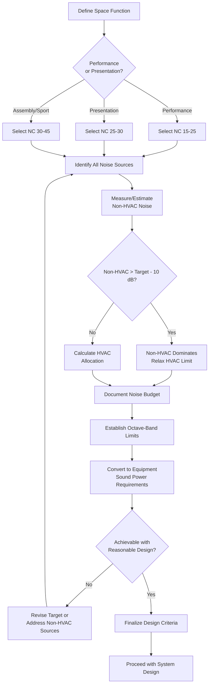

## Overview

Background noise limits define the maximum permissible sound pressure levels from HVAC systems in assembly spaces. These limits balance acoustic performance requirements with practical system design constraints. Unlike occupied office environments where moderate background noise aids speech privacy, assembly spaces demand near-silent operation to preserve speech intelligibility and musical clarity.

Establishing appropriate background noise limits requires understanding the space's acoustic function, occupant expectations, and the interaction between HVAC-generated noise and other sound sources including architectural finishes, electronic systems, and external environmental noise.

## Noise Criteria Methods

### NC (Noise Criteria) Curves

The NC method, developed by Leo Beranek in 1957 and refined through subsequent research, establishes octave-band sound pressure level limits from 63 Hz to 8000 Hz. Each NC curve represents a single-number rating describing the maximum permissible sound pressure level at each octave band.

The NC curve family provides limits that account for the human ear's frequency-dependent sensitivity. Low-frequency noise receives stricter limits than mid-frequency noise because low frequencies are more difficult to attenuate and more likely to cause annoyance through perceptible vibration and rumble.

**NC Curve Mathematical Relationship:**

The octave-band sound pressure limits for NC curves follow approximate relationships:

$$L_{NC} = NC - A_f$$

Where:
- $L_{NC}$ = octave-band sound pressure level limit (dB)
- $NC$ = noise criteria rating number
- $A_f$ = frequency-dependent adjustment factor

For practical application, use published NC curve tables rather than calculations, as the empirical curves incorporate psychoacoustic research beyond simple mathematical relationships.

### RC (Room Criteria) Curves

The RC method, introduced in 1981 and updated to RC Mark II in 1997, addresses limitations in the NC system by explicitly evaluating spectrum quality. RC curves identify "rumble" (excessive low-frequency energy) and "hiss" (excessive high-frequency energy) that indicate poor system design even when meeting NC limits.

RC curves use a reference spectrum shape based on a neutral-quality HVAC system. Deviations from this reference indicate specific problems:

- **Rumble (R)** - Low-frequency energy excess indicating undersized ducts, poor fan selection, or inadequate low-frequency attenuation
- **Hiss (H)** - High-frequency energy excess indicating excessive air velocity or turbulence
- **Neutral (N)** - Balanced spectrum following reference curve shape

The RC rating includes both the magnitude (RC 25, RC 30) and quality descriptor (RC 25(N), RC 30(H)).

### Relationship Between NC and RC

For systems with neutral spectral balance:

$$RC \approx NC - 5$$

This relationship provides rough equivalence between the two rating systems. A well-designed system meeting NC 25 typically achieves RC 20(N). However, this correlation breaks down for systems with poor spectral balance.

## Background Noise Criteria by Space Type

### Performance Venues

Performance venues require the strictest background noise limits to preserve acoustic clarity:

| Venue Type | NC Limit | RC Limit | Primary Criteria | Notes |
|------------|----------|----------|------------------|-------|
| Concert halls (classical) | NC 15-20 | RC 15(N) | Unamplified orchestral music | Noise floor must not mask pianissimo passages |
| Opera houses | NC 20-25 | RC 20(N) | Unamplified vocal performance | Critical for vocal clarity without amplification |
| Recital halls | NC 15-20 | RC 15(N) | Chamber music, solo performance | Intimate acoustic environment |
| Legitimate theaters | NC 20-25 | RC 20(N) | Dramatic performance | Speech intelligibility paramount |
| Movie theaters | NC 25-30 | RC 25(N) | Amplified presentation | System noise must not interfere with soundtrack |
| Multipurpose auditoriums | NC 25-30 | RC 25(N) | Mixed use programming | Compromise for operational flexibility |

**NC 15 spaces represent the acoustic limit of practical HVAC design.** Systems achieving NC 15 require extraordinary measures including very low velocities (200-400 fpm in mains), oversized ductwork, extensive silencer application, and remote equipment placement. The approximately 50-75% cost premium over conventional systems is justified only for world-class performance venues.

### Presentation and Assembly Spaces

Spaces emphasizing speech communication require moderate background noise limits:

| Space Type | NC Limit | RC Limit | Primary Function | Acoustic Priority |
|------------|----------|----------|------------------|-------------------|
| Large lecture halls (>200 seats) | NC 25-30 | RC 25(N) | Educational presentation | Speech intelligibility with amplification |
| Small lecture halls (<200 seats) | NC 25-30 | RC 25(N) | Educational presentation | May use unamplified speech |
| Conference centers | NC 25-30 | RC 25(N) | Business presentations | Video conferencing compatibility |
| Houses of worship - sanctuary | NC 20-30 | RC 20-25(N) | Religious services, music | Varies by denomination and musical tradition |
| Houses of worship - fellowship | NC 30-35 | RC 30(N) | Social gathering | Less critical acoustic environment |
| Court rooms | NC 25-30 | RC 25(N) | Legal proceedings | Speech intelligibility for record |
| Council chambers | NC 25-30 | RC 25(N) | Public meetings | Speech intelligibility, recording quality |

### Sports and Recreation Facilities

Large-volume spaces with high occupancy and amplified sound systems:

| Facility Type | NC Limit | RC Limit | Design Consideration | Acoustic Approach |
|---------------|----------|----------|----------------------|-------------------|
| Indoor arenas (>5,000 seats) | NC 35-45 | RC 35-40 | High ambient noise, amplified sound | HVAC noise secondary to crowd and sound system |
| Gymnasiums | NC 35-40 | RC 35(N) | High activity levels | Adequate for verbal communication |
| Natatoriums | NC 40-45 | RC 40 | High reverberation, water noise | HVAC noise masked by environmental sounds |
| Ice rinks | NC 40-45 | RC 40 | Refrigeration equipment proximity | Vibration isolation critical |

## Combined Noise Source Calculation

When multiple noise sources contribute to background noise, the total sound pressure level is calculated using logarithmic addition:

$$L_{total} = 10 \log_{10}\left(\sum_{i=1}^{n} 10^{L_i/10}\right)$$

Where:
- $L_{total}$ = total combined sound pressure level (dB)
- $L_i$ = sound pressure level of source $i$ (dB)
- $n$ = number of noise sources

**Example Calculation:**

A lecture hall contains three HVAC diffusers, each producing 30 dB at the listener position, plus a projector producing 28 dB:

$$L_{total} = 10 \log_{10}\left(3 \times 10^{30/10} + 10^{28/10}\right)$$

$$L_{total} = 10 \log_{10}(3000 + 631) = 10 \log_{10}(3631)$$

$$L_{total} = 10 \times 3.56 = 35.6 \text{ dB}$$

The combined noise level of 35.6 dB exceeds the NC 30 target (~38 dB at mid-frequencies), demonstrating the importance of considering all sources.

### Allocation of Noise Budget

Distribute the allowable background noise among contributing sources:

$$L_{HVAC} = L_{criterion} - 10 \log_{10}\left(1 + 10^{(L_{other} - L_{criterion})/10}\right)$$

Where:
- $L_{HVAC}$ = allowable HVAC noise contribution
- $L_{criterion}$ = target NC/RC level
- $L_{other}$ = combined level of all non-HVAC sources

For a space with NC 25 target (35 dB at 1000 Hz) and non-HVAC sources totaling 32 dB:

$$L_{HVAC} = 35 - 10 \log_{10}\left(1 + 10^{(32-35)/10}\right) = 35 - 2.5 = 32.5 \text{ dB}$$

The HVAC system must not exceed 32.5 dB to maintain the NC 25 criterion when combined with other sources.

## Noise Limit Determination Process

## Speech Privacy and Masking Considerations

### Speech Privacy Requirements

Speech privacy describes the degree to which conversations are unintelligible to unintended listeners. The Articulation Index (AI) or Speech Transmission Index (STI) quantifies speech privacy:

- **AI < 0.05 or STI < 0.30** - Confidential privacy (executive offices, counseling rooms)
- **AI 0.05-0.20 or STI 0.30-0.45** - Normal privacy (general offices, exam rooms)
- **AI 0.20-0.50 or STI 0.45-0.60** - Limited privacy (open offices, waiting areas)
- **AI > 0.50 or STI > 0.60** - No privacy (public spaces, lobbies)

**Assembly spaces generally target maximum intelligibility (AI > 0.70, STI > 0.75)**, the opposite of privacy-focused design. Background noise must be minimized to maximize speech intelligibility.

### Sound Masking Systems

Sound masking systems introduce controlled background noise to improve speech privacy in spaces where low background noise creates excessive intelligibility. These systems are inappropriate for assembly spaces but may apply to:

- Lobby areas adjacent to performance spaces (NC 35-40 masking)
- Administrative offices within performing arts centers
- Concession and public circulation areas

Masking systems typically produce pink noise or shaped spectra at NC 35-40 levels. Never apply sound masking in performance or presentation spaces, as it directly contradicts the acoustic objectives.

### Interaction with Architectural Acoustics

Background noise limits must coordinate with reverberation time requirements:

$$RT_{60} = 0.049 \times \frac{V}{A}$$

Where:
- $RT_{60}$ = reverberation time (seconds)
- $V$ = room volume (ft³)
- $A$ = total absorption (sabins)

Spaces with long reverberation times (cathedrals, large auditoriums) amplify background noise through sound energy buildup. The effective background noise level increases:

$$L_{reverberant} = L_{direct} + 10 \log_{10}\left(\frac{RT_{60}}{0.5}\right)$$

A space with 2.5-second RT₆₀ increases effective noise by 7 dB compared to the direct field measurement. Coordinate HVAC noise limits with acoustic consultant recommendations for absorption treatment and reverberation control.

## Verification and Measurement

### Pre-Occupancy Testing

Verify background noise levels before building acceptance:

1. **Test conditions** - HVAC system in normal operating mode, all other systems secured, exterior doors closed
2. **Measurement positions** - Multiple locations representing typical audience/occupant positions
3. **Measurement duration** - Minimum 30 seconds per position for statistical averaging
4. **Frequency resolution** - Octave-band analysis from 63 Hz to 4000 Hz minimum

### Acceptance Criteria

ASHRAE Standard 189.1 suggests the following tolerances:

- **Within ±3 dB per octave band** - Acceptable performance
- **Exceeding criterion by 3-5 dB in any band** - Marginal, investigate corrective measures
- **Exceeding criterion by >5 dB in any band** - Non-compliance, corrective action required

Many performance venue contracts specify tighter tolerances of ±2 dB for NC 15-20 spaces.

### Troubleshooting Excessive Noise

Common causes and remedies:

| Problem | Likely Cause | Remedy |
|---------|--------------|--------|
| Low-frequency rumble (63-125 Hz) | Fan-generated noise, undersized ducts | Add low-frequency silencers, reduce fan speed |
| Mid-frequency excess (250-1000 Hz) | Duct-borne noise, inadequate silencers | Increase silencer performance, check installation |
| High-frequency hiss (2000-4000 Hz) | Excessive velocity at diffusers | Reduce airflow, add terminal silencers |
| Localized noise at diffusers | Turbulence, obstruction | Adjust dampers, verify duct connections |
| Equipment vibration transmission | Inadequate isolation | Improve vibration isolation, add inertia bases |

## Design Recommendations

### Conservative Approach

For critical spaces (NC 15-25), design HVAC systems to achieve performance 5 dB better than required:

- NC 20 target → Design for NC 15
- NC 25 target → Design for NC 20

This safety margin accounts for:
- Manufacturing tolerances in equipment performance
- Field installation variations from design intent
- Aging and degradation of acoustic materials
- Unanticipated noise sources discovered post-occupancy

### Documentation Requirements

Provide complete acoustic documentation:

1. **Design calculations** - Sound power level estimates for all equipment
2. **Attenuation analysis** - Duct attenuation, silencer insertion loss, room effect calculations
3. **Predicted performance** - Octave-band sound pressure levels at representative positions
4. **Product data** - AHRI-certified sound power ratings for fans, AHRI Standard 885 data for silencers
5. **Field verification plan** - Testing protocol, acceptance criteria, remediation procedures

## References and Standards

**ASHRAE Standards and Handbooks:**
- ASHRAE Handbook—HVAC Applications, Chapter 49: Noise and Vibration Control
- ASHRAE Handbook—Fundamentals, Chapter 8: Sound and Vibration
- ASHRAE Standard 189.1: Standard for the Design of High-Performance Green Buildings

**Acoustic Standards:**
- AHRI Standard 885: Procedure for Estimating Occupied Space Sound Levels in the Application of Air Terminals and Air Outlets
- AHRI Standard 260: Sound Rating of Ducted Air Moving and Conditioning Equipment
- ASTM E1573: Standard Test Method for Evaluating Masking Sound in Open Offices

**Design Guidance:**
- Acoustical Society of America: Acoustics of Worship Spaces
- ANSI S12.60: Acoustical Performance Criteria, Design Requirements, and Guidelines for Schools

Background noise limits represent the foundation of successful acoustic design for assembly spaces. Establish realistic, achievable criteria based on space function, coordinate with architectural acoustic design, and verify performance through systematic measurement. The investment in achieving stringent noise criteria directly correlates with occupant satisfaction and the space's ability to fulfill its acoustic mission.
