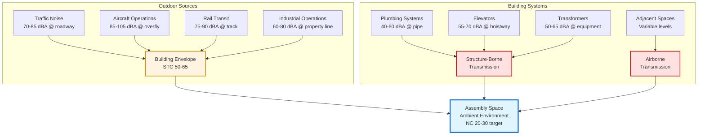

## Overview

The ambient noise environment encompasses all sound sources external to the HVAC system that contribute to the total background noise level within assembly spaces. While HVAC systems receive primary attention during acoustic design, the ambient environment often establishes the practical lower limit for achievable background noise levels. A meticulously designed NC 15 HVAC system provides no benefit if ambient traffic noise produces NC 25 conditions within the occupied space.

The ambient noise environment includes outdoor sources (traffic, aircraft, rail, industrial operations), adjacent space activities, and building service systems (plumbing, elevators, transformers). Successful acoustic design requires comprehensive analysis of all ambient sources and implementation of transmission control strategies that reduce intrusion to levels below the HVAC system contribution.

## Sound Transmission Through Building Envelope

### Transmission Loss Fundamentals

Sound transmission through building envelope assemblies follows the mass law relationship, where transmission loss increases with surface density and frequency:

$$TL = 20\log(f \cdot m) - 48$$

Where:
- $TL$ = transmission loss (dB)
- $f$ = frequency (Hz)
- $m$ = surface mass density (lb/ft²)

This relationship demonstrates that doubling wall mass increases transmission loss by 6 dB, while doubling frequency also increases transmission loss by 6 dB. Low-frequency sound (63-125 Hz) presents the greatest transmission challenge for building envelopes.

### Sound Transmission Class (STC)

Sound Transmission Class provides a single-number rating of an assembly's sound isolation performance. STC ratings derive from transmission loss measurements across 16 one-third octave bands from 125-4000 Hz, fitted to standard reference contours per ASTM E413.

The relationship between outdoor sound pressure level and indoor level accounts for transmission loss and room absorption:

$$L_{indoor} = L_{outdoor} - TL + 10\log\left(\frac{S}{A}\right)$$

Where:
- $L_{indoor}$ = indoor sound pressure level (dB)
- $L_{outdoor}$ = outdoor sound pressure level (dB)
- $TL$ = transmission loss of envelope (dB)
- $S$ = area of transmitting surface (ft²)
- $A$ = total room absorption (sabins)

For assembly spaces targeting NC 20-25, envelope assemblies facing significant outdoor noise sources require STC 55-65 ratings.

## Ambient Noise Sources

### Traffic Noise Characteristics

Highway and arterial traffic generates broadband noise with peak energy in the 250-1000 Hz octave bands. Sound levels at the roadway edge range from 70-85 dBA depending on traffic volume, speed, and vehicle mix (percentage of heavy trucks).

Traffic noise attenuates with distance according to:

$$L_2 = L_1 - 20\log\left(\frac{r_2}{r_1}\right) - \alpha(r_2 - r_1)$$

Where:
- $L_2$ = sound level at distance $r_2$ (dB)
- $L_1$ = sound level at reference distance $r_1$ (dB)
- $\alpha$ = atmospheric absorption coefficient (dB/ft)

Doubling distance from a roadway reduces sound levels by approximately 6 dB for line sources. Additional attenuation derives from ground absorption, barriers, and intervening structures.

### Aircraft Noise Impact

Aircraft operations produce the highest amplitude ambient noise events affecting assembly spaces near airports. Commercial jet aircraft generate 85-105 dBA during takeoff and approach operations, with dominant energy at 125-500 Hz octave bands from turbofan exhaust.

The Federal Aviation Administration establishes Day-Night Average Sound Level (DNL) contours around airports. Sites within the 65 DNL contour require special acoustic treatment for noise-sensitive uses. Assembly venues in these locations typically require:

- Exterior wall assemblies: STC 60-65
- Roof assemblies: STC 55-60
- Glazing systems: STC 50-55 (laminated or dissimilar thickness IGUs)
- Mechanical penetrations: Lined, baffled configurations

### Rail Transit Noise

Rail operations (freight, passenger, and light rail) generate impulsive noise events dominated by wheel-rail interaction, typically 75-90 dBA at 50 feet from track centerline. Ground-borne vibration from rail operations also transmits through building foundations, radiating as structure-borne noise within interior spaces.

Subway and underground rail systems present particular challenges for assembly spaces located above or within 200 feet of tunnel alignments. Vibration isolation of the building structure from surrounding soil may be necessary to achieve NC 20-25 performance.

## Typical Ambient Noise Levels

The following table presents characteristic ambient noise levels for various venue locations and conditions:

| Venue Location | Outdoor Ambient | Envelope STC Required | Achieved Indoor NC |
|----------------|----------------|----------------------|-------------------|
| Rural/suburban, residential area | 45-55 dBA | STC 45-50 | NC 20-25 |
| Suburban, light commercial | 55-65 dBA | STC 50-55 | NC 25-30 |
| Urban, arterial street | 65-75 dBA | STC 55-60 | NC 25-30 |
| Urban, major highway | 70-80 dBA | STC 60-65 | NC 30-35 |
| Airport approach zone (65-70 DNL) | 75-85 dBA (events) | STC 60-65 | NC 25-30 |
| Airport approach zone (70-75 DNL) | 80-90 dBA (events) | STC 65-70 | NC 30-35 |
| Active rail corridor | 70-85 dBA (events) | STC 55-60 + vibration isolation | NC 25-30 |

### Assembly Space Background Noise Targets

Ambient noise contributions must remain below HVAC system design levels to avoid dominating the background environment. The following targets establish appropriate relationships:

| Assembly Space Type | HVAC Target (NC) | Ambient Target (NC) | Combined Result (NC) |
|---------------------|------------------|---------------------|---------------------|
| Concert halls | NC 15-20 | NC 12-17 | NC 18-22 |
| Legitimate theaters | NC 20-25 | NC 17-22 | NC 23-27 |
| Movie theaters | NC 25-30 | NC 22-27 | NC 28-32 |
| Lecture halls | NC 25-30 | NC 22-27 | NC 28-32 |
| Multi-purpose auditoriums | NC 30-35 | NC 27-32 | NC 33-37 |

Ambient contributions should be approximately 3-5 dB below HVAC contributions to ensure the mechanical system dominates. This approach provides operational flexibility, as HVAC systems can be shut down during critical performances while ambient noise remains acceptable.

## Building Envelope Design Strategies

### Wall Assembly Construction

Exterior wall assemblies achieve required STC ratings through mass, decoupling, and absorption:

**High-Performance Wall Assembly (STC 60-65):**
- Exterior: Brick veneer (4" nominal) or precast concrete (6")
- Air space: 2" minimum with insulation
- Backup wall: 8" CMU or 6" metal studs at 16" o.c.
- Cavity insulation: 6" fiberglass batt
- Interior resilient channel: Hat channel at 24" o.c.
- Interior finish: Two layers 5/8" Type X gypsum board

The decoupled interior finish provides critical additional transmission loss at mid and high frequencies where mass law alone provides insufficient attenuation.

### Glazing System Selection

Glazing represents the acoustically weakest element in building envelopes. Standard 1/4" monolithic glass provides approximately STC 28, inadequate for most assembly space applications.

Achieve improved performance through:

**Laminated Glass:** Two glass plies bonded with viscoelastic interlayer (PVB). A 1/4" + 0.030" PVB + 1/4" laminated unit achieves STC 35-38.

**Asymmetric Insulating Glass Units (IGUs):** Dissimilar glass thicknesses (e.g., 1/4" outboard, 3/8" inboard) with 2" airspace achieve STC 40-45. The asymmetry eliminates coincidence dip resonance.

**Laminated IGUs:** Combine laminated glass with IGU construction for maximum performance. A 1/4" + PVB + 1/4" laminated outboard lite with 2" airspace and 3/8" inboard lite achieves STC 48-52.

Specify operable windows only when outdoor ambient levels remain below 55 dBA. Operable units inherently leak sound around seals and provide 10-15 dB less isolation than fixed glazing.

### Roof Assembly Acoustics

Roof assemblies require equal attention to walls for sites with aircraft overflight exposure. Metal deck roof systems without proper detailing provide poor low-frequency isolation due to panel resonance.

**High-Performance Roof Assembly (STC 55-60):**
- Roofing membrane: TPO or EPDM
- Cover board: 1/2" gypsum or cement fiber
- Insulation: 6" polyisocyanurate (multiple layers, staggered joints)
- Metal deck: 22 gauge, 1.5" deep
- Acoustic deck treatment: Spray-applied fiber or mineral wool (1-2")
- Interior finish: Suspended ACT ceiling or gypsum board at structure

The acoustic deck treatment provides critical absorption of sound energy within the roof cavity, reducing sound transmission through the assembly.

## Adjacent Space Noise Control

### Interior Partition Requirements

Partitions separating assembly spaces from adjacent occupied areas require careful acoustic design. Standard drywall partitions provide insufficient isolation for venues targeting NC 20-25.

| Adjacent Space Type | Required Partition STC | Construction Example |
|---------------------|----------------------|----------------------|
| Mechanical rooms | STC 60-65 | 8" CMU or staggered stud with double drywall |
| Lobbies, circulation | STC 55-60 | Staggered stud or double stud with insulation |
| Offices, practice rooms | STC 50-55 | Single stud, insulated, resilient channel |
| Restrooms | STC 50-55 | Single stud, insulated, resilient channel |
| Storage, service areas | STC 45-50 | Standard insulated stud partition |

All partition penetrations (outlets, HVAC terminals, piping) require acoustic sealing. Back-to-back electrical boxes create sound flanking paths that negate partition performance. Offset boxes horizontally by minimum 24" or use putty pads to maintain acoustic integrity.

### Floor-Ceiling Assembly Isolation

Structure-borne sound transmission from floor activities above assembly spaces (lobbies, rehearsal spaces, offices) requires impact isolation:

**Impact Insulation Class (IIC):** Measures resistance to footfall and impact noise transmission. Assembly spaces below occupied floors require IIC 60-65 to prevent intrusion.

Achieve required IIC through:
- Floating floor systems (1.5-2" concrete over resilient mat)
- Carpet with pad (provides 15-20 IIC improvement over hard surfaces)
- Suspended ceiling below with 12-18" plenum depth
- Resilient channel ceiling attachment

## Building Systems Noise Intrusion

### Plumbing System Acoustics

Plumbing systems generate noise through water flow turbulence, drainage discharge, and pump operation. Drain stacks adjacent to assembly spaces transmit broadband noise and low-frequency resonance during discharge events.

Control plumbing noise through:

**Routing:** Locate vertical drainage stacks minimum 15 feet from assembly space walls. Consolidate plumbing in dedicated chase walls isolated from performance areas.

**Pipe Wrap:** Apply 1-2" fiberglass or foam pipe insulation with acoustic barrier facing to all drainage piping within 30 feet of assembly spaces.

**Wall Isolation:** Construct chase walls as fully isolated assemblies (separate studs, resilient attachment, sealed penetrations).

**Trap Primers:** Use electronic or pressure-actuated trap primers rather than continuous drip systems to eliminate constant flow noise.

### Transformer and Electrical System Noise

Dry-type transformers generate tonal noise at 120 Hz (fundamental) and harmonics from magnetostriction of core laminations. Large transformers (500+ kVA) produce 60-70 dBA at 3 feet, sufficient to intrude into adjacent assembly spaces through structure-borne transmission.

Isolate transformer noise through:

- Dedicated electrical room with STC 55-60 walls, minimum 25 feet from assembly spaces
- Vibration isolation pads (1" deflection) under transformer base
- Flexible conduit connections to prevent structure-borne transmission to building steel
- Acoustic louvers at ventilation openings (15-20 dB insertion loss)

## Combined Ambient and HVAC Analysis

The total background noise level in an assembly space results from logarithmic addition of all contributing sources:

$$L_{total} = 10\log\left(\sum_{i=1}^{n} 10^{L_i/10}\right)$$

Where $L_i$ represents individual source contributions in dB.

For practical design, when two sources differ by:
- 0-1 dB: Total level = louder source + 3 dB
- 2-3 dB: Total level = louder source + 2 dB
- 4-9 dB: Total level = louder source + 1 dB
- 10+ dB: Total level ≈ louder source (dominant)

**Design Example:**

Concert hall targeting NC 20:
- HVAC system: NC 18 (27 dB @ 1000 Hz)
- Traffic ambient: NC 15 (24 dB @ 1000 Hz)
- Plumbing system: NC 12 (21 dB @ 1000 Hz)

Combined level: $10\log(10^{27/10} + 10^{24/10} + 10^{21/10}) = 28.3$ dB at 1000 Hz

Result: NC 21, meeting design target with appropriate margin.

## Field Verification and Testing

### Pre-Construction Ambient Surveys

Conduct 24-hour ambient noise monitoring at the site during design phase to establish baseline conditions. Measure octave-band levels during representative periods (weekday/weekend, day/night). Identify peak events (aircraft overflights, train passages) and sustained background levels.

Compare measured ambient levels to design targets. If ambient exceeds allowable interior NC by less than envelope transmission loss, the site supports acoustic objectives. If ambient exceeds objectives even with high-performance envelope, consider alternate site or accept compromise in acoustic performance.

### Post-Construction Verification

Verify envelope performance through sound isolation testing per ASTM E336. Generate broadband noise exterior to the building (calibrated loudspeaker or recorded traffic/aircraft) and measure interior response. Calculate normalized level difference and compare to design transmission loss.

Conduct testing with HVAC system operational and non-operational to separate contributions. Acceptable performance demonstrates interior ambient NC minimum 3 dB below HVAC contribution.

## Applicable Standards and Guidelines

**ASHRAE Standards:**
- ASHRAE Handbook—HVAC Applications, Chapter 49: Noise and Vibration Control
- ASHRAE Handbook—Fundamentals, Chapter 8: Sound and Vibration

**ASTM Standards:**
- ASTM E413: Classification for Rating Sound Insulation
- ASTM E90: Laboratory Measurement of Airborne Sound Transmission Loss
- ASTM E336: Field Measurement of Airborne Sound Insulation

**Acoustic Design References:**
- Beranek, L.L. *Concert Halls and Opera Houses* - Ambient criteria for performance venues
- Long, M. *Architectural Acoustics* - Building envelope transmission analysis
- Cavanaugh, W.J. and Wilkes, J.A. *Architectural Acoustics* - Composite transmission calculations

## Conclusion

The ambient noise environment establishes fundamental limits on achievable background noise performance in assembly spaces. Sites with significant outdoor noise exposure (traffic, aircraft, rail) require high-performance envelope assemblies with STC 55-65 ratings to achieve NC 20-30 targets. Building systems noise (plumbing, transformers, elevators) demands careful routing and isolation to prevent structure-borne intrusion. Successful acoustic design integrates comprehensive ambient analysis with HVAC system design to ensure combined contributions meet stringent assembly space requirements. Early-phase ambient monitoring and envelope performance verification provide essential validation that design objectives can be achieved on the selected site.
