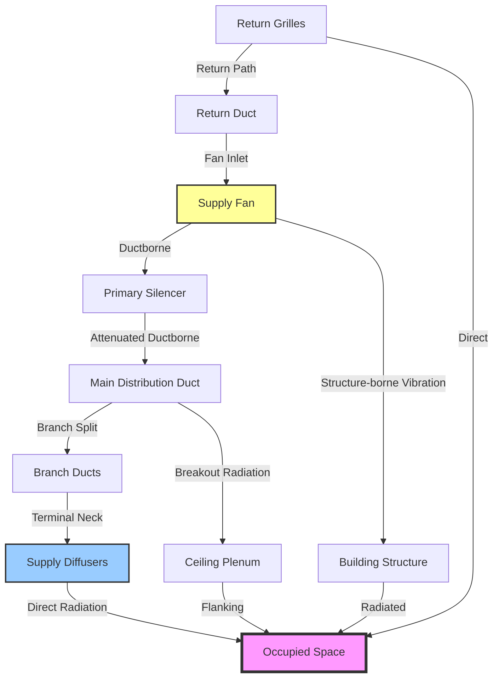

## Overview

HVAC systems represent the dominant continuous noise source in assembly spaces during occupied periods. While architectural elements, audience movement, and external intrusions contribute to the overall acoustic environment, properly designed mechanical systems determine whether a space achieves its design Noise Criteria (NC) rating. Understanding how individual HVAC components contribute to the total noise budget enables designers to allocate attenuation resources effectively and achieve required performance levels without excessive cost.

The fundamental challenge is that HVAC noise arrives at listener positions through multiple simultaneous paths—ductborne transmission, breakout radiation, structure-borne vibration, and flanking paths through ceiling plenums. Each path requires separate analysis and mitigation. The total sound pressure level at any point represents the logarithmic sum of contributions from all sources and paths.

## HVAC as Dominant Background Noise Source

### Contribution Percentage

In properly designed buildings, HVAC systems contribute 70-85% of the total background noise energy during normal operation. This dominance stems from several factors:

- Continuous operation during occupancy
- Distributed source locations throughout the space
- Multiple frequency bands of energy generation
- Direct coupling to occupied zones via air distribution

Other noise sources (exterior traffic, adjacent spaces, building systems) typically contribute the remaining 15-30% when HVAC systems are operating. During HVAC shutdown, these sources become audible and may exceed NC targets, but performance evaluation focuses on occupied conditions with full mechanical operation.

### Design Target: 5 dB Below NC

Standard practice establishes HVAC system noise targets 5 dB below the space NC rating. This margin accounts for:

1. **Non-HVAC sources** - Allows 15-30% contribution from other sources
2. **Measurement uncertainty** - Compensates for ±2 dB accuracy in predictions
3. **Future modifications** - Provides headroom for system alterations
4. **Manufacturing variation** - Accounts for equipment performance tolerances

For an NC 25 assembly space, the HVAC design target becomes NC 20. This margin ensures the space achieves NC 25 even with moderate contributions from non-HVAC sources.

$$\text{NC}_{\text{HVAC}} = \text{NC}_{\text{space}} - 5 \text{ dB}$$

## Noise Budgeting Methodology

### Total System Noise Calculation

The sound pressure level at a listener position from multiple uncorrelated sources combines logarithmically:

$$L_{p,\text{total}} = 10 \log_{10} \left( \sum_{i=1}^{n} 10^{L_{p,i}/10} \right)$$

Where:
- $L_{p,\text{total}}$ = total sound pressure level (dB)
- $L_{p,i}$ = sound pressure level from source $i$ (dB)
- $n$ = number of independent sources

This equation demonstrates that sources within 10 dB of the loudest source contribute significantly to the total, while sources more than 10 dB quieter have negligible impact.

### Component-Level Budgeting

Allocate the total HVAC noise budget among system components based on their proximity to occupied spaces and ease of control:

$$L_{w,\text{allowed}} = L_{p,\text{target}} - 10\log\left(\frac{Q}{4\pi r^2}\right) - 10\log\left(\frac{4}{R}\right) + \text{NR}$$

Where:
- $L_{w,\text{allowed}}$ = allowable sound power level (dB)
- $L_{p,\text{target}}$ = target sound pressure level at receiver (dB)
- $Q$ = directivity factor (dimensionless)
- $r$ = distance from source to receiver (m)
- $R$ = room constant, $R = \frac{S\bar{\alpha}}{1-\bar{\alpha}}$ (m²)
- $\text{NR}$ = noise reduction through intervening barriers (dB)

### Octave Band Analysis Requirements

All noise budgeting must occur in octave bands from 63 Hz through 4000 Hz. NC curves specify different limits at each frequency, with mid-frequencies (500-1000 Hz) typically governing speech interference and low frequencies (63-125 Hz) controlling rumble perception.

| Octave Band Center Frequency (Hz) | NC 15 | NC 20 | NC 25 | NC 30 |
|-----------------------------------|-------|-------|-------|-------|
| 63 | 47 | 51 | 54 | 57 |
| 125 | 36 | 40 | 44 | 48 |
| 250 | 29 | 33 | 37 | 41 |
| 500 | 22 | 26 | 31 | 35 |
| 1000 | 17 | 22 | 27 | 31 |
| 2000 | 14 | 19 | 24 | 29 |
| 4000 | 12 | 17 | 22 | 28 |

The most restrictive frequency band determines whether the space meets its NC rating. Most HVAC systems produce peak energy at 250-500 Hz, making these bands critical for design.

## Component Noise Contributions

### Typical Contribution Breakdown

In a properly balanced system design, component contributions distribute approximately as follows:

| Component | Contribution to Total HVAC Noise | Typical Range (dB below NC) |
|-----------|----------------------------------|----------------------------|
| Supply air terminals | 40-50% | NC -3 to NC -5 |
| Fan noise (ductborne) | 20-30% | NC -6 to NC -8 |
| Duct breakout | 10-20% | NC -8 to NC -10 |
| Return air grilles | 10-15% | NC -8 to NC -10 |
| Structure-borne vibration | 5-10% | NC -10 to NC -12 |
| Plenum/flanking paths | 5-10% | NC -10 to NC -12 |

This distribution assumes proper silencer application on fan discharge, appropriate duct sizing, and adequate vibration isolation. Poor design shifts contribution percentages dramatically—undersized ducts or inadequate silencers can make fan noise the dominant contributor.

### Supply Air Terminal Dominance

Supply diffusers typically represent the largest single contributor because they:

1. Locate directly in the occupied space
2. Experience no attenuation between source and receiver
3. Operate at the highest velocity point in the distribution system
4. May number 20-100+ units per space, combining logarithmically

Manufacturers provide NC ratings at specific airflow rates, but actual installation conditions (ceiling type, plenum depth, mounting orientation) alter performance by ±3 dB.

### Fan Noise Transmission

Fan-generated noise transmits through ductwork to occupied spaces via ductborne propagation. Attenuation occurs through:

- Duct silencers: 10-25 dB insertion loss per silencer
- Natural attenuation: 0.1-0.3 dB per foot in lined ducts
- End reflection loss: 3-10 dB at terminal openings
- Branch power division: 3 dB per split (theoretically)

Total duct attenuation from fan to farthest diffuser may reach 20-40 dB, but nearest terminals receive minimal benefit. This necessitates fan sound power levels 20-30 dB below space NC limits at the fan discharge.

### Duct Breakout Radiation

Sheet metal ducts radiate sound energy into adjacent spaces through panel vibration. Breakout transmission loss varies with:

$$\text{TL}_{\text{breakout}} = 10\log\left(\frac{P_d}{S_d}\right) + \text{TL}_{\text{wall}} - 3 \text{ dB}$$

Where:
- $P_d$ = duct perimeter (m)
- $S_d$ = duct surface area (m²)
- $\text{TL}_{\text{wall}}$ = duct wall transmission loss (dB)

Breakout becomes significant when:
- Ducts run in ceiling plenums above noise-sensitive spaces
- Internal duct sound levels exceed 75-80 dB
- Low frequencies (63-250 Hz) dominate the spectrum

Specify double-wall or lagged construction for ducts with internal levels exceeding 85 dB.

## Noise Path Analysis

### Path Hierarchy and Control

The diagram illustrates six distinct paths for noise transmission from HVAC systems to occupied spaces:

1. **Direct ductborne path (Fan → Silencer → Ducts → Terminals → Space)**
   - Primary design focus
   - Controlled through silencers, duct sizing, terminal selection
   - Typically contributes 60-75% of total noise

2. **Duct breakout path (Internal duct → Duct walls → Plenum → Ceiling → Space)**
   - Significant when internal duct levels exceed 80 dB
   - Controlled through duct wall construction, plenum absorption
   - Contributes 10-20% when uncontrolled

3. **Structure-borne path (Fan vibration → Structure → Radiated noise)**
   - Requires vibration isolation at equipment supports
   - Dominant below 125 Hz if isolation inadequate
   - Should contribute <5% with proper isolation

4. **Return air path (Space → Return grilles → Return ducts → Fan)**
   - Often neglected in design
   - Provides reverse transmission path for fan noise
   - Controlled through lined return ducts, low grille velocities

5. **Flanking ceiling plenum path**
   - Bypasses intended acoustic barriers
   - Requires sealed plenum construction, high-CAC ceiling tiles
   - Can dominate if ceiling system inadequate

6. **Outdoor intake/exhaust path**
   - Exterior noise sources entering through ventilation openings
   - Requires silenced louvers, adequate duct length

### Design Margins and Safety Factors

Conservative design practice incorporates margins at multiple levels:

**Component-level margin**: Specify equipment 2-3 dB quieter than calculated requirement
- Accounts for manufacturing tolerances
- Provides headroom for installation variations
- Compensates for aging/wear

**System-level margin**: Design for NC rating 5 dB below space requirement
- Allows contribution from non-HVAC sources
- Accommodates future modifications
- Reduces risk of marginal failure

**Frequency-specific margin**: Provide extra attenuation at problematic frequencies
- Low-frequency (63-125 Hz) margins of 3-5 dB for fan rumble control
- Mid-frequency (500-1000 Hz) margins of 2-3 dB for speech interference
- High-frequency (2000-4000 Hz) typically achieves targets without special margin

Total combined margin may reach 10-12 dB, which appears excessive but reflects the compounding uncertainties in acoustic prediction and the severe consequences of failure in assembly spaces.

### Cumulative Effects of Multiple Sources

When 20 identical diffusers operate simultaneously in an auditorium, the total sound power increase follows:

$$\Delta L_w = 10\log_{10}(N)$$

Where $N$ = number of identical sources.

For 20 diffusers: $\Delta L_w = 10\log_{10}(20) = 13$ dB increase over single-diffuser level.

This cumulative effect requires individual diffuser NC ratings 13 dB below the space target for this example. With 40 diffusers, the required margin increases to 16 dB, illustrating why high-capacity, low-noise terminals prove more cost-effective than numerous small units.

### Outdoor Noise Intrusion via HVAC

Outdoor air intakes and exhaust terminations provide pathways for exterior noise to enter buildings. Urban assembly spaces face challenges from:

- Traffic noise: 70-85 dBA at building facades
- Aircraft overflights: 80-95 dBA during events
- Construction activities: 75-90 dBA

Design intake and exhaust systems with:

- Acoustically rated louvers (15-25 dB insertion loss)
- Minimum 20 feet of lined ductwork between louver and occupied space
- Intake location on quiet building facade when possible
- Silencers on both intake and exhaust when exterior levels exceed 75 dBA

The transmission path from exterior to interior includes louver attenuation, duct attenuation, and terminal-end reflection loss, but direct coupling between outside and inside makes this path critical in noisy environments.

## Frequency-Specific Control Strategies

### Low-Frequency Challenges (63-125 Hz)

Low-frequency control presents the greatest difficulty due to:

- Long wavelengths (18 ft at 63 Hz) limiting silencer effectiveness
- High fan energy output in this range
- Reduced effectiveness of porous absorbers
- Strong structure-borne transmission

Control strategies:

1. Fan selection with inherently low LF output
2. Vibration isolation with natural frequencies <10 Hz
3. Reactive silencers (expansion chambers) for wavelength-specific attenuation
4. Massive concrete construction around mechanical rooms

### Mid-Frequency Design Focus (250-1000 Hz)

The 250-1000 Hz range governs most NC ratings and receives primary design attention:

- Standard fiberglass duct silencers provide peak performance
- NC curves most restrictive in this range
- Human hearing most sensitive at these frequencies
- Speech interference concentrated here

Design to achieve NC limits minus 3-5 dB margin in the 500-1000 Hz octave bands.

### High-Frequency Attenuation (2000-4000 Hz)

High frequencies attenuate readily through:

- Natural duct losses (0.5-1.0 dB/ft in lined ducts)
- End reflection at terminals
- Absorption by ceiling tiles and furnishings

Rarely require special treatment except in reverberation-controlled spaces with minimal absorption.

## Practical Application Example

For an NC 20 concert hall with 30 supply diffusers:

**Step 1: Establish HVAC target**
$$\text{NC}_{\text{HVAC}} = 20 - 5 = \text{NC } 15$$

**Step 2: Calculate individual diffuser allowance**
$$L_{\text{diffuser}} = L_{\text{NC15@1000Hz}} - 10\log_{10}(30) - 3 \text{ dB (margin)}$$
$$L_{\text{diffuser}} = 17 - 15 - 3 = -1 \text{ dB re: NC 15}$$

Individual diffusers must rate NC 14 or better at design airflow.

**Step 3: Verify fan noise contribution**
With primary silencer providing 20 dB insertion loss:
$$L_{\text{fan,allowed}} = \text{NC } 15 - 8 \text{ dB (to be } 8 \text{ dB below diffusers)}$$

Fan discharge sound power must not exceed NC 7 after silencer attenuation.

This budget allocation ensures diffusers dominate the noise signature while fan and duct contributions remain 8-10 dB below, as recommended in ASHRAE Fundamentals Chapter 48.

## Verification and Commissioning

Post-installation verification confirms design predictions:

1. **Background noise measurement** with HVAC operating at design airflow
2. **Octave-band analysis** to identify dominant contributors
3. **Comparison to NC curves** at multiple listener positions
4. **Isolation of individual sources** to verify component contributions

Measurements should occur with space unoccupied, using precision sound level meters meeting ANSI S1.4 Type 1 standards. Test results within ±2 dB of predictions indicate successful design execution.

## Conclusion

HVAC systems represent 70-85% of background noise in assembly spaces, requiring systematic noise budgeting across all components and transmission paths. Design margins of 5 dB below space NC ratings provide necessary safety factors for non-HVAC sources, uncertainties, and future modifications. Component-level analysis reveals that supply air terminals typically dominate the noise budget, with fan noise, duct breakout, and structure-borne paths contributing secondary effects when properly controlled. Octave-band analysis from 63-4000 Hz ensures compliance across all NC curve frequencies, with mid-range (500-1000 Hz) bands typically governing design decisions. Reference ASHRAE Fundamentals Chapter 48 (Noise and Vibration Control) for detailed calculation procedures and system-specific design guidance.
