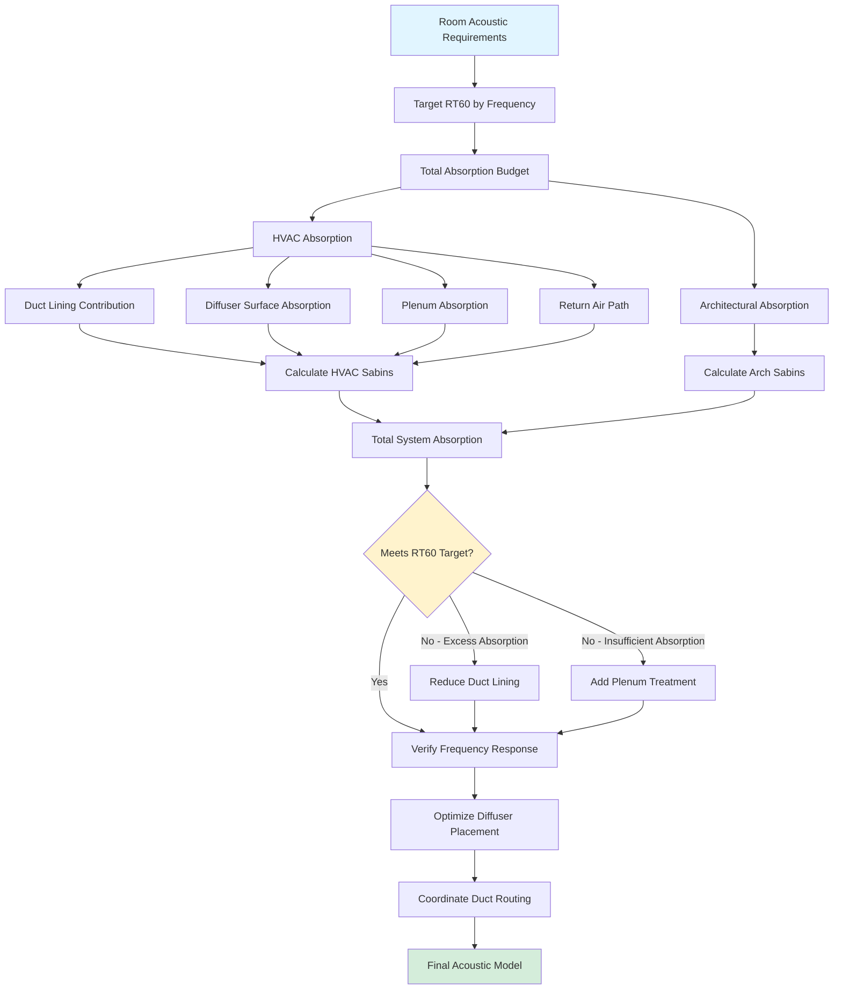

## Overview

Reverberation time represents the duration required for sound energy to decay 60 dB after a source stops emitting. In assembly spaces, HVAC systems influence reverberation time through multiple mechanisms: exposed duct surfaces provide sound absorption, diffuser locations affect sound field distribution, plenum spaces introduce additional absorption, and duct lining materials contribute to overall room acoustics. Coordination between mechanical and architectural acoustic design ensures HVAC systems support rather than compromise the intended acoustic environment.

The mechanical engineer must understand that every exposed HVAC surface, from diffuser faces to duct runs to plenum cavities, acts as an acoustic boundary with specific absorption characteristics. Ignoring these contributions during design leads to discrepancies between predicted and measured reverberation times, potentially requiring costly post-construction remediation.

## Reverberation Time Fundamentals

### Sabine Equation

The Sabine equation relates reverberation time to room volume and total sound absorption:

$$RT_{60} = \frac{0.049V}{A}$$

Where:
- $RT_{60}$ = reverberation time (seconds)
- $V$ = room volume (ft³)
- $A$ = total room absorption (sabins)

Total absorption is calculated as:

$$A = \sum_{i=1}^{n} S_i \alpha_i$$

Where:
- $S_i$ = surface area of material $i$ (ft²)
- $\alpha_i$ = absorption coefficient of material $i$ (dimensionless, 0-1)

### Norris-Eyring Equation

For rooms with highly absorptive surfaces (average α > 0.3), the Norris-Eyring equation provides more accurate results:

$$RT_{60} = \frac{0.049V}{-S\ln(1-\bar{\alpha})}$$

Where:
- $S$ = total surface area (ft²)
- $\bar{\alpha}$ = average absorption coefficient

This equation accounts for the fact that sound absorption is not perfectly diffuse in highly absorptive environments, a condition often present in assembly spaces with extensive acoustic treatment.

## Target Reverberation Times by Space Type

### Assembly Space Requirements

Different assembly functions demand specific reverberation characteristics to optimize speech intelligibility or musical quality:

| Space Type | Volume Range (ft³) | RT₆₀ Target @ 500-1000 Hz | Primary Acoustic Goal |
|------------|-------------------|---------------------------|----------------------|
| Concert halls (classical) | 300,000-600,000 | 1.8-2.2 seconds | Musical warmth, blend |
| Concert halls (contemporary) | 200,000-400,000 | 1.4-1.8 seconds | Clarity, articulation |
| Opera houses | 250,000-500,000 | 1.3-1.7 seconds | Vocal projection, orchestral balance |
| Legitimate theaters | 100,000-300,000 | 0.9-1.2 seconds | Speech intelligibility |
| Multi-purpose auditoriums | 200,000-500,000 | 1.2-1.6 seconds | Versatility |
| Lecture halls | 50,000-150,000 | 0.7-1.0 seconds | Speech clarity |
| Movie theaters | 100,000-250,000 | 0.8-1.2 seconds | Amplified sound reproduction |
| Houses of worship | 150,000-800,000 | 1.5-2.5 seconds | Liturgical music, reverberation |

### Frequency-Dependent Targets

Reverberation time varies with frequency. Optimal rooms exhibit specific frequency response characteristics:

| Frequency (Hz) | 125 | 250 | 500 | 1000 | 2000 | 4000 |
|----------------|-----|-----|-----|------|------|------|
| Concert hall ratio | 1.05-1.15 | 1.00-1.05 | 1.00 | 1.00 | 0.95-1.00 | 0.90-0.95 |
| Speech room ratio | 1.00-1.10 | 1.00-1.05 | 1.00 | 1.00 | 0.95-1.00 | 0.85-0.95 |

The ratio represents $RT_{60}(f) / RT_{60}(1000\text{ Hz})$. Concert halls benefit from slight bass rise for warmth, while speech-oriented spaces require flatter response for clarity.

## HVAC System Acoustic Contributions

### Absorption Coefficients of HVAC Materials

HVAC components contribute measurable absorption across the frequency spectrum:

| Material/Component | 125 Hz | 250 Hz | 500 Hz | 1000 Hz | 2000 Hz | 4000 Hz |
|-------------------|--------|--------|--------|---------|---------|---------|
| Bare sheet metal duct | 0.02 | 0.02 | 0.03 | 0.03 | 0.04 | 0.05 |
| 1" duct liner (fiberglass) | 0.08 | 0.25 | 0.65 | 0.85 | 0.90 | 0.90 |
| 2" duct liner (fiberglass) | 0.15 | 0.50 | 0.85 | 0.95 | 0.95 | 0.95 |
| Perforated metal diffuser | 0.15 | 0.20 | 0.15 | 0.10 | 0.08 | 0.05 |
| Linear slot diffuser | 0.10 | 0.12 | 0.10 | 0.08 | 0.06 | 0.05 |
| Acoustical lay-in ceiling | 0.15 | 0.40 | 0.70 | 0.85 | 0.85 | 0.80 |
| Return air grille (25% open) | 0.10 | 0.15 | 0.12 | 0.10 | 0.08 | 0.06 |

### Calculation Example

Consider a 150,000 ft³ lecture hall with target $RT_{60} = 0.85$ seconds at 1000 Hz:

**Required total absorption:**
$$A = \frac{0.049V}{RT_{60}} = \frac{0.049 \times 150,000}{0.85} = 8,647 \text{ sabins}$$

**HVAC absorption contribution:**
- Exposed ductwork: 2,500 ft² with 1" liner, $\alpha = 0.85$ → 2,125 sabins
- 40 diffusers: 60 ft² total, $\alpha = 0.08$ → 5 sabins
- Plenum absorption: 8,000 ft² with fiberglass, $\alpha = 0.75$ → 6,000 sabins

**Total HVAC contribution:** 8,130 sabins (94% of required absorption)

This example demonstrates that HVAC systems can dominate room acoustics when extensive duct lining and plenum treatment are employed. The architectural acoustician must account for these contributions during design.

## Diffuser Placement and Acoustic Impact

### Placement Principles

Diffuser location affects sound field uniformity and early reflection patterns. Strategic placement supports acoustic goals:

**Ceiling-mounted diffusers:**
- Position away from reflective surfaces within critical distance of performers
- Maintain minimum 6 ft spacing from wall surfaces to prevent flutter echoes
- Coordinate with architectural reflector panels to avoid blocking early reflections
- Locate between seating rows rather than directly above listener heads (reduces draft sensation)

**Wall-mounted diffusers:**
- Install in sidewall locations 8-12 ft above floor level
- Angle discharge away from reflective surfaces
- Avoid placement near proscenium openings or sound-transparent surfaces
- Consider acoustic shadowing from balcony overhangs

### Critical Distance Considerations

The critical distance $D_c$ represents the point where direct sound equals reverberant sound:

$$D_c = 0.141\sqrt{\frac{QR}{1}}$$

Where:
- $Q$ = directivity factor (2 for hemisphere, 4 for quarter-sphere)
- $R$ = room constant = $\frac{S\bar{\alpha}}{1-\bar{\alpha}}$

Place diffusers outside the critical distance for performers/speakers to minimize direct airflow noise interference with acoustic sources.

## Duct Termination Effects

### Diffuser Face Geometry

Diffuser face configuration influences both aerodynamic noise generation and acoustic reflection characteristics:

**Perforated face diffusers:**
- Perforation percentage: 25-40% for optimal acoustic performance
- Hole diameter: 3/16" to 1/4" balances acoustics and structural integrity
- Backing depth: 2-4" plenum depth provides mid-frequency absorption
- Acoustic behavior: Acts as Helmholtz resonator array with absorption peak at $f = \frac{c}{2\pi}\sqrt{\frac{p}{t(d+0.8D)}}$

Where:
- $c$ = speed of sound (1,130 ft/s)
- $p$ = perforation percentage (decimal)
- $t$ = panel thickness (ft)
- $d$ = backing depth (ft)
- $D$ = hole diameter (ft)

**Linear slot diffusers:**
- Slot width: 1/2" to 1" for assembly applications
- Aspect ratio: Length/width >12:1 minimizes end effects
- Face velocity: <200 fpm prevents slot whistle
- Pattern control: Adjustable vanes direct air parallel to ceiling to reduce turbulence noise

### Duct Lining Termination

Terminate duct liner 12-18" upstream of diffuser connection to prevent erosion while maintaining acoustic performance. Exposed ductwork in the terminal zone reduces pressure drop but increases high-frequency noise regeneration. This trade-off requires careful analysis for NC 15-20 spaces.

## Plenum Absorption Characteristics

### Plenum Space Acoustics

Ceiling plenums act as coupled volumes affecting room reverberation. The plenum absorption contribution depends on:

1. **Ceiling tile transmission loss** - Determines acoustic coupling between room and plenum
2. **Plenum surface treatment** - Fiberglass lining provides 0.70-0.95 absorption coefficients
3. **Plenum volume** - Larger volumes extend low-frequency absorption
4. **Plenum geometry** - Aspect ratios affect modal distribution

### Coupled Volume Model

For rooms with significant plenum coupling (ceiling tile NRC >0.65), model as coupled volumes:

$$RT_{60,total} = \frac{0.049(V_{room} + V_{plenum})}{A_{room} + A_{plenum} + A_{interface}}$$

Where $A_{interface}$ represents absorption at the ceiling tile boundary, calculated as:

$$A_{interface} = S_{ceiling} \times TL_{avg}$$

With $TL_{avg}$ converted to equivalent absorption using empirical relationships from ASTM E795.

## HVAC-Acoustic Integration Strategies

### Design Process Integration

**Phase 1 - Schematic Design:**
1. Establish target $RT_{60}$ values by frequency band
2. Calculate required total absorption from Sabine equation
3. Allocate absorption budget between architectural and HVAC systems
4. Determine preliminary duct lining strategy (lined vs. unlined)

**Phase 2 - Design Development:**
1. Calculate HVAC absorption contributions based on routing and diffuser layout
2. Coordinate diffuser locations with architectural reflector panels
3. Model plenum absorption effects on coupled volume behavior
4. Adjust architectural finishes to compensate for HVAC contributions

**Phase 3 - Construction Documents:**
1. Specify duct liner thickness and density by location
2. Detail diffuser mounting to minimize acoustic leakage paths
3. Establish plenum construction requirements (sealed vs. leaky)
4. Coordinate with architectural acoustician on final absorption calculations

## Return Air Path Acoustic Treatment

Return air systems require equal consideration to supply systems in acoustic design:

**Transfer grille contributions:**
- Face area absorption: $A = S_{grille} \times \alpha$ where $\alpha = 0.10-0.15$ depending on perforation
- Turbulence noise: Maintain face velocity <300 fpm
- Mounting isolation: Acoustically isolate frames from hard surfaces

**Ducted return systems:**
- Line return ducts with same criteria as supply ducts for spaces requiring NC <25
- Size for velocities 25% lower than supply to reduce pressure drop and regenerated noise
- Terminate lining 18-24" from grille connections

**Plenum return systems:**
- Acceptable only for NC 30-35 spaces with properly sealed plenum construction
- Require ceiling tiles with CAC (Ceiling Attenuation Class) >35
- Provide 2" fiberglass plenum liner for absorption contribution

## Standards and References

**ASHRAE Standards:**
- ASHRAE Handbook—HVAC Applications, Chapter 49: Noise and Vibration Control
- ASHRAE Handbook—Fundamentals, Chapter 8: Sound and Vibration
- ASHRAE Standard 189.1: Design criteria for high-performance buildings

**Architectural Acoustic Standards:**
- ASTM E90: Laboratory measurement of airborne sound transmission
- ASTM E795: Mounting test specimens during sound absorption tests
- ISO 3382: Measurement of reverberation time in auditoria
- ANSI S12.60: Acoustical performance criteria for schools

**Industry References:**
- Acoustical Society of America: Room acoustics design principles
- National Council of Acoustical Consultants (NCAC): Design guidelines
- SMACNA HVAC Systems—Duct Design: Acoustic lining specifications

## Coordination with Acoustical Consultant

Successful projects require ongoing collaboration between mechanical engineers and acoustical consultants:

1. **Early design phase**: Share preliminary duct routing and diffuser layouts for acoustic impact assessment
2. **Design development**: Provide duct liner specifications and plenum construction details for absorption modeling
3. **Construction documents**: Coordinate specifications for acoustic performance requirements and testing protocols
4. **Commissioning**: Joint verification of background noise levels and reverberation time measurements

The mechanical engineer provides quantitative data on HVAC absorption contributions, allowing the acoustician to accurately predict room acoustic performance and specify appropriate architectural treatments.

## Conclusion

HVAC systems exert substantial influence on room reverberation characteristics through duct lining absorption, diffuser surface effects, plenum coupling, and return air path contributions. Mechanical engineers must quantify these effects using the Sabine equation and coordinate with architectural acousticians to ensure HVAC design supports rather than compromises acoustic performance targets. Strategic diffuser placement, careful duct termination detailing, and appropriate plenum treatment allow HVAC systems to contribute positively to room acoustics while maintaining thermal comfort and indoor air quality. The 8-15% of total room absorption typically provided by HVAC systems represents a significant design variable requiring explicit consideration during all project phases.
