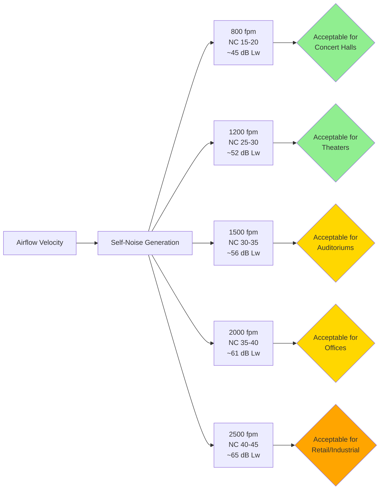

Airflow velocity through duct silencers represents a critical design parameter that directly affects self-noise generation, acoustic performance, and system efficiency. Exceeding velocity limits causes turbulence-induced noise that negates the silencer's insertion loss benefit, while unnecessarily low velocities result in oversized equipment and excessive cost.

## Self-Noise Generation Mechanisms

Self-noise occurs when airflow generates acoustic energy within the silencer assembly. Three primary mechanisms produce self-noise in dissipative duct silencers:

**Perforation Noise**

Air passing through perforated facings creates turbulent jets that radiate sound. The acoustic power generated increases dramatically with velocity, following an approximately sixth-power relationship. Small perforation diameters (1/16" to 1/8") produce higher frequency noise, while larger perforations (3/16" to 1/4") shift noise generation toward lower frequencies.

**Airway Turbulence**

Flow separation at baffle leading edges, flow restriction through narrow airways, and boundary layer turbulence along absorptive surfaces generate broadband noise across the audible spectrum. Airways narrower than 4 inches exacerbate turbulence effects, particularly at velocities exceeding 1500 fpm.

**Vortex Shedding**

Trailing edge vortices form as air exits the silencer, creating periodic pressure fluctuations that manifest as tonal or narrowband noise. The Strouhal relationship governs shedding frequency:

$$f = \frac{St \cdot V}{d}$$

Where:
- $f$ = vortex shedding frequency (Hz)
- $St$ = Strouhal number (typically 0.2 for bluff bodies)
- $V$ = air velocity (ft/s)
- $d$ = characteristic dimension, baffle thickness (ft)

## Self-Noise Power Level Relationships

The acoustic power generated by silencer self-noise follows empirical relationships validated through laboratory testing per ASTM E477:

$$L_{w,self} = K_{silencer} + 50 \log_{10}(V) + 10 \log_{10}(A)$$

Where:
- $L_{w,self}$ = self-noise sound power level (dB re 10⁻¹² W)
- $K_{silencer}$ = silencer construction constant (-10 to +5 dB)
- $V$ = face velocity (fpm)
- $A$ = free airway area (ft²)

The 50 log(V) term indicates that doubling velocity increases self-noise by approximately 15 dB. This rapid increase dominates acoustic performance at high velocities.

**Simplified Velocity-Noise Relationship**

For parallel baffle silencers with 4-6 inch airways:

$$\Delta L_w = 50 \log_{10}\left(\frac{V_2}{V_1}\right)$$

Where $\Delta L_w$ represents the change in self-noise power level when velocity changes from $V_1$ to $V_2$.

Practical example: Increasing velocity from 1000 fpm to 2000 fpm increases self-noise by:

$$\Delta L_w = 50 \log_{10}(2) = 50 \times 0.301 = 15 \text{ dB}$$

## Recommended Velocity Limits by Application

Velocity limits ensure self-noise remains below levels that compromise acoustic performance. The critical constraint is that self-noise power level must remain at least 5-10 dB below the allowable sound power level entering the occupied space.

### Maximum Face Velocity Guidelines

| Space Type | NC Target | Max Velocity (fpm) | Max Velocity (m/s) | Typical Application |
|------------|-----------|--------------------|--------------------|---------------------|
| Concert halls, recording studios | NC 15-20 | 800-1000 | 4.0-5.1 | Critical acoustic environments |
| Theaters, churches | NC 20-25 | 1000-1200 | 5.1-6.1 | Performance spaces |
| Auditoriums, lecture halls | NC 25-30 | 1200-1500 | 6.1-7.6 | Presentation venues |
| Offices, conference rooms | NC 30-35 | 1500-2000 | 7.6-10.2 | Standard commercial |
| Retail, corridors | NC 35-40 | 2000-2500 | 10.2-12.7 | Public circulation |
| Industrial areas | NC 40-45 | 2500-3000 | 12.7-15.2 | Non-critical spaces |

### Manufacturer-Specific Limits

Leading silencer manufacturers publish velocity-noise curves showing self-noise power levels at various velocities. Typical manufacturer recommendations:

- **Critical applications (NC 15-25)**: Limit velocity to 1200 fpm maximum
- **Standard applications (NC 30-35)**: Limit velocity to 1800 fpm maximum
- **Non-critical applications (NC 35-40)**: Limit velocity to 2500 fpm maximum
- **Industrial applications (NC 40+)**: Velocities up to 3500 fpm acceptable

These limits apply to standard parallel baffle construction. Low-velocity silencers with enhanced perforation patterns and optimized airway geometry support 20-30% higher velocities at equivalent self-noise levels.

## Breakout Noise Considerations

Breakout noise occurs when sound energy transmits through the silencer casing into adjacent spaces. Thin-gauge metal casings provide minimal sound transmission loss, allowing high internal sound power levels to radiate externally.

**Breakout Transmission Loss**

The sound transmission through sheet metal follows:

$$TL = 20 \log_{10}(m \cdot f) - 47$$

Where:
- $TL$ = transmission loss (dB)
- $m$ = surface mass (lb/ft²)
- $f$ = frequency (Hz)

Standard 20-24 gauge galvanized steel casings provide only 15-25 dB transmission loss at mid-frequencies, insufficient for applications where silencers pass through or near occupied spaces.

**Breakout Prevention Strategies**

1. **Increase casing thickness**: Specify 16 or 18 gauge construction for silencers in sensitive locations
2. **Add external lagging**: Wrap silencer exterior with 1-2 inch fibrous insulation and 0.5-1.0 lb/ft² mass loaded vinyl
3. **Use double-wall construction**: Manufacturers offer dual-wall casings with internal isolation
4. **Limit internal velocity**: Reducing velocity decreases internal sound power levels available for breakout

For silencers located within 10 feet of occupied spaces with NC 30 or lower requirements, external treatment adds 8-15 dB additional transmission loss.

## Silencer Sizing Methodology

Proper silencer sizing balances acoustic performance, pressure drop, physical constraints, and velocity limits.

**Step 1: Calculate Allowable Face Velocity**

Based on target NC level from the velocity limit table above, establish maximum face velocity.

**Step 2: Determine Required Face Area**

$$A_{face} = \frac{Q}{V_{max}}$$

Where:
- $A_{face}$ = silencer face area (ft²)
- $Q$ = airflow rate (CFM)
- $V_{max}$ = maximum allowable velocity (fpm)

**Step 3: Select Standard Silencer Size**

Choose a standard silencer dimension that provides face area equal to or greater than calculated minimum. Common rectangular sizes:
- 24" × 24" (4.0 ft²)
- 30" × 30" (6.25 ft²)
- 36" × 36" (9.0 ft²)
- 48" × 48" (16.0 ft²)

**Step 4: Verify Self-Noise Performance**

Using manufacturer data or the self-noise formula, calculate actual self-noise power level at design velocity. Ensure self-noise remains at least 5 dB below allowable sound power level.

**Step 5: Check Pressure Drop**

Calculate pressure drop using:

$$\Delta P = K \cdot \frac{V^2}{4005} \cdot \frac{L}{12}$$

Where:
- $\Delta P$ = pressure drop (in w.c.)
- $K$ = loss coefficient (0.8-1.5, manufacturer-specific)
- $V$ = face velocity (fpm)
- $L$ = active silencer length (feet)

Target pressure drop below 0.25 inches w.c. for most applications to minimize fan energy consumption.

### Worked Example

Design a silencer for 8,000 CFM serving a lecture hall with NC 25 requirement.

1. Maximum velocity = 1200 fpm (from table)
2. Required face area = 8,000 ÷ 1200 = 6.67 ft²
3. Select 36" × 36" silencer (9.0 ft²)
4. Actual velocity = 8,000 ÷ 9.0 = 889 fpm ✓
5. Self-noise = $K + 50 \log_{10}(889) + 10 \log_{10}(9.0)$ = 0 + 148 + 9.5 = 47.5 dB
6. For 5 ft length with K = 1.0: $\Delta P = 1.0 \times (889^2/4005) \times (5/12) = 82$ in w.c. ✓

## ASHRAE and Industry Standards

ASHRAE Handbook—HVAC Applications, Chapter 49 (Sound and Vibration Control) provides comprehensive guidance on silencer selection including velocity limit recommendations. The handbook emphasizes that face velocity represents the single most critical parameter affecting self-noise generation.

ASTM E477 establishes standard laboratory test methods for measuring silencer insertion loss, pressure drop, and self-noise. This standard requires testing at multiple velocities to characterize self-noise performance across the operating range.

AHRI Standard 885 (Procedure for Estimating Occupied Space Sound Levels in the Application of Air Terminals and Air Outlets) addresses terminal device noise generation, including effects of approach velocity on regenerated noise.

Leading silencer manufacturers including Industrial Acoustics Company (IAC), Kinetics Noise Control, Vibro-Acoustics, and Duct Silencers Inc. publish comprehensive technical data showing velocity-noise relationships for their product lines. Selection software from these manufacturers incorporates velocity limits and automatically flags designs exceeding recommended thresholds.

## Oversizing Considerations

While maintaining velocity below limits prevents self-noise issues, excessive oversizing imposes cost and space penalties. Silencer face area 25-40% larger than minimum required provides margin for:

- System airflow adjustments during commissioning
- Future system modifications or capacity increases
- Variation in manufacturer performance data
- Conservative safety factor for critical applications

Avoid oversizing beyond 50% of calculated minimum, as the incremental acoustic benefit diminishes while cost increases linearly with size.

## Conclusion

Airflow velocity limits in duct silencers derive from the fundamental physics of turbulence-generated noise, with self-noise increasing at 50 times the logarithm of velocity. Maintaining face velocities below 1200 fpm for critical acoustic applications (NC 25-30) and below 1500 fpm for standard commercial applications (NC 30-35) ensures self-noise remains subordinate to silencer insertion loss benefit. Proper sizing requires careful analysis of acoustic requirements, velocity constraints, pressure drop limitations, and physical installation parameters to achieve optimal system performance.
