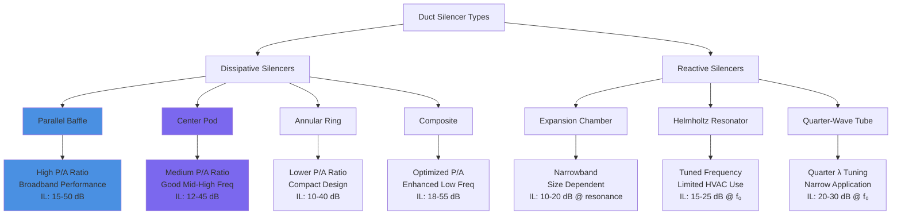

Insertion loss (IL) quantifies the reduction in sound power level achieved by installing a duct silencer in an HVAC system, expressed in decibels across octave or one-third octave frequency bands. This parameter serves as the primary metric for silencer acoustic performance and depends critically on silencer geometry, absorptive material properties, airflow characteristics, and frequency.

## Theoretical Foundation

The insertion loss of a dissipative silencer derives from the conversion of acoustic energy into heat as sound waves interact with fibrous absorptive materials. The sound pressure wave induces particle motion within the porous media, creating viscous friction and thermal exchanges that dissipate acoustic energy.

**Fundamental Insertion Loss Equation**

For parallel baffle silencers, the theoretical insertion loss follows:

$$IL = 1.05 \times \alpha \times L \times \left(\frac{P}{A}\right) - 10\log_{10}\left(\frac{A_1}{A_2}\right)$$

Where:
- $IL$ = insertion loss (dB)
- $\alpha$ = absorption coefficient of lining material (dimensionless, frequency dependent)
- $L$ = active silencer length (ft or m)
- $P$ = perimeter of absorptive surface (ft or m)
- $A$ = free cross-sectional area of airway (ft² or m²)
- $A_1$ = inlet duct area (ft² or m²)
- $A_2$ = outlet duct area (ft² or m²)

The perimeter-to-area ratio $(P/A)$ proves critical—smaller airways with greater surface area per unit cross-section provide superior attenuation. The constant 1.05 converts natural logarithm calculations to decibel scale and accounts for geometric factors.

**Simplified Practical Formula**

For standard rectangular silencers with matched inlet/outlet areas:

$$IL = K \times \alpha \times L \times \left(\frac{P}{A}\right)$$

Where $K$ ranges from 0.8 to 1.2 depending on baffle configuration and mounting details.

## Frequency Selectivity

Insertion loss demonstrates strong frequency dependence, with performance characteristics varying dramatically across the acoustic spectrum. This selectivity arises from the wavelength-to-dimension relationships and the frequency-dependent absorption coefficient of fibrous materials.

**Low Frequency Performance (63-250 Hz)**

At low frequencies, wavelengths (4.5 to 17 feet at 125 Hz) substantially exceed typical airway dimensions and absorptive material thickness. This dimensional mismatch limits acoustic energy interaction with the absorptive media. Glass fiber and mineral wool exhibit absorption coefficients of 0.1 to 0.3 in this range, resulting in modest insertion loss values.

Practical low-frequency insertion loss for standard silencers:
- 3 ft silencer: 3-6 dB at 125 Hz
- 5 ft silencer: 5-9 dB at 125 Hz
- 10 ft silencer: 9-15 dB at 125 Hz

Achieving meaningful low-frequency attenuation requires extended silencer length or specialized configurations with increased treatment surface area.

**Mid Frequency Performance (500-2000 Hz)**

Mid frequencies represent the optimal performance range for dissipative silencers. Wavelengths (0.6 to 2.3 feet at 1000 Hz) approximate airway dimensions, maximizing acoustic energy interaction with absorptive materials. Absorption coefficients reach 0.7 to 0.95, enabling substantial energy dissipation.

This frequency range typically governs silencer selection because:
1. HVAC equipment generates significant energy in these bands
2. Human hearing sensitivity peaks in this range
3. Silencer performance reaches maximum effectiveness

**High Frequency Performance (4000-8000 Hz)**

High frequency attenuation often exceeds design requirements. Wavelengths (0.14 to 0.6 feet at 4000 Hz) remain small relative to treatment dimensions, and absorption coefficients approach 0.95 to 0.99. Even short silencers provide 20-30 dB attenuation.

Natural duct attenuation and air absorption also become significant at high frequencies, sometimes eliminating the need for dedicated silencer treatment above 4000 Hz.

## Silencer Length Effects

The relationship between silencer length and insertion loss exhibits approximately linear behavior across most of the frequency spectrum, though with diminishing returns at extreme lengths due to saturation effects.

**Length-Attenuation Relationship**

Doubling silencer length increases insertion loss by:
- 63-125 Hz: 2-3 dB per doubling
- 250-500 Hz: 4-5 dB per doubling
- 1000-2000 Hz: 5-6 dB per doubling
- 4000-8000 Hz: 3-4 dB per doubling (saturation effects)

This relationship allows performance scaling:

$$IL_2 = IL_1 + 10\log_{10}\left(\frac{L_2}{L_1}\right) \times F_{freq}$$

Where:
- $IL_2$ = insertion loss at new length (dB)
- $IL_1$ = insertion loss at reference length (dB)
- $L_2$ = new silencer length (ft)
- $L_1$ = reference length (ft)
- $F_{freq}$ = frequency correction factor (0.6 to 1.0)

## Typical Insertion Loss Performance Data

The following tables present certified test data per ASTM E477 for standard parallel baffle silencers with 4-6 inch airways and glass fiber density of 3-6 lb/ft³.

**Rectangular Parallel Baffle Silencers**

| Length | 63 Hz | 125 Hz | 250 Hz | 500 Hz | 1000 Hz | 2000 Hz | 4000 Hz | 8000 Hz |
|--------|-------|--------|--------|--------|---------|---------|---------|---------|
| 3 ft   | 2-3   | 4-6    | 7-10   | 13-17  | 19-24   | 23-29   | 25-31   | 26-32   |
| 5 ft   | 3-5   | 6-9    | 11-15  | 19-25  | 27-34   | 32-40   | 35-43   | 36-44   |
| 7 ft   | 5-7   | 8-12   | 15-20  | 24-32  | 34-43   | 40-50   | 43-53   | 44-54   |
| 10 ft  | 7-10  | 11-16  | 19-26  | 30-40  | 42-53   | 48-60   | 51-63   | 52-64   |

**Circular Center-Pod Silencers**

| Length | 63 Hz | 125 Hz | 250 Hz | 500 Hz | 1000 Hz | 2000 Hz | 4000 Hz | 8000 Hz |
|--------|-------|--------|--------|--------|---------|---------|---------|---------|
| 3 ft   | 1-2   | 3-5    | 6-9    | 11-15  | 16-21   | 20-26   | 22-28   | 23-29   |
| 5 ft   | 2-4   | 5-8    | 9-13   | 16-22  | 23-30   | 28-36   | 31-39   | 32-40   |
| 7 ft   | 3-6   | 7-11   | 12-17  | 21-29  | 29-38   | 35-45   | 38-48   | 39-49   |
| 10 ft  | 5-8   | 9-14   | 16-23  | 27-37  | 36-47   | 43-55   | 46-58   | 47-59   |

Circular silencers demonstrate approximately 10-15% lower insertion loss than equivalent rectangular units due to reduced treatment surface area per unit volume.

## Face Velocity Effects

Air velocity through the silencer affects insertion loss through two competing mechanisms: acoustic streaming and self-noise generation.

**Acoustic Streaming Effects**

At moderate velocities (500-2000 fpm), airflow enhances acoustic energy transport into the absorptive material, potentially increasing insertion loss by 1-2 dB in the 500-2000 Hz range. This benefit derives from improved acoustic coupling at the air-material interface.

**Self-Noise Degradation**

At elevated velocities (>2000 fpm), turbulent flow at perforated facings generates self-noise that can exceed the insertion loss benefit. The self-noise predominantly affects high frequencies (2000-8000 Hz) where turbulent boundary layers produce significant acoustic energy.

Effective insertion loss accounting for self-noise:

$$IL_{eff} = IL_{static} - IL_{degradation}$$

Where:

$$IL_{degradation} = 10\log_{10}\left(\frac{V_{actual}}{V_{reference}}\right) \times 6$$

For $V_{reference}$ = 1500 fpm, and applies primarily above 2000 Hz.

**Recommended Face Velocity Limits**

To maintain insertion loss effectiveness:
- Low noise applications (NC 25-30): 1200-1500 fpm maximum
- Moderate noise applications (NC 30-35): 1500-2000 fpm maximum
- Higher noise applications (NC 35-40): 2000-2500 fpm maximum
- Industrial applications (NC 40+): 2500-3000 fpm maximum

## Silencer Configuration Comparison

Different silencer geometries provide varying insertion loss characteristics based on their perimeter-to-area ratios and acoustic treatment configurations.

## ASTM E477 Testing Protocol

ASTM E477 standardizes the laboratory measurement of duct silencer insertion loss, ensuring consistent performance reporting across manufacturers. The test method employs a reverberation room sound source, test duct with silencer installation, and anechoic termination.

**Test Configuration Requirements**

1. Upstream straight duct: minimum 3 duct diameters
2. Downstream straight duct: minimum 5 duct diameters
3. Anechoic termination to prevent reflections
4. Multiple microphone positions (minimum 4) for spatial averaging
5. Airflow simulation at specified velocities

**Measurement Procedure**

Insertion loss determination requires two sequential measurements:

1. **Baseline Measurement**: Sound power level with duct empty (no silencer)
2. **Silencer Measurement**: Sound power level with silencer installed

The insertion loss equals:

$$IL = L_{w,baseline} - L_{w,silencer}$$

Where measurements occur in octave or one-third octave bands from 63 Hz to 8000 Hz.

**Reporting Requirements**

Per ASTM E477, manufacturers must report:
- Insertion loss in each frequency band
- Test velocity (fpm or m/s)
- Pressure drop at test velocity
- Self-noise power level
- Silencer dimensions and configuration
- Absorptive material type and density

## ASHRAE Application Guidelines

ASHRAE Handbook—HVAC Applications, Chapter 49 provides comprehensive guidance on silencer selection and insertion loss application in system design.

**System Insertion Loss Calculation**

Required silencer insertion loss derives from the acoustic design equation:

$$IL_{required} = L_{w,source} - A_{duct} - A_{end} - A_{room} - NC_{target}$$

Where:
- $L_{w,source}$ = equipment sound power level (dB per band)
- $A_{duct}$ = natural duct attenuation (dB per band)
- $A_{end}$ = end reflection loss (dB per band)
- $A_{room}$ = room effect (dB per band)
- $NC_{target}$ = target noise criterion level (dB per band)

**Safety Factors**

ASHRAE recommends applying safety factors to account for:
- Manufacturing tolerances: 2-3 dB
- Installation variations: 2-3 dB
- Aging effects: 1-2 dB (fibrous material settling)

Total design margin typically ranges from 5 to 8 dB in critical frequency bands.

## Practical Selection Methodology

**Step 1: Frequency Band Analysis**

Identify critical frequency bands requiring attenuation. Typically 500-2000 Hz governs selection for fan noise control, while 250-1000 Hz proves critical for compressor applications.

**Step 2: Length Determination**

Select minimum silencer length providing required insertion loss in critical bands. Cross-reference manufacturer data at specified face velocity.

**Step 3: Velocity Verification**

Calculate face velocity:

$$V_{face} = \frac{CFM}{A_{face}}$$

Verify velocity remains within limits for target NC level.

**Step 4: Performance Confirmation**

Confirm insertion loss exceeds requirements across all octave bands with appropriate safety margin. Address deficient bands through increased length or multiple silencer stages.

The combination of proper theoretical understanding, standardized test data per ASTM E477, and ASHRAE design guidelines ensures accurate silencer selection and predictable acoustic performance in installed HVAC systems.
