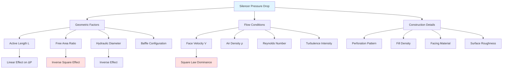

Pressure drop through duct silencers represents a critical design parameter affecting fan energy consumption, system operating costs, and acoustic performance trade-offs. Understanding the fundamental relationships between silencer geometry, airflow characteristics, and pressure losses enables engineers to optimize silencer selection for minimum lifecycle cost while achieving required acoustic attenuation.

## Fundamental Pressure Drop Theory

Pressure drop in duct silencers results from three primary mechanisms: friction losses along absorptive surfaces, form losses at inlet/outlet transitions, and turbulence within restricted airways. The total pressure drop combines these components into a single system resistance that the supply fan must overcome.

**Basic Pressure Drop Equation**

The fundamental relationship governing silencer pressure drop follows the Darcy-Weisbach equation adapted for HVAC applications:

$$\Delta P = f \cdot \frac{L}{D_h} \cdot \frac{\rho V^2}{2} + K_e \cdot \frac{\rho V^2}{2}$$

Where:
- $\Delta P$ = total pressure drop (Pa or in w.c.)
- $f$ = Darcy friction factor (dimensionless, typically 0.02-0.08 for silencers)
- $L$ = active silencer length (m or ft)
- $D_h$ = hydraulic diameter of airway (m or ft)
- $\rho$ = air density (kg/m³ or lb/ft³)
- $V$ = face velocity through silencer (m/s or fpm)
- $K_e$ = entrance/exit loss coefficient (typically 0.5-1.0)

**Hydraulic Diameter Calculation**

For rectangular airways between parallel baffles:

$$D_h = \frac{4A}{P} = \frac{4 \cdot W \cdot H}{2(W + H)} = \frac{2WH}{W + H}$$

Where:
- $A$ = airway cross-sectional area (m² or ft²)
- $P$ = wetted perimeter (m or ft)
- $W$ = airway width (m or ft)
- $H$ = airway height (m or ft)

For square airways (W = H): $D_h = W$

**Simplified Engineering Formula**

For preliminary sizing at standard conditions (sea level, 70°F):

$$\Delta P_{in\ w.c.} = C_f \cdot \left(\frac{V_{fpm}}{1000}\right)^2 \cdot \frac{L_{ft}}{D_{h,ft}}$$

Where $C_f$ is a configuration factor ranging from 0.08 to 0.15 depending on:
- Perforation geometry (hole size, percent open area)
- Fill density and facing material
- Internal baffle alignment quality
- Surface roughness

## Free Area Ratio and Velocity Effects

The free area ratio (FAR) defines the proportion of silencer face area available for airflow versus baffle obstruction. This parameter directly influences both pressure drop and acoustic performance.

**Free Area Ratio Definition**

$$FAR = \frac{A_{airway}}{A_{total}} = \frac{\sum(airway\ widths)}{total\ silencer\ width}$$

**Velocity Relationships**

For a silencer with face area $A_f$ and volumetric flow $Q$:

Face velocity: $V_f = \frac{Q}{A_f}$

Airway velocity: $V_a = \frac{Q}{A_f \cdot FAR} = \frac{V_f}{FAR}$

Since pressure drop varies with the square of velocity, reducing FAR from 0.60 to 0.50 increases pressure drop by $(0.60/0.50)^2 = 1.44$ times (44% increase).

**Typical Free Area Ratios by Silencer Type**

| Silencer Configuration | Free Area Ratio | Relative Pressure Drop | Acoustic Advantage |
|------------------------|-----------------|------------------------|-------------------|
| Wide airways (8" spacing) | 0.65-0.70 | Baseline (1.0×) | Lower IL/ft |
| Standard airways (6" spacing) | 0.55-0.60 | 1.3-1.5× | Balanced performance |
| Narrow airways (4" spacing) | 0.45-0.50 | 1.8-2.2× | Higher IL/ft |
| High-performance (3" spacing) | 0.35-0.40 | 2.8-3.5× | Maximum IL/ft |

Narrower airways increase the perimeter-to-area ratio (P/A), enhancing acoustic absorption but substantially increasing pressure drop. The optimal balance depends on specific project requirements and energy cost analysis.

## Silencer Length Effects

Pressure drop increases linearly with silencer length for fully developed turbulent flow, while insertion loss follows a logarithmic relationship with diminishing returns at extended lengths.

**Length Impact on Pressure Drop**

Doubling silencer length doubles the friction component of pressure drop:

$$\frac{\Delta P_2}{\Delta P_1} = \frac{L_2}{L_1}$$

However, entrance/exit losses remain constant regardless of length.

**Comparative Pressure Drop by Length**

| Silencer Length | 1000 fpm | 1500 fpm | 2000 fpm | 2500 fpm | 3000 fpm |
|-----------------|----------|----------|----------|----------|----------|
| 3 ft (0.9 m) | 0.04 | 0.09 | 0.16 | 0.25 | 0.36 |
| 5 ft (1.5 m) | 0.07 | 0.15 | 0.27 | 0.42 | 0.60 |
| 7 ft (2.1 m) | 0.10 | 0.22 | 0.38 | 0.59 | 0.85 |
| 10 ft (3.0 m) | 0.14 | 0.31 | 0.54 | 0.84 | 1.21 |

Values in inches w.c. for rectangular silencers with 0.55 FAR.

**Acoustic Efficiency vs. Pressure Penalty**

The insertion loss per unit pressure drop provides a metric for comparing silencer efficiency:

$$\eta_{acoustic} = \frac{IL_{avg}\ (dB)}{\Delta P\ (in\ w.c.)}$$

Shorter silencers typically exhibit higher $\eta_{acoustic}$ values, making them preferable when moderate attenuation suffices and energy costs dominate lifecycle considerations.

## Pressure Drop by Silencer Type

Different silencer configurations demonstrate varying pressure drop characteristics based on construction and airflow patterns.

### Parallel Baffle Silencers (Rectangular)

Standard construction with multiple parallel baffles creates uniform airflow distribution and predictable pressure drop. Pressure losses correlate strongly with FAR and baffle length.

**Typical Performance:**
- Pressure drop: 0.15-0.40 in w.c. at 2000 fpm
- Free area ratio: 0.50-0.60
- Best application: Main supply/return ducts

### Center Pod Silencers (Circular)

Center pod design concentrates absorptive material along the duct centerline, creating annular airflow. Pod diameter relative to duct diameter determines pressure drop.

**Pod Diameter Ratio Effects:**

| Pod/Duct Ratio | FAR | Pressure Drop Factor | Comments |
|----------------|-----|---------------------|----------|
| 0.40 | 0.84 | 1.0× | Minimal pressure drop, lower IL |
| 0.50 | 0.75 | 1.3× | Balanced design |
| 0.60 | 0.64 | 1.7× | Higher IL, moderate pressure |
| 0.70 | 0.51 | 2.6× | Maximum IL, high pressure drop |

**Typical Performance:**
- Pressure drop: 0.10-0.30 in w.c. at 2000 fpm
- Free area ratio: 0.65-0.85
- Best application: Circular duct mains, limited space

### Elbow Silencers

Elbow silencers combine acoustic treatment with directional change, eliminating a separate elbow fitting. Pressure drop includes both friction and form losses from the 90° turn.

**Typical Performance:**
- Pressure drop: 0.25-0.60 in w.c. at 2000 fpm
- Equivalent to: Straight silencer + standard elbow
- Best application: Space-constrained installations

### Dissipative vs. Reactive Comparison

| Type | Pressure Drop | Broadband Performance | HVAC Suitability |
|------|---------------|----------------------|------------------|
| Dissipative (fibrous fill) | Moderate (0.15-0.40 in w.c.) | Excellent | Standard choice |
| Reactive (chamber/resonator) | Low (0.05-0.15 in w.c.) | Narrow-band only | Rare in HVAC |
| Hybrid (combined) | Moderate-High (0.20-0.50 in w.c.) | Very good | Specialized applications |

## Energy Impact and Operating Cost

Pressure drop directly translates to fan energy consumption through the fundamental fan power equation:

$$P_{fan} = \frac{Q \cdot \Delta P}{\eta_{fan}} = \frac{Q \cdot \Delta P}{6356 \cdot \eta_{fan}}$$

Where:
- $P_{fan}$ = fan power (hp)
- $Q$ = airflow (CFM)
- $\Delta P$ = total pressure (in w.c.)
- $\eta_{fan}$ = fan total efficiency (typically 0.55-0.75)

**Annual Energy Cost Calculation**

$$Cost_{annual} = P_{fan} \cdot 0.746 \cdot t_{hrs} \cdot c_{kWh}$$

Where:
- $0.746$ = conversion factor hp to kW
- $t_{hrs}$ = annual operating hours
- $c_{kWh}$ = electricity cost ($/kWh)

**Example Energy Cost Comparison**

System parameters:
- Airflow: 10,000 CFM
- Operating hours: 4,000 hrs/year
- Electricity cost: $0.12/kWh
- Fan efficiency: 0.65

| Silencer ΔP | Fan Power | Annual kWh | Annual Cost | 10-Year Cost |
|-------------|-----------|------------|-------------|--------------|
| 0.20 in w.c. | 4.8 hp | 14,300 | $1,716 | $17,160 |
| 0.40 in w.c. | 9.6 hp | 28,600 | $3,432 | $34,320 |
| 0.60 in w.c. | 14.4 hp | 42,900 | $5,148 | $51,480 |
| 0.80 in w.c. | 19.2 hp | 57,200 | $6,864 | $68,640 |

A 0.40 in w.c. increase in pressure drop costs $17,160 over 10 years for this moderate-sized system. Large systems with higher flow rates experience proportionally greater energy penalties.

## Pressure Drop Influencing Factors

## Design Optimization Strategies

**Strategy 1: Maximize Free Area Ratio**

Specify wider airways when acoustic requirements permit. Increasing airway width from 4" to 6" (FAR from 0.50 to 0.60) reduces pressure drop by approximately 30% with a corresponding reduction in insertion loss of 2-4 dB.

**Strategy 2: Reduce Face Velocity**

Upsize silencer face dimensions to achieve lower velocities. Since $\Delta P \propto V^2$, reducing velocity from 2000 to 1500 fpm (25% reduction) decreases pressure drop by 44%.

Face area adjustment:

$$A_{new} = A_{original} \cdot \left(\frac{V_{original}}{V_{target}}\right)$$

**Strategy 3: Minimize Required Length**

Use the shortest silencer length that achieves required insertion loss. Consider multiple shorter silencers in series rather than a single long unit if installation constraints permit, as this provides acoustic redundancy with equivalent or lower total pressure drop.

**Strategy 4: Select Appropriate Silencer Type**

Match silencer configuration to application:
- Low pressure drop priority: Center pod circular silencers or wide-airway rectangular units
- Maximum attenuation priority: Narrow-airway parallel baffle silencers
- Balanced approach: Standard rectangular with 0.55-0.60 FAR

## Testing and Verification

ASTM E477 "Standard Test Method for Laboratory Measurement of Acoustical and Airflow Performance of Duct Liner Materials and Prefabricated Silencers" establishes procedures for measuring pressure drop alongside insertion loss. Manufacturers provide certified test data showing pressure drop curves across the velocity range.

**Field Verification**

Install pressure taps 2-3 duct diameters upstream and downstream of the silencer, avoiding turbulent regions near elbows or transitions. Use calibrated manometers or differential pressure transducers to measure actual pressure drop at design airflow.

Measured values exceeding manufacturer predictions by more than 20% indicate:
- Improper installation with airflow obstructions
- Damaged or compressed absorptive media
- Manufacturing defects or specification deviations

## ASHRAE Standards and References

ASHRAE Handbook—HVAC Applications, Chapter 49 (Sound and Vibration Control) provides comprehensive guidance on silencer pressure drop calculations and selection procedures. The chapter includes correction factors for:
- Altitude (reduced air density decreases pressure drop)
- Temperature (higher temperatures reduce density)
- Humidity (minimal effect on pressure drop)

Pressure drop calculations account for standard air density of 0.075 lb/ft³ (1.20 kg/m³) at sea level. At 5,000 ft elevation, air density decreases to 0.065 lb/ft³, reducing pressure drop by approximately 13%.

ASHRAE Standard 90.1 (Energy Standard for Buildings) indirectly addresses silencer pressure drop through fan power limitations and pressure drop budgets for system components. Total system pressure drop, including silencers, must remain within efficient fan operating ranges.

## Economic Decision Framework

Total lifecycle cost combines first cost and operating cost over the analysis period:

$$LCC = C_{initial} + \sum_{i=1}^{n} \frac{C_{energy,i}}{(1+d)^i}$$

Where:
- $LCC$ = lifecycle cost
- $C_{initial}$ = equipment and installation cost
- $C_{energy,i}$ = energy cost in year i
- $d$ = discount rate
- $n$ = analysis period (typically 15-20 years)

Low pressure drop silencers carry higher first costs but reduced operating costs. The optimal selection depends on electricity rates, operating schedules, and discount rates. In continuous-operation facilities with high energy costs, premium low-pressure-drop silencers typically prove economical despite 20-40% higher initial investment.

Select silencers balancing acoustic performance, pressure drop, physical constraints, and lifecycle economics. Optimizing for minimum first cost often yields substantially higher operating costs over the system lifespan, particularly in systems operating extended hours or requiring significant attenuation demanding longer silencer lengths.
