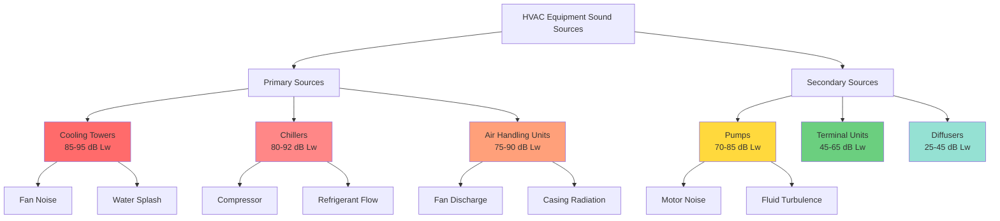

## Overview

Equipment sound levels represent the primary acoustic challenge in assembly space HVAC design. While duct-borne noise can be attenuated through silencers and low-velocity design, equipment-generated noise requires source control through careful selection, placement, and isolation. Understanding sound power ratings, octave-band characteristics, and equipment-specific acoustic performance enables designers to specify systems that meet stringent NC 15-25 requirements without costly retrofits.

Sound power level (Lw) quantifies the total acoustic energy emitted by equipment independent of distance or room characteristics. This frequency-independent metric allows direct comparison between manufacturers and prediction of installed sound pressure levels using established acoustic formulas. ASHRAE Fundamentals Chapter 8 and AMCA Publication 300 provide the standardized test methods and rating procedures that enable reliable acoustic predictions.

## Sound Power Rating Fundamentals

### Sound Power Level Calculation

Sound power level represents the logarithmic ratio of acoustic power output to the reference power level:

$$L_w = 10 \log_{10} \left( \frac{W}{W_0} \right)$$

Where:
- $L_w$ = sound power level (dB re $10^{-12}$ W)
- $W$ = acoustic power output (W)
- $W_0$ = reference power = $10^{-12}$ W

For equipment with multiple sources, total sound power combines logarithmically:

$$L_{w,total} = 10 \log_{10} \left( \sum_{i=1}^{n} 10^{L_{w,i}/10} \right)$$

This relationship demonstrates that combining two identical sources (same Lw) increases total sound power by 3 dB, not doubling.

### Octave-Band Analysis

Equipment sound power must be analyzed across octave bands to assess compliance with NC curves, which establish frequency-dependent limits:

$$L_{w,oct} = L_{w,overall} + K_{oct}$$

Where:
- $L_{w,oct}$ = sound power in octave band (dB)
- $L_{w,overall}$ = overall A-weighted sound power (dBA)
- $K_{oct}$ = octave-band correction factor from manufacturer data

Standard octave bands for HVAC analysis: 63 Hz, 125 Hz, 250 Hz, 500 Hz, 1000 Hz, 2000 Hz, 4000 Hz, 8000 Hz.

### Distance Attenuation

Sound pressure level at a receiver location decreases with distance according to the inverse square law for point sources:

$$L_p = L_w - 20 \log_{10}(r) - 11$$

Where:
- $L_p$ = sound pressure level at distance r (dB)
- $r$ = distance from source (ft)
- 11 dB = constant for point source in free field

For line sources (piping runs), attenuation follows:

$$L_p = L_w - 10 \log_{10}(r) - 8$$

## Equipment Sound Level Hierarchy

## Air Handling Unit Sound Levels

### AHU Sound Power Characteristics

Air handling units generate sound through multiple mechanisms: fan rotation, air turbulence, motor operation, and casing vibration. Total AHU sound power depends on fan type, airflow, static pressure, and cabinet construction.

**Typical AHU Sound Power Levels by Configuration:**

| AHU Type | Airflow (CFM) | Fan Type | Lw Overall (dBA) | Lw @ 500 Hz (dB) |
|----------|---------------|----------|------------------|------------------|
| Draw-through | 5,000 | FC centrifugal | 78 | 72 |
| Draw-through | 10,000 | FC centrifugal | 83 | 77 |
| Draw-through | 20,000 | AF centrifugal | 88 | 82 |
| Blow-through | 5,000 | FC centrifugal | 81 | 75 |
| Blow-through | 10,000 | FC centrifugal | 86 | 80 |
| Blow-through | 20,000 | AF centrifugal | 91 | 85 |
| Plenum fan | 10,000 | Plug fan | 80 | 74 |
| Plenum fan | 20,000 | Plug fan | 85 | 79 |

Note: FC = forward curved, AF = airfoil. Draw-through configurations provide 3-5 dB lower discharge sound power.

### Fan Selection for Low Sound

Fan selection fundamentally determines AHU acoustic performance. Operating fans at peak efficiency (typically 70-80% of maximum cataloged volume) minimizes sound generation:

$$L_{w,fan} = K_w + 10 \log_{10}(Q) + 20 \log_{10}(P_{sf})$$

Where:
- $K_w$ = fan-specific constant (from AMCA data)
- $Q$ = airflow (CFM)
- $P_{sf}$ = fan static pressure (in. w.g.)

This relationship shows that doubling static pressure increases sound power by 6 dB, while doubling airflow increases sound power by 3 dB.

**Fan Type Sound Power Ranking (quietest to loudest):**

1. Airfoil backward-inclined centrifugal (Kw = 35-40)
2. Backward-inclined centrifugal (Kw = 38-43)
3. Plenum/plug fans (Kw = 40-45)
4. Forward-curved centrifugal (Kw = 45-50)
5. Axial fans (Kw = 48-53)

### AHU Cabinet Radiation

Cabinet sound radiation occurs when internal sound energy transmits through AHU walls. Double-wall construction with 2-4 inch fiberglass insulation provides 15-25 dB attenuation across octave bands:

| Frequency (Hz) | Single-wall 22 ga | Double-wall 2" ins | Double-wall 4" ins |
|----------------|-------------------|--------------------|--------------------|
| 63 | 8 dB | 18 dB | 22 dB |
| 125 | 12 dB | 22 dB | 28 dB |
| 250 | 16 dB | 26 dB | 32 dB |
| 500 | 18 dB | 28 dB | 35 dB |
| 1000 | 20 dB | 30 dB | 38 dB |
| 2000 | 22 dB | 32 dB | 40 dB |
| 4000 | 24 dB | 34 dB | 42 dB |

Specify AHUs with double-wall, acoustically lined construction for assembly space applications. Require AMCA 300 certified sound ratings.

## Chiller Sound Levels

### Chiller Acoustic Characteristics

Chillers generate sound primarily through compressor operation, refrigerant flow, and control valve modulation. Water-cooled centrifugal chillers provide the lowest sound levels, while air-cooled scroll and screw chillers produce significantly higher output.

**Chiller Sound Power Levels by Type:**

| Chiller Type | Capacity (Tons) | Compressor | Lw Overall (dBA) | Lw @ 125 Hz (dB) | Lw @ 500 Hz (dB) |
|--------------|-----------------|------------|------------------|------------------|------------------|
| Centrifugal, water-cooled | 200 | Single stage | 82 | 79 | 76 |
| Centrifugal, water-cooled | 500 | Single stage | 87 | 84 | 81 |
| Centrifugal, water-cooled | 1000 | Two stage | 90 | 87 | 84 |
| Screw, water-cooled | 200 | Twin screw | 85 | 83 | 80 |
| Screw, water-cooled | 500 | Twin screw | 90 | 88 | 85 |
| Scroll, air-cooled | 50 | Multiple scroll | 84 | 78 | 75 |
| Scroll, air-cooled | 100 | Multiple scroll | 89 | 83 | 80 |
| Screw, air-cooled | 200 | Single screw | 92 | 88 | 85 |

### Compressor Sound Control

Compressor-generated sound dominates chiller acoustic output, particularly at low frequencies (63-250 Hz) where NC curve limits are most restrictive. Variable-speed compressors operating at part load reduce sound power by 3-8 dB compared to full-load operation.

Isolation mounting reduces structure-borne transmission but does not affect airborne sound radiation. Chiller acoustic enclosures provide 10-20 dB insertion loss when properly designed with sound-absorptive interior lining and sealed access panels.

### Chiller Placement Requirements

Locate chillers with minimum 100 ft horizontal separation from assembly spaces or isolate with STC 60+ construction. Mechanical penthouses above performance spaces require 6-8 inch concrete structural slabs with continuous resilient underlayment to prevent low-frequency transmission.

## Pump Sound Levels

### Pump Acoustic Output

Pumps generate sound through motor operation, impeller rotation, fluid turbulence, and cavitation. Properly selected pumps operating at design conditions produce 70-80 dBA sound power, while oversized pumps throttled with control valves may exceed 85 dBA.

**Pump Sound Power Levels:**

| Pump Type | Flow (GPM) | Head (ft) | Motor (HP) | Lw Overall (dBA) | Lw @ 250 Hz (dB) |
|-----------|------------|-----------|------------|------------------|------------------|
| End suction | 100 | 50 | 5 | 73 | 68 |
| End suction | 500 | 80 | 25 | 79 | 74 |
| End suction | 1000 | 100 | 50 | 83 | 78 |
| Split case | 1000 | 150 | 75 | 85 | 80 |
| Split case | 2000 | 200 | 150 | 89 | 84 |
| Vertical inline | 200 | 60 | 10 | 76 | 71 |
| Vertical inline | 500 | 100 | 30 | 81 | 76 |

### Cavitation Noise

Cavitation occurs when local fluid pressure drops below vapor pressure, creating and collapsing vapor bubbles. This phenomenon generates broadband noise 10-20 dB above normal pump operation and causes rapid impeller damage.

Prevent cavitation by maintaining net positive suction head available (NPSHa) at least 5 ft above NPSHr:

$$NPSH_a = P_{atm} + P_{static} - P_{vapor} - h_{friction}$$

Where all terms are in feet of liquid.

### Pump Vibration Isolation

Mount pumps on 1.5-2.0 inch static deflection spring isolators or elastomeric pads. Install flexible connectors on suction and discharge piping within 4 pipe diameters of pump flanges. Provide inertia bases (2-2.5 times pump weight) for pumps exceeding 20 HP.

## Cooling Tower Sound Levels

### Cooling Tower Acoustic Characteristics

Cooling towers rank among the loudest HVAC equipment, combining fan noise with water splash sound. Open-circuit towers generate 85-95 dBA at typical operating conditions, presenting severe challenges for sites adjacent to assembly spaces.

**Cooling Tower Sound Power Levels:**

| Tower Type | Capacity (Tons) | Fan HP | Fan Qty | Lw Overall (dBA) | Lw @ 500 Hz (dB) |
|------------|-----------------|--------|---------|------------------|------------------|
| Induced draft, open | 200 | 10 | 2 | 87 | 82 |
| Induced draft, open | 500 | 20 | 2 | 91 | 86 |
| Induced draft, open | 1000 | 30 | 3 | 94 | 89 |
| Forced draft, open | 200 | 15 | 2 | 89 | 84 |
| Forced draft, open | 500 | 25 | 2 | 93 | 88 |
| Closed circuit | 200 | 15 | 2 | 85 | 80 |
| Closed circuit | 500 | 25 | 2 | 89 | 84 |

### Tower Sound Attenuation

Multiple strategies reduce cooling tower sound transmission to adjacent spaces:

1. **Low-speed fans** - Reduce fan tip speed from 12,000 to 8,000 fpm for 6-8 dB reduction
2. **Discharge plenums** - Add 6-10 ft plenum height above fans for 5-8 dB attenuation
3. **Sound barriers** - Install perimeter walls with 4-6 lb/ft² mass for 10-15 dB reduction
4. **Acoustic louvers** - Replace standard inlet louvers with acoustic versions for 8-12 dB insertion loss

Combining strategies achieves cumulative attenuation approaching 25-30 dB, sufficient for towers located 50+ ft from assembly spaces.

### Alternative Cooling Systems

Consider closed-loop systems for sites where tower noise proves prohibitive:

- Dry coolers (air-cooled fluid coolers): 82-88 dBA, no water splash noise
- Adiabatic coolers: 84-90 dBA, pre-cooling minimizes evaporative noise
- Hybrid towers: Switch to dry mode during low-load or noise-sensitive periods

## Testing and Verification Standards

### AMCA 300 - Sound Testing Standards

AMCA Publication 300, "Reverberant Room Method for Sound Testing of Fans," establishes standardized test procedures for determining fan sound power levels. This standard requires:

- Reverberant room meeting qualification criteria (T60 > 1.5 sec)
- Background noise 10 dB below test levels
- Octave-band measurements from 63 Hz through 8000 Hz
- Multiple microphone positions (minimum 6) time-averaged
- Correction for room absorption characteristics

Specify that all fans and AHUs include AMCA 300 certified sound ratings. Reject equipment lacking certified performance data.

### AHRI 370 - Chiller Sound Rating

AHRI Standard 370 establishes sound rating and testing procedures for liquid-chilling packages. Testing occurs in semi-reverberant conditions with corrections applied for room characteristics. Certified ratings include:

- Sound power levels by octave band
- Overall A-weighted sound power level
- Reference sound pressure at 5 meters
- Operating condition (full load, part load)

### Sound Level Verification Testing

Conduct post-installation sound testing to verify compliance with design criteria:

1. **Background noise measurement** - Measure ambient with all equipment off
2. **Equipment operating measurement** - Measure with specific equipment energized
3. **Octave-band analysis** - Compare measured levels to NC curve limits
4. **Source identification** - Isolate excessive sources for remediation

Require contractor-furnished testing by certified acoustical consultants for NC 15-25 spaces. Document all measurements and submit to design team for review.

## Conclusion

Equipment sound levels determine the acoustic success of assembly space HVAC systems. Selection of low-sound equipment (airfoil fans, centrifugal chillers, properly sized pumps), strategic placement with adequate separation, and comprehensive vibration isolation form the foundation of effective acoustic design. Sound power ratings certified to AMCA 300 and AHRI 370 standards enable reliable predictions, while post-installation testing verifies compliance. The 10-15% cost premium for acoustically rated equipment represents essential investment for achieving NC 15-25 performance in theaters, concert halls, and lecture facilities. Reference ASHRAE Handbook—Fundamentals Chapter 8 for acoustic calculation procedures and ASHRAE Handbook—HVAC Applications Chapter 49 for equipment-specific guidance.
