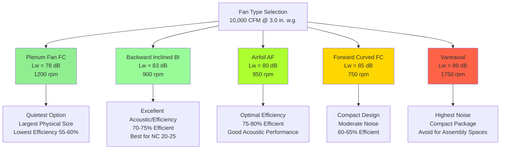

## Overview

Fan selection represents the most critical decision in achieving acceptable acoustic performance in assembly space HVAC systems. The fan determines the baseline sound power level that propagates throughout the distribution system, and improper selection can render even the most carefully designed duct system incapable of meeting NC 15-25 criteria. Fans operating in assembly space applications must deliver substantial airflow (typically 10,000-50,000 CFM) while generating 15-20 dB less sound power than fans in conventional commercial systems.

The acoustic performance of a fan depends on six primary factors: fan type, impeller design, operating point relative to peak efficiency, rotational speed, inlet and outlet conditions, and system effects. Each factor contributes logarithmically to total sound power output, making optimization of all parameters essential rather than optional.

## Fan Sound Power Fundamentals

### Sound Power Level Definition

Sound power level ($L_w$) represents the total acoustic energy emitted by a fan, measured in decibels referenced to $10^{-12}$ watts. Unlike sound pressure level, which varies with distance and room acoustics, sound power level is an intrinsic property of the source.

The relationship between fan aerodynamic performance and sound power follows empirically derived equations. For centrifugal fans, the total sound power level correlates with fan size and operating conditions:

$$L_w = K_w + 10\log_{10}(Q) + 20\log_{10}(P) + C$$

Where:
- $L_w$ = overall sound power level (dB re $10^{-12}$ W)
- $K_w$ = specific sound power level coefficient (fan type dependent)
- $Q$ = airflow rate (CFM)
- $P$ = total pressure (in. w.g.)
- $C$ = correction factor for operating point and installation

### Octave Band Distribution

Fans generate sound power across the frequency spectrum, but the distribution varies significantly by fan type. The octave-band sound power level at frequency $f$ can be estimated from overall sound power:

$$L_{w,f} = L_w - \Delta L_f$$

Where $\Delta L_f$ represents the octave-band reduction from overall level. For backward-inclined centrifugal fans operating at design point:

| Octave Band Center Frequency (Hz) | $\Delta L_f$ (dB) | Typical Application |
|-----------------------------------|-------------------|---------------------|
| 63 | -12 | Low-frequency rumble |
| 125 | -8 | Structural transmission concern |
| 250 | -3 | Primary acoustic energy |
| 500 | -1 | Peak sound power output |
| 1000 | -2 | Speech frequency range |
| 2000 | -5 | High-frequency content |
| 4000 | -10 | Typically attenuated by silencers |
| 8000 | -16 | Minimal contribution to NC |

The concentration of acoustic energy in the 250-1000 Hz range directly overlaps with the human ear's maximum sensitivity and speech intelligibility frequencies, making octave-band analysis essential for assembly space applications.

### Fan Speed and Sound Power Relationship

Sound power level increases dramatically with fan rotational speed according to the fan laws. For a given fan operating on its characteristic curve:

$$L_{w2} = L_{w1} + 50\log_{10}\left(\frac{N_2}{N_1}\right)$$

Where:
- $L_{w1}$, $L_{w2}$ = sound power levels at speeds $N_1$ and $N_2$
- $N_1$, $N_2$ = rotational speeds (rpm)

This relationship demonstrates why reducing fan speed by 20% (via VFD control or mechanical speed change) reduces sound power by approximately 8.5 dB—a clearly audible difference. For assembly spaces, this relationship drives the fundamental strategy: select larger, slower-rotating fans rather than smaller, faster units.

### Tip Speed Acoustic Limit

Fan blade tip speed ($V_{tip}$) fundamentally limits acoustic performance. Tip speed relates to fan diameter and rotational speed:

$$V_{tip} = \frac{\pi D N}{720}$$

Where:
- $V_{tip}$ = blade tip speed (ft/min)
- $D$ = impeller diameter (inches)
- $N$ = rotational speed (rpm)

For assembly space applications, maintain tip speeds below the following limits:

| Fan Type | Maximum Tip Speed | Application Limit |
|----------|-------------------|-------------------|
| Plenum fans (FC) | 4,000 fpm | NC 15-20 spaces |
| Backward inclined | 7,500 fpm | NC 20-25 spaces |
| Airfoil centrifugal | 10,000 fpm | NC 25-30 spaces |
| Vaneaxial fans | 12,000 fpm | Not recommended for critical acoustics |

Exceeding these limits generates turbulence-induced noise that cannot be effectively attenuated by downstream silencers, particularly in high-frequency octave bands.

## Fan Type Acoustic Performance

### Comparative Sound Power Levels

Different fan types exhibit characteristic sound power levels at equivalent aerodynamic performance. The following diagram illustrates relative acoustic performance:

### Plenum Fans (Forward Curved)

Plenum fans use forward-curved impeller blades within a cabinet designed for direct ceiling plenum installation. Their acoustic advantage derives from:

1. **Low rotational speed** - 600-1200 rpm typical, resulting in minimal blade-pass frequency noise
2. **Large impeller diameter** - 36-60 inches for medium airflow, maintaining low tip speed
3. **Smooth airflow** - Multiple shallow blades (40-64 blades) create uniform discharge

**Sound Power Characteristics:**

| Airflow (CFM) | Static Pressure (in. w.g.) | Overall $L_w$ (dB) | 500 Hz $L_w$ (dB) |
|---------------|----------------------------|-------------------|-------------------|
| 5,000 | 2.0 | 73 | 65 |
| 10,000 | 2.5 | 78 | 70 |
| 15,000 | 3.0 | 82 | 74 |
| 20,000 | 3.5 | 85 | 77 |

Plenum fans represent the optimal choice for NC 15-20 applications (concert halls, recording studios) despite lower static efficiency (55-65%) and larger equipment footprint.

### Backward Inclined Centrifugal Fans

Backward inclined (BI) fans use single-thickness airfoil or curved blades tilted away from the direction of rotation. These fans offer the best balance of acoustic performance and energy efficiency for most assembly space applications.

**Key Acoustic Advantages:**

- **Non-overloading power characteristic** - Power peaks near design point, preventing motor overload
- **Stable operating point** - Performs well across 60-100% of design flow
- **Moderate speed** - 800-1400 rpm for medium-size units
- **Self-cleaning** - Backward curvature resists dust accumulation

**Sound Power by Size (3.0 in. w.g. SP):**

| Fan Size (inches) | Airflow at Peak Efficiency (CFM) | Speed (rpm) | Tip Speed (fpm) | Overall $L_w$ (dB) |
|-------------------|----------------------------------|-------------|-----------------|-------------------|
| 18 | 5,000 | 1,350 | 7,990 | 79 |
| 24 | 10,000 | 1,050 | 7,850 | 83 |
| 30 | 16,000 | 900 | 8,480 | 86 |
| 36 | 25,000 | 750 | 8,480 | 89 |
| 42 | 35,000 | 650 | 8,590 | 91 |

Backward inclined fans suit NC 20-30 applications and represent the industry standard for theater, auditorium, and lecture hall HVAC systems.

### Airfoil Centrifugal Fans

Airfoil fans use thick, aerodynamically shaped blades (similar to aircraft wings) that provide maximum static efficiency (75-82%) with acoustic performance approaching backward inclined designs.

**Acoustic Considerations:**

- Sound power approximately 2-3 dB lower than backward inclined at same duty
- Highest efficiency reduces required motor horsepower and operating cost
- More sensitive to inlet conditions—poor inlet configuration increases noise by 5-8 dB
- Optimal for large systems (>20,000 CFM) in NC 25-30 applications

### Forward Curved Centrifugal Fans

Forward curved fans (distinct from plenum fans) use multiple thin blades curved in the direction of rotation. While compact, they generate 5-7 dB more sound power than backward inclined fans at equivalent duty due to:

- Higher blade-pass frequency (60-80 blades vs 10-16 for BI)
- Turbulent discharge pattern
- Overloading power characteristic requiring careful motor sizing

Use only in non-critical acoustic applications or where space constraints prohibit larger fan types.

### Vaneaxial and Tubeaxial Fans

Axial fans generate the highest sound power levels among common HVAC fan types due to:

1. **High rotational speed** - 1,200-3,000 rpm typical
2. **Blade tip vortices** - Vortex shedding at blade tips creates broadband noise
3. **Narrow discharge pattern** - Concentrated jet generates turbulence-induced noise downstream

**Typical Sound Power Comparison (10,000 CFM @ 3.0 in. w.g.):**

- Vaneaxial with inlet guide vanes: $L_w$ = 89 dB
- Backward inclined centrifugal: $L_w$ = 83 dB
- Difference: 6 dB (perceived as approximately 50% louder)

Avoid vaneaxial fans in assembly space applications. If unavoidable due to space constraints, specify dual-stage silencers (inlet and discharge) and operate at reduced speed via VFD.

## Operating Point Optimization

### Peak Efficiency Operation

Fan sound power varies with operating point on the fan curve. Minimum sound power occurs at approximately 75-85% of wide-open volume (the point of maximum static efficiency for most centrifugal fans).

The sound power penalty for off-peak operation:

$$\Delta L_w = 10\log_{10}\left(\frac{1}{\eta}\right) + K_{op}$$

Where:
- $\eta$ = static efficiency (decimal)
- $K_{op}$ = operating point correction factor

Operating at 90% of peak efficiency typically adds 2-3 dB to sound power output. Operating at 70% efficiency adds 5-6 dB.

### Selection Strategy for Variable Loads

Assembly spaces exhibit highly variable occupancy and therefore thermal loads. Design fan selection to optimize acoustic performance at the most critical operating condition:

1. **Size for acoustic performance** - Select fan to operate at 70-80% of wide-open volume at design condition
2. **Use VFD control** - Reduce speed during low-load periods for additional noise reduction
3. **Consider multiple smaller units** - Two 50% capacity fans allow single-fan operation during low occupancy

**Example: 15,000 CFM Concert Hall**

- Option A: Single fan rated 18,000 CFM operates at 83% volume, $L_w$ = 84 dB
- Option B: Two fans rated 9,000 CFM each; one fan operates during rehearsals at 60% speed, $L_w$ = 76 dB
- Option B provides 8 dB reduction during most occupied hours

## Inlet and Outlet Conditions

### System Effect Factors

Poor inlet or outlet conditions increase fan sound power by 3-10 dB through flow turbulence and separation. System effects include:

**Inlet Obstructions:**
- Elbows within 3 fan diameters of inlet: +3 to +5 dB
- Inlet damper or louver: +2 to +4 dB
- Obstructed inlet (wall proximity): +5 to +8 dB
- Inlet duct velocity >1,500 fpm: +3 to +6 dB

**Outlet Obstructions:**
- Discharge elbow immediately downstream: +4 to +7 dB
- Abrupt transition (expansion/contraction): +3 to +5 dB
- Discharge into plenum: +2 to +4 dB

### Proper Inlet Configuration

Optimal inlet configuration for acoustic applications:

1. **Straight duct approach** - Minimum 4 equivalent diameters of straight duct upstream of fan inlet
2. **Inlet bell** - Radius inlet bell with r/D ≥ 0.1 reduces turbulence-induced noise
3. **Low approach velocity** - Limit inlet duct velocity to 1,000-1,500 fpm
4. **Turning vanes** - If upstream elbow unavoidable, install turning vanes (1.5-inch chord minimum)

**Inlet Configuration Impact on Sound Power:**

| Inlet Condition | Configuration | Sound Power Penalty |
|-----------------|---------------|---------------------|
| Optimal | Straight duct, 5D length, inlet bell | 0 dB (baseline) |
| Good | Straight duct, 3D length, no bell | +1 to +2 dB |
| Fair | Elbow with turning vanes, 2D length | +3 to +4 dB |
| Poor | Elbow without vanes, <2D length | +5 to +7 dB |
| Unacceptable | Direct wall connection, obstruction | +8 to +10 dB |

### Discharge Silencer Placement

Position discharge silencers 3-5 duct diameters downstream of fan outlet to allow flow stabilization. Silencers placed immediately at fan discharge operate in turbulent flow fields, reducing rated insertion loss by 3-5 dB and generating self-noise.

## AMCA Sound Ratings

### AMCA Standard 300

The Air Movement and Control Association (AMCA) Standard 300 establishes uniform methods for calculating and reporting fan sound power levels. AMCA certification ensures:

1. **Octave-band sound power data** - Published for each catalog fan model at multiple operating points
2. **Standard test methodology** - Testing per AMCA 300 in certified reverberant room facilities
3. **Installation category** - Ratings provided for ducted inlet/ducted outlet (DIDO), the configuration used in assembly space systems

### AMCA Certified Ratings Program

Specify fans with AMCA Certified Ratings to ensure accuracy of sound power data. The AMCA seal indicates:

- Third-party verification of manufacturer's published data
- Testing performed at AMCA-accredited laboratory
- Annual audit of manufacturing facility and test procedures
- Published data accuracy within ±2 dB

**Ratings Include:**

| Parameter | Description | Application |
|-----------|-------------|-------------|
| $L_{wA}$ | Overall A-weighted sound power | Single-number comparison |
| $L_{w,63}$ through $L_{w,8000}$ | Octave-band sound power levels | Detailed acoustic analysis |
| $L_{wi}$ | Inlet sound power (DIDO configuration) | Inlet silencer sizing |
| $L_{wo}$ | Outlet sound power (DIDO configuration) | Discharge silencer sizing |

### Sound Power at Non-Catalog Conditions

When operating fans at conditions between catalog ratings, interpolate sound power levels. For speed changes on the same fan:

$$L_{w,new} = L_{w,catalog} + 50\log_{10}\left(\frac{N_{new}}{N_{catalog}}\right)$$

For different fan sizes in the same family (geometric similarity):

$$L_{w,2} = L_{w,1} + 70\log_{10}\left(\frac{D_2}{D_1}\right)$$

Where $D_1$ and $D_2$ are impeller diameters.

## Selection Procedure for Assembly Spaces

### Step-by-Step Process

**Step 1: Determine Allowable Fan Sound Power**

Calculate allowable fan discharge sound power working backward from space NC requirement:

1. Establish space NC criterion (NC 15-25 for assembly spaces)
2. Determine room sound pressure level at each octave band from NC curve
3. Calculate allowable duct sound power at terminals (accounting for number of diffusers)
4. Add duct attenuation (natural + silencer) to find allowable fan sound power

**Step 2: Establish Fan Duty**

Define aerodynamic requirements:
- Airflow: Sum of zone loads + exhaust makeup + pressurization
- Total pressure: Duct friction + coil pressure drop + terminal device + filters + safety factor (15%)

**Step 3: Select Fan Type**

Based on NC requirement:
- NC 15-20: Plenum fan or oversized backward inclined at reduced speed
- NC 20-25: Backward inclined or airfoil centrifugal
- NC 25-30: Airfoil centrifugal or backward inclined

**Step 4: Select Fan Size and Speed**

Choose fan size and speed to:
- Operate at 70-80% of wide-open volume
- Maintain tip speed below limits (4,000-7,500 fpm depending on fan type)
- Achieve static efficiency >70%
- Deliver actual sound power ≤ allowable sound power (Step 1)

**Step 5: Verify Performance**

Confirm:
- Motor HP at maximum operating point
- Sound power at all octave bands below limits
- System effect factors minimized through proper installation

### Example Selection

**Requirements:**
- Concert hall, NC 20 criterion
- Airflow: 20,000 CFM
- Total pressure: 4.5 in. w.g.
- Allowable discharge sound power: $L_w$ = 81 dB (500 Hz octave band)

**Analysis:**

Option A: Backward inclined, 36" diameter
- Speed: 950 rpm
- Tip speed: 8,485 fpm (exceeds 7,500 fpm limit)
- Catalog $L_w$ at 500 Hz: 83 dB
- Conclusion: Unacceptable (exceeds sound power limit by 2 dB and tip speed limit)

Option B: Backward inclined, 42" diameter
- Speed: 750 rpm
- Tip speed: 7,850 fpm (acceptable)
- Catalog $L_w$ at 500 Hz: 80 dB
- Static efficiency: 73%
- Conclusion: Acceptable (meets all criteria)

Option C: Plenum fan, 48" diameter
- Speed: 650 rpm
- Tip speed: 7,750 fpm (acceptable)
- Catalog $L_w$ at 500 Hz: 77 dB
- Static efficiency: 61%
- Conclusion: Best acoustic performance but 4 dB margin unnecessary; higher operating cost

**Selection: Option B** provides adequate acoustic performance with superior energy efficiency.

## Conclusion

Acoustic-optimized fan selection requires balancing sound power output, energy efficiency, physical size, and cost. For assembly space applications prioritize:

1. Select quietest fan type compatible with space constraints (plenum or backward inclined)
2. Choose larger, slower-rotating fans over smaller, faster units
3. Operate fans at 70-80% of maximum volume for minimum sound power
4. Maintain tip speeds below 7,500 fpm for critical acoustics
5. Specify AMCA-certified sound ratings for all equipment
6. Design inlet conditions to minimize system effect penalties

The 10-15% cost premium for acoustically optimized fan selection represents a small fraction of total HVAC construction cost while fundamentally determining whether the system can achieve required NC criteria. Consult AMCA Publication 302 (Application of Sone Ratings for Non-Ducted Air Moving Devices) and ASHRAE Handbook—HVAC Applications Chapter 49 for additional guidance on fan acoustic selection and system integration.
