## Overview

Sound attenuation in HVAC systems reduces noise transmission from mechanical equipment to occupied spaces through passive and active acoustic treatment. Assembly facilities require careful attenuation design to meet stringent noise criteria (NC 30-40) while maintaining proper airflow performance. Effective sound control involves duct lining, silencers, plenum chambers, geometric attenuation, and proper system layout.

## Attenuation Mechanisms

### Duct Lining Attenuation

Internally lined rectangular or round ductwork provides broadband sound absorption. The attenuation depends on duct dimensions, lining thickness, and acoustic properties of the absorptive material.

**Rectangular Duct Attenuation:**

$$
\text{Attenuation} = \frac{1.05 \cdot P \cdot \alpha}{S} \cdot L
$$

Where:
- $P$ = perimeter of lined duct (ft)
- $\alpha$ = absorption coefficient of lining material (dimensionless)
- $S$ = cross-sectional area (ft²)
- $L$ = length of lined section (ft)

**Round Duct Attenuation:**

$$
\text{Attenuation} = \frac{12.6 \cdot \alpha}{D} \cdot L
$$

Where:
- $\alpha$ = absorption coefficient
- $D$ = duct diameter (in)
- $L$ = length of lined section (ft)

### Distance Attenuation

Sound pressure level decreases with distance from the source according to inverse square law principles.

**Point Source (Free Field):**

$$
L_2 = L_1 - 20 \log_{10}\left(\frac{r_2}{r_1}\right)
$$

**Line Source (Ductwork):**

$$
L_2 = L_1 - 10 \log_{10}\left(\frac{r_2}{r_1}\right)
$$

Where:
- $L_1$ = sound pressure level at distance $r_1$ (dB)
- $L_2$ = sound pressure level at distance $r_2$ (dB)

Doubling distance from a point source reduces sound level by 6 dB; doubling distance from a line source reduces level by 3 dB.

### Plenum Attenuation

Plenum chambers provide significant attenuation through volume expansion, absorption, and directional changes. Attenuation effectiveness depends on plenum volume, lining treatment, and inlet/outlet configuration.

$$
\text{Attenuation}_{\text{plenum}} = 10 \log_{10}\left(\frac{A_{\text{in}}}{A_{\text{out}}} \cdot \frac{V}{V_{\text{ref}}}\right) + \alpha_{\text{lining}}
$$

Where:
- $A_{\text{in}}$ = inlet area (ft²)
- $A_{\text{out}}$ = outlet area (ft²)
- $V$ = plenum volume (ft³)
- $\alpha_{\text{lining}}$ = absorption contribution from lining

## Typical Attenuation Values

### Duct Lining Performance

| Component | 125 Hz | 250 Hz | 500 Hz | 1000 Hz | 2000 Hz | 4000 Hz |
|-----------|--------|--------|--------|---------|---------|---------|
| 1" lining, 10 ft length | 1 dB | 2 dB | 4 dB | 7 dB | 10 dB | 12 dB |
| 2" lining, 10 ft length | 2 dB | 4 dB | 8 dB | 12 dB | 15 dB | 18 dB |
| 1" lining, 20 ft length | 2 dB | 4 dB | 8 dB | 14 dB | 20 dB | 24 dB |
| 2" lining, 20 ft length | 4 dB | 8 dB | 16 dB | 24 dB | 30 dB | 36 dB |

*Values for rectangular duct 24" × 12" with perimeter lining*

### Duct Silencer Insertion Loss

| Silencer Type | 125 Hz | 250 Hz | 500 Hz | 1000 Hz | 2000 Hz | 4000 Hz |
|---------------|--------|--------|--------|---------|---------|---------|
| Dissipative, 3 ft | 5 dB | 10 dB | 18 dB | 25 dB | 28 dB | 30 dB |
| Dissipative, 5 ft | 8 dB | 15 dB | 28 dB | 38 dB | 42 dB | 45 dB |
| Reactive, tuned | 15 dB | 20 dB | 15 dB | 10 dB | 8 dB | 6 dB |
| Combination, 5 ft | 12 dB | 20 dB | 30 dB | 40 dB | 42 dB | 44 dB |

*Performance varies by manufacturer and airflow velocity*

### Geometric Elements

| Element | Typical Attenuation |
|---------|---------------------|
| 90° unlined elbow | 1-3 dB (frequency dependent) |
| 90° lined elbow | 3-7 dB (frequency dependent) |
| Branch takeoff (50% split) | 3-6 dB |
| End reflection loss (open termination) | 10-25 dB (low frequency) |
| Terminal unit insertion loss | 5-15 dB (varies by type) |

## Sound Attenuation Path Diagram

```mermaid
graph LR
    A[Fan<br/>85 dB] -->|Distance<br/>-6 dB| B[Duct Entry]
    B -->|Lined Duct<br/>20 ft, 2 inch<br/>-8 dB @ 500 Hz| C[Elbow]
    C -->|90° Lined<br/>-5 dB| D[Silencer<br/>5 ft]
    D -->|Insertion Loss<br/>-28 dB @ 500 Hz| E[Branch]
    E -->|Takeoff<br/>-4 dB| F[Terminal Unit]
    F -->|Insertion Loss<br/>-8 dB| G[Diffuser]
    G -->|Room Effect<br/>-2 dB| H[Occupied Space<br/>24 dB]

    style A fill:#ff9999
    style H fill:#99ff99
    style D fill:#ffcc99
    style F fill:#ffcc99
```

*Example attenuation path showing cumulative reduction from 85 dB to 24 dB at 500 Hz*

## Design Considerations

### Duct Lining Application

**Advantages:**
- Low cost compared to silencers
- Effective at mid to high frequencies (500-4000 Hz)
- No additional pressure drop
- Broadband attenuation

**Limitations:**
- Limited low-frequency performance (below 250 Hz)
- Attenuation effectiveness decreases in large ducts
- Fiber release concerns in critical applications
- Maintenance considerations for cleanability

### Silencer Selection

Select silencers based on:

1. **Required insertion loss** across octave bands
2. **Allowable pressure drop** (typically 0.15-0.5 in. w.g.)
3. **Face velocity limits** (1000-2000 fpm maximum)
4. **Space constraints** (length and cross-section)
5. **Application environment** (temperature, moisture, contaminants)

**Pressure Drop Calculation:**

$$
\Delta P = K \cdot \left(\frac{V}{1000}\right)^2
$$

Where:
- $\Delta P$ = pressure drop (in. w.g.)
- $K$ = silencer loss coefficient (manufacturer data)
- $V$ = face velocity (fpm)

### Plenum Design Guidelines

**Effective plenum chambers require:**
- Minimum volume 10× duct cross-sectional area
- Complete internal lining with 1-2 inch absorptive material
- Inlet and outlet on opposite walls, non-aligned
- Inlet velocity below 1500 fpm to minimize regenerated noise
- Baffles for enhanced performance in large plenums

### System Layout Optimization

**Maximize natural attenuation:**
- Locate equipment rooms away from critical spaces
- Use long duct runs where feasible (20-40 ft minimum)
- Incorporate multiple elbows and branches
- Avoid straight-line paths from equipment to diffusers
- Install terminal units between equipment and occupied spaces

## Application in Assembly Facilities

### Critical Noise Control Points

1. **Main air handlers:** Discharge and return connections require silencers or extensive lined ductwork
2. **Variable volume systems:** Terminal unit noise may dominate; select low-noise models
3. **High-velocity systems:** Silencers mandatory at equipment and upstream of pressure reduction
4. **Return air paths:** Often overlooked; provide attenuation equal to supply side

### Calculation Procedure

**Step 1:** Establish space noise criteria (NC curve)

**Step 2:** Determine equipment sound power levels (manufacturer data)

**Step 3:** Calculate required system attenuation:

$$
\text{Attenuation}_{\text{required}} = L_w - L_p + 10 \log_{10}(Q) - R
$$

Where:
- $L_w$ = equipment sound power level (dB)
- $L_p$ = design sound pressure level in space (dB)
- $Q$ = directivity factor
- $R$ = room constant (ft²)

**Step 4:** Allocate attenuation across components (lining, silencers, distance, etc.)

**Step 5:** Verify total attenuation meets or exceeds requirement at each octave band

## ASHRAE Standards Reference

ASHRAE Fundamentals Chapter 49 (Sound and Vibration Control) provides comprehensive guidance on:
- Sound power level data for HVAC equipment
- Attenuation calculation methodologies
- Duct lining and silencer performance prediction
- Room acoustics and absorption
- System effect factors

Design engineers should reference manufacturer test data per AHRI Standard 260 (Sound Rating of Ducted Air Moving and Conditioning Equipment) and ASTM E477 (Laboratory Measurement of Duct Silencers).

## Practical Implementation

### Specification Requirements

Include in construction documents:
- Minimum duct lining lengths and thickness
- Silencer insertion loss performance requirements by octave band
- Maximum allowable pressure drop for silencers
- Installation details preventing acoustic short-circuits
- Testing and verification procedures

### Common Errors to Avoid

- Undersizing silencers leading to excessive pressure drop
- Using only duct lining for low-frequency noise control
- Neglecting return air path attenuation
- Installing silencers too close to diffusers (regenerated noise)
- Failing to seal duct connections (flanking noise paths)

### Performance Verification

Post-installation sound testing should verify:
- Space NC levels meet design criteria
- Equipment sound power levels match manufacturer data
- System attenuation achieves predicted values
- No unexpected noise sources or flanking paths

Measurements follow ASHRAE Standard 130 (Sound Measurement in HVAC Systems) using sound intensity or pressure techniques with appropriate instrumentation.
