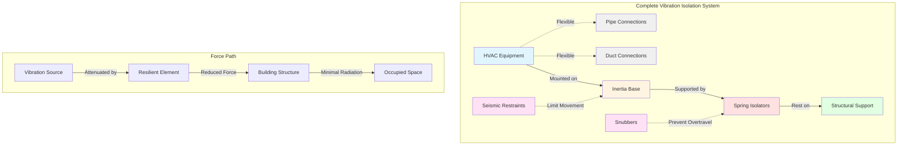

## Overview

Vibration isolation represents a critical component of acoustic control in assembly spaces, where structure-borne noise transmission from HVAC equipment can compromise performance even when airborne noise is adequately controlled. HVAC equipment generates vibration through rotating components (fans, motors, compressors) and fluid turbulence, which transmits through structural connections to building elements that radiate sound into occupied spaces.

Effective isolation requires reducing the vibration transmission from equipment to supporting structure by 90-99%, achieved through properly selected and installed resilient mounts that create a mechanical discontinuity between the vibrating source and the receiver. This section provides the technical foundation for isolation system design in the demanding acoustic environment of theaters, concert halls, and auditoriums.

## Fundamental Isolation Principles

### Transmissibility and Isolation Efficiency

Transmissibility (T) quantifies the ratio of force transmitted through isolators to the disturbing force generated by equipment. The single-degree-of-freedom model provides the governing relationship:

$$T = \frac{1}{\sqrt{(1 - r^2)^2 + (2\zeta r)^2}}$$

Where:
- T = transmissibility (dimensionless ratio)
- r = frequency ratio = f/f_n (operating frequency / natural frequency)
- ζ = damping ratio (typically 0.05-0.10 for steel springs)
- f = disturbing frequency (Hz)
- f_n = natural frequency of isolated system (Hz)

Isolation efficiency (IE) expresses the percentage reduction in transmitted force:

$$IE = \left(1 - T\right) \times 100\%$$

For effective isolation, the frequency ratio must exceed √2 (r > 1.414), beyond which transmissibility falls below unity and actual isolation occurs. Assembly space applications typically require r ≥ 3-5 for isolation efficiency of 90-95%.

### Natural Frequency Requirements

The isolated system natural frequency determines isolation performance across the operating frequency range. The natural frequency depends on static deflection:

$$f_n = \frac{3.13}{\sqrt{\delta_{st}}}$$

Where:
- f_n = natural frequency (Hz)
- δ_st = static deflection (inches)

This relationship shows the inverse square root dependence: doubling static deflection reduces natural frequency by 29%.

| Static Deflection | Natural Frequency | Typical Application |
|-------------------|-------------------|---------------------|
| 0.25 in | 6.3 Hz | Light equipment, roof-mounted units |
| 0.50 in | 4.4 Hz | Medium equipment, air handlers |
| 1.0 in | 3.1 Hz | Heavy equipment, large fans |
| 1.5 in | 2.6 Hz | Assembly space equipment, chillers |
| 2.0 in | 2.2 Hz | Critical acoustic applications |

For assembly spaces (NC 15-25), specify isolators providing 1.5-2.0 inches static deflection to achieve natural frequencies of 2.2-2.6 Hz. This provides adequate isolation at typical fan speeds (600-1800 RPM = 10-30 Hz).

## Isolation Performance Analysis

### Frequency Ratio Calculation

Calculate the frequency ratio for each significant disturbing frequency to verify isolation performance:

**Example Calculation:**
- Equipment: Supply fan, 1200 RPM direct drive
- Isolator: 1.5 in static deflection springs
- Operating frequency: f = 1200 RPM ÷ 60 = 20 Hz
- Natural frequency: f_n = 3.13 / √1.5 = 2.56 Hz
- Frequency ratio: r = 20 / 2.56 = 7.81
- Transmissibility: T = 1 / √[(1 - 7.81²)² + (2 × 0.05 × 7.81)²] = 0.017
- Isolation efficiency: IE = (1 - 0.017) × 100% = 98.3%

This configuration provides excellent isolation, transmitting only 1.7% of the disturbing force to the structure.

### Multi-Frequency Considerations

HVAC equipment generates vibration at multiple frequencies:

1. **Fundamental frequency** - Fan/motor RPM
2. **Blade pass frequency** - RPM × number of blades
3. **Belt frequencies** - For belt-drive configurations
4. **Motor slip frequency** - For induction motors

Evaluate transmissibility at each significant frequency, particularly blade pass frequency which often dominates the vibration spectrum for centrifugal fans.

## Vibration Isolation System Components

### Inertia Base Requirements

Inertia bases provide a rigid platform that:

- Distributes equipment weight evenly across multiple isolators
- Increases total system mass to lower natural frequency
- Prevents rocking modes in equipment with high center of gravity
- Provides consistent support for equipment components

Specify structural steel inertia bases for:
- Equipment with length/width exceeding 6 feet
- Equipment with operating speed above 1000 RPM
- Equipment weight exceeding 1000 lbs
- All equipment in NC 15-20 spaces

Base thickness typically ranges from 4-8 inches depending on equipment weight and rigidity requirements.

### Isolator Types and Selection

| Isolator Type | Deflection Range | Damping | Applications | Advantages | Limitations |
|---------------|------------------|---------|--------------|------------|-------------|
| Neoprene pads | 0.1-0.3 in | High (0.15-0.20) | Small fans, pumps | Low cost, simple installation | Limited deflection, moderate isolation |
| Rubber-in-shear | 0.2-0.5 in | Moderate (0.10-0.15) | Roof curb mounted equipment | Weather resistant, stable | Degradation over time |
| Restrained spring | 1.0-4.0 in | Low (0.05-0.10) | Large equipment, assembly spaces | High performance, adjustable | Higher cost, requires housing |
| Air springs | 2.0-6.0 in | Variable | Ultra-critical applications | Excellent isolation, tunable | Complex, maintenance required |
| Combination spring-neoprene | 1.0-2.0 in | Moderate (0.10) | General assembly applications | Good performance, built-in limiting | Moderate cost |

For assembly space applications, restrained spring isolators provide optimal performance. Select isolators with:

- Free-standing or housed steel springs
- Neoprene or elastomeric acoustical pads between base and structure
- Vertical and horizontal restraints for seismic compliance
- Corrosion-resistant finish for longevity
- Minimum 50% additional capacity beyond static load

### Flexible Connections

Flexible duct and pipe connections prevent vibration transmission through connected systems:

**Duct Connections:**
- Canvas or neoprene-coated fabric, minimum 10 oz/yd²
- Length: 8-12 inches for adequate flexibility
- Wire reinforcement for negative pressure applications
- Pressure/velocity class matching duct system rating

**Pipe Connections:**
- Braided stainless steel flexible connectors for water systems
- Rubber expansion joints for larger piping (>3 inches)
- Length: 12-18 inches or 8-10 pipe diameters
- Pressure rating 1.5× system operating pressure
- Control rods to prevent over-extension

## Isolator Selection Methodology

### Step 1: Determine Equipment Operating Characteristics

Document the following for each piece of equipment:
- Total operating weight (equipment + base + accessories)
- Operating speed (RPM) and disturbing frequencies
- Equipment configuration (dimensions, center of gravity)
- Foundation type (concrete slab, structural steel, roof structure)

### Step 2: Establish Acoustic Criteria

Based on space requirements:
- NC 15-20: 1.5-2.0 in deflection, f_n ≤ 2.6 Hz
- NC 20-25: 1.0-1.5 in deflection, f_n ≤ 3.1 Hz
- NC 25-30: 0.75-1.0 in deflection, f_n ≤ 3.6 Hz

### Step 3: Calculate Required Spring Deflection

Target frequency ratio r ≥ 4 for assembly applications:

$$\delta_{st} = \left(\frac{3.13 \times r}{f}\right)^2$$

Where f represents the lowest disturbing frequency (typically fundamental RPM/60).

### Step 4: Select Number and Arrangement of Isolators

Distribute isolators to:
- Support equipment center of gravity
- Prevent rocking (minimum 4 isolators)
- Maintain accessibility for maintenance
- Provide uniform load distribution (±10% variance)

Typical arrangements:
- 4 isolators: Rectangular equipment, 1 per corner
- 6 isolators: Long equipment (L/W > 2), additional mid-span support
- 8+ isolators: Heavy equipment (>5000 lbs), multiple rows

### Step 5: Verify Load Capacity

Calculate load per isolator accounting for weight distribution:

$$W_{isolator} = \frac{W_{total}}{N_{isolators}} \times DF$$

Where:
- W_total = equipment + base + accessory weight
- N_isolators = number of isolators
- DF = distribution factor (1.25-1.50 for unequal distribution)

Select isolators with rated capacity ≥ 1.5 × calculated load to ensure proper deflection and allow for load variations.

## Seismic and Wind Restraint Coordination

### Restraint System Requirements

Vibration isolation systems require lateral restraints to prevent damage during seismic events or high wind conditions. The restraint system must:

- Allow normal vibration isolation during operation
- Engage during seismic excitation (acceleration > 0.1g)
- Provide restoring force to prevent isolator overtravel
- Coordinate with building seismic design category

For assembly spaces, specify:
- Built-in seismic snubbers on all spring isolators
- All-directional restraint (horizontal and vertical)
- Clearance gap: 1/4 - 1/2 inch for normal operation
- Restraint capacity: 2× equipment weight laterally, 1× weight uplift

### Seismic Snubber Types

| Type | Operation | Applications | Advantages |
|------|-----------|--------------|------------|
| Elastomeric | Compressed during excitation | Light equipment (<500 lbs) | Simple, low cost |
| Mechanical stop | Rigid engagement at travel limit | Medium equipment (500-2000 lbs) | Positive stop, reliable |
| Cable restraint | Tension at deflection limit | Heavy equipment (>2000 lbs) | Adjustable, multi-directional |
| Integrated housing | Combined isolation/restraint | All assembly space applications | Coordinated design, certified |

Consult structural engineer for equipment in Seismic Design Categories D-F or equipment importance factor > 1.0.

## Installation and Commissioning

### Critical Installation Details

Proper installation ensures design performance:

1. **Level mounting surface** - Within 1/8 inch over isolator spacing
2. **Isolator alignment** - Vertical load path through isolator centerline
3. **Uniform deflection** - Verify all isolators deflect within ±10% of calculated value
4. **Clearance verification** - Minimum 1 inch clearance around flexible connections
5. **Anchor verification** - Torque anchor bolts to manufacturer specifications

### Deflection Verification

After installation and equipment startup:
- Measure actual static deflection at each isolator location
- Compare to design deflection (target ± 15%)
- Adjust spring preload if deflection exceeds tolerance
- Document final deflection values for operational records

### Performance Testing

For critical assembly spaces (NC 15-20), consider vibration testing:
- Measure vibration at equipment mounting points (accelerometer)
- Measure vibration at structure interface points
- Calculate actual transmissibility: T = V_structure / V_equipment
- Verify isolation efficiency meets design criteria (>90%)

## Common Design Errors

### Inadequate Static Deflection

Specifying isolators with insufficient deflection remains the most common error. The misconception that "some isolation is better than none" fails at low frequency ratios where transmissibility can exceed unity, amplifying rather than reducing transmitted vibration.

**Solution:** Always verify frequency ratio ≥ 3 at lowest operating speed.

### Rigid Connections

Installing flexible duct/pipe connections defeats isolation. Even small rigid connections (electrical conduit, control wiring) can create flanking paths for vibration transmission.

**Solution:** Use flexible connections for all duct, pipe, and electrical connections within 10 feet of isolated equipment.

### Inadequate Inertia Base

Mounting equipment directly on isolators without an inertia base allows rocking modes and uneven load distribution.

**Solution:** Specify structural steel inertia bases for all equipment in assembly spaces.

### Improper Isolator Selection

Selecting isolators based solely on load capacity without considering deflection requirements.

**Solution:** Select based on required static deflection first, then verify load capacity.

## Integration with Building Structure

### Structural Coordination

Coordinate isolation system with structural design:

- Verify floor/roof structure can accommodate isolator loads without excessive deflection
- Confirm structural natural frequency exceeds 8 Hz to prevent resonance
- Provide structural reinforcement for concentrated isolator loads
- Detail housekeeping pads or equipment pads at each isolator location

### Equipment Room Design

Design mechanical equipment rooms to minimize noise radiation:

- Locate rooms away from assembly spaces (minimum 50 ft horizontal separation)
- Specify concrete or CMU construction (minimum 8-inch thickness)
- Provide acoustical treatment on interior surfaces
- Use solid-core acoustically rated doors with seals

## Conclusion

Vibration isolation for assembly space HVAC equipment requires careful attention to natural frequency selection, isolator specification, and installation details. Target static deflections of 1.5-2.0 inches provide natural frequencies of 2.2-2.6 Hz, yielding isolation efficiency exceeding 95% at typical fan operating speeds. Coordinate isolation design with seismic restraints, verify installation deflections, and ensure all connections include proper flexible elements. When properly designed and installed, vibration isolation systems prevent structure-borne noise transmission that would otherwise compromise the stringent acoustic requirements of theaters, concert halls, and auditoriums.

Refer to ASHRAE Handbook—HVAC Applications, Chapter 49 (Noise and Vibration Control) for detailed design procedures and manufacturer catalogs for specific isolator performance data. Consult ASHRAE Handbook—Fundamentals, Chapter 8 (Sound and Vibration) for underlying vibration theory and transmission principles.
