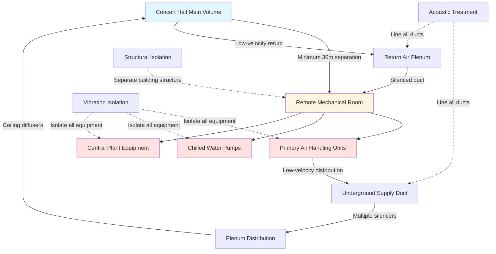

## NC-20 Background Noise Requirements

Concert halls demand the most stringent acoustic control of any building type, with background noise levels specified at NC-20 or lower to ensure musical clarity and dynamic range. At this criterion, HVAC systems must produce less than 27 dBA overall sound pressure level, requiring extraordinary design measures that go far beyond conventional commercial practice.

The NC-20 curve represents sound pressure levels that vary by octave band, with progressively lower limits at higher frequencies where human hearing is most sensitive. This necessitates comprehensive control of both low-frequency rumble from mechanical equipment and high-frequency hiss from air movement.

## Octave Band Sound Pressure Level Limits

| Octave Band Center Frequency (Hz) | NC-20 Maximum SPL (dB) | Typical Challenge Source |
|-----------------------------------|------------------------|--------------------------|
| 63 | 47 | Fan vibration, duct rumble |
| 125 | 36 | Motor noise, low-frequency resonance |
| 250 | 29 | Air turbulence, damper noise |
| 500 | 22 | Diffuser discharge, branch takeoffs |
| 1000 | 17 | High-velocity air, terminal units |
| 2000 | 14 | Air jets, grille noise |
| 4000 | 12 | Turbulent flow, sharp bends |
| 8000 | 11 | High-frequency hiss, small openings |

## Acoustic Power and Sound Pressure Relationships

The sound pressure level in a concert hall space resulting from HVAC equipment is calculated using:

$$L_p = L_w - 10\log_{10}(4\pi r^2) + 10\log_{10}\left(\frac{4}{R}\right)$$

Where:
- $L_p$ = sound pressure level at listener position (dB)
- $L_w$ = sound power level of source (dB)
- $r$ = distance from source to receiver (m)
- $R$ = room constant = $\frac{S\alpha}{1-\alpha}$ (m²)
- $S$ = total room surface area (m²)
- $\alpha$ = average absorption coefficient

For concert halls with highly reflective surfaces ($\alpha$ ≈ 0.15-0.25), the room constant contribution is minimal, making distance the primary attenuation mechanism.

## Remote Equipment Placement Strategy

## Duct Velocity and Regenerated Noise Control

Air velocity must be severely restricted to prevent regenerated noise from turbulence. The relationship between duct velocity and regenerated noise is:

$$L_w = 10\log_{10}(V^6 \cdot P \cdot d)$$

Where:
- $L_w$ = sound power level per unit length (dB/m)
- $V$ = air velocity (m/s)
- $P$ = duct perimeter (m)
- $d$ = hydraulic diameter (m)

For NC-20 spaces, maximum velocities are:

| Duct Type | Maximum Velocity | Typical Application |
|-----------|-----------------|---------------------|
| Main supply trunk | 3.0 m/s (600 fpm) | Primary distribution |
| Branch ducts | 2.5 m/s (500 fpm) | Zone distribution |
| Final runouts | 2.0 m/s (400 fpm) | Terminal connections |
| Return ducts | 3.5 m/s (700 fpm) | Low-pressure return |

These velocities are 60-75% lower than conventional commercial practice, resulting in substantially larger duct cross-sections and increased installation cost.

## Required Attenuation Calculations

The total attenuation required between mechanical room and occupied space is:

$$A_{required} = L_{w,source} - L_{p,target} + 10\log_{10}(4\pi r^2) - 10\log_{10}\left(\frac{4}{R}\right) - A_{duct}$$

Where:
- $A_{required}$ = total active attenuation needed (dB)
- $L_{w,source}$ = equipment sound power level (dB)
- $L_{p,target}$ = target NC-20 level per band (dB)
- $A_{duct}$ = passive attenuation from duct length (dB)

For a typical scenario with fan sound power of 85 dB at 500 Hz and 30m separation:

$$A_{required} = 85 - 22 + 10\log_{10}(4\pi \times 30^2) - 2 - 12 = 85 - 22 + 36.5 - 2 - 12 = 85.5 \text{ dB}$$

This requires multiple silencers in series plus extensive lined ductwork.

## Critical Design Parameters

**Equipment Selection:**
- Fan total static pressure: 750-1250 Pa to overcome silencer losses
- Fan efficiency: >85% to minimize motor size and heat
- Motor isolation: dual-stage spring mounts with 95%+ efficiency at operating frequencies
- Variable speed drives: located remotely with filtered cooling
- Pump vibration: <0.1 mm/s RMS on isolated foundations

**Duct Silencer Configuration:**
- Primary silencer: 3-4 m length, 150-200 mm media thickness
- Secondary silencer: 2-3 m length, 100-150 mm media thickness
- Minimum 10 duct diameters between silencers for flow stabilization
- Acoustic media: 96-144 kg/m³ density fiberglass, foil-faced
- Pressure drop budget: 125-250 Pa per silencer

**Diffuser Design:**
- Discharge velocity: <0.75 m/s (150 fpm) at diffuser face
- Throw: designed for 0.25 m/s terminal velocity
- NC rating: individual diffuser NC-15 or lower
- Type: perforated face, large free area, smooth transitions
- Plenum: minimum 300mm depth, internally lined

## Structural and Vibration Isolation

Mechanical rooms must be structurally isolated from concert hall construction:

$$T_{isolation} = 20\log_{10}\left(\frac{f}{f_n}\right)^2$$

Where:
- $T_{isolation}$ = vibration isolation transmission loss (dB)
- $f$ = forcing frequency (Hz)
- $f_n$ = natural frequency of isolation system (Hz)

Target natural frequency should be <6 Hz for equipment operating at 25-60 Hz, providing >20 dB isolation.

**Foundation Requirements:**
- Isolated concrete pads: 300-500 mm thick, separated by neoprene
- Floating floor slabs: dual-layer with resilient interlayer
- Wall isolation: gapped construction or resilient connections
- Pipe penetrations: spring-isolated through sleeves with acoustic seal

## Measurement and Verification

Post-commissioning acoustic testing per ASHRAE Standard 189.1 and ISO 3382:

- Unoccupied background noise: octave band analysis at 5+ locations
- HVAC operating at design airflow: all modes tested
- Acceptance criteria: 3 dB below NC-20 curve in all bands
- Reverberation time verification: ensure RT60 meets acoustic design
- Speech intelligibility metrics: STI >0.60 where applicable

## Design Checklist for NC-20 Achievement

1. Equipment location minimum 30m from performance space
2. All equipment on dual-stage vibration isolation
3. Duct velocities <3.0 m/s in mains, <2.0 m/s at terminals
4. Series silencers totaling 5-7m combined length
5. 100% lined ductwork with 25-50mm media thickness
6. Diffuser discharge velocity <0.75 m/s
7. No duct-mounted terminal units within 15m of space
8. Flexible duct connections at all equipment
9. Resilient pipe hangers and supports throughout
10. Acoustically rated penetration seals at all openings

The extraordinary measures required for NC-20 concert halls typically increase HVAC costs by 200-400% compared to conventional construction, but this investment is essential to preserve the acoustic clarity that defines world-class performance venues.

---

*References: ASHRAE Fundamentals Chapter 48 (Noise and Vibration Control), ASHRAE Applications Chapter 23 (Sound and Vibration), ISO 3382-1 (Acoustics of Performance Spaces), Beranek "Concert Halls and Opera Houses"*
