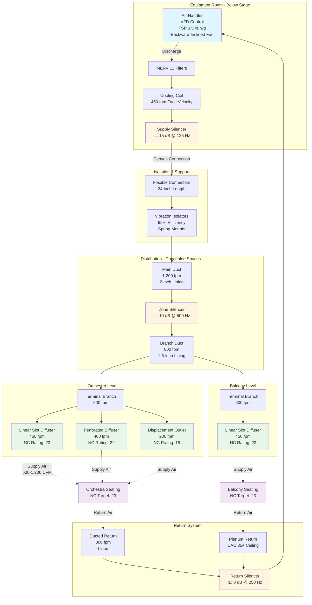

Theaters demand NC-25 acoustic performance to preserve speech intelligibility and dramatic impact without the extreme cost of NC-20 concert hall designs. This 5 dB relaxation from concert hall standards allows moderate air velocities and simplified attenuation strategies while maintaining acoustic quality suitable for both amplified and unamplified theatrical performances.

## NC-25 Octave Band Requirements

NC-25 specifies maximum permissible sound pressure levels across the audible frequency spectrum. The curve shape reflects human auditory sensitivity and typical HVAC system spectral characteristics.

### Frequency-Specific Limits

| Octave Band Center Frequency (Hz) | Maximum SPL (dB) | Design Margin (dB) | Critical Control Strategy |
|-----------------------------------|------------------|-------------------|--------------------------|
| 63 | 47 | 3-5 | Equipment isolation, structural decoupling |
| 125 | 39 | 3-5 | Duct silencers, breakout control |
| 250 | 33 | 2-3 | Lined ductwork, diffuser selection |
| 500 | 29 | 2-3 | Air velocity reduction, terminal units |
| 1000 | 25 | 2-3 | Diffuser performance, plenum attenuation |
| 2000 | 22 | 2-3 | High-frequency absorption, grille design |
| 4000 | 20 | 2-3 | Terminal device selection, duct lining |
| 8000 | 18 | 2-3 | Diffuser blade design, turbulence control |

Design margin accounts for measurement uncertainty (±2 dB), aging effects on absorptive materials, and variations in construction quality. Target NC-23 during design to ensure NC-25 performance in operation.

## Theater Size and Acoustic Implications

Audience capacity directly influences HVAC acoustic design through ventilation requirements, duct sizing, and absorption characteristics.

### Capacity Classifications

**Small Theaters (100-300 seats):**
- Ventilation: 2,000-6,000 CFM total
- Duct velocities: 800-1,000 fpm achievable
- Primary challenge: Limited space for ductwork and equipment
- Advantage: Higher room absorption per CFM
- Typical approach: Multiple small air handlers, displacement ventilation

**Medium Theaters (300-800 seats):**
- Ventilation: 6,000-16,000 CFM total
- Duct velocities: 1,000-1,200 fpm maximum
- Primary challenge: Balancing capacity with velocity limits
- Advantage: Dedicated equipment rooms feasible
- Typical approach: Central air handler, extensive silencing

**Large Theaters (800-2,000+ seats):**
- Ventilation: 16,000-40,000+ CFM total
- Duct velocities: 1,200-1,500 fpm maximum in mains
- Primary challenge: Duct breakout noise, regenerated noise
- Advantage: Proportionally greater room absorption
- Typical approach: Multiple air handlers, plenum distribution

### Volume-Specific Acoustic Behavior

Room volume affects sound pressure level through absorption area. The relationship between sound power and resulting SPL follows:

$$\text{SPL} = L_w - 10\log_{10}\left(\frac{A}{4}\right) + 10.5$$

Where:
- $L_w$ = sound power level (dB re 10⁻¹² W)
- $A$ = total room absorption (sabins)

For a 500-seat theater with 50,000 ft³ volume and reverberation time of 1.2 seconds:

$$A = \frac{0.049V}{RT_{60}} = \frac{0.049 \times 50,000}{1.2} = 2,042 \text{ sabins}$$

$$\text{SPL} = L_w - 10\log_{10}\left(\frac{2,042}{4}\right) + 10.5 = L_w - 16.6 \text{ dB}$$

Larger theaters with proportionally greater absorption provide increased attenuation, but this advantage diminishes as ventilation quantities scale with capacity.

## Speech Intelligibility Requirements

Theater acoustics prioritize speech transmission index (STI) and articulation loss (ALcons). HVAC background noise influences both metrics.

### Signal-to-Noise Ratio

Effective speech communication requires signal-to-noise ratio (SNR) of 25 dB minimum:

$$\text{SNR} = L_{\text{speech}} - L_{\text{background}}$$

Unamplified speech projects 55-65 dBA at 10 feet. For SNR ≥ 25 dB:

$$L_{\text{background}} \leq 55 - 25 = 30 \text{ dBA}$$

NC-25 corresponds to approximately 29-31 dBA, meeting this criterion with minimal margin. Amplified performances permit higher background levels, but designers must accommodate unamplified rehearsals and intimate productions.

### Articulation Index Impact

Background noise reduces articulation index (AI) through masking of speech frequencies (500-4000 Hz). The AI calculation weights octave bands:

$$\text{AI} = \sum_{i=1}^{n} W_i \times \left(\frac{\text{SNR}_i + 15}{30}\right)$$

Where $W_i$ represents frequency-dependent weighting factors. NC-25 limits in the 500-2000 Hz range preserve AI > 0.70, considered "good" intelligibility.

## HVAC System Design Strategies

Achieving NC-25 requires integrated acoustic design addressing source, path, and receiver.

### Source Control

**Fan Selection:**
Select backward-inclined or airfoil centrifugal fans operating at 60-70% of maximum pressure. Sound power correlates with tip speed:

$$L_w \propto 50\log_{10}(V_{\text{tip}}) + 10\log_{10}(Q) + K$$

Where:
- $V_{\text{tip}}$ = blade tip speed (fpm)
- $Q$ = airflow (CFM)
- $K$ = fan-specific constant

Reducing tip speed from 10,000 to 7,000 fpm decreases sound power by:

$$\Delta L_w = 50\log_{10}\left(\frac{7,000}{10,000}\right) = 50 \times (-0.155) = -7.7 \text{ dB}$$

**Equipment Location:**
Separate mechanical equipment from audience spaces by minimum STC-50 construction. Preferred locations:

1. Below-stage mechanical rooms with structural isolation
2. Rooftop penthouses with resilient mounts
3. Remote building locations with connecting ductwork

### Path Treatment

**Duct Velocity Limits:**
Terminal velocity at diffusers governs self-noise generation:

| Location | Maximum Velocity (fpm) | Rationale |
|----------|----------------------|-----------|
| Main supply ducts | 1,500 | Breakout control, regenerated noise |
| Branch ducts | 1,000 | Reduced turbulence |
| Terminal branches | 600-700 | Diffuser approach conditions |
| Grilles/diffusers | 400-500 | Self-noise prevention |

**Silencer Application:**

Install duct silencers where sound transmission exceeds targets by >3 dB at any octave band. Required insertion loss:

$$\text{IL}_{\text{req}} = L_{w,\text{source}} - \text{Att}_{\text{duct}} - \text{ERL} - \text{SPL}_{\text{target}} + 10\log_{10}\left(\frac{A}{4}\right) - 10.5$$

For a 5,000 CFM system with $L_w$ = 75 dB at 500 Hz, 50 feet of lined duct (1.5 dB/ft), ERL = 8 dB, and target SPL = 29 dB:

$$\text{IL}_{\text{req}} = 75 - (1.5 \times 50) - 8 - 29 + 10\log_{10}\left(\frac{2,000}{4}\right) - 10.5$$
$$= 75 - 75 - 8 - 29 + 27 - 10.5 = -20.5 \text{ dB}$$

No silencer required; path treatment adequate. Adjust this calculation for each octave band.

**Duct Breakout Transmission:**

Sound transmits through duct walls when internal pressure exceeds duct transmission loss. Breakout noise level:

$$L_p = L_w + 10\log_{10}\left(\frac{S}{4\pi r^2}\right) - \text{TL}_{\text{duct}}$$

Where:
- $S$ = duct surface area (ft²)
- $r$ = distance from duct (ft)
- $\text{TL}_{\text{duct}}$ = duct wall transmission loss (dB)

Unlined 22-gauge sheet metal provides TL ≈ 25-30 dB at mid-frequencies. Doubling duct wall thickness increases TL by 6 dB. External lagging adds 5-15 dB depending on mass and absorption.

### Receiver Protection

**Diffuser Selection:**
Specify diffusers with published NC data at operating airflow. High-induction diffusers generate less self-noise than conventional grilles:

- Perforated face diffusers: NC 25-30 at 400-500 fpm
- Slot diffusers: NC 30-35 at 300-400 fpm
- Linear bar grilles: NC 35-40 at 300-400 fpm

**Plenum Systems:**
Above-ceiling plenums serve as supply or return chambers. Acoustic performance depends on:

1. **Plenum attenuation:** 5-15 dB depending on volume and absorption
2. **Ceiling transmission loss:** Acoustic ceiling tiles provide STC 20-35
3. **Ceiling attenuation class (CAC):** Measures plenum-to-plenum transmission; specify CAC ≥ 35

## Theater-Specific Considerations

### Legitimate vs. Movie Theaters

**Legitimate (Live) Theaters:**
- Unamplified dialogue requires strict NC-25 adherence
- Variable occupancy (rehearsals to full house) affects absorption
- Intermittent system operation acceptable between acts
- Acoustic consultant involvement essential

**Movie Theaters:**
- Amplified soundtrack masks moderate HVAC noise
- NC-30 often acceptable during presentations
- NC-25 maintained during previews and intermissions
- Coordinated shut-down during critical scenes possible

### Balcony and Upper Tier Acoustics

Multi-level theaters present unique challenges:

1. **Stratification:** Warm air rises to upper levels, requiring dedicated zone control
2. **Absorption variation:** Balcony seating provides less absorption per square foot
3. **Duct routing:** Structural conflicts in thin floor assemblies
4. **Diffuser placement:** Avoid aiming supply air at reflective balcony fronts

Design separate air handling for orchestra and balcony levels when capacity exceeds 800 seats.

### Lobby and Circulation Spaces

Public areas outside the auditorium tolerate NC-35 to NC-40. Provide acoustic separation through:

- Vestibule doors with seals (STC ≥ 45)
- Dedicated HVAC systems avoiding shared ductwork
- Sound locks at auditorium entries
- Transfer ducts with silencers where code requires air transfer

## Measurement and Verification

Verify NC-25 performance through octave-band analysis at multiple locations:

### Measurement Protocol

1. **Conditions:** All HVAC systems at design airflow, unoccupied theater
2. **Locations:** Front orchestra, center orchestra, rear orchestra, balcony center, extreme side seats (minimum 5 locations)
3. **Equipment:** Type 1 sound level meter with octave-band filters
4. **Duration:** 30-second average per location
5. **Background:** Measure ambient with HVAC off; subtract using logarithmic methods

### Data Analysis

Plot measured octave-band levels against NC-25 curve. Identify exceedances:

- **Low-frequency (63-125 Hz):** Equipment vibration, duct breakout
- **Mid-frequency (250-1000 Hz):** Fan noise, terminal unit regenerated noise
- **High-frequency (2000-8000 Hz):** Diffuser self-noise, turbulent flow

Address exceedances through system balancing, diffuser adjustment, or supplemental treatment before acceptance.

## System Architecture for NC-25 Performance

## Cost-Benefit Analysis: NC-25 vs. NC-30

Achieving NC-25 instead of NC-30 increases HVAC cost by 15-30%:

| Design Element | NC-30 Approach | NC-25 Approach | Cost Premium |
|----------------|----------------|----------------|--------------|
| Duct sizing | 1,500 fpm mains | 1,200 fpm mains | +20% duct material |
| Silencers | AHU discharge only | Discharge + zone | +$8,000-15,000 |
| Duct lining | 1-inch standard | 1.5-2 inch premium | +30% lining cost |
| Diffusers | Standard grilles | High-performance low-NC | +40% terminal cost |
| Testing | Basic commissioning | Acoustic verification | +$5,000-10,000 |

The acoustic improvement justifies premium investment for legitimate theaters, opera houses, and venues featuring unamplified performance. Movie theaters and multi-purpose spaces may accept NC-30 with substantial cost savings.

## References and Standards

**ASHRAE Handbook—HVAC Applications, Chapter 49:** Comprehensive NC curve data, octave-band calculation methodology, and mechanical system acoustic design guidance.

**ASHRAE Handbook—Fundamentals, Chapter 8:** Sound and vibration theory, frequency analysis, and absorption coefficients.

**ANSI/ASA S12.60-2010/Part 1:** Acoustical performance criteria for learning spaces; applicable to lecture and presentation theaters.

**IES Lighting Handbook:** Coordination between acoustic ceiling systems and lighting design affecting CAC values.

**ASTM E1130:** Standard test method for objective measurement of speech privacy providing context for theater acoustic privacy between spaces.

Engage qualified acoustic consultants for theaters requiring NC-25 or stricter performance. Consultant involvement during schematic design prevents costly corrections during construction.
