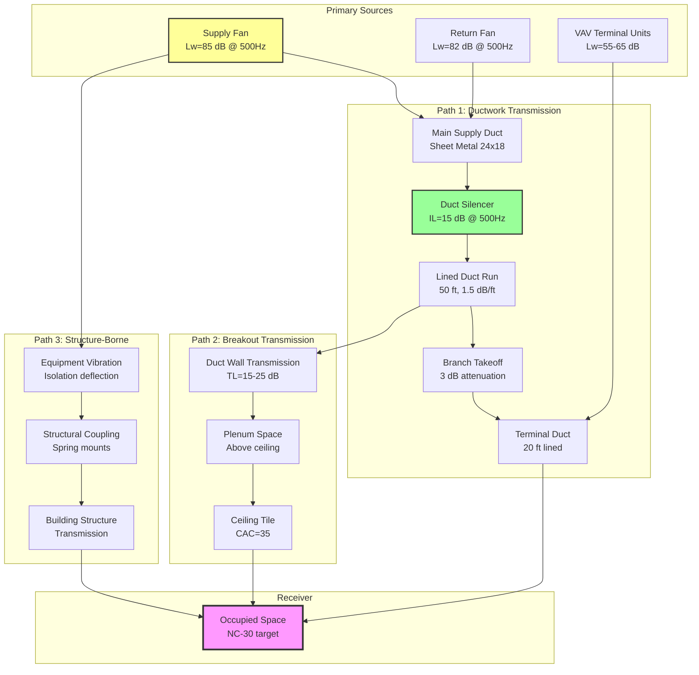

## NC-30 Design Fundamentals

Lecture halls targeting NC-30 background noise levels balance acoustic quality with economic practicality. The NC-30 criterion permits HVAC-generated background noise of approximately 30 dB at 1000 Hz while maintaining frequency-weighted limits across the audible spectrum to ensure speech intelligibility and minimize distraction during unamplified presentations.

NC-30 represents a 10 dB relaxation from concert hall requirements (NC-20) yet provides substantially better acoustic conditions than typical office environments (NC-35 to NC-40). This middle ground enables cost-effective design while supporting the primary pedagogical mission: clear communication between instructor and students.

## NC-30 Octave Band Limits

### Frequency-Specific Sound Pressure Levels

NC-30 establishes maximum permissible sound pressure levels across eight octave bands:

| Octave Band Center Frequency (Hz) | Maximum SPL (dB) | Design Margin SPL (dB) | Primary Source |
|-----------------------------------|------------------|------------------------|----------------|
| 63 | 57 | 54 | Fan rumble, duct breakout |
| 125 | 48 | 45 | Fan blade passage frequency |
| 250 | 41 | 38 | Air turbulence in ducts |
| 500 | 35 | 32 | Diffuser regenerated noise |
| 1000 | 31 | 28 | System airflow noise |
| 2000 | 29 | 26 | High-velocity air streams |
| 4000 | 28 | 25 | Diffuser hiss, damper noise |
| 8000 | 27 | 24 | Terminal device self-noise |

Design margin values represent recommended targets 3 dB below the NC-30 curve to accommodate measurement uncertainty, aging equipment, and simultaneous multiple sources. Systems designed to barely meet NC-30 limits frequently exceed criteria after 2-3 years of operation due to filter loading, belt wear, and damper deterioration.

### NC-30 Curve Mathematical Representation

The NC-30 curve follows an empirical relationship approximating:

$$\text{SPL}_f = 30 + 10\log_{10}\left(\frac{1000}{f}\right) - K_f$$

Where:
- $\text{SPL}_f$ = sound pressure level at frequency $f$ (dB)
- $f$ = octave band center frequency (Hz)
- $K_f$ = frequency-specific correction factor

Correction factors account for human perception and typical HVAC spectral characteristics:

$$K_f = \begin{cases}
-25 & f = 63 \text{ Hz} \\
-15 & f = 125 \text{ Hz} \\
-8 & f = 250 \text{ Hz} \\
-3 & f = 500 \text{ Hz} \\
0 & f = 1000 \text{ Hz} \\
+1 & f = 2000 \text{ Hz} \\
+2 & f = 4000 \text{ Hz} \\
+3 & f = 8000 \text{ Hz}
\end{cases}$$

## Speech Intelligibility Requirements

### Articulation Index and Speech Transmission Index

Speech intelligibility in lecture halls depends on the signal-to-noise ratio (SNR) across speech-critical frequencies (500-4000 Hz). The Articulation Index (AI) quantifies intelligibility on a scale from 0 (unintelligible) to 1 (perfect intelligibility):

$$\text{AI} = \frac{1}{n}\sum_{i=1}^{n}\frac{\text{SNR}_i - \text{SNR}_{\text{min}}}{\text{SNR}_{\text{max}} - \text{SNR}_{\text{min}}}$$

Where:
- $n$ = number of frequency bands (typically 7-20)
- $\text{SNR}_i$ = signal-to-noise ratio in band $i$ (dB)
- $\text{SNR}_{\text{min}}$ = minimum useful SNR (typically -3 dB)
- $\text{SNR}_{\text{max}}$ = maximum useful SNR (typically +18 dB)

For lecture halls, target AI ≥ 0.75, corresponding to "good" intelligibility where 95-98% of syllables are correctly understood. NC-30 background noise supports this target when combined with adequate voice levels (60-65 dBA at 1 meter from instructor) and appropriate room acoustics (reverberation time 0.6-0.8 seconds for speech).

### Critical Distance and Direct-to-Reverberant Ratio

The critical distance ($D_c$) marks the boundary where direct sound equals reverberant sound:

$$D_c = 0.141\sqrt{\frac{Q \cdot R_{\text{room}}}{\pi}}$$

Where:
- $Q$ = directivity factor of source (2.0-3.0 for human speech)
- $R_{\text{room}}$ = room constant = $\frac{S\bar{\alpha}}{1-\bar{\alpha}}$ (ft²)
- $S$ = total room surface area (ft²)
- $\bar{\alpha}$ = average absorption coefficient

Within the critical distance, speech intelligibility depends primarily on direct sound levels and background noise. Beyond the critical distance, reverberation dominates and intelligibility degrades regardless of HVAC noise control. Proper lecture hall design extends critical distance through acoustic absorption treatment, ensuring direct sound reaches all seating areas.

## HVAC System Sound Path Analysis

### Sound Power Transmission Calculation

Predict sound pressure level in the occupied lecture hall by accounting for all transmission paths:

**Path 1 - Direct Duct Transmission:**

$$\text{SPL}_{\text{duct}} = L_w - \text{ATT}_{\text{silencer}} - \text{ATT}_{\text{duct}} - \text{ATT}_{\text{end}} + \text{RC}$$

Where:
- $L_w$ = fan sound power level (dB)
- $\text{ATT}_{\text{silencer}}$ = silencer insertion loss (dB)
- $\text{ATT}_{\text{duct}}$ = duct attenuation = $\alpha \cdot L$ (dB)
- $\alpha$ = attenuation per foot (dB/ft)
- $L$ = duct length (ft)
- $\text{ATT}_{\text{end}}$ = end reflection loss (dB)
- $\text{RC}$ = room correction = $10\log_{10}\left(\frac{4}{R}\right) + 10.5$ (dB)

**Path 2 - Duct Breakout:**

$$\text{SPL}_{\text{breakout}} = L_w - 10\log_{10}(S_{\text{duct}}) - \text{TL}_{\text{duct}} - \text{TL}_{\text{ceiling}} + \text{RC}$$

Where:
- $S_{\text{duct}}$ = radiating duct surface area (ft²)
- $\text{TL}_{\text{duct}}$ = duct wall transmission loss (dB)
- $\text{TL}_{\text{ceiling}}$ = ceiling transmission loss (dB)

**Combined Level:**

$$\text{SPL}_{\text{total}} = 10\log_{10}\left(10^{\text{SPL}_{\text{duct}}/10} + 10^{\text{SPL}_{\text{breakout}}/10} + 10^{\text{SPL}_{\text{structure}}/10}\right)$$

## HVAC Design Strategies for NC-30

### Air Velocity Limitations

Maintain conservative air velocities to minimize regenerated noise:

| System Component | Maximum Velocity (fpm) | Typical Velocity (fpm) | Pressure Drop Basis |
|------------------|------------------------|------------------------|---------------------|
| Main supply ducts | 1500 | 1200 | 0.12 in.wg/100 ft |
| Branch ducts | 1000 | 800 | 0.10 in.wg/100 ft |
| Riser ducts | 1200 | 1000 | 0.11 in.wg/100 ft |
| Terminal ducts | 800 | 600 | 0.08 in.wg/100 ft |
| Diffuser neck | 400 | 300 | Manufacturer data |
| Return grilles | 500 | 400 | 0.03 in.wg maximum |

These velocities represent approximately 60-70% of conventional commercial practice, resulting in duct systems 40-50% larger by cross-sectional area. The increased first cost (15-25% for ductwork) is offset by reduced fan energy, smaller fans, and elimination of supplemental sound attenuation measures.

### Duct Silencer Application

**Primary Silencers:**
Install discharge silencers immediately downstream of supply and return fans (within 5 duct diameters). Select for minimum 15 dB insertion loss at fan blade passage frequency:

$$f_{\text{BPF}} = \frac{n_{\text{blades}} \cdot \text{RPM}}{60}$$

For a 10-blade fan operating at 1200 RPM:
$$f_{\text{BPF}} = \frac{10 \cdot 1200}{60} = 200 \text{ Hz}$$

This falls in the 125 Hz or 250 Hz octave band, requiring silencer selection emphasizing low-frequency performance.

**Secondary Silencers:**
Consider zone silencers where calculated sound levels exceed NC-30 limits by more than 3 dB. Position at major branch takeoffs serving the lecture hall, maintaining face velocities below 1000 fpm to prevent self-generated noise.

### Equipment Selection and Isolation

**Fan Selection Criteria:**
- Centrifugal fans with backward-curved or airfoil blades (lowest sound power generation)
- Operating point at 75-80% of maximum cataloged CFM (peak efficiency, minimum noise)
- Fan static efficiency ≥70% to minimize motor horsepower and associated noise
- AMCA-certified sound power ratings per AMCA 300

**Vibration Isolation Requirements:**
- Spring isolators with 1.0-1.5 inch static deflection for equipment >1000 lbs
- Neoprene isolators (0.5 inch deflection) for smaller terminal units
- Flexible duct connections (10-12 inch length) at all equipment connections
- Isolation efficiency target ≥90% at lowest operating frequency

### Terminal Device Selection

VAV terminal units selected for NC-30 lecture halls require careful attention to sound power ratings at minimum and maximum airflow:

**Acceptable Terminal Types:**
- Fan-powered VAV boxes with forward-curved blower (for constant background sound masking)
- Pressure-independent VAV boxes with low-pressure-drop dampers
- Dual-duct VAV boxes (avoid unless required for system architecture)

**Unacceptable Terminal Types:**
- High-pressure parallel fan-powered boxes (excessive fan noise at low loads)
- Single-duct throttling boxes without sound lining (damper regenerated noise)

Specify terminal unit discharge sound power levels not exceeding:
- Maximum airflow: Lw ≤ 55 dB at 500 Hz
- Minimum airflow: Lw ≤ 48 dB at 500 Hz

## Diffuser and Grille Design

### Low-Velocity Diffusers

Select diffusers from manufacturer NC-rated product lines, verifying performance at actual operating conditions:

**Linear Slot Diffusers:**
- 1-slot or 2-slot configurations with acoustic plenum boxes
- Neck velocity ≤300 fpm
- Throw adjusted for 150 fpm terminal velocity at occupied zone
- NC-25 rated at design airflow (provides 5 dB safety margin)

**Perforated Face Diffusers:**
- 3/16-inch or 1/4-inch perforations
- Face velocity ≤400 fpm across entire grille area
- Integral volume dampers factory-set and sealed (avoid field-adjustable dampers)

### Return Air Grilles

Return air systems contribute equally to background noise and demand equivalent design attention:

- Face velocity ≤400 fpm measured across free area
- Acoustically lined frames or boots (1-inch fiberglass minimum)
- Return air plenums sealed and isolated from supply side
- Ducted returns preferred over ceiling plenum returns

Ceiling plenum returns acceptable only when:
1. Ceiling tiles achieve CAC ≥35 (Ceiling Attenuation Class)
2. Supply ducts in plenum insulated for thermal performance (limiting breakout radiation)
3. No fan-powered terminal units exhaust into return plenum

## Commissioning and Verification

### Acoustic Testing Protocol

Conduct octave-band sound level measurements following ASHRAE Standard 189.1 and ASTM E1780:

1. **Equipment Setup:**
   - Type 1 sound level meter with octave-band filters
   - Calibrator with NIST-traceable certification
   - Microphone positioned 4-5 feet above floor, 3 feet from walls

2. **Test Conditions:**
   - All HVAC systems operating at design airflow
   - Lecture hall unoccupied (background noise measurement only)
   - Doors and windows closed
   - Minimum 3 measurement locations (front, center, rear of seating area)

3. **Acceptance Criteria:**
   - All octave bands ≤NC-30 limits at all measurement locations
   - No single location exceeds NC-30 by more than 2 dB in any band
   - Subjective evaluation confirms absence of tonal components or rumble

### Common Failure Modes and Remediation

**Excessive Low-Frequency Noise (63-250 Hz):**
- **Cause:** Fan operation near structural resonance, inadequate vibration isolation
- **Remediation:** Adjust fan speed via VFD to avoid resonant frequencies, supplement vibration isolation

**High-Frequency Hiss (2000-4000 Hz):**
- **Cause:** Excessive diffuser velocity, damper blade flutter
- **Remediation:** Reduce airflow, replace diffusers with larger models, lock dampers in optimal position

**Tonal Noise Components:**
- **Cause:** VFD carrier frequency radiation, fan blade passage frequency
- **Remediation:** Install VFD line reactors, verify silencer adequacy at blade passage frequency

## Cost Implications and Value Engineering

NC-30 lecture hall design typically adds 10-15% to HVAC first cost compared to NC-35 classroom design:

| Cost Premium Category | Typical Impact | Design Drivers |
|----------------------|----------------|----------------|
| Larger ductwork (40% size increase) | +15-20% duct cost | Reduced velocities |
| Duct silencers | +$3,000-$8,000 per unit | Fan discharge attenuation |
| Enhanced vibration isolation | +$1,500-$4,000 per unit | Structure-borne isolation |
| Low-velocity diffusers | +25% diffuser cost | NC-rated products |
| Additional sound testing | +$2,500-$5,000 | Commissioning verification |

This investment directly supports educational outcomes. Research demonstrates that classroom background noise above NC-35 reduces speech intelligibility by 15-25% and increases student cognitive load, particularly for non-native speakers and students with hearing impairments.

## References and Standards

- ASHRAE Handbook—HVAC Applications, Chapter 49: Noise and Vibration Control
- ANSI/ASA S12.60-2010: Acoustical Performance Criteria for Educational Facilities
- ASHRAE Standard 189.1: Design of High-Performance Green Buildings
- ASTM E1780: Standard Practice for Measuring Sound Pressure Levels in Buildings
- AHRI Standard 885: Procedure for Estimating Occupied Space Sound Levels

Lecture halls requiring NC-25 or better performance should involve an acoustical consultant during schematic design to establish room geometry, surface treatment, and HVAC integration strategies. The relatively modest cost of acoustical consulting (typically $10,000-$25,000 for a 300-seat lecture hall) prevents expensive remediation after construction completion.
