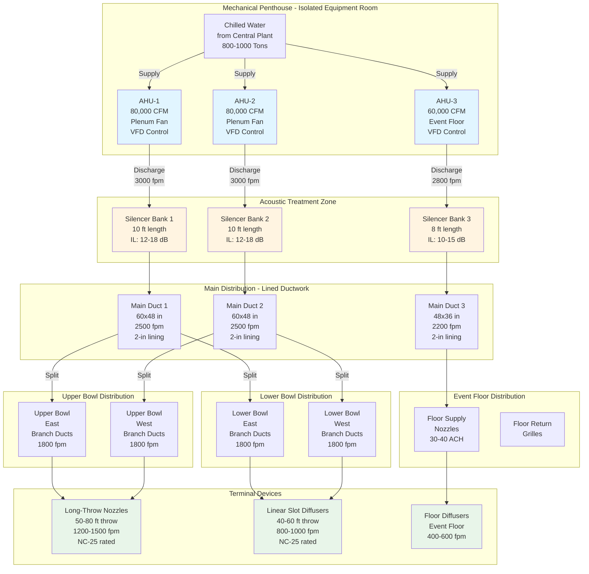

Sports arenas and multipurpose entertainment venues present unique HVAC acoustic challenges that differ fundamentally from concert halls and theaters. While these facilities target NC-35—the most relaxed criteria among performance venues—achieving this specification requires careful attention to the massive air quantities, extensive duct distribution networks, and high cooling loads characteristic of 10,000 to 20,000+ seat venues.

## NC-35 Criteria for Large Venues

NC-35 represents the maximum background noise level acceptable for venues where amplified sound dominates the acoustic environment. This rating acknowledges that sports events, concerts with sound reinforcement, and public assemblies generate ambient sound levels of 70-90 dBA, rendering acoustic perfection economically unjustifiable.

The NC-35 curve permits the following octave band sound pressure levels in the unoccupied space:

| Octave Band Center Frequency (Hz) | Maximum SPL (dB) | Tolerance Band (dB) |
|-----------------------------------|------------------|---------------------|
| 63 | 54 | ±2 |
| 125 | 47 | ±2 |
| 250 | 42 | ±2 |
| 500 | 38 | ±1 |
| 1000 | 35 | ±1 |
| 2000 | 33 | ±1 |
| 4000 | 31 | ±1 |
| 8000 | 30 | ±1 |

The frequency weighting reflects human sensitivity and typical HVAC spectrum characteristics. Low-frequency rumble below 250 Hz receives higher SPL allowances, while mid-to-high frequencies require tighter control to prevent intrusive hiss during quiet moments.

## Arena NC Requirements Comparison

Understanding arena acoustic targets requires context relative to other venue types and the operational differences that justify relaxed criteria:

| Venue Type | NC Rating | Typical Capacity | Primary Use | CFM per Person | Design Rationale |
|------------|-----------|------------------|-------------|----------------|------------------|
| Concert Halls | NC-20 | 1,500-2,500 | Unamplified orchestral music | 15-20 | Preserve pianissimo passages at 40-50 dBA |
| Theaters | NC-25 | 500-1,500 | Dramatic performance, dialogue | 15-20 | Support speech intelligibility without amplification |
| Lecture Halls | NC-30 | 200-800 | Educational presentation | 15-18 | Balance communication clarity with cost |
| Arenas | NC-35 | 10,000-20,000+ | Amplified sports, concerts, events | 8-12 | Accept higher background noise with sound reinforcement |
| Convention Centers | NC-40 | Variable | Exhibitions, trade shows | 10-15 | Higher ambient noise from crowds acceptable |

The CFM per person values reflect arena HVAC's focus on high-occupancy cooling rather than ventilation air quality. ASHRAE Standard 62.1 ventilation requirements drive minimum outdoor air, but total supply air far exceeds this minimum to address sensible cooling loads from lighting, occupants, and solar gains.

## Large-Scale Cooling Load Characteristics

Arena HVAC systems must address cooling loads that dwarf typical commercial applications. A 15,000-seat arena generates peak cooling demands of 800-1,200 tons, distributed across three distinct zones:

**Seating Bowl (60-70% of total load):**
Occupant sensible heat, solar gain through skylights or translucent roofing, and lighting create loads of 25-35 BTU/hr-ft² floor area. At 120,000 ft² seating area:

$$Q_{\text{seating}} = A_{\text{floor}} \times q_{\text{sensible}} = 120{,}000 \, \text{ft}^2 \times 30 \, \frac{\text{BTU}}{\text{hr-ft}^2} = 3{,}600{,}000 \, \frac{\text{BTU}}{\text{hr}} = 300 \, \text{tons}$$

**Playing Surface/Event Floor (20-25% of total load):**
Sports events and concerts require 30-40 ACH for moisture control and performer comfort. A 200 ft × 85 ft hockey rink with 40 ft height demands:

$$V_{\text{floor}} = 200 \times 85 \times 40 = 680{,}000 \, \text{ft}^3$$

$$Q_{\text{floor}} = \frac{\text{ACH} \times V \times \rho \times c_p \times \Delta T}{60} = \frac{35 \times 680{,}000 \times 0.075 \times 0.24 \times 25}{60} = 1{,}785{,}000 \, \frac{\text{BTU}}{\text{hr}} = 149 \, \text{tons}$$

**Concourses and Back-of-House (15-20% of total load):**
Concession areas, restrooms, locker rooms, and support spaces contribute 150-250 tons depending on configuration and simultaneous usage factors.

## High-Capacity Air Handling System Design

Arena air handling requires multiple large-capacity units operating in parallel to provide redundancy and zone control. A typical 15,000-seat arena employs 4-6 AHUs rated 50,000-100,000 CFM each, totaling 300,000-500,000 CFM system capacity.

### Air Distribution Strategies

Arena air distribution follows three primary approaches, each with distinct acoustic implications:

**Overhead Supply to Seating (Most Common):**
Large-diameter (36"-60") main ducts distribute air around the seating bowl perimeter, feeding branch ducts at 20-30 ft spacing. Long-throw nozzles or linear slot diffusers mounted 30-50 ft above the floor project conditioned air across seating sections.

Acoustic considerations include:

- Main duct velocities limited to 2,500-3,000 fpm to control regenerated noise
- Branch duct velocities reduced to 1,800-2,200 fpm approaching diffusers
- Nozzle discharge velocities of 1,200-1,800 fpm for 50-80 ft throw distances
- Minimum 2-inch internal duct lining in final 30 ft before diffusers

**Underfloor/Riser Supply to Seating:**
Vertical risers embedded in concrete seating structure deliver air through floor-mounted or seat-back diffusers directly to occupied zone. This strategy reduces duct exposure in the upper bowl but requires careful coordination during construction.

Acoustic advantages include:

- Shorter duct runs minimize cumulative noise transmission
- Low-velocity discharge (300-500 fpm) at floor level reduces diffuser noise
- Concrete encasement provides transmission loss of 45-55 dB

**Displacement Ventilation (Limited Application):**
Low-velocity (50-150 fpm) air supply at floor level with overhead extraction suits arenas in mild climates or those emphasizing sustainability. Thermal stratification challenges and high first cost limit widespread adoption.

### Equipment Sound Power Considerations

Large centrifugal fans driving 50,000-100,000 CFM airflow generate significant sound power. A plenum fan rated 80,000 CFM at 6 inches total static pressure (TSP) produces octave band sound power levels:

| Frequency (Hz) | 63 | 125 | 250 | 500 | 1000 | 2000 | 4000 | 8000 |
|----------------|----|----|-----|-----|------|------|------|------|
| Lw (dB) | 95 | 92 | 89 | 86 | 83 | 80 | 77 | 73 |

To achieve NC-35 in a 500,000 ft³ arena seating bowl (approximately 20,000 sabins absorption), the required sound pressure level at 1000 Hz:

$$\text{SPL}_{1000} = L_w - 10\log_{10}\left(\frac{A}{4}\right) + 10.5$$

$$\text{SPL}_{1000} = 83 - 10\log_{10}\left(\frac{20{,}000}{4}\right) + 10.5 = 83 - 37 + 10.5 = 56.5 \, \text{dB}$$

This exceeds the NC-35 target of 35 dB at 1000 Hz by 21.5 dB, requiring substantial duct attenuation, silencers, and path treatment.

## Acoustic Control Strategies for Arena HVAC

Achieving NC-35 with high-capacity systems demands integrated source-path-receiver control:

### Source Control

**Fan Selection:**
Specify backward-curved or airfoil centrifugal fans operating at tip speeds below 10,000 fpm. Fan static efficiency above 70% correlates with lower sound power generation. Variable frequency drives (VFDs) allow demand-based operation, reducing both energy consumption and sound generation during low-occupancy events.

$$\text{Fan Sound Power} \propto \log_{10}(\text{TSP}) + 50\log_{10}(\text{CFM})$$

A 10% reduction in TSP through oversized coils and low-resistance filters yields approximately 3-4 dB lower sound power.

**AHU Enclosure:**
Locate air handling units in dedicated mechanical rooms with minimum STC-50 walls. Internal sound-absorptive lining (2-4 inch fiberglass, 3-6 lb/ft³ density) on all mechanical room surfaces reduces reverberant buildup and transmission to adjacent spaces.

### Path Treatment

**Duct Silencers:**
Install rectangular or cylindrical silencers immediately downstream of AHU discharge. For 60"×48" main ducts carrying 80,000 CFM, a 10-foot parallel baffle silencer provides:

$$\text{Insertion Loss (IL)} = 5 + 2\log_{10}\left(\frac{L}{W}\right) + 10\log_{10}(f) - 20$$

Where L = silencer length (ft), W = airway width (ft), and f = frequency (Hz). At 500 Hz with L = 10 ft and W = 1.5 ft:

$$\text{IL}_{500} = 5 + 2\log_{10}\left(\frac{10}{1.5}\right) + 10\log_{10}(500) - 20 = 5 + 1.6 + 27 - 20 = 13.6 \, \text{dB}$$

Critical design parameters include:

- Maximum face velocity: 2,000 fpm to prevent self-generated noise
- Minimum 4-inch media thickness for low-frequency absorption
- Pressure drop: 0.3-0.6 inches w.g., factored into fan selection

**Duct Attenuation:**
Internally lined rectangular ductwork provides 1.5-2.5 dB/ft attenuation at mid frequencies (500-2000 Hz). For 100 ft of 48"×36" main duct with 2-inch lining:

$$\text{Total Attenuation} = \alpha \times L = 2.0 \, \frac{\text{dB}}{\text{ft}} \times 100 \, \text{ft} = 200 \, \text{dB}$$

This unrealistic value demonstrates that duct attenuation is geometry-limited. Actual calculations segment the system into:

- Straight runs (1.5-2.5 dB/ft for first 10-15 ft, then diminishing returns)
- Elbows with turning vanes (3-5 dB each)
- Branches and takeoffs (3 dB per split due to energy division)
- Transitions and diffusers (2-8 dB depending on geometry)

**Duct Breakout Transmission:**
Large ductwork in arenas presents substantial surface area for sound radiation into seating areas. Breakout transmission loss (TL) for rectangular ductwork:

$$TL = 17.4 + 10\log_{10}(t) + 10\log_{10}(f) - 10\log_{10}(P/A)$$

Where t = duct wall thickness (inches), f = frequency (Hz), P = duct perimeter (inches), and A = duct cross-sectional area (in²).

For 60"×48" ductwork (22-gauge = 0.03" thickness) at 500 Hz:

$$TL = 17.4 + 10\log_{10}(0.03) + 10\log_{10}(500) - 10\log_{10}\left(\frac{216}{2{,}880}\right)$$

$$TL = 17.4 - 15.2 + 27 - (-11.2) = 40.4 \, \text{dB}$$

External duct lagging with 1-2 inch fiberglass and mass-loaded vinyl barrier improves TL by 10-15 dB where ductwork runs through seating areas.

### Receiver Protection

**Diffuser Selection:**
Low-noise diffusers rated for NC-25 to NC-30 at design airflow ensure terminal device noise does not dominate. Long-throw nozzles and linear slots generate less turbulence than conventional square diffusers.

Maximum discharge velocities:

- Nozzles: 1,500 fpm for 60-80 ft throw
- Linear slots: 800-1,200 fpm
- Ceiling diffusers: 400-600 fpm (concourse areas)

**Ceiling Systems:**
Acoustical ceiling tiles with NRC 0.70-0.85 in concourses and suites absorb reflected HVAC noise and reduce reverberation. The seating bowl typically remains exposed structure, relying on seating upholstery and crowd absorption for acoustic damping.

## Arena HVAC System Configuration

The following diagram illustrates a typical arena HVAC layout designed to achieve NC-35 acoustic performance with high-capacity cooling:

## System Sizing and Acoustic Impact

Arena HVAC sizing balances thermal load requirements with acoustic constraints. The relationship between supply airflow and noise generation follows:

$$\text{Diffuser SPL} = L_w + 10\log_{10}(N) - 10\log_{10}(A/4) + 10.5$$

Where:
- Lw = diffuser sound power level (manufacturer data)
- N = number of diffusers
- A = room absorption (sabins)

For 100 nozzles each generating Lw = 55 dB at 1000 Hz in a 20,000 sabin arena:

$$\text{SPL}_{1000} = 55 + 10\log_{10}(100) - 10\log_{10}(5{,}000) + 10.5$$

$$\text{SPL}_{1000} = 55 + 20 - 37 + 10.5 = 48.5 \, \text{dB}$$

This exceeds NC-35 (35 dB at 1000 Hz) by 13.5 dB, requiring lower-noise diffusers, reduced airflow per outlet, or additional outlets to distribute the load.

## Operational Considerations

Arena HVAC systems operate under highly variable conditions:

**Event-Based Scheduling:**
Systems ramp up 2-4 hours before events to precool the space and stabilize conditions. VFD-controlled fans reduce speed to 40-60% during unoccupied periods, lowering sound levels and energy consumption.

**Demand-Based Ventilation:**
CO₂ sensors in seating areas modulate outdoor air dampers to maintain 800-1,000 ppm, reducing overcooling loads during partial occupancy events.

**Acoustic Commissioning:**
Verify NC-35 compliance through octave band measurements at multiple seating locations with systems at full airflow. Test during unoccupied conditions to eliminate crowd noise masking. Address exceedances through:

- VFD speed reduction (1-2 dB per 10% speed decrease)
- Diffuser flow balancing to reduce localized high-velocity outlets
- Supplemental duct lining or external lagging in problem areas

## Design Standards and References

Arena acoustic design references multiple industry standards:

**ASHRAE Applications Handbook, Chapter 49:** Provides NC curve data, calculation methods, and recommended design targets for assembly occupancies.

**ASHRAE Standard 62.1:** Establishes minimum ventilation rates (7.5 CFM/person + 0.06 CFM/ft² for spectator areas) that influence total system airflow and associated acoustic impacts.

**Sports Facility Design Guidelines:** Organizations including the International Association of Venue Managers (IAVM) and individual professional sports leagues publish acoustic recommendations ranging from NC-35 to NC-40 depending on venue tier and intended use.

**Acoustic Consultant Involvement:** Engage acousticians during schematic design to establish sound power budgets, evaluate alternate air distribution schemes, and specify performance testing requirements. Third-party acoustic commissioning ensures NC-35 targets are met before venue opening.

## Cost-Performance Tradeoffs

Achieving NC-35 in large arenas requires acoustic investment balanced against construction budgets:

| Acoustic Strategy | First Cost Impact | Acoustic Benefit | Recommended Priority |
|------------------|-------------------|------------------|---------------------|
| Oversized AHUs (lower TSP) | +8-12% equipment cost | 3-5 dB reduction | High - permanent benefit |
| Discharge silencers | +$40,000-80,000 per AHU | 12-18 dB at problem frequencies | High - most cost-effective |
| Duct lining (2-inch vs unlined) | +$12-18/ft² duct surface | 1.5-2.5 dB/ft (first 15 ft) | Medium - diminishing returns |
| External duct lagging | +$8-15/ft² in seating areas | 10-15 dB breakout reduction | Medium - zone-specific |
| Low-noise diffusers | +15-25% diffuser cost | 5-8 dB at terminal devices | High - localized impact critical |
| VFD control (vs constant volume) | +$8,000-15,000 per fan | Variable - 1-2 dB per 10% speed reduction | High - energy + acoustic benefit |

## Conclusion

NC-35 arena HVAC systems successfully balance acoustic performance with the practical realities of large-scale cooling, high-capacity air handling, and cost-effective construction. While less stringent than concert hall NC-20 requirements, achieving NC-35 in venues serving 10,000-20,000 occupants demands systematic attention to fan selection, duct sizing, acoustic treatment, and terminal device performance. The investment in acoustic design yields measurable improvements in spectator comfort, event quality, and venue competitiveness for attracting premium entertainment programming.
