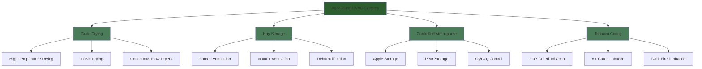

Agricultural drying and storage facilities require specialized HVAC systems that control temperature, humidity, and airflow to preserve crop quality while managing moisture content. These applications demand precise environmental control to prevent spoilage, maintain product value, and minimize energy consumption during the critical post-harvest period.

## Fundamental Drying Physics

The drying process involves simultaneous heat and mass transfer, governed by psychrometric principles and material properties. The drying rate depends on air temperature, humidity, velocity, and the moisture gradient between the product and surrounding air.

### Thin-Layer Drying Rate

The moisture removal rate for agricultural products follows exponential decay:

$$MR = \frac{M - M_e}{M_0 - M_e} = \exp(-kt)$$

Where:
- $MR$ = Moisture ratio (dimensionless)
- $M$ = Moisture content at time $t$ (decimal, dry basis)
- $M_e$ = Equilibrium moisture content (decimal, dry basis)
- $M_0$ = Initial moisture content (decimal, dry basis)
- $k$ = Drying constant (1/h)
- $t$ = Drying time (h)

### Equilibrium Moisture Content

The Modified Henderson equation describes moisture equilibrium:

$$M_e = \left[\frac{-\ln(1-RH)}{A(T+C)}\right]^{1/B}$$

Where:
- $RH$ = Relative humidity (decimal)
- $T$ = Temperature (°C)
- $A$, $B$, $C$ = Empirical constants specific to each crop

For corn: $A = 8.989 \times 10^{-5}$, $B = 2.098$, $C = 51.58$

## System Applications

## Drying Requirements by Crop

### Temperature and Airflow Specifications

| Crop Type | Safe Drying Temp | Max Temp | Airflow Rate | Target Moisture |
|-----------|------------------|----------|--------------|-----------------|
| Corn (seed) | 38-43°C (100-110°F) | 43°C (110°F) | 0.05-0.1 m³/s/m³ | 13-15% wb |
| Corn (feed) | 60-71°C (140-160°F) | 82°C (180°F) | 0.15-0.25 m³/s/m³ | 15-16% wb |
| Wheat | 43-60°C (110-140°F) | 60°C (140°F) | 0.05-0.1 m³/s/m³ | 13-14% wb |
| Soybeans | 43-49°C (110-120°F) | 49°C (120°F) | 0.05-0.08 m³/s/m³ | 11-13% wb |
| Rice | 43-49°C (110-120°F) | 49°C (120°F) | 0.08-0.12 m³/s/m³ | 12-14% wb |
| Hay (alfalfa) | Ambient + 5-8°C | 38°C (100°F) | 0.02-0.05 m³/s/m³ | 16-18% wb |
| Peanuts | 32-35°C (90-95°F) | 35°C (95°F) | 0.08-0.15 m³/s/m³ | 9-10% wb |
| Tobacco | 38-71°C (varies) | 71°C (160°F) | 0.01-0.03 m³/s/m³ | 10-12% wb |

wb = wet basis

### Energy Requirements

| Drying Method | Energy Input | Evaporation Rate | Efficiency |
|---------------|--------------|------------------|------------|
| High-temp grain (gas) | 4200-5600 kJ/kg H₂O | 50-150 kg/h | 50-60% |
| Low-temp bin (electric) | 2800-3500 kJ/kg H₂O | 10-30 kg/h | 60-75% |
| Hay ventilation | 250-500 kJ/kg H₂O | 5-15 kg/h | 70-85% |
| Dehumidification | 3000-4000 kJ/kg H₂O | 8-20 kg/h | 200-300% COP |

## Grain Drying Systems

High-temperature grain dryers operate at 60-82°C (140-180°F) for commercial operations, removing moisture rapidly to prevent spoilage. The heated air capacity must satisfy:

$$Q_{air} = \frac{\dot{m}_{grain} \times (M_i - M_f)}{(W_i - W_o) \times \rho_{air}}$$

Where:
- $Q_{air}$ = Required airflow (m³/s)
- $\dot{m}_{grain}$ = Grain throughput (kg/s)
- $M_i$, $M_f$ = Initial and final moisture content (decimal, db)
- $W_i$, $W_o$ = Inlet and outlet air humidity ratio (kg/kg)
- $\rho_{air}$ = Air density (kg/m³)

ASABE Standard S448.2 specifies static pressure requirements: 1.5-2.5 kPa for column depths of 6-12 m in continuous-flow dryers. Fan power follows:

$$P_{fan} = \frac{Q \times \Delta P}{\eta_{fan} \times \eta_{motor}}$$

In-bin drying uses ambient or slightly heated air (ambient + 3-6°C) with extended drying periods of 5-30 days. Airflow rates of 0.05-0.1 m³/s per m³ of grain maintain adequate drying fronts while minimizing energy costs.

## Hay Storage Ventilation

Hay baled at 18-22% moisture requires forced ventilation to reduce moisture to safe storage levels (14-16%). The system must provide 0.02-0.05 m³/s per m³ of hay, with distribution plenums spaced 2.4-3.6 m apart.

Critical design parameters per ASABE EP559:
- Minimum plenum velocity: 10-15 m/s to ensure uniform distribution
- Static pressure: 750-1500 Pa depending on bale density and stack height
- Drying time: 7-21 days depending on initial moisture and weather
- Temperature rise: Limited to 5-8°C to prevent heat damage

Hay exceeding 22% moisture risks spontaneous combustion from microbial respiration heat. Temperature monitoring is essential; exceeding 60°C requires immediate stack ventilation.

## Controlled Atmosphere Storage

Controlled atmosphere (CA) storage extends fruit shelf life by reducing oxygen (1.0-3.0%) and elevating carbon dioxide (1.0-5.0%) concentrations. The system maintains precise temperature (0-4°C for apples, 1-2°C for pears) with ±0.5°C control.

ASABE Standard EP413.2 specifies:
- O₂ reduction rate: 0.5-1.0% per day to avoid low-O₂ injury
- CO₂ scrubbing: Hydrated lime or molecular sieves
- Ethylene removal: Catalytic oxidation or potassium permanganate
- Gas monitoring: ±0.1% accuracy for O₂ and CO₂

Refrigeration loads include respiration heat (50-150 W/tonne depending on commodity), infiltration, and product cooling. Evaporator coils require 5-8°C TD to minimize moisture loss while providing adequate dehumidification.

## Tobacco Curing

Flue-cured tobacco follows a precise temperature-humidity schedule over 5-7 days:

1. Yellowing phase: 32-38°C, RH 85-90%, 24-48 hours
2. Leaf drying: 38-54°C, RH 70-80%, 24-36 hours
3. Stem drying: 54-71°C, RH 45-60%, 36-48 hours

Air circulation of 0.01-0.03 m³/s per m³ of barn volume ensures uniform conditions. Burner capacity of 30-50 kW per 100 m³ barn volume provides temperature control, with dampers modulating fresh air for humidity management.

Air-cured tobacco uses natural ventilation through adjustable wall boards, requiring 4-8 weeks at ambient conditions with protection from rain. Dark-fired tobacco combines air-curing with smoke exposure from smoldering hardwood for flavor development.

## Standards and References

- ASABE S352.2: Moisture Measurement - Unground Grain and Seeds
- ASABE D245.6: Moisture Relationships of Plant-based Agricultural Products
- ASABE S448.2: Thin-Layer Drying of Agricultural Crops
- ASABE S593.1: Terminology and Definitions for Agricultural Chemical Application
- ASABE EP559: Design Recommendations for Hay and Forage Drying and Storage
- ASABE EP413.2: Controlled Atmosphere Storage of Fruits and Vegetables

These agricultural applications demonstrate the critical intersection of HVAC engineering and food production, where precise environmental control directly impacts product quality, safety, and economic value.
