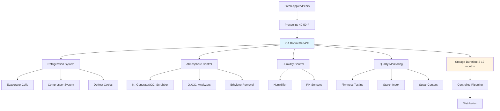

Controlled atmosphere (CA) storage extends the marketable life of apples and pears by reducing respiration rates and maintaining fruit quality for up to 12 months. This storage method combines precise temperature control with modified atmospheric conditions—reduced oxygen and elevated carbon dioxide—to slow metabolic processes while maintaining optimal humidity.

## Temperature Requirements

Temperature control forms the foundation of successful CA storage. Most apple and pear varieties require storage temperatures between 30-34°F (-1 to 1°C), maintained within ±0.5°F to prevent physiological disorders and freeze damage.

**Critical temperature considerations:**

- **30-31°F (-1 to -0.5°C)**: Optimal for most storage apples (Fuji, Gala, Honeycrisp)
- **32-34°F (0-1°C)**: Required for chilling-sensitive varieties (Granny Smith, some pears)
- **Temperature uniformity**: Maximum variation of 1°F throughout storage room
- **Cooling rate**: Initial pulldown at 1-2°F per day to avoid condensation stress

The relationship between temperature and respiration rate follows an exponential function. The respiration rate $R$ at temperature $T$ can be approximated by:

$$R(T) = R_0 \cdot Q_{10}^{(T-T_0)/10}$$

where $R_0$ is the base respiration rate at reference temperature $T_0$, and $Q_{10}$ typically ranges from 2.0 to 2.5 for apples and pears.

## Oxygen and Carbon Dioxide Management

CA storage effectiveness depends on maintaining specific atmospheric compositions tailored to each variety. Oxygen reduction and carbon dioxide elevation work synergistically to suppress respiration and ethylene production.

**Standard CA conditions:**

- **Regular CA (RCA)**: 1.5-3% O₂, 1-3% CO₂
- **Low oxygen CA**: 1.0-1.5% O₂, 0.5-1% CO₂
- **Ultra-low oxygen (ULO)**: 0.7-1.0% O₂, <1% CO₂
- **Dynamic CA (DCA)**: O₂ adjusted based on fruit response (0.4-0.6% O₂)

The respiratory quotient (RQ) indicates the ratio of CO₂ produced to O₂ consumed:

$$RQ = \frac{\text{CO}_2 \text{ produced}}{\text{O}_2 \text{ consumed}}$$

Normal aerobic respiration yields an RQ near 1.0. Values above 1.5 indicate anaerobic respiration and potential fruit damage.

## Variety-Specific CA Requirements

Different apple and pear varieties require distinct CA conditions for optimal storage performance.

| Variety | Temperature (°F) | O₂ (%) | CO₂ (%) | Storage Duration | Special Notes |
|---------|------------------|--------|---------|------------------|---------------|
| **Apples** |
| Fuji | 30-31 | 1.0-2.0 | 0.5-1.0 | 9-12 months | ULO recommended |
| Gala | 30-32 | 1.5-2.5 | 2.5-3.0 | 5-7 months | Ethylene sensitive |
| Granny Smith | 32-34 | 1.0-1.5 | 0.5-1.0 | 10-12 months | Tolerates ULO well |
| Honeycrisp | 36-37 | 2.5-3.0 | 1.0-1.5 | 4-6 months | Warmer than standard |
| Red Delicious | 30-31 | 1.5-2.0 | 3.0-4.5 | 6-9 months | Higher CO₂ tolerance |
| Golden Delicious | 30-31 | 2.0-3.0 | 2.0-3.0 | 6-8 months | Scald susceptible |
| **Pears** |
| Bartlett | 30-31 | 2.0-3.0 | 0.5-1.0 | 2-3 months | Short storage life |
| Anjou | 30-31 | 1.0-2.0 | 0.5-1.0 | 6-9 months | ULO extends storage |
| Bosc | 30-31 | 1.5-2.5 | 0.5-1.5 | 3-5 months | Moderate CA benefit |
| Comice | 30-31 | 2.0-3.0 | <0.5 | 2-4 months | CO₂ sensitive |

## Ethylene Control Systems

Ethylene accelerates ripening and senescence in both apples and pears. Effective ethylene management is critical for maintaining fruit quality during extended storage.

**Ethylene removal methods:**

- **Catalytic oxidation**: Converts ethylene to CO₂ and H₂O at 350-400°F using platinum/palladium catalysts
- **Potassium permanganate scrubbers**: Chemical absorption in fixed-bed systems
- **Ozone treatment**: Oxidizes ethylene at 0.1-0.3 ppm O₃ concentration
- **1-MCP treatment**: Blocks ethylene receptors before CA storage (0.625-1.0 μL/L for 24 hours)

Target ethylene concentrations should remain below 1 ppm for apples and below 0.5 ppm for pears throughout the storage period.

## Humidity Maintenance

Relative humidity must be maintained at 90-95% to minimize water loss while avoiding condensation that promotes decay organisms.

**Humidity control strategies:**

- High-efficiency cooling coils with minimal temperature differential (3-5°F)
- Ultrasonic or centrifugal humidifiers for supplemental moisture
- Air circulation rates of 0.5-1.0 cfm per pound of fruit
- Condensate management to prevent free water accumulation

Weight loss during storage follows:

$$\Delta W = k \cdot A \cdot (P_{sat} - P_{actual}) \cdot t$$

where $k$ is the mass transfer coefficient, $A$ is surface area, $(P_{sat} - P_{actual})$ is the vapor pressure deficit, and $t$ is storage time.

## System Configuration

## Quality Monitoring Protocols

Regular assessment ensures fruit maintains marketable quality throughout storage.

**Essential monitoring parameters:**

- **Firmness**: Penetrometer readings weekly (target: minimal loss <2 lbf)
- **Soluble solids**: Refractometer testing biweekly (maintain °Brix)
- **Starch degradation**: Iodine staining for maturity index
- **Disorder detection**: Visual inspection for scald, breakdown, CO₂ injury
- **Atmospheric composition**: Continuous O₂/CO₂ monitoring (±0.1% accuracy)
- **Ethylene concentration**: Weekly sampling (<1 ppm for apples)

Storage duration capabilities vary significantly by variety, ranging from 2-3 months for Bartlett pears to 12 months for Granny Smith apples under optimal ULO conditions. Proper CA management can extend marketable life 3-4 times longer than conventional refrigerated storage alone.

The economic benefits of CA storage—including extended marketing windows and reduced losses—must be balanced against higher capital costs for gas-tight construction, atmosphere control equipment, and intensive monitoring requirements.
