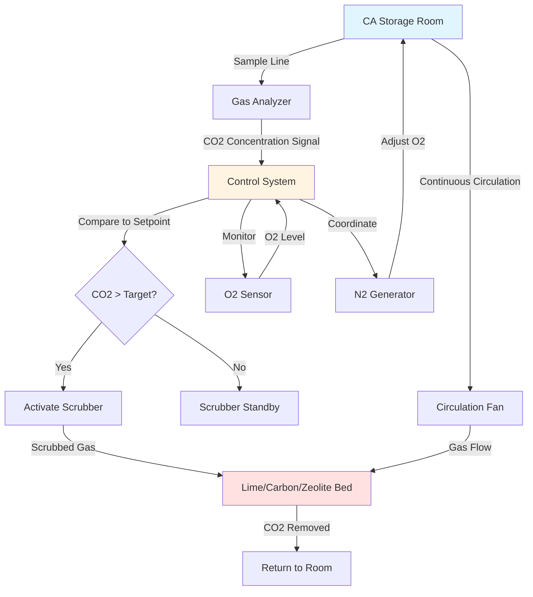

## CO2 Accumulation in CA Storage

Carbon dioxide accumulates continuously in controlled atmosphere storage rooms due to produce respiration. The rate of CO2 generation depends on produce type, temperature, oxygen level, and storage duration. Without active removal, CO2 concentrations can reach levels that cause physiological damage to stored crops.

The CO2 generation rate follows respiratory patterns and can be estimated using:

$$Q_{CO2} = m \cdot R \cdot RQ$$

where $Q_{CO2}$ is CO2 production rate (kg/hr), $m$ is produce mass (kg), $R$ is respiration rate (mg CO2/kg·hr), and $RQ$ is the respiratory quotient (typically 0.9-1.1 for most produce).

For a storage room containing 50,000 kg of apples at 0.5°C with a respiration rate of 3 mg CO2/kg·hr:

$$Q_{CO2} = 50000 \times 0.003 \times 1.0 = 150 \text{ g/hr} = 3.6 \text{ kg/day}$$

This continuous generation requires active CO2 removal to maintain target concentrations between 1-5% depending on the stored commodity.

## CO2 Scrubbing Technologies

### Activated Carbon Systems

Activated carbon adsorbers remove CO2 through physical adsorption on high-surface-area carbon media. These systems operate in dual-bed configurations with alternating adsorption and regeneration cycles. Regeneration requires heating to 200-300°C to release adsorbed CO2.

**Key characteristics:**
- CO2 removal capacity: 5-15% by weight
- Regeneration cycle: 4-8 hours
- Energy intensive due to heating requirements
- Sensitive to moisture content in gas stream

### Hydrated Lime Scrubbers

Calcium hydroxide (hydrated lime) chemically reacts with CO2 to form calcium carbonate in an irreversible reaction:

$$\text{Ca(OH)}_2 + \text{CO}_2 \rightarrow \text{CaCO}_3 + \text{H}_2\text{O}$$

Hydrated lime scrubbers are consumable systems requiring periodic lime replacement but offer simple, reliable operation without regeneration cycles.

**Operating parameters:**
- CO2 removal efficiency: 90-98%
- Lime consumption: 1.7 kg Ca(OH)2 per kg CO2
- Bed replacement interval: 2-4 weeks typical
- No heating or energy required for regeneration

### Molecular Sieve Systems

Zeolite molecular sieves selectively adsorb CO2 based on molecular size and polarity. These systems use pressure swing adsorption (PSA) or temperature swing adsorption (TSA) for regeneration.

**Advantages:**
- High selectivity for CO2 over O2 and N2
- Lower regeneration temperatures (100-150°C) than activated carbon
- Longer cycle life than chemical scrubbers
- Can operate at lower CO2 concentrations

## Optimal CO2 Levels and Injury Thresholds

Different crops tolerate varying CO2 concentrations. Exceeding injury thresholds causes physiological disorders including flesh browning, off-flavors, and accelerated senescence.

| Crop | Optimal CO2 (%) | Maximum Safe CO2 (%) | Injury Symptoms |
|------|-----------------|----------------------|-----------------|
| Apples (most varieties) | 0.5-3.0 | 5.0 | Core browning, flesh discoloration |
| Pears (Bartlett) | 0-1.0 | 2.0 | Core breakdown, brown heart |
| Pears (d'Anjou) | 1.0-3.0 | 5.0 | Brown core, flesh browning |
| Strawberries | 10-20 | 25 | Off-flavors, fungal susceptibility |
| Lettuce | 0 | 2.0 | Brown stain, russet spotting |
| Broccoli | 5-10 | 15 | Yellowing, off-odors |
| Avocados | 3-10 | 15 | Flesh discoloration, off-flavors |
| Kiwifruit | 3-5 | 8.0 | Flesh softening, off-flavors |

## CO2 Monitoring and Control Automation

Modern CA storage facilities employ continuous CO2 monitoring with automated scrubber control to maintain precise set points.

### Control Strategy Elements

**Measurement frequency:** CO2 analyzers sample at 1-5 minute intervals using infrared (IR) or electrochemical sensors with ±0.1% accuracy.

**Control algorithm:** PID control loops maintain CO2 within ±0.5% of set point by modulating scrubber circulation rate or cycling scrubber operation.

**Safety interlocks:** High CO2 alarms trigger at 1-2% above target with automatic scrubber activation and notification to operators.

## Integration with Oxygen Control

CO2 scrubbing systems operate in coordination with oxygen reduction equipment to maintain the complete CA environment. Critical integration considerations include:

**Gas balance:** Removing CO2 without replacing volume can create slight negative pressure. Nitrogen injection systems compensate by maintaining room pressure while lowering oxygen.

**Simultaneous control:** Independent control loops manage O2 (typically 1-3%) and CO2 (1-5%) with both parameters monitored continuously. O2 control takes priority in most systems since oxygen deficiency causes more rapid damage than elevated CO2.

**Scrubber selectivity:** CO2 scrubbers must not remove significant oxygen. Molecular sieves offer high selectivity, while activated carbon and lime systems have minimal O2 affinity.

**Energy optimization:** Coordinating scrubber operation with nitrogen generator cycles reduces energy consumption. Running both systems during off-peak electrical periods lowers operating costs.

**Respiration response:** As O2 levels decrease, respiration slows and CO2 generation declines. Control systems adjust scrubber operation dynamically based on actual CO2 accumulation rates rather than fixed schedules.

Effective CO2 management extends storage life, maintains quality, and maximizes the economic benefits of controlled atmosphere storage for high-value crops.
