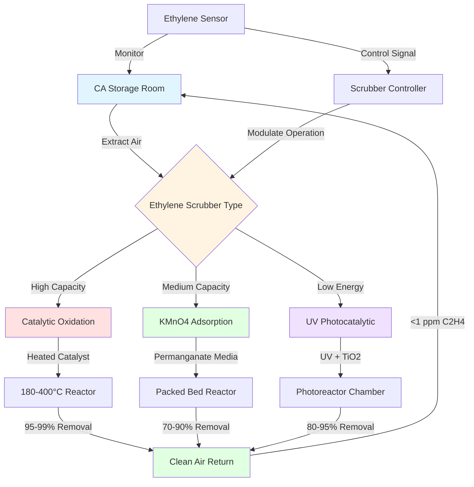

Ethylene scrubbing represents a critical component of controlled atmosphere (CA) storage systems for climacteric fruits and vegetables. Ethylene (C₂H₄), a plant hormone that accelerates ripening and senescence, must be actively removed to extend storage life and maintain produce quality during long-term cold storage operations.

## Ethylene Production by Climacteric Fruits

Climacteric fruits exhibit a characteristic respiration peak during ripening accompanied by substantial ethylene production. The autocatalytic nature of ethylene biosynthesis means that even trace quantities can trigger accelerated ripening throughout stored produce.

The ethylene generation rate varies significantly by commodity, temperature, and ripeness stage. The ethylene production rate can be estimated using:

$$E_p = E_0 \cdot Q_{10}^{(T-T_0)/10} \cdot f_m$$

Where:
- $E_p$ = ethylene production rate (μL/kg·h)
- $E_0$ = base production rate at reference temperature
- $Q_{10}$ = temperature coefficient (typically 2.0-3.0)
- $T$ = storage temperature (°C)
- $T_0$ = reference temperature (°C)
- $f_m$ = maturity factor (0.1-10.0)

### Ethylene Production Rates by Produce Type

| Commodity | Production Rate (μL/kg·h) | Temperature | Storage Sensitivity |
|-----------|---------------------------|-------------|---------------------|
| Apples (mature) | 0.1-10.0 | 0-5°C | High |
| Pears (Bartlett) | 5.0-30.0 | 0-2°C | Very High |
| Bananas (green) | 0.1-0.5 | 13-15°C | Moderate |
| Bananas (ripe) | 10.0-50.0 | 13-15°C | High |
| Kiwifruit | 1.0-5.0 | 0°C | High |
| Tomatoes (mature green) | 0.5-2.0 | 12-15°C | Moderate |
| Avocados | 5.0-100.0 | 5-13°C | Very High |
| Peaches | 2.0-20.0 | 0-2°C | High |
| Mangoes | 1.0-10.0 | 10-13°C | High |

The required ethylene removal capacity for a CA storage room is calculated as:

$$C_{removal} = \frac{M_{produce} \cdot E_p \cdot 1.1}{V_{room}}$$

Where:
- $C_{removal}$ = required removal capacity (μL/m³·h)
- $M_{produce}$ = mass of stored produce (kg)
- $V_{room}$ = room volume (m³)
- 1.1 = safety factor

## Catalytic Oxidation Scrubbing Systems

Catalytic oxidation systems provide continuous ethylene removal through conversion to carbon dioxide and water at elevated temperatures. These systems employ precious metal catalysts (platinum, palladium) supported on ceramic substrates.

The catalytic oxidation reaction proceeds as:

$$\text{C}_2\text{H}_4 + 3\text{O}_2 \xrightarrow{\text{catalyst, heat}} 2\text{CO}_2 + 2\text{H}_2\text{O}$$

**Operating Parameters:**
- Catalyst temperature: 180-400°C
- Contact time: 0.5-2.0 seconds
- Air flow rate: 50-150 m³/h per 100 tonnes stored
- Removal efficiency: 95-99% single pass
- Power consumption: 0.5-1.5 kW per 100 tonnes

Catalytic systems excel in high-capacity installations where continuous operation is required. The catalyst bed requires periodic regeneration to remove accumulated contaminants that poison active sites. Typical catalyst life spans 3-5 years under normal operating conditions.

## Potassium Permanganate Adsorption Systems

Potassium permanganate (KMnO₄) impregnated on alumina pellets provides effective ethylene removal through chemical oxidation at ambient temperatures. This passive approach requires no electrical power and offers simplicity in retrofit applications.

The oxidation mechanism involves:

$$3\text{C}_2\text{H}_4 + 2\text{KMnO}_4 \rightarrow 2\text{MnO}_2 + 2\text{KOH} + 3\text{CH}_3\text{CHO}$$

**System Characteristics:**
- Media capacity: 100-200 g ethylene per kg KMnO₄
- Airflow velocity: 0.3-0.5 m/s through media bed
- Contact time: 2-4 seconds
- Removal efficiency: 70-90% single pass
- Media replacement: every 4-12 months

The required media mass is calculated from:

$$M_{media} = \frac{M_{produce} \cdot E_p \cdot t_{storage}}{C_{media} \cdot \eta}$$

Where:
- $M_{media}$ = required media mass (kg)
- $t_{storage}$ = storage duration (hours)
- $C_{media}$ = media capacity (g ethylene/kg)
- $\eta$ = utilization efficiency (typically 0.7)

Permanganate systems work best in smaller facilities (under 500 tonnes) where capital cost minimization is prioritized over operational efficiency.

## UV Photocatalytic Oxidation Methods

UV photocatalytic oxidation combines ultraviolet light with titanium dioxide (TiO₂) catalysts to decompose ethylene at ambient temperature. This technology offers low maintenance and continuous operation without consumables replacement.

**Process Fundamentals:**
- UV wavelength: 254 nm (germicidal)
- TiO₂ catalyst activation
- Hydroxyl radical (·OH) generation
- Ethylene oxidation to CO₂ and H₂O

**Performance Specifications:**
- Removal efficiency: 80-95% single pass
- Residence time: 5-10 seconds
- Power consumption: 0.3-0.8 kW per 100 tonnes
- Lamp life: 10,000-20,000 hours
- No consumable replacement required

Photocatalytic systems provide advantages in organic production where chemical oxidants are prohibited. The absence of high-temperature components reduces fire risk in facilities handling flammable refrigerants or insulation materials.

## Target Ethylene Levels in CA Storage

Maintaining ethylene concentrations below 1 ppm represents the standard target for most CA storage applications. Specific commodities exhibit varying sensitivity thresholds:

- Ultra-sensitive (kiwifruit, broccoli): <0.1 ppm
- Highly sensitive (apples, pears): <0.5 ppm
- Moderately sensitive (citrus, peppers): <1.0 ppm
- Low sensitivity (onions, potatoes): <5.0 ppm

Continuous monitoring using electrochemical or gas chromatography sensors ensures ethylene levels remain within acceptable ranges. Control systems modulate scrubber operation based on real-time concentration feedback.

## Integration with CA Storage Systems

Ethylene scrubbers integrate with broader CA storage infrastructure through coordinated control strategies. The scrubbing system operates in parallel with oxygen depletion, carbon dioxide scrubbing, and humidity management systems.

**System Integration Considerations:**

1. **Airflow Coordination**: Scrubber airflow rates must balance with overall CA system circulation to maintain uniform conditions throughout the storage room.

2. **Energy Management**: Catalytic oxidation systems benefit from waste heat recovery to preheat inlet air, reducing electrical heating requirements by 30-40%.

3. **Sensor Placement**: Ethylene sensors should be positioned at air return locations where concentrations peak before scrubbing.

4. **Backup Capacity**: Critical installations incorporate redundant scrubbing capacity (150-200% of design load) to accommodate system maintenance and peak production periods.

5. **Safety Interlocks**: High-temperature catalytic systems require temperature limit controls and fire suppression integration.

The selection of ethylene scrubbing technology depends on storage capacity, commodity type, energy costs, and capital budget constraints. Large commercial operations typically favor catalytic oxidation for reliability and capacity, while smaller facilities utilize permanganate systems for simplicity and lower initial investment.

Proper ethylene management extends storage duration by 2-4 months for sensitive commodities, translating directly to improved product quality, reduced losses, and enhanced market flexibility for stored produce.
