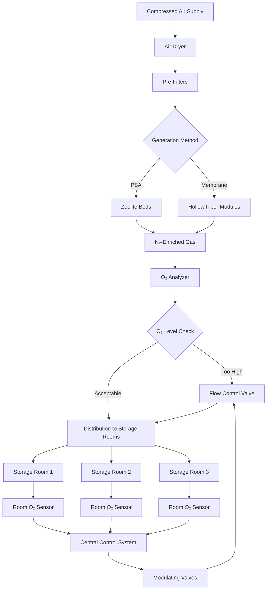

## Oxygen Control Fundamentals

Precise oxygen control represents the cornerstone of controlled atmosphere (CA) storage effectiveness. By reducing oxygen concentrations from atmospheric levels (20.9%) to target ranges of 1-3%, facilities dramatically slow the respiration rate of stored produce, extending shelf life by 2-4 times compared to conventional refrigerated storage.

The relationship between oxygen concentration and respiration rate follows Michaelis-Menten kinetics:

$$R = \frac{R_{max} \cdot [O_2]}{K_m + [O_2]}$$

Where $R$ is the respiration rate, $R_{max}$ is the maximum respiration rate at atmospheric oxygen, $[O_2]$ is oxygen concentration, and $K_m$ is the Michaelis constant (typically 0.5-2% for most fruits).

## Low-Oxygen Atmosphere Generation Methods

### Pressure Swing Adsorption (PSA) Systems

PSA nitrogen generators produce high-purity nitrogen by selectively adsorbing oxygen from compressed air using carbon molecular sieves. The process operates in alternating cycles:

**Adsorption phase:** Compressed air flows through zeolite beds at 6-8 bar, which preferentially retain oxygen molecules while allowing nitrogen to pass through. Product purity reaches 95-99.5% nitrogen.

**Regeneration phase:** Pressure drops to atmospheric level, releasing trapped oxygen to exhaust. Typical cycle times range from 30-120 seconds.

PSA systems deliver capacity from 10-10,000 SCFH with energy consumption of 0.35-0.45 kWh per 100 cubic feet of nitrogen. Initial costs are higher than membrane systems but operating costs decrease for larger installations.

### Membrane Separation Systems

Hollow fiber membrane generators separate nitrogen from air based on differential permeation rates through polymer membranes. Oxygen and water vapor permeate faster than nitrogen, creating nitrogen-enriched permeate stream.

Membrane systems operate continuously at 7-10 bar inlet pressure, producing nitrogen purity of 95-99% depending on flow rate adjustments. Energy consumption approximates 0.25-0.35 kWh per 100 cubic feet of nitrogen.

These systems excel in small-to-medium installations (5-500 SCFH) with lower capital costs, minimal maintenance requirements, and compact footprint. Membrane lifespan typically exceeds 10 years with proper air filtration.

### Catalytic Oxygen Removal

Catalytic burners consume residual oxygen by controlled combustion with propane or natural gas over platinum catalysts. This method fine-tunes oxygen levels to ultra-low concentrations (0.5-1%) unachievable with nitrogen generation alone.

The combustion reaction:

$$O_2 + 2H_2 \rightarrow 2H_2O$$

or

$$O_2 + CH_4 \rightarrow CO_2 + 2H_2O$$

Scrubbers remove combustion byproducts before gas recirculation. This approach suits specialty applications requiring extreme oxygen reduction for long-term apple storage or dried fruit preservation.

## Optimal Oxygen Levels by Crop

| Crop | Oxygen (%) | CO₂ (%) | Temperature (°C) | Storage Duration |
|------|-----------|---------|------------------|------------------|
| Apples (Granny Smith) | 1.0-1.5 | 1.0-2.0 | 0-1 | 9-12 months |
| Apples (Gala) | 1.5-2.5 | 2.5-3.0 | 0-1 | 6-9 months |
| Pears (Bartlett) | 1.5-2.5 | 0-1.0 | -1-0 | 2-3 months |
| Pears (Anjou) | 1.0-2.0 | 0.5-1.5 | -1-0 | 6-8 months |
| Kiwifruit | 1.0-2.0 | 3.0-5.0 | 0 | 5-6 months |
| Avocados | 2.0-5.0 | 3.0-10.0 | 5-13 | 2-8 weeks |
| Cabbage | 2.5-5.0 | 2.5-6.0 | 0 | 5-6 months |
| Blueberries | 2.0-5.0 | 12.0-20.0 | 0-1 | 6-8 weeks |

## Oxygen Monitoring and Control Systems

Modern CA facilities employ redundant oxygen measurement using electrochemical, paramagnetic, or zirconia-based sensors. Electrochemical cells offer 0.1% accuracy with 6-24 month lifespan at $200-500 per sensor.

Control systems maintain setpoints through:

**Continuous nitrogen injection:** Modulating valves regulate nitrogen flow based on measured oxygen levels with typical dead band of ±0.2%.

**Rapid pull-down:** Initial oxygen reduction from atmospheric to target levels occurs over 3-7 days to prevent physiological damage.

**Pressure compensation:** Sealed rooms require pressure relief to prevent structural damage as nitrogen displaces oxygen.

PLC-based controllers log oxygen, carbon dioxide, temperature, and humidity data at 1-15 minute intervals, triggering alarms when parameters deviate beyond tolerance bands.

## Respiration Rate Reduction Benefits

Reducing oxygen from 21% to 2% decreases respiration rates by 40-70% depending on commodity and temperature. The combined effect with refrigeration provides multiplicative benefit:

$$Q_{10} = \left(\frac{R_2}{R_1}\right)^{\frac{10}{T_2-T_1}}$$

Where $Q_{10}$ represents the temperature coefficient (typically 2-3 for most produce), demonstrating that 10°C temperature reduction doubles or triples respiration rate.

Low oxygen atmospheres suppress ethylene production, delay ripening, reduce moisture loss, minimize fungal growth, and maintain firmness, color, and nutritional quality throughout extended storage periods.

## Safety Considerations for Low-Oxygen Environments

Oxygen-deficient atmospheres (below 19.5%) present immediate asphyxiation hazards. Critical safety protocols include:

**Entry procedures:** Ventilate rooms to atmospheric oxygen levels before entry. Confirm >19.5% O₂ with calibrated portable monitors. Never enter alone.

**Warning systems:** Flashing lights and audible alarms at room entrances indicating hazardous atmosphere status.

**Ventilation interlocks:** Door opening automatically triggers exhaust fans and nitrogen supply shutdown.

**Emergency equipment:** Self-contained breathing apparatus (SCBA) stationed outside each room. Rescue tripods and retrieval systems for emergency extraction.

**Training requirements:** Annual confined space entry certification for all personnel with room access authorization.

Facilities typically install oxygen sensors at multiple heights, as nitrogen stratification can create localized pockets of severe oxygen depletion near floor level.

## Leak Detection and Sealing Requirements

CA storage effectiveness depends on maintaining gas-tight envelopes. Acceptable leakage rates range from 1-5% room volume per 24 hours at 0.25 inch water column positive pressure.

**Pressure decay testing:** Pressurize empty room to 1 inch water gauge, measure pressure reduction over 30 minutes. Calculate leakage rate:

$$L = \frac{V \cdot \Delta P}{P_{atm} \cdot t} \times 100\%$$

Where $L$ is leakage percentage, $V$ is room volume, $\Delta P$ is pressure drop, $P_{atm}$ is atmospheric pressure, and $t$ is test duration.

**Sealing strategies:** Vapor barriers, gasketed doors, sealed penetrations, caulked panel joints, and epoxy floor coatings. High-traffic facilities install air curtains or double-door vestibules to minimize infiltration during access periods.

Regular leak testing before each storage season identifies deterioration requiring repair to maintain economic nitrogen generation efficiency.
