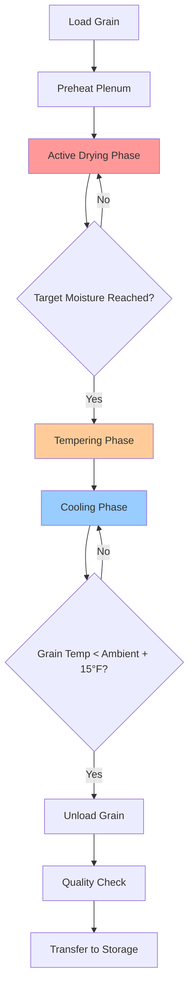

Batch grain dryers process discrete quantities of grain through complete drying cycles before unloading and reloading. These systems offer flexibility for farm-scale operations and grain elevators handling multiple crops or varying moisture levels.

## Batch Dryer Types

### Bin Dryers

Bin dryers integrate drying and storage in a single structure. Heated air flows through perforated flooring or ducts, moving upward through the grain column. Typical capacities range from 500 to 5,000 bushels. The grain depth affects drying uniformity, with shallower depths (4-6 feet) providing more uniform results than deeper beds (12-16 feet).

### Portable Batch Dryers

Portable units provide mobility for custom drying operations or farms with multiple storage locations. These dryers typically process 200-1,000 bushels per batch. The drying chamber features perforated walls or columns through which heated air passes horizontally or radially through the grain mass.

### Stationary Batch Dryers

Large commercial batch dryers handle 1,000-10,000 bushels per batch with vertical or horizontal airflow configurations. Multiple-zone heating allows temperature staging, with higher temperatures in initial zones and lower temperatures as grain approaches target moisture content.

## Drying Cycle Operation

The batch drying process follows a defined sequence controlled by time, temperature, and moisture measurement.

**Heating Phase**: Burner output elevates air temperature to the target drying temperature. Plenum temperature reaches setpoint before full airflow engages to prevent thermal shock to the grain.

**Active Drying Phase**: Heated air removes moisture from the grain mass. The drying front progresses through the grain bed at a rate determined by airflow velocity, temperature, and initial moisture content. Drying time $t_d$ relates to moisture removal:

$$t_d = \frac{M_g \cdot (MC_i - MC_f)}{Q_a \cdot \rho_a \cdot (W_o - W_i) \cdot 60}$$

where $M_g$ is grain mass (lb), $MC_i$ and $MC_f$ are initial and final moisture contents (% wet basis), $Q_a$ is airflow rate (cfm), $\rho_a$ is air density (lb/ft³), and $W_o$ and $W_i$ are outlet and inlet air humidity ratios (lb moisture/lb dry air).

**Tempering Phase**: Airflow continues with reduced or zero heat input, allowing moisture within grain kernels to equilibrate. This phase typically requires 2-4 hours and improves final moisture uniformity.

**Cooling Phase**: Ambient or refrigerated air reduces grain temperature to within 10-15°F of ambient before storage to prevent condensation and spoilage.

## Temperature Control for Grain Quality

Maximum allowable drying temperatures depend on grain type and end use. Exceeding these limits causes stress cracks, germination loss, and reduced quality.

**Corn**: Seed corn limits to 110°F, food-grade corn to 140°F, and feed corn tolerates up to 180°F.

**Soybeans**: Seed soybeans require temperatures below 110°F, while commercial soybeans accept up to 130°F.

**Wheat**: Milling wheat limits to 140°F to preserve gluten quality.

Temperature control systems employ modulating burners or dampers to maintain setpoint within ±5°F. Proportional-integral-derivative (PID) controllers adjust fuel and airflow based on plenum temperature sensors.

## Moisture Uniformity Challenges

Uneven drying results from non-uniform airflow distribution, grain depth variations, and initial moisture content differences. Grain near air inlet points dries faster, creating moisture gradients.

**Airflow Distribution Solutions**:
- Perforated duct spacing at 4-6 foot intervals
- Plenum pressure monitoring to detect flow restrictions
- Grain leveling devices for uniform bed depth

**Mixing and Stirring**: Mechanical stirrers or pneumatic recirculation systems redistribute grain during drying. Stirring reduces moisture variation from 4-6% to 1-2% within the batch.

**Moisture Monitoring**: Multi-point moisture sensors detect variations within the grain mass. Controllers adjust cycle timing based on the wettest zone rather than average moisture content.

## Cooling Requirements

Grain exiting the dryer at 120-160°F must cool to safe storage temperature (40-60°F for long-term storage, 70-80°F for short-term holding). Cooling airflow requirements:

$$Q_{cool} = \frac{M_g \cdot C_p \cdot (T_g - T_{final})}{60 \cdot \rho_a \cdot C_{p,a} \cdot (T_{out} - T_{in}) \cdot t_{cool}}$$

where $C_p$ is grain specific heat (typically 0.4 Btu/lb-°F), $C_{p,a}$ is air specific heat (0.24 Btu/lb-°F), temperatures are in °F, and $t_{cool}$ is cooling time (minutes).

Cooling typically requires 0.5-1.0 cfm per bushel and 1-3 hours depending on ambient conditions.

## Capacity and Throughput Considerations

Batch dryer throughput depends on batch size, drying time, and handling efficiency. Daily capacity:

$$C_{daily} = \frac{B \cdot N_{cycles} \cdot (MC_i - MC_f)}{100 - MC_f}$$

where $B$ is batch size (bushels), $N_{cycles}$ is cycles per day, and moisture contents are % wet basis.

| Dryer Type | Batch Size (bu) | Drying Time (hr) | Cooling Time (hr) | Cycles/Day | Daily Capacity (bu/day)* |
|------------|-----------------|------------------|-------------------|------------|--------------------------|
| Small Bin | 500-1,000 | 4-8 | 2-3 | 2-3 | 1,000-3,000 |
| Portable | 200-1,000 | 2-6 | 1-2 | 3-5 | 600-5,000 |
| Large Bin | 2,000-5,000 | 6-12 | 2-4 | 1-2 | 2,000-10,000 |
| Stationary Commercial | 5,000-10,000 | 4-8 | 2-3 | 2-3 | 10,000-30,000 |

*Assuming 4% moisture removal on corn

**Loading and Unloading Efficiency**: Transfer equipment capacity must match dryer throughput. Augers and bucket elevators sized for 30-60 minute loading/unloading minimize cycle downtime.

**Energy Efficiency**: Heat recovery systems capture exhaust air energy using air-to-air heat exchangers, improving thermal efficiency from 40-50% to 60-70%. Fuel consumption approximates:

$$Fuel = \frac{M_g \cdot (MC_i - MC_f) \cdot H_{fg}}{(100 - MC_f) \cdot \eta \cdot HHV}$$

where $H_{fg}$ is latent heat of vaporization (1,060 Btu/lb), $\eta$ is burner efficiency, and $HHV$ is fuel higher heating value.

Batch dryers balance operational flexibility with energy efficiency, making them suitable for operations with varying grain types, seasonal processing demands, and moderate throughput requirements.
