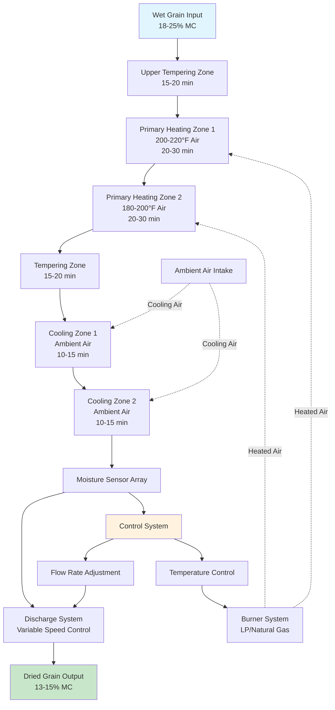

Continuous flow grain dryers provide uninterrupted drying operations for high-volume agricultural processing facilities, handling grain throughput rates from 100 to 1,500 bushels per hour. These systems maintain constant grain movement through heated air zones, enabling predictable moisture reduction and consistent product quality for commercial grain elevators, seed processing plants, and large farming operations.

## Dryer Configuration Types

### Cross-Flow Design

Cross-flow dryers move grain vertically downward through rectangular columns while heated air passes horizontally through the grain mass. Air enters one side of the column, travels perpendicular to grain flow, and exhausts from the opposite side.

The grain column width typically ranges from 12 to 24 inches, limiting the distance air must travel through the grain mass. This configuration achieves drying rates of 0.5 to 1.5 percentage points moisture removal per pass, with plenum temperatures from 180°F to 220°F depending on grain type and initial moisture content.

Cross-flow dryers excel at high-capacity operations where multiple passes through the dryer system are acceptable. The design maximizes airflow volume relative to energy input, achieving fuel efficiency of 2,500 to 3,500 BTU per pound of water removed.

### Mixed-Flow Design

Mixed-flow dryers combine vertical grain movement with angular air distribution through perforated ducts arranged in alternating patterns. Grain flows downward around these ducts while heated air enters at angles ranging from 30° to 60° relative to grain flow direction.

This configuration exposes each grain kernel to more uniform heating compared to cross-flow designs. The angular air pattern creates turbulent mixing within the grain mass, reducing moisture gradients and improving drying uniformity. Typical moisture removal rates reach 1.0 to 2.0 percentage points per pass.

The flow rate calculation for mixed-flow dryers accounts for the effective exposure area:

$$Q_g = \frac{A_e \times V_g \times \rho_g}{60}$$

where $Q_g$ is grain flow rate (bu/hr), $A_e$ is effective cross-sectional area (ft²), $V_g$ is grain velocity (ft/min), and $\rho_g$ is grain bulk density (lb/ft³).

### Counter-Flow Design

Counter-flow dryers move grain downward against upward-moving heated air, maximizing heat transfer efficiency through direct opposition of flow directions. This arrangement creates the highest temperature differential between entering air and exiting grain, achieving fuel efficiency approaching 1,800 to 2,200 BTU per pound of water removed.

The configuration requires careful control to prevent over-drying of grain at the bottom of the drying column where the driest grain encounters the hottest air. Advanced systems incorporate graduated air temperature control across multiple zones to optimize the drying profile.

## Residence Time and Flow Control

Grain residence time within the dryer determines moisture removal capacity and system throughput. The relationship between residence time and flow rate follows:

$$t_r = \frac{V_c}{Q_g}$$

where $t_r$ is residence time (hours), $V_c$ is column volume (bu), and $Q_g$ is grain flow rate (bu/hr).

Commercial continuous flow dryers maintain residence times from 20 to 90 minutes depending on initial moisture content, target final moisture, and grain type. Variable-speed discharge mechanisms control grain flow rate, with precision metering rolls or augers adjusting flow in response to moisture sensor feedback.

## Multi-Stage Drying Architecture

High-efficiency continuous flow dryers incorporate multiple drying and tempering zones to optimize moisture removal while preserving grain quality. The multi-stage approach prevents thermal stress cracking by allowing grain kernels to equilibrate moisture gradients between heating cycles.

**Typical Stage Configuration:**

1. **Upper tempering zone** - Preheats grain to 90-110°F, initiating surface moisture evaporation
2. **Primary heating zones** - Two to four sections with graduated air temperatures
3. **Intermediate tempering** - Allows internal moisture migration to grain surface
4. **Cooling zones** - Reduces grain temperature to within 10°F of ambient before storage

The tempering time ratio typically equals 1.5 to 2.0 times the heating time to ensure complete moisture equilibration throughout the kernel structure.

## Capacity and Throughput Calculations

Dryer capacity ratings depend on initial moisture content, target final moisture, grain type, and ambient conditions. The fundamental throughput calculation:

$$C = \frac{Q_g \times (M_i - M_f)}{100}$$

where $C$ is moisture removal capacity (bu-points/hr), $Q_g$ is grain flow rate (bu/hr), $M_i$ is initial moisture content (%), and $M_f$ is final moisture content (%).

For corn drying from 20% to 15% moisture at 300 bu/hr throughput:

$$C = \frac{300 \times (20 - 15)}{100} = 15 \text{ bu-points/hr}$$

Commercial dryer specifications rate capacity in bu-points/hr to account for varying moisture removal requirements across different operating conditions.

## Moisture Monitoring Systems

Modern continuous flow dryers employ real-time moisture monitoring with capacitance sensors, infrared analyzers, or microwave resonance systems positioned at dryer discharge. These sensors provide feedback to control systems that adjust grain flow rate and heating intensity.

**Control System Functions:**

- Continuous moisture measurement with ±0.3% accuracy
- Automatic flow rate modulation to maintain target moisture
- Temperature limit protection preventing grain damage
- Data logging for quality assurance documentation
- Remote monitoring and alarm notification

Advanced systems incorporate predictive algorithms that anticipate required adjustments based on incoming grain moisture trends, minimizing output moisture variation to ±0.5% throughout production runs.

## Configuration Comparison

| Configuration | Airflow Pattern | Drying Efficiency | Fuel Consumption | Moisture Uniformity | Best Application |
|---------------|----------------|-------------------|------------------|---------------------|------------------|
| **Cross-Flow** | Horizontal through vertical grain flow | 2,500-3,500 BTU/lb water | Higher | Good (±1.0%) | High-volume elevator operations |
| **Mixed-Flow** | Angular (30-60°) through grain | 2,200-2,800 BTU/lb water | Medium | Excellent (±0.5%) | Seed conditioning, premium grain |
| **Counter-Flow** | Upward against grain flow | 1,800-2,200 BTU/lb water | Lower | Very Good (±0.7%) | Energy-critical operations |

## Advantages for High-Volume Operations

Continuous flow dryers provide distinct operational benefits for facilities processing over 100,000 bushels annually. The constant grain movement eliminates batch handling labor, reduces facility footprint per bushel of daily capacity, and enables automated integration with grain handling systems.

Energy efficiency improves through heat recovery systems that capture exhaust air thermal energy for pre-heating combustion air or supplemental grain heating. Modern installations achieve seasonal average fuel consumption below 2,500 BTU per pound of water removed when processing corn from 20% to 15% moisture.

System reliability exceeds 95% uptime during harvest season through modular component design enabling rapid maintenance without complete shutdown. Predictive maintenance monitoring of bearing temperatures, belt tension, and burner performance identifies potential failures before operational interruption occurs.

The automated operation reduces labor requirements to periodic monitoring and daily maintenance checks, with a single operator managing dryer systems handling 500+ bushels per hour across multiple production lines.
