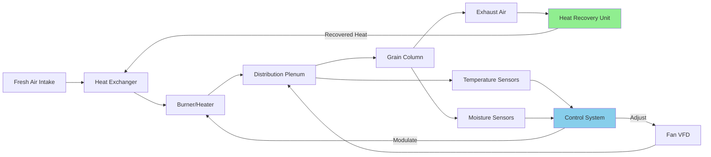

Heated air grain drying systems utilize fossil fuel, electric, or biomass heat sources to elevate air temperature above ambient conditions, increasing the vapor pressure differential between grain kernels and drying air. This accelerates moisture removal rates while requiring careful temperature management to prevent thermal damage to grain structure and germination viability.

## Temperature Limits by Grain Type

Maximum safe drying air temperatures depend on grain species, end use, and initial moisture content. Exceeding these limits causes kernel stress-cracking, germination loss, and protein denaturation.

| Grain Type | Seed Use (°F) | Feed Use (°F) | Food/Malt Use (°F) | Critical Damage Point (°F) |
|------------|--------------|---------------|-------------------|---------------------------|
| Corn | 110 | 140 | 130 | 150 |
| Soybeans | 110 | 130 | 120 | 140 |
| Wheat | 110 | 140 | 130 | 150 |
| Barley (malting) | 100 | 130 | 110 | 120 |
| Rice (rough) | 110 | 130 | 120 | 140 |
| Sorghum | 110 | 140 | 130 | 150 |
| Oats | 110 | 130 | 120 | 140 |
| Canola/Rapeseed | 95 | 110 | 105 | 120 |

Seed grain temperatures should remain 10-15°F below feed-grade limits to preserve germination rates above 85%. High-value crops like malting barley require the lowest temperatures to maintain enzyme activity.

## Heat Source Options

### LP and Natural Gas Burners

Direct-fired burners inject combustion products into the drying airstream, offering 95-100% thermal efficiency. Gas consumption follows:

$$Q_{gas} = \frac{\dot{m}_{air} \times c_p \times \Delta T}{\eta_{burner} \times LHV_{fuel}}$$

Where:
- $Q_{gas}$ = fuel consumption rate (ft³/hr or gal/hr)
- $\dot{m}_{air}$ = airflow rate (lb/min)
- $c_p$ = specific heat of air (0.24 BTU/lb·°F)
- $\Delta T$ = temperature rise (°F)
- $\eta_{burner}$ = burner efficiency (0.95-1.0)
- $LHV_{fuel}$ = lower heating value (BTU/ft³ or BTU/gal)

For natural gas at 1,000 BTU/ft³, a 10,000 CFM system with 80°F temperature rise requires approximately 960 ft³/hr fuel input.

### Indirect Fired Heat Exchangers

Indirect exchangers separate combustion products from drying air, preventing contamination but reducing efficiency to 70-85%. Heat transfer follows:

$$Q = UA \times LMTD$$

Where:
- $Q$ = heat transfer rate (BTU/hr)
- $U$ = overall heat transfer coefficient (8-12 BTU/hr·ft²·°F for gas-to-air)
- $A$ = heat exchanger surface area (ft²)
- $LMTD$ = log mean temperature difference (°F)

### Electric Heating Elements

Electric resistance heaters provide 100% conversion efficiency at the dryer but suffer from high energy costs. Power requirements:

$$P_{electric} = \frac{\dot{m}_{air} \times c_p \times \Delta T}{3412 \text{ BTU/kWh}}$$

Electric heating proves economical only with subsidized rates below $0.06/kWh or for small-scale operations under 5,000 bushels annually.

### Biomass Combustion

Wood chips, corn cobs, and crop residues offer renewable heating at $3-6/MMBTU versus $8-12/MMBTU for propane. Indirect-fired biomass systems prevent smoke contamination while achieving 65-75% overall efficiency.

## Air Temperature Rise Calculations

The temperature increase delivered by heating equipment depends on airflow rate and heat input:

$$\Delta T = \frac{Q_{input}}{\dot{m}_{air} \times c_p \times 60}$$

For a 500,000 BTU/hr burner with 10,000 CFM airflow at standard conditions (0.075 lb/ft³):

$$\Delta T = \frac{500,000}{10,000 \times 0.075 \times 0.24 \times 60} = 46.3°F$$

Higher ambient temperatures reduce achievable temperature rise due to fixed heat input, requiring airflow modulation or staged heating in multi-zone dryers.

## Drying Efficiency and Energy Consumption

Thermal efficiency in heated air drying depends on heat utilization for moisture evaporation versus sensible heating of grain and parasitic losses. Energy consumption per pound of water removed:

$$E_{specific} = \frac{Q_{total}}{W_{evap} \times \eta_{utilization}}$$

Where:
- $E_{specific}$ = energy per pound water removed (BTU/lb)
- $Q_{total}$ = total heat input (BTU)
- $W_{evap}$ = water mass evaporated (lb)
- $\eta_{utilization}$ = heat utilization efficiency (0.40-0.65)

High-temperature drying at 140°F typically consumes 2,200-2,800 BTU/lb water removed, while low-temperature systems at 100-110°F achieve 1,800-2,200 BTU/lb through improved heat utilization and reduced overdrying.

## Over-Drying Risks and Prevention

Excessive drying below optimal storage moisture (13-14% for corn, 12-13% for soybeans) causes economic losses through weight reduction and increased brittleness. A 1% moisture reduction below target represents 1.2-1.3% product weight loss.

Prevention strategies include:

**Moisture Monitoring**: Automated moisture sensors with 0.5% accuracy prevent over-drying through burner cycling

**Equilibrium Moisture Control**: Exhaust air relative humidity monitoring maintains grain at target moisture

**Plenum Temperature Limits**: Maximum plenum temperatures 5-10°F below grain damage thresholds

**Airflow Distribution**: Uniform airflow prevents localized over-drying in high-velocity zones

## Heat Recovery and Efficiency Improvements

Heat recovery from exhaust air improves efficiency by 15-25% through:

**Air-to-Air Heat Exchangers**: Cross-flow or rotary heat wheels transfer sensible heat from 120-140°F exhaust to incoming ambient air

**Recirculation Systems**: Partial exhaust air recirculation during low ambient temperatures maintains target plenum temperature with reduced fuel input

**Condensing Heat Recovery**: Exhaust air cooling below dew point recovers latent heat at 8,000-9,000 BTU/lb condensate

Heat recovery effectiveness:

$$\epsilon = \frac{T_{supply} - T_{ambient}}{T_{exhaust} - T_{ambient}}$$

Well-designed systems achieve 60-70% effectiveness, reducing fuel consumption by 20-30% in cold climates where ambient temperatures remain 30-40°F below exhaust conditions.

Combined with variable-speed fan controls that reduce airflow during final drying stages, comprehensive efficiency improvements reduce energy costs by 35-45% compared to conventional fixed-speed, non-recovery systems while maintaining grain quality and throughput.
