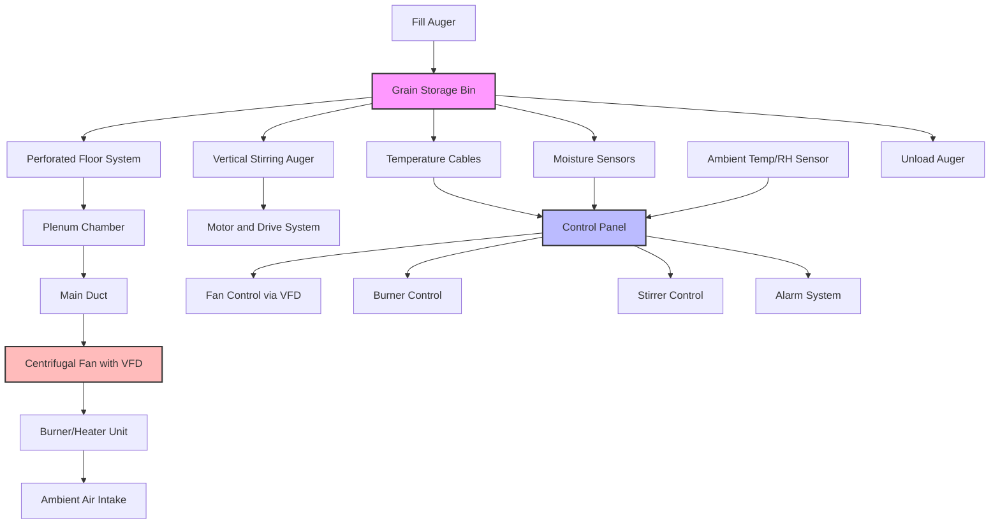

In-bin grain drying systems combine the drying and storage functions within a single structure, providing cost-effective moisture reduction for harvested grain. These systems utilize heated or ambient air forced through grain mass via perforated floors, enabling farmers to dry grain gradually while it remains in storage bins.

## Layer Drying vs Full-Bin Drying Approaches

**Layer Drying** involves filling the bin partially (typically 3-6 feet depth) and drying that layer completely before adding subsequent layers. The drying front moves upward through each layer as moisture is removed. This method provides:

- Faster drying of initial grain quantities
- Ability to market grain in batches
- Lower initial airflow requirements
- Reduced risk of spoilage in wet grain above the drying zone

The drying time for layer drying follows:

$$t_{\text{layer}} = \frac{d \cdot \rho_b \cdot (M_i - M_f)}{q \cdot \Delta W \cdot 60}$$

where $t_{\text{layer}}$ is drying time (hours), $d$ is layer depth (ft), $\rho_b$ is bulk density (lb/ft³), $M_i$ and $M_f$ are initial and final moisture content (% wet basis), $q$ is airflow rate (cfm/bu), and $\Delta W$ is moisture removal rate (lb H₂O/lb dry air·hr).

**Full-Bin Drying** fills the entire bin to capacity before starting the drying process. The drying front progresses from the perforated floor upward through the grain column. This approach:

- Maximizes storage capacity utilization
- Requires higher fan capacity for adequate airflow
- Takes longer to complete drying
- Demands careful monitoring to prevent spoilage in upper layers

Full-bin drying requires static pressure calculations:

$$\Delta P = K \cdot d \cdot V^n$$

where $\Delta P$ is pressure drop (inches H₂O), $K$ is resistance coefficient, $d$ is grain depth (ft), $V$ is superficial air velocity (fpm), and $n$ is an exponent (typically 1.8-2.0).

## Perforated Floor Design and Airflow Distribution

Perforated floors serve as the air distribution plenum, ensuring uniform airflow through the entire grain cross-section. Critical design parameters include:

**Perforation Specifications:**
- Hole diameter: 0.125-0.375 inches
- Open area: 7-12% of total floor area
- Hole spacing: 0.5-1.0 inches on center
- Material: galvanized steel, aluminum, or stainless steel

**Plenum Design:**
- Depth: 12-18 inches minimum
- Transition from duct to plenum: gradual expansion (15-20° angle)
- Cross-sectional area: sized to maintain velocity below 1200 fpm
- Support structure: capable of supporting grain load (typically 50-60 psf)

The airflow uniformity coefficient is:

$$U = 1 - \frac{\sigma_V}{\bar{V}}$$

where $U$ is uniformity (target > 0.85), $\sigma_V$ is standard deviation of velocity measurements, and $\bar{V}$ is mean velocity.

## Stirring Devices for Uniform Drying

Stirring systems redistribute grain within the bin to improve drying uniformity and break up moisture gradients. Two primary types exist:

**Vertical Stirring Augers:**
- Center-mounted auger that rotates and moves vertically
- Lifts grain from bottom and deposits at top
- Reduces drying time by 20-30%
- Operates intermittently (15 minutes per hour typical)

**Horizontal Spreaders:**
- Rotating arms or sweeps at grain surface
- Level grain during filling
- Prevent core formation and improve airflow distribution

Stirring effectiveness increases drying rate:

$$\frac{dM}{dt}_{\text{stirred}} = 1.25 \cdot \frac{dM}{dt}_{\text{unstirred}}$$

## Transition from Drying to Storage

Once target moisture content is achieved, the system transitions from active drying to storage mode. This process involves:

1. **Cooling Phase:** Continue airflow without heat for 6-12 hours to cool grain to within 10°F of ambient temperature
2. **Final Moisture Verification:** Sample grain from multiple locations to confirm uniform moisture (within ±1% variation)
3. **System Shutdown:** Gradually reduce airflow over 30-60 minutes to prevent condensation
4. **Aeration Setup:** Switch to intermittent aeration mode for long-term storage

The cooling requirement follows:

$$Q_{\text{cool}} = \rho_b \cdot V_{\text{bin}} \cdot c_p \cdot (T_{\text{grain}} - T_{\text{ambient}})$$

where $Q_{\text{cool}}$ is heat removal (Btu), $V_{\text{bin}}$ is bin volume (ft³), and $c_p$ is specific heat (0.45 Btu/lb·°F for grain).

## Aeration Integration for Cooling

Integrated aeration systems maintain grain quality during storage by:

- Cooling grain to safe storage temperatures (40-50°F)
- Eliminating temperature gradients that drive moisture migration
- Preventing hot spots and insect activity
- Operating with ambient air (no supplemental heat)

Aeration airflow is substantially lower than drying:

$$q_{\text{aeration}} = 0.1-0.2 \text{ cfm/bu}$$

compared to drying airflow:

$$q_{\text{drying}} = 1.0-2.5 \text{ cfm/bu}$$

The system uses the same perforated floor and fan, controlled by automated switches based on ambient conditions.

## Automation and Monitoring Systems

Modern in-bin drying systems employ comprehensive automation:

**Temperature Monitoring:**
- Thermocouples or resistance temperature detectors (RTDs) at multiple depths
- Typical arrangement: 3-5 cables with sensors every 3-4 feet vertically
- Alarm thresholds: 10°F above ambient or 120°F absolute

**Moisture Monitoring:**
- Capacitance or EMC sensors at critical zones
- Equilibrium moisture content calculation from temperature and humidity
- Target accuracy: ±0.5% moisture content

**Fan Control:**
- Variable frequency drives (VFDs) for airflow modulation
- Automated start/stop based on ambient conditions
- Runtime tracking and maintenance scheduling

**Burner Management:**
- Temperature setpoint control (typically 100-140°F)
- High-limit cutoffs for safety (180°F maximum)
- Fuel consumption monitoring

The automated control logic optimizes:

$$\text{EMC} = f(T_{\text{ambient}}, \text{RH}_{\text{ambient}})$$

Only operating when equilibrium moisture content is below target storage moisture.

## In-Bin Drying Design Parameters

| Parameter | Layer Drying | Full-Bin Drying | Units |
|-----------|--------------|-----------------|-------|
| Airflow Rate | 1.0-1.5 | 1.5-2.5 | cfm/bu |
| Static Pressure | 2-4 | 4-8 | in H₂O |
| Temperature Rise | 10-20 | 10-15 | °F |
| Layer Depth | 3-6 | 15-30 | ft |
| Drying Time | 6-12 | 24-72 | hours |
| Fan Horsepower | 5-10 | 15-30 | HP/1000 bu |
| Perforated Floor Open Area | 8-10 | 10-12 | % |
| Plenum Depth | 12-15 | 15-18 | inches |
| Maximum Grain Temperature | 130 | 120 | °F |
| Target Moisture Removal | 1-2 | 3-6 | percentage points |

## In-Bin Drying System Configuration

## Operational Efficiency Considerations

In-bin drying efficiency depends on several critical factors:

**Initial Moisture Content:** Systems perform optimally when initial moisture is 18-22%. Higher moisture requires extended drying times and increased energy consumption.

**Ambient Conditions:** Relative humidity below 70% and temperatures above 40°F provide favorable drying conditions. Automated controls should suspend operation during unfavorable weather.

**Grain Type:** Different grains require specific airflow rates:
- Corn: 1.5-2.0 cfm/bu
- Soybeans: 1.0-1.5 cfm/bu
- Wheat: 1.0-1.5 cfm/bu

**Energy Consumption:** Total energy use combines fan power and burner fuel:

$$E_{\text{total}} = E_{\text{fan}} + E_{\text{burner}} = \frac{\text{HP} \cdot 0.746 \cdot t_{\text{dry}}}{0.9} + \frac{Q_{\text{heat}}}{\eta_{\text{burner}} \cdot \text{HHV}_{\text{fuel}}}$$

where $\eta_{\text{burner}}$ is burner efficiency (0.75-0.85) and HHV is higher heating value of fuel.

In-bin drying systems provide flexible, cost-effective grain conditioning when properly designed with adequate airflow, uniform distribution, automation controls, and integrated monitoring. The dual-purpose infrastructure serves both initial drying and long-term aeration needs, maximizing return on investment for agricultural operations.
