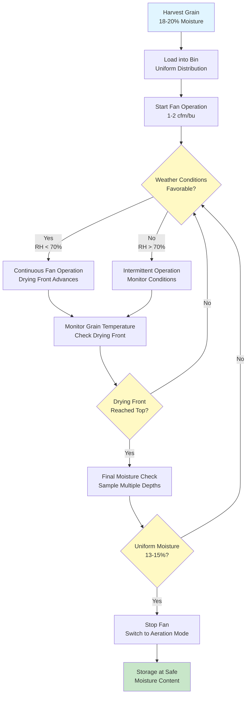

Natural air grain drying uses unheated ambient air to remove moisture from grain stored in bins. This method relies on favorable atmospheric conditions and requires extended drying periods compared to heated-air systems. When harvest moisture content is within 2-3 percentage points of safe storage levels, natural air drying provides the most energy-efficient grain conditioning method available.

## Operating Principles

Natural air drying exploits the vapor pressure difference between grain kernels and ambient air. When atmospheric relative humidity is below the equilibrium relative humidity for the grain at its current moisture content, water vapor transfers from the grain to the air. This process occurs continuously during favorable weather conditions, gradually reducing grain moisture to safe storage levels.

The drying front progresses upward through the grain mass as a distinct zone. Grain below the drying front reaches equilibrium moisture content, while grain above remains at initial harvest moisture. Fan operation must continue until the drying front completely traverses the grain depth, ensuring uniform moisture reduction throughout the bin.

### Equilibrium Moisture Relationship

Grain moisture equilibrates with air based on temperature and relative humidity:

$$M_e = a - b \ln[-(T + c) \ln(RH)]$$

Where:
- $M_e$ = equilibrium moisture content (% wet basis)
- $T$ = air temperature (°C)
- $RH$ = relative humidity (decimal)
- $a, b, c$ = grain-specific constants

For corn: $a = 4.85$, $b = 0.675$, $c = 54.6$

### Drying Potential Index

The cumulative drying potential determines whether ambient conditions support natural air drying:

$$DPI = \sum (EMC_{target} - EMC_{ambient}) \times hours$$

Successful natural air drying requires $DPI \geq 200$ degree-hours during the anticipated drying period. Locations with warm, dry fall weather provide superior natural air drying conditions compared to humid regions.

## Airflow Rate Requirements

Proper airflow ensures complete drying within acceptable timeframes while preventing spoilage in undried grain. The airflow rate directly affects drying time and energy consumption.

### Standard Airflow Specifications

| Grain Type | Minimum Airflow (cfm/bu) | Recommended Airflow (cfm/bu) | Maximum Initial Moisture (%) |
|------------|--------------------------|------------------------------|------------------------------|
| Corn | 0.75 | 1.0-1.5 | 20 |
| Soybeans | 1.00 | 1.25-2.0 | 16 |
| Wheat | 1.00 | 1.25-1.75 | 18 |
| Barley | 1.00 | 1.25-1.75 | 18 |
| Sorghum | 0.75 | 1.0-1.5 | 19 |
| Sunflower | 1.50 | 2.0-2.5 | 12 |

Higher airflow rates reduce drying time but increase fan energy consumption. The economic optimum balances energy costs against grain quality deterioration risks during extended drying periods.

### Airflow Calculation

Total fan capacity required:

$$CFM_{total} = Volume_{grain} \times Density_{bulk} \times Rate_{cfm/bu} \times \frac{1}{60}$$

Where:
- $CFM_{total}$ = required fan capacity (ft³/min)
- $Volume_{grain}$ = grain volume in bin (ft³)
- $Density_{bulk}$ = grain bulk density (lb/ft³)
- $Rate_{cfm/bu}$ = airflow per bushel (cfm/bu)
- Factor converts bushels (56 lb) to appropriate units

## Fan Selection and Static Pressure

Natural air drying fans must overcome static pressure from grain depth and ductwork resistance. Centrifugal or axial fans are selected based on pressure requirements and energy efficiency considerations.

### Static Pressure Estimation

Grain static pressure follows Shedd's equation:

$$SP = k \times D \times (1 + \frac{D}{100})^2 \times (\frac{Q}{100})^{1.8}$$

Where:
- $SP$ = static pressure (inches water column)
- $k$ = grain resistance factor (corn: 0.0026, soybeans: 0.0045, wheat: 0.0052)
- $D$ = grain depth (feet)
- $Q$ = airflow rate (cfm/bu)

Add 0.2-0.5 inches water column for ductwork and floor resistance.

### Fan Power Requirements

Fan motor power needed:

$$HP = \frac{CFM \times SP}{6356 \times \eta_{fan}}$$

Where:
- $HP$ = motor horsepower
- $\eta_{fan}$ = fan efficiency (typically 0.50-0.70 for agricultural fans)
- 6356 = conversion constant

Vaneaxial fans provide higher efficiency at lower static pressures (<4 inches water), while centrifugal fans perform better at higher pressures (>4 inches water).

## Drying Time Estimation

Natural air drying duration depends on initial moisture content, target moisture, grain depth, airflow rate, and cumulative favorable weather hours.

### Empirical Drying Time

For corn with 1.0-1.5 cfm/bu airflow:

$$t_{dry} = \frac{D \times \Delta M \times k_{weather}}{24 \times f_{favorable}}$$

Where:
- $t_{dry}$ = drying time (days)
- $D$ = grain depth (feet)
- $\Delta M$ = moisture points to remove (%)
- $k_{weather}$ = weather factor (1.2-2.0, higher for humid climates)
- $f_{favorable}$ = fraction of time with favorable drying conditions (typically 0.4-0.6)

Typical drying times range from 15-45 days depending on weather conditions and initial moisture content.

## Grain Depth Limitations

Excessive grain depth increases static pressure, extends drying time, and elevates spoilage risk in undried grain above the drying front.

### Maximum Recommended Depths

**For 1.0-1.5 cfm/bu airflow:**
- Corn: 20-22 feet maximum depth
- Soybeans: 18-20 feet maximum depth
- Wheat: 20-24 feet maximum depth
- High moisture (>18%): Reduce depths by 20-30%

Shallower grain depths enable faster drying with lower static pressure, reducing fan energy consumption and spoilage risk. Fill bins in layers if harvest conditions are unfavorable, operating fans between fill cycles to begin drying immediately.

### Drying Front Velocity

The drying front moves upward at approximately:

$$v_{front} = \frac{Q \times 24}{D \times \rho_{bulk} \times (M_i - M_f) \times 0.01}$$

Where:
- $v_{front}$ = drying front velocity (ft/day)
- $\rho_{bulk}$ = bulk density (lb/ft³)
- $M_i$ = initial moisture (%)
- $M_f$ = final moisture (%)

For corn at 18% initial moisture dried to 15% with 1.25 cfm/bu, the drying front advances approximately 1.0-1.5 feet per day under favorable conditions.

## Energy Efficiency Analysis

Natural air drying consumes minimal energy compared to heated-air systems, with total energy costs primarily from fan operation.

### Energy Consumption

Total electrical energy:

$$E_{total} = HP \times 0.746 \times t_{hours}$$

Where:
- $E_{total}$ = energy consumption (kWh)
- $t_{hours}$ = total fan operating hours
- 0.746 = conversion factor (HP to kW)

Typical energy consumption: 0.3-0.8 kWh per bushel dried, compared to 1.5-3.0 kWh/bu for low-temperature heated air systems.

### Operating Cost Comparison

| Drying Method | Energy Use (kWh/bu) | Typical Cost per Bushel* | Drying Time |
|---------------|---------------------|--------------------------|-------------|
| Natural air | 0.3-0.8 | $0.03-0.08 | 15-45 days |
| Low-temp heated air | 1.5-3.0 | $0.15-0.30 | 7-21 days |
| High-temp continuous | 4.0-8.0 | $0.40-0.80 | <24 hours |

*Based on $0.10/kWh electricity, $0.80/therm natural gas

## Advantages and Limitations

**Advantages:**
- Minimal energy consumption reduces operating costs by 70-90% compared to heated-air drying
- Preserves grain quality through low-temperature drying with minimal kernel stress
- Simple system design with low initial capital investment
- Reduced fire hazard without burners or heaters
- Combines drying and storage functions in single bin

**Limitations:**
- Weather-dependent operation requires favorable atmospheric conditions
- Extended drying periods (15-45 days) increase risk exposure
- Limited to grain harvested within 2-3 percentage points of storage moisture
- Geographic constraints restrict applicability to regions with dry fall weather
- Harvest delays often necessary to achieve lower field moisture content
- Fan operation costs accumulate during extended drying periods
- Spoilage risk in undried grain if weather turns unfavorable

## Management Strategies

Successful natural air drying requires active management and weather monitoring:

1. **Harvest at appropriate moisture:** Target 18-20% for corn, 14-16% for soybeans
2. **Fill bins rapidly:** Complete filling within 3-5 days to minimize spoilage risk
3. **Start fans immediately:** Begin operation as soon as grain enters bin
4. **Monitor weather forecasts:** Plan harvest around favorable drying periods
5. **Check drying progress:** Sample grain at multiple depths weekly
6. **Run fans continuously** during favorable conditions (RH <70%)
7. **Install moisture cables:** Automate monitoring of drying front progression
8. **Maintain backup capacity:** Have heated-air capability available for emergency drying if weather deteriorates

Natural air drying remains the most economical grain drying method when harvest moisture content, bin depth, and weather conditions align favorably. Proper system design and management minimize spoilage risks while maximizing energy efficiency advantages.
