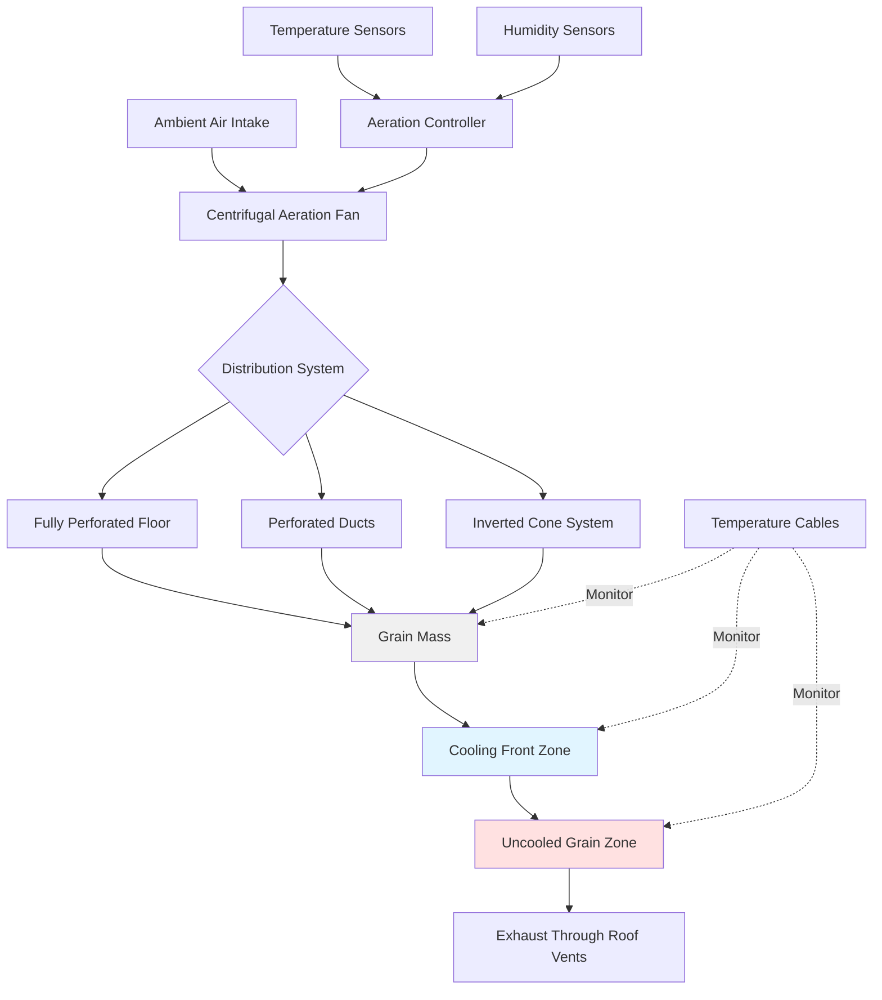

## Aeration System Objectives

Grain storage aeration systems serve critical functions in preserving grain quality during extended storage periods. The primary objectives include:

**Temperature Control**: Cooling grain to temperatures that inhibit insect activity (below 60°F/15.5°C) and slow mold growth. Maintaining uniform temperatures throughout the grain mass prevents localized spoilage.

**Moisture Equalization**: Redistributing moisture within the grain mass to eliminate pockets of high moisture content that promote mold growth and heating. Aeration moves moisture from wetter regions to drier areas, achieving equilibrium throughout the bin.

**Condensation Prevention**: Managing temperature differentials between grain and ambient air to prevent moisture migration and condensation formation on bin walls or within the grain mass.

**Quality Preservation**: Maintaining grain quality parameters including germination viability, test weight, and market grade throughout the storage period.

## Airflow Rate Requirements

Aeration airflow rates differ significantly from drying applications, requiring substantially lower air volumes. Standard aeration rates range from 0.1 to 0.25 cfm/bu (cubic feet per minute per bushel), compared to 5-20 cfm/bu for high-temperature drying.

### Recommended Airflow Rates

| Climate Zone | Airflow Rate (cfm/bu) | Application |
|--------------|----------------------|-------------|
| Northern (< 4000 HDD) | 0.10 - 0.15 | Standard cooling |
| Central (4000-6000 HDD) | 0.15 - 0.20 | Moderate climate |
| Southern (> 6000 HDD) | 0.20 - 0.25 | Warm, humid regions |
| High Moisture Storage | 0.25 - 0.50 | Moisture equalization |

The total airflow requirement for a grain bin is calculated as:

$$Q = V \times \rho \times r$$

where $Q$ is total airflow (cfm), $V$ is grain volume (bu), $\rho$ is grain bulk density correction factor (typically 1.0 for standard fills), and $r$ is the desired aeration rate (cfm/bu).

For a 10,000 bushel bin requiring 0.15 cfm/bu:

$$Q = 10,000 \times 1.0 \times 0.15 = 1,500 \text{ cfm}$$

## Fan and Duct Sizing

Aeration fan selection depends on the required airflow and static pressure the system must overcome. Static pressure in aeration systems is significantly lower than drying systems due to reduced airflow rates.

### Static Pressure Calculation

The static pressure for fully perforated floors follows:

$$P_s = k \times r^{1.8} \times d$$

where $P_s$ is static pressure (inches of water), $k$ is grain resistance constant (species-dependent), $r$ is airflow rate (cfm/bu), and $d$ is grain depth (feet).

For corn with $k = 0.22$ at 0.15 cfm/bu and 20 feet depth:

$$P_s = 0.22 \times (0.15)^{1.8} \times 20 = 0.22 \times 0.052 \times 20 = 0.23 \text{ in. w.g.}$$

### Duct Sizing for Perforated Systems

When using perforated duct systems instead of fully perforated floors, the total duct area should be:

$$A_d = \frac{Q}{v_d}$$

where $A_d$ is total duct area (ft²), $Q$ is airflow (cfm), and $v_d$ is duct velocity (typically 800-1200 fpm for aeration).

Perforations should constitute 8-12% of the total duct surface area to maintain adequate air distribution while preventing grain intrusion.

## Aeration Controller Strategies

Modern aeration controllers optimize fan operation based on ambient conditions and grain temperature monitoring.

**Temperature Differential Controllers**: Activate fans when ambient temperature is 5-10°F below average grain temperature. This prevents adding heat to cooler grain while ensuring adequate cooling differentials.

**Humidity-Compensated Controllers**: Factor in both temperature and relative humidity, calculating equilibrium moisture content (EMC) to prevent moisture addition during high-humidity periods.

**Programmable Controllers**: Allow custom operating schedules, temperature setpoints, and humidity limits. Advanced models incorporate weather forecasts and grain condition trends.

**Multi-Zone Controllers**: Manage multiple bins or fan systems independently, prioritizing bins with highest temperatures or moisture levels.

## Cooling Front Progression

The cooling front represents the boundary between cooled grain near the air inlet and warmer grain above. Understanding cooling front movement is essential for effective aeration management.

### Cooling Front Velocity

The rate of cooling front progression is calculated as:

$$v_c = \frac{r \times 60}{S_h}$$

where $v_c$ is cooling front velocity (ft/day), $r$ is airflow rate (cfm/bu), and $S_h$ is specific heat of grain (approximately 15-20 for most grains at typical moisture levels).

For 0.15 cfm/bu aeration of wheat with $S_h = 18$:

$$v_c = \frac{0.15 \times 60}{18} = 0.5 \text{ ft/day}$$

A 20-foot grain depth requires approximately 40 days of continuous operation to cool completely. Monitoring temperature cables at multiple depths tracks cooling front progression.

## Seasonal Aeration Schedules

Effective aeration follows seasonal strategies aligned with ambient temperature patterns and grain storage objectives.

**Fall Cooling (Harvest to December)**: Aggressive cooling to reduce grain temperature from field temperature to 30-40°F. Operate fans whenever ambient temperature is 5-10°F below grain temperature, targeting 10-15°F temperature reduction per cooling cycle.

**Winter Maintenance (December to March)**: Limited operation in northern climates to maintain uniform cold temperatures. In southern regions, continue cooling during cold fronts to achieve target storage temperatures.

**Spring Warming Prevention (March to May)**: Minimize aeration to prevent warming. Operate only during coolest periods to counteract solar heating and conduction from warming bin surfaces.

**Summer Monitoring (June to August)**: Cease aeration in most climates unless severe heating develops. Monitor grain temperatures closely for hot spots indicating insect activity or mold development.

**Pre-Harvest Conditioning (August to September)**: In extended storage scenarios, consider limited cooling if safe ambient conditions exist and grain will remain in storage through next season.

Aeration fan runtime typically totals 200-400 hours annually depending on climate, initial grain condition, and storage duration. Energy consumption remains modest at 0.02-0.05 kWh/bu for typical storage periods, making aeration highly cost-effective for quality preservation.

Temperature monitoring at minimum 7-10 day intervals allows timely detection of problem areas requiring intervention. Cable-based temperature monitoring systems with 3-5 cables per bin provide adequate coverage for bins over 3,000 bushels capacity.
