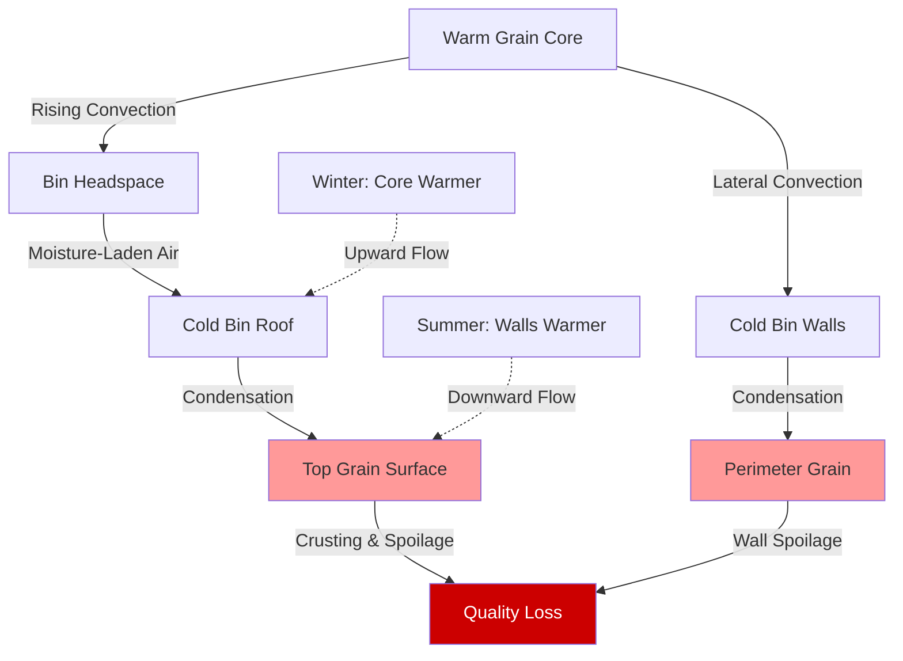

Moisture migration in grain storage bins represents one of the most destructive phenomena affecting stored grain quality. Understanding the thermodynamic mechanisms driving moisture movement enables effective prevention strategies that preserve grain quality and prevent economic losses.

## Convection Current Mechanisms

Convection currents within grain bins develop from temperature differentials between grain masses and ambient air. These currents transport moisture vapor through intergranular air spaces, concentrating it in specific zones.

The driving force for natural convection follows:

$$Q_{conv} = h \cdot A \cdot \Delta T$$

where $Q_{conv}$ is convective heat transfer (Btu/hr), $h$ is the convection coefficient (0.5-2.0 Btu/hr·ft²·°F for grain), $A$ is surface area (ft²), and $\Delta T$ is temperature difference (°F).

Moisture carrying capacity changes with temperature according to:

$$W_{sat} = 0.622 \cdot \frac{P_{sat}}{P_{atm} - P_{sat}}$$

where $W_{sat}$ is saturation humidity ratio (lb water/lb dry air), $P_{sat}$ is saturation vapor pressure at grain temperature, and $P_{atm}$ is atmospheric pressure.

When warm, moisture-laden air contacts cold grain surfaces, condensation occurs as the air temperature drops below its dew point. This fundamental relationship creates moisture accumulation zones that promote spoilage.

## Seasonal Temperature Differentials

Winter conditions create the classic moisture migration scenario. Cold outdoor temperatures cool bin walls and roof surfaces while the grain core retains harvest heat. Air warmed by the grain center rises through convection, carrying moisture vapor. Upon contacting cold surfaces at the bin periphery and top, this moisture condenses.

Temperature differentials of 30-50°F between grain core and bin walls commonly occur during winter in northern climates. These gradients establish powerful convection cells that can transport 0.1-0.3 lb of water per bushel to concentration zones over a storage season.

Summer migration reverses the pattern. Solar heating of bin roofs and walls creates hot zones while grain interior remains cool from spring temperatures. Warm ambient air entering through roof vents or poorly sealed hatches descends along bin walls, cools, and deposits moisture in the upper grain layers.

The rate of moisture migration intensity follows:

$$\dot{m}_{migration} = \rho_{air} \cdot v \cdot A_{flow} \cdot (W_{warm} - W_{cool})$$

where $\dot{m}_{migration}$ is moisture migration rate (lb/hr), $\rho_{air}$ is air density (0.075 lb/ft³), $v$ is convection velocity (5-20 ft/hr in grain), $A_{flow}$ is effective flow area, and $W$ represents humidity ratios at warm and cool locations.

## Moisture Condensation Zones

Condensation concentrates in predictable locations based on convection patterns and surface temperatures. The bin top surface receives the majority of winter moisture migration, with wet grain depths of 6-18 inches common in unmanaged bins. This "top spoilage" zone exhibits moisture contents 4-8 percentage points above the bulk grain.

Bin walls create vertical condensation zones extending 12-24 inches inward from the perimeter. These zones remain active throughout winter, progressively wetting grain in contact with cold metal surfaces.

South-facing walls experience diurnal cycling in moderate climates, with daytime solar heating creating downward convection and nighttime cooling reversing the pattern. This cycling accelerates spoilage development through repeated wetting.

## Roof Ventilation and Headspace Management

Proper roof ventilation prevents moisture accumulation in the headspace while avoiding excessive condensation. Continuous ridge vents sized at 1 square inch per 50 square feet of bin floor area provide passive moisture removal without inducing strong convection currents.

Eave vents must remain closed during cold weather to prevent cold air infiltration that accelerates wall condensation. Opening both ridge and eave vents creates chimney effect that can increase moisture migration rates by 200-400%.

Headspace volume affects condensation patterns. Bins with 18-24 inches of headspace above grain surfaces dilute moisture concentration and reduce direct condensation onto grain. Overfilled bins with less than 6 inches of headspace experience severe top crusting.

Roof insulation provides significant benefits by maintaining roof interior temperatures closer to grain temperatures. Insulation with R-10 to R-19 values reduces condensation rates by 60-80% compared to uninsulated steel roofs.

## Aeration Timing Strategies

Strategic aeration prevents moisture migration by eliminating temperature differentials that drive convection. The fundamental principle: maintain uniform temperature throughout the grain mass.

Fall cooling aeration should reduce grain temperature to 35-40°F before winter. This cooling eliminates the warm core that drives upward convection. Operate aeration fans when ambient temperature is 10-15°F below grain temperature, running continuously until temperature uniformity is achieved.

Aeration airflow rate for migration prevention:

$$CFM = \frac{V_{grain}}{200 \text{ to } 300}$$

where $V_{grain}$ is grain volume (ft³), providing 0.2-0.3 CFM/bu for temperature maintenance.

Spring warming aeration prevents summer migration by raising grain temperature before hot weather. Begin when ambient temperatures consistently exceed 50°F, targeting final grain temperature of 50-60°F to match summer conditions.

Monitor grain temperature with cable systems at multiple depths and radial positions. Temperature differentials exceeding 10°F indicate active convection requiring immediate aeration.

## Seasonal Moisture Migration Risk Assessment

| Season | Primary Risk | Temperature Pattern | Critical Zones | Prevention Priority |
|--------|--------------|---------------------|----------------|---------------------|
| Fall (Harvest) | Initial stratification | Variable, unstable | Core areas | Rapid cooling aeration |
| Early Winter | Top surface condensation | Cold roof, warm core | Upper 12-18 inches | Uniform cooling completion |
| Mid Winter | Wall condensation | Very cold walls | Perimeter grain | Verify sealing, monitor |
| Late Winter | Cycling damage | Diurnal temperature swings | South walls, top | Maintain cold uniformity |
| Spring | Transition condensation | Warming walls, cold core | Upper grain layers | Gradual warming aeration |
| Summer | Reverse migration | Hot roof/walls, cool core | Top surface, walls | Seal against hot air entry |

## Crusting and Spoilage Indicators

Grain crusting signals advanced moisture migration. Surface grain binds together in solid masses ranging from fragile sheets to concrete-hard layers requiring mechanical removal. Moisture contents in crusted areas reach 18-25%, well above safe storage levels of 13-14% for most grains.

Visual indicators include surface grain darkening, grain clumping when probed, and visible mold growth appearing as white, gray, or black patches. Musty odors detected when opening roof hatches indicate active spoilage.

Temperature monitoring reveals spoilage through localized heating. Spoilage zones show temperatures 10-20°F above ambient due to respiration and microbial activity. Temperature increases of 5°F per week indicate rapid deterioration requiring immediate intervention.

Condensate dripping from bin roofs during cold weather definitively confirms active moisture migration. Ice formation on interior roof surfaces during extreme cold demonstrates the moisture load being transported to condensation zones.

Prevention remains far more effective than remediation. Grain with established crusting requires complete removal and drying, often with 20-40% quality loss in affected areas. Systematic attention to temperature uniformity through proper aeration timing eliminates moisture migration and preserves grain quality throughout extended storage periods.