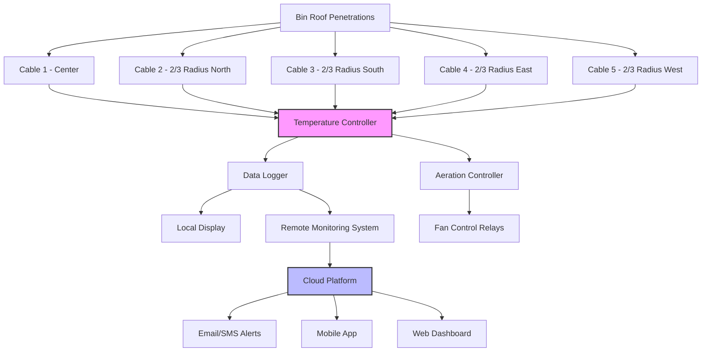

Effective temperature monitoring forms the foundation of successful grain storage management. Temperature sensors provide early warning of deterioration, enabling timely intervention through aeration or grain movement before significant quality loss or spoilage occurs.

## Temperature Cable Types and Placement

Temperature monitoring cables suspend vertically from the bin roof through the grain mass to measure temperature at multiple points. Three primary cable types serve grain storage applications:

**Thermistor cables** provide high accuracy (±0.5°F) with digital output signals. Each thermistor element generates a resistance value proportional to temperature, allowing controllers to interrogate individual sensors along the cable. These cables typically include 6-12 temperature points spaced 4-8 feet vertically.

**Thermocouple cables** use dissimilar metal junctions to generate voltage signals proportional to temperature. While less expensive than thermistor systems, thermocouples offer lower accuracy (±2°F) and require more complex signal processing.

**Distributed temperature sensing (DTS)** cables employ fiber optic technology to measure temperature continuously along the entire cable length. DTS systems provide exceptional spatial resolution but represent the highest initial cost.

Cables should extend to within 2-3 feet of the bin floor, with sensors concentrated in the upper third of the grain mass where temperature problems typically originate. The lowest sensor should remain at least 2 feet above the floor to avoid floor cooling effects that mask grain temperature.

## Sensor Number and Location Requirements

Adequate sensor coverage prevents dangerous gaps in monitoring. The number of cables required depends on bin diameter:

| Bin Diameter | Minimum Cables | Sensor Pattern |
|--------------|----------------|----------------|
| Up to 18 ft | 1 | Center |
| 18-27 ft | 3 | Center + 2/3 radius |
| 27-36 ft | 5 | Center + 4 at 1/2 radius |
| 36-48 ft | 7 | Center + 6 at 2/3 radius |
| 48-60 ft | 9 | Center + 8 at 1/2 and 2/3 radius |
| Over 60 ft | 12+ | Multiple radial positions |

Position cables at consistent radial distances to create monitoring zones. Avoid placing cables against the bin wall where temperature stratification differs from the grain mass interior. For non-circular bins, space cables on a grid pattern with maximum spacing of 15-20 feet between cables.

## Hot Spot Detection and Interpretation

Hot spots indicate active biological activity—insect metabolism, fungal growth, or both. Heat generation in spoiling grain follows:

$$Q = m \cdot r \cdot \Delta H$$

where $Q$ represents heat generation (BTU/hr), $m$ equals grain mass affected (lb), $r$ denotes respiration rate (lb O₂/lb·hr), and $\Delta H$ is the heat of respiration (approximately 7,000 BTU/lb O₂).

Temperature monitoring identifies hot spots through two methods:

**Absolute temperature thresholds** trigger alarms when any sensor exceeds safe storage temperatures. The threshold varies with intended storage duration and grain moisture content.

**Temperature gradients** between adjacent sensors reveal developing problems. A difference exceeding 10°F between sensors 4-6 feet apart indicates active spoilage, even if absolute temperatures remain below alarm thresholds. Hot spots typically develop as follows:

1. Initial temperature rise of 5-10°F above ambient
2. Expansion at 0.5-1.5 feet per day if unchecked
3. Peak temperatures reaching 130-150°F in severe cases
4. Eventual cooling as grain depletes and moisture migrates

## Data Logging and Remote Monitoring

Modern monitoring systems automatically record temperature data at user-defined intervals (typically 1-4 hours). Data loggers store readings locally while transmitting to cloud platforms via cellular or internet connections.

Remote monitoring provides several critical advantages:

- **Continuous surveillance** without physical bin visits
- **Automated alerts** via email, SMS, or mobile app notifications
- **Historical trend analysis** to identify gradual temperature changes
- **Multi-site management** from centralized dashboards
- **Proof of storage conditions** for quality claims or insurance

Data retention should span the entire storage period plus one additional crop year to provide historical comparisons.

## Temperature Trends Indicating Spoilage

Temperature patterns reveal grain condition changes before visible spoilage occurs:

**Rising temperature trend**: Sustained increases of 1-2°F per week indicate active biological processes. Immediate investigation and corrective action are required.

**Temperature divergence**: Previously uniform temperatures separating into distinct zones suggest moisture migration or localized spoilage.

**Inverted temperature profile**: Bottom temperatures exceeding top temperatures (opposite of normal thermal stratification) indicate serious problems, typically from roof leaks concentrating moisture.

**Temperature cycling**: Daily fluctuations exceeding 5°F suggest inadequate weather protection or bin structural issues creating condensation.

## Integration with Aeration Controls

Advanced systems integrate temperature monitoring with aeration fan controls to automate grain cooling. The controller initiates fan operation when:

$$T_{grain} - T_{ambient} \geq \Delta T_{threshold}$$

where typical $\Delta T_{threshold}$ values range from 10-15°F. Controllers calculate average grain temperature from all sensors, excluding outliers that may indicate localized problems requiring separate attention.

Automated aeration provides optimal cooling while minimizing energy consumption and overdrying. The system stops fans when grain temperature approaches ambient or when ambient conditions become unfavorable (high humidity, warm temperature, precipitation).

## Temperature Alarm Thresholds

Temperature limits vary with grain type, moisture content, and intended storage duration:

| Grain Type | Short-term (< 6 mo) | Long-term (> 6 mo) | Critical Alarm |
|------------|---------------------|-------------------|----------------|
| Corn | 60°F | 50°F | 80°F |
| Soybeans | 60°F | 50°F | 80°F |
| Wheat | 65°F | 55°F | 85°F |
| Rice | 65°F | 55°F | 85°F |
| Sorghum | 60°F | 50°F | 80°F |
| Barley | 60°F | 50°F | 80°F |

These thresholds assume grain at safe moisture content (typically 13-15% depending on grain type). Higher moisture grain requires lower temperature thresholds, while drier grain tolerates slightly higher temperatures.

Proper temperature monitoring combined with timely response prevents the majority of grain storage losses. The investment in quality monitoring equipment pays returns through preserved grain quality, reduced shrink, and maintained market value.
