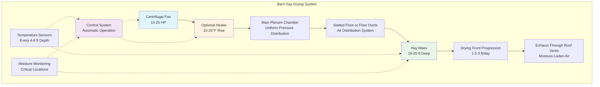

Barn drying systems use forced air to reduce hay moisture content from field-cured levels (25-35% moisture) to safe storage levels (18-20% moisture) while minimizing field weather dependency and preserving nutritional quality. Proper system design ensures uniform airflow distribution, prevents mold growth, and optimizes energy consumption.

## Forced Air Drying System Design

The fundamental objective of barn drying is to move sufficient air volume through the hay mass to remove moisture before spoilage occurs. The required airflow rate depends on hay moisture content, depth, and ambient conditions.

**Airflow requirement calculation:**

$$Q = A \times v \times 60$$

Where:
- $Q$ = airflow rate (CFM)
- $A$ = cross-sectional area perpendicular to airflow (ft²)
- $v$ = air velocity through hay (ft/min)

For hay depths of 16-20 feet, recommended air velocities range from 0.5 to 1.0 ft/min through the hay mass. This translates to specific airflow rates:

$$q = \frac{Q}{V} = 10-25 \text{ CFM/ton}$$

Where $V$ represents the hay volume in tons. Higher moisture content requires airflow rates at the upper end of this range.

## Floor Duct and Slatted Floor Configurations

Two primary distribution systems deliver air to the hay mass:

**Floor Duct Systems:**
- Perforated round or rectangular ducts embedded in the barn floor
- Duct spacing: 8-12 feet for uniform coverage
- Perforation area: 10-15% of duct surface area
- Maximum hay depth above ducts: 20 feet

**Slatted Floor Systems:**
- Wooden slats (2x4 or 2x6) spaced 3/4 to 1 inch apart
- Plenum chamber beneath providing uniform pressure
- Covers entire barn floor area
- Superior uniformity compared to duct systems
- Higher initial cost but better performance

The pressure distribution relationship:

$$\Delta P_{total} = \Delta P_{hay} + \Delta P_{duct} + \Delta P_{losses}$$

## Heated vs Unheated Air Drying Options

**Unheated Air Drying:**
- Relies on ambient air temperature and relative humidity
- Most economical operating cost
- Requires favorable weather conditions
- Drying rate: 2-4% moisture per day
- Limited to late spring through early fall

**Supplemental Heat Drying:**
- Temperature rise: 10-20°F above ambient
- Dramatically increases drying capacity
- Reduces relative humidity of drying air

The relationship between temperature and drying capacity:

$$RH_2 = RH_1 \times \frac{P_{sat,1}}{P_{sat,2}}$$

Where:
- $RH_1$ = initial relative humidity
- $RH_2$ = relative humidity after heating
- $P_{sat}$ = saturation pressure at respective temperatures

A 15°F temperature increase reduces relative humidity by approximately 50%, doubling the moisture-carrying capacity of the air.

## Fan Selection and Static Pressure Requirements

Static pressure through the hay mass increases exponentially with depth and linearly with airflow velocity:

$$SP = k \times d^{1.5} \times v^{1.2}$$

Where:
- $SP$ = static pressure (inches water column)
- $k$ = hay resistance coefficient (0.4-0.6)
- $d$ = hay depth (feet)
- $v$ = air velocity (ft/min)

**Typical Design Parameters:**

| Hay Depth (ft) | Airflow (CFM/ton) | Static Pressure (in. w.c.) | Fan Power (HP/1000 CFM) |
|---------------|-------------------|---------------------------|------------------------|
| 12 | 15 | 1.5-2.0 | 0.5-0.7 |
| 16 | 18 | 2.5-3.5 | 0.8-1.1 |
| 20 | 20 | 4.0-5.5 | 1.2-1.7 |
| 24 | 25 | 6.0-8.0 | 1.8-2.5 |

Fan selection must match the operating point where the system curve intersects the fan performance curve. Axial fans work best for low static pressure applications (under 3 inches w.c.), while centrifugal fans handle higher pressures more efficiently.

## Drying Front Progression Monitoring

The drying front represents the boundary between dried hay above and undried hay below. Monitoring progression ensures complete drying without over-drying upper layers.

**Monitoring methods:**
- Temperature sensors at multiple depths (every 4-6 feet)
- Moisture probes at critical locations
- Visual inspection of hay color and texture
- Electrical resistance measurements

The drying front advances at approximately:

$$v_{front} = \frac{q \times \Delta W}{d \times \rho_{hay}}$$

Where:
- $v_{front}$ = drying front velocity (ft/day)
- $\Delta W$ = moisture removal rate (lb water/lb dry air)
- $\rho_{hay}$ = hay bulk density (lb/ft³)

Typical progression rates range from 1.5 to 3.0 feet per day depending on airflow, temperature, and initial moisture content.

## Energy Efficiency Considerations

Energy consumption represents the largest operating cost for heated barn drying systems:

$$E_{total} = E_{fan} + E_{heat}$$

**Fan Energy:**

$$P_{fan} = \frac{Q \times SP}{6356 \times \eta_{fan} \times \eta_{motor}}$$

Where efficiency values typically range from 0.5-0.7 for fans and 0.85-0.95 for motors.

**Heating Energy:**

$$Q_{heat} = \dot{m}_{air} \times c_p \times \Delta T = 1.08 \times Q \times \Delta T$$

For a 20,000 CFM system with 15°F temperature rise, heating power required equals approximately 324,000 BTU/hr (95 kW).

**Optimization strategies:**
- Operate during favorable ambient conditions (low RH)
- Use minimal temperature rise adequate for drying
- Install variable frequency drives for fan control
- Maximize insulation to reduce heat loss
- Consider heat recovery from exhaust air

**Return on investment calculation:**

$$\text{Payback} = \frac{\text{Initial Cost}}{\text{Annual Savings}}$$

Where annual savings include reduced field losses (10-20% of crop), improved hay quality (15-25% premium), and weather independence value. Typical payback periods range from 3-7 years depending on farm size and hay market conditions.

Proper barn drying system design balances capital investment against operating costs while ensuring consistent hay quality and minimizing weather-related losses. The system must deliver adequate airflow at sufficient static pressure to achieve target drying rates within safe timeframes.
