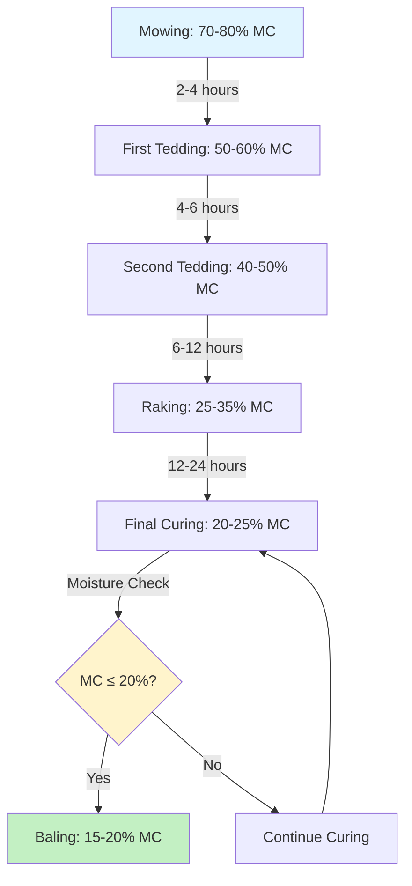

Field curing remains the most economical method for hay drying, relying on solar radiation and wind to reduce moisture content from 70-80% at cutting to 15-20% suitable for baling. Understanding the physical principles governing moisture removal and employing proper field management techniques minimizes dry matter loss while preserving forage quality.

## Natural Drying Process and Stages

The field curing process involves three distinct drying phases, each governed by different heat and mass transfer mechanisms.

**Phase 1: Free Moisture Evaporation (70% to 40% MC)**

Initial moisture removal occurs rapidly as surface water evaporates. The drying rate depends on:

- Solar radiation intensity (W/m²)
- Air temperature and relative humidity
- Wind velocity across the windrow
- Surface area exposure of plant material

The evaporation rate during this phase follows:

$$E = h_m \cdot A \cdot (P_{sat} - P_{air})$$

Where $E$ is evaporation rate (kg/h), $h_m$ is mass transfer coefficient, $A$ is exposed surface area (m²), $P_{sat}$ is saturation vapor pressure at plant surface temperature, and $P_{air}$ is vapor pressure of ambient air.

**Phase 2: Transition Phase (40% to 30% MC)**

As surface moisture depletes, internal moisture must migrate to the plant surface. Drying rate decreases significantly as diffusion through cell walls becomes the limiting factor.

**Phase 3: Bound Moisture Removal (30% to 15% MC)**

Final drying involves removing water bound within cellular structures. This phase requires extended field time and favorable weather conditions. The moisture ratio follows:

$$MR = \frac{M - M_e}{M_0 - M_e}$$

Where $M$ is instantaneous moisture content, $M_e$ is equilibrium moisture content, and $M_0$ is initial moisture content.

## Conditioning Equipment to Accelerate Drying

Mechanical conditioning crushes or crimps plant stems to accelerate internal moisture migration, reducing field curing time by 20-40%.

**Crushing Conditioners**

Steel rollers compress stems between intermeshing surfaces, crushing nodes and creating fissures in the waxy cuticle. Roller gap settings typically range from 3-6 mm depending on crop maturity.

**Crimping Conditioners**

Rubber or urethane rollers crimp stems at regular intervals without excessive crushing. This method causes less mechanical damage to leaves while improving stem drying rates.

Conditioning effectiveness depends on:

- Roller speed differential (typically 10-20%)
- Material throughput rate
- Stem moisture content at conditioning
- Crop species and maturity stage

## Tedding and Raking for Uniform Drying

Tedding fluffs and redistributes cut forage to expose fresh surfaces to air movement and solar radiation.

**Tedding Frequency**

- First tedding: 2-4 hours after mowing when top layer reaches 50-60% MC
- Second tedding: When bottom layer approaches 40-50% MC
- Additional tedding if drying stalls due to weather

Excessive tedding increases leaf shatter losses, particularly in legumes where leaves contain 60-70% of total protein.

**Raking Operations**

Raking consolidates partially dried forage into windrows for final curing and baling. Optimal raking occurs at 25-35% moisture content when stems retain flexibility but leaves have dried sufficiently to resist shattering.

Wide windrows (1.2-1.5 m) promote airflow through the material. Windrow density should allow 30-40% void space for adequate ventilation.

## Weather Dependency and Risk Factors

Field curing success depends entirely on favorable weather conditions. Critical risk factors include:

**Rainfall During Curing**

Precipitation rewets forage, leaching soluble carbohydrates and proteins. Each wetting/drying cycle increases dry matter loss by 5-15%. Rewetted hay requires additional field time, increasing respiration losses and microbial degradation.

**Relative Humidity**

Nighttime relative humidity above 80% halts drying progress and may cause moisture reabsorption. The equilibrium moisture content relationship:

$$EMC = \frac{18.02}{27.3} \cdot \frac{1.8 \cdot 10^{-5} \cdot RH \cdot e^{\frac{8750}{T}}}{1 + 1.8 \cdot 10^{-5} \cdot RH \cdot e^{\frac{8750}{T}}}$$

Where $RH$ is relative humidity (%), and $T$ is temperature (K).

**Wind Conditions**

Inadequate air movement (<2 m/s) extends drying time significantly. Optimal wind speeds range from 3-5 m/s, providing sufficient air exchange without excessive mechanical losses.

## Dry Matter and Nutrient Loss Considerations

Field curing inevitably results in dry matter losses through respiration, leaching, and mechanical handling.

**Respiration Losses**

Plant cells continue metabolic activity post-cutting, consuming 2-6% of dry matter during typical field curing. Respiration rate doubles for each 10°C temperature increase until cellular death occurs.

**Mechanical Losses**

Leaf shattering during tedding, raking, and baling accounts for 3-15% dry matter loss, with highest losses in over-dried legumes. Since leaves contain the majority of protein and digestible nutrients, mechanical losses disproportionately reduce forage quality.

**Nutrient Degradation**

- Crude protein: 5-20% loss depending on field time
- Carotene (Vitamin A precursor): 50-80% loss from UV exposure
- Water-soluble carbohydrates: 10-25% loss, higher with rainfall

## Optimal Timing for Baling After Field Curing

Baling at correct moisture content prevents heating, mold growth, and spontaneous combustion while minimizing field losses.

**Target Moisture Contents**

| Hay Type | Small Square Bales | Large Square Bales | Round Bales |
|----------|-------------------|-------------------|-------------|
| Grass hay | 15-18% | 14-16% | 16-18% |
| Legume hay | 16-18% | 15-17% | 17-20% |
| Mixed hay | 15-18% | 14-17% | 16-19% |

Large packages require lower moisture content due to reduced surface-to-volume ratio and restricted heat dissipation.

**Moisture Testing**

Field moisture determination methods:

- Microwave oven method (accurate to ±2%)
- Electronic moisture meters (rapid, ±3% accuracy)
- Twist test (subjective, experienced operators)

Bale at moisture content 1-2 percentage points below target to account for field variability and moisture migration during storage.

## Comparison of Drying Methods

| Parameter | Field Curing | Barn Drying | Dehydration |
|-----------|--------------|-------------|-------------|
| Energy cost | Minimal | Moderate | High |
| Weather dependency | Complete | None | None |
| Drying time | 1-5 days | 0.5-2 days | Hours |
| DM loss | 15-25% | 5-10% | 2-5% |
| Quality retention | Variable | Good | Excellent |
| Capital investment | Low | Moderate | Very High |
| Operating cost/ton | $5-15 | $20-40 | $60-100 |

Field curing remains the preferred method for most hay producers when weather permits, offering acceptable quality at minimal cost. Understanding moisture dynamics and employing proper field management techniques optimizes this natural drying process while minimizing losses.
