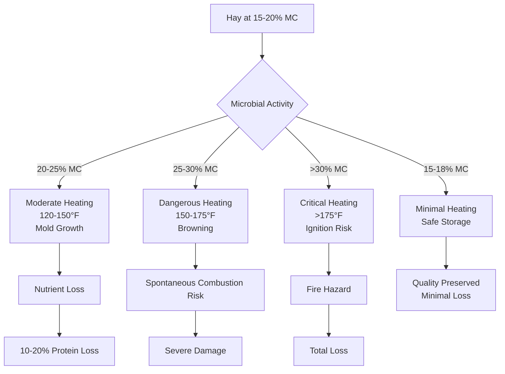

Moisture content represents the most critical parameter in hay preservation and storage safety. The relationship between moisture level and hay stability determines whether stored material remains safe, nutritious feed or becomes a fire hazard and nutritional loss.

## Safe Storage Moisture Levels

Safe storage moisture content varies by hay type and storage method. The target moisture range balances preservation quality against spontaneous heating risk.

| Hay Type | Maximum Safe Moisture | Optimal Range | Storage Method |
|----------|----------------------|---------------|----------------|
| Alfalfa (small bales) | 18% | 15-18% | Conventional barn |
| Alfalfa (large bales) | 16% | 13-16% | Conventional barn |
| Grass hay (small bales) | 20% | 16-20% | Conventional barn |
| Grass hay (large bales) | 18% | 15-18% | Conventional barn |
| Mixed hay (small bales) | 19% | 15-19% | Conventional barn |
| Mixed hay (large bales) | 17% | 14-17% | Conventional barn |
| Hay (wrapped silage) | 50-60% | 50-60% | Anaerobic storage |

Alfalfa requires lower moisture content than grass hay because its higher protein content supports more vigorous microbial activity. Large bales demand lower moisture than small bales due to reduced surface area for heat dissipation and restricted air movement through the denser pack.

## Moisture Measurement Methods

Accurate moisture determination guides harvest timing and storage decisions.

**Mechanical Testers**: Electronic resistance or capacitance meters provide rapid field measurements. Insert probes into multiple bale locations, measuring 6-8 points per bale. Calibrate devices for specific hay types, as electrical properties vary with species and stem-to-leaf ratio.

**Oven Drying Method**: The reference standard weighs a sample, dries it at 135°F (57°C) for 24 hours, then reweighs. Moisture content on wet basis:

$$MC_{wb} = \frac{W_{wet} - W_{dry}}{W_{wet}} \times 100\%$$

where $W_{wet}$ = initial sample weight and $W_{dry}$ = oven-dried weight.

**Microwave Method**: Accelerated drying provides results in 10-15 minutes. Weigh sample, microwave at 50% power in 1-minute intervals, reweigh between cycles until weight stabilizes.

**Temperature Monitoring**: Internal bale temperature indicates moisture-driven heating. Temperatures above 120°F (49°C) signal dangerous conditions requiring immediate action.

## Moisture and Heating Risk Relationship

The relationship between moisture content and spontaneous heating follows predictable patterns driven by microbial respiration and chemical oxidation.

At 15-18% moisture content, aerobic bacteria and fungi cannot sustain significant populations. Respiration heat dissipates faster than generation. Between 20-25% moisture, microbial populations expand, generating heat that elevates internal temperature to 120-150°F (49-66°C). This range produces mold growth, dusty hay, and reduced palatability.

Above 25% moisture, chemical reactions accelerate as temperature rises. The Maillard reaction browns proteins, reducing digestibility. Heat accumulation becomes self-sustaining, potentially reaching ignition temperature around 175-190°F (80-88°C).

## Drying Rate Factors

Hay drying rate depends on environmental conditions and material properties. The drying rate equation:

$$\frac{dM}{dt} = -k \cdot A \cdot (P_{sat} - P_{air})$$

where $\frac{dM}{dt}$ = moisture removal rate, $k$ = drying coefficient, $A$ = surface area, $P_{sat}$ = saturated vapor pressure at hay temperature, and $P_{air}$ = ambient air vapor pressure.

**Temperature**: Increasing air temperature raises vapor pressure difference, accelerating moisture transfer. Each 10°F (5.6°C) temperature increase approximately doubles drying rate within the practical range of 80-120°F (27-49°C).

**Relative Humidity**: Lower ambient humidity increases vapor pressure gradient. Drying effectively stops when ambient humidity exceeds 65-70% regardless of temperature.

**Airflow Rate**: Higher airflow removes moisture-saturated air from hay surfaces. Minimum effective airflow rates range from 2-5 CFM per cubic foot of hay, depending on initial moisture content. The relationship:

$$CFM_{required} = V_{hay} \cdot f \cdot (MC_{initial} - MC_{target})$$

where $V_{hay}$ = hay volume (ft³), $f$ = flow factor (2-5 CFM/ft³), $MC_{initial}$ = starting moisture content (%), and $MC_{target}$ = desired moisture content (%).

**Hay Density**: Compressed bales restrict airflow, reducing drying efficiency. Loose hay in windrows dries faster than baled material due to greater surface exposure and air penetration.

## Equilibrium Moisture Content

Equilibrium moisture content (EMC) represents the moisture level hay reaches when exposed to constant temperature and humidity conditions. Hay neither gains nor loses moisture at EMC.

The relationship follows sorption isotherms specific to hay type and temperature. For grass hay at 68°F (20°C):

$$EMC = \frac{1800}{W} \cdot \frac{K \cdot RH}{1 - K \cdot RH} + \frac{18}{W} \cdot \frac{K \cdot k_1 \cdot K \cdot RH}{1 + k_1 \cdot K \cdot RH}$$

where $W$ = molecular weight of water (18), $K$ and $k_1$ = material constants.

Practical EMC values guide ventilation strategies. At 60% relative humidity and 70°F (21°C), grass hay equilibrates at approximately 14% moisture content. Storage facilities maintaining conditions below the target EMC naturally dry hay to safe levels.

## Quality Preservation Through Moisture Management

Proper moisture management preserves nutritional value, color, and palatability. Hay dried to 15-18% moisture retains 95-98% of field nutrients. Vitamin A (carotene) degrades rapidly above 20% moisture due to oxidation accelerated by heat and mold activity.

Protein digestibility remains highest when drying occurs rapidly to safe moisture levels. Slow drying or rewetting allows enzyme activity that converts protein to less digestible forms. Target drying times of 24-48 hours from cutting to baling minimize respiration losses.

Color retention indicates proper moisture management. Green hay signals rapid drying with minimal heating. Brown hay indicates excessive heating from high moisture content or extended storage above 120°F (49°C). Black hay represents severe heating approaching combustion conditions.

Proper moisture control throughout the drying and storage cycle maintains hay quality, ensures safety, and preserves the investment in harvesting and handling operations.
