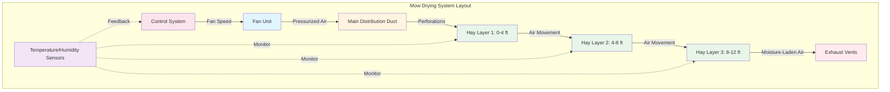

## Mow Drying Principles and Applications

Mow drying represents a controlled approach to hay preservation using forced-air circulation through hay stored in barns or mows. The system moves ambient or heated air through the hay mass to remove excess moisture, reducing baling moisture from 25-35% down to the safe storage level of 15-20%. This active drying process transforms the traditional hay storage structure into a sophisticated dehumidification system.

The fundamental principle involves creating a pressure differential that forces air through the packed hay. Air enters through distribution ducts at the bottom of the mow and exits at the top, carrying water vapor removed from the plant material. The drying front progresses vertically through the hay mass, with the layer nearest the duct drying first and subsequent layers drying as conditioned air passes through them.

Mow drying proves particularly valuable in humid climates or during harvest seasons with unpredictable weather. The system allows farmers to bale hay at higher moisture contents without risking spontaneous combustion or mold growth, extending the harvest window and reducing weather-related losses.

## Air Distribution Duct Design

Proper duct design ensures uniform air distribution across the entire hay mass. The most common configuration uses a perforated main duct running along the floor or slightly elevated, with air entering through holes or slots spaced to provide even coverage.

**Duct sizing requirements:**

The duct cross-sectional area must maintain air velocity below 1,800 ft/min to prevent excessive pressure loss. For a main duct serving a 30-foot wide mow:

$$A_{duct} = \frac{Q}{V_{max}}$$

Where $A_{duct}$ is duct area (ft²), $Q$ is total airflow (CFM), and $V_{max}$ is maximum velocity (1,800 ft/min).

Perforation patterns follow specific guidelines to ensure uniform discharge. The total area of perforations should equal 1.5 to 2 times the main duct cross-sectional area, with openings concentrated toward the duct end to compensate for pressure drop along the length.

**Common duct configurations:**

- **Floor ducts**: Round or rectangular ducts laid on the floor with upward-facing perforations
- **Elevated ducts**: Suspended 12-24 inches above floor level to improve air distribution
- **Lateral branch ducts**: Multiple perpendicular ducts connected to a main plenum
- **Slotted floors**: Full-width perforated floor sections for large installations

Material selection considers durability and airflow characteristics. Galvanized steel provides longevity, while agricultural-grade PVC or polyethylene offers corrosion resistance and ease of installation.

## Fan Sizing and Airflow Requirements

Proper fan selection determines system effectiveness. Required airflow depends on hay depth, moisture content, and desired drying time.

### Airflow Rate Requirements

| Hay Depth (ft) | Airflow Rate (CFM/ton) | Static Pressure (in. w.g.) | Drying Time (days) |
|----------------|------------------------|----------------------------|-------------------|
| 4-6 | 150-200 | 0.5-1.0 | 3-5 |
| 6-8 | 100-150 | 1.0-1.5 | 5-7 |
| 8-10 | 75-125 | 1.5-2.5 | 7-10 |
| 10-12 | 50-100 | 2.5-3.5 | 10-14 |
| 12-16 | 40-75 | 3.5-5.0 | 14-21 |

**Fan horsepower calculation:**

$$HP = \frac{Q \times SP}{6356 \times \eta}$$

Where $HP$ is horsepower, $Q$ is airflow (CFM), $SP$ is static pressure (in. w.g.), and $\eta$ is fan efficiency (typically 0.60-0.75).

For a 12-foot deep mow with 100 tons of hay requiring 100 CFM/ton at 3.0 inches static pressure:

$$HP = \frac{10,000 \times 3.0}{6356 \times 0.70} = 6.8 \text{ HP}$$

Select a 7.5 HP motor to provide adequate capacity with safety margin.

Axial fans suit most mow drying applications due to their ability to move large volumes at moderate pressures. Centrifugal fans handle deeper mows where static pressure exceeds 4 inches water gauge.

## Temperature and Humidity Considerations

Successful mow drying requires managing both air temperature and relative humidity to optimize moisture removal rates without damaging the hay.

**Unheated air drying** relies on ambient conditions and works effectively when air temperature exceeds 50°F with relative humidity below 70%. The air's moisture-carrying capacity increases with temperature following psychrometric relationships. Air at 70°F and 60% RH can absorb significantly more moisture than cooler, more humid air.

**Supplemental heating** accelerates drying when ambient conditions prove marginal. Raising air temperature by 10-15°F typically halves drying time. The temperature rise should not exceed 20°F above ambient to prevent excessive energy costs and potential hay damage from over-drying or heat stress.

**Critical temperature limits:**

- Hay temperature should remain below 120°F to preserve protein and carotene content
- Air temperatures above 140°F risk damaging leaf material and reducing palatability
- Monitor hay temperature during initial drying when respiration heat adds to system heat

Relative humidity in exhaust air indicates drying progress. Initially, exhaust humidity approaches saturation (95-100% RH) as moisture freely evaporates from hay surfaces. As drying progresses, exhaust humidity decreases, signaling completion when it approaches ambient levels.

## Advantages Over Field Drying

Mow drying provides substantial benefits compared to traditional field-curing methods:

**Weather independence** eliminates the primary variable in hay quality. Farmers can bale during brief weather windows and complete drying under controlled conditions, reducing losses from rain damage, leaf shatter, and extended field exposure.

**Extended harvest season** allows earlier cutting when nutrient levels peak. First-cut alfalfa harvested at early bloom stage contains maximum protein and TDN (Total Digestible Nutrients) but requires longer field drying. Mow systems enable harvest at optimal maturity regardless of weather forecasts.

**Reduced field losses** from mechanical handling. Each field operation causes 2-5% dry matter loss through leaf shatter. Mow drying reduces field time from 3-5 days to same-day baling, eliminating multiple tedding and raking operations.

**Labor efficiency** concentrates harvesting into shorter periods, allowing better equipment utilization and workforce scheduling. Baling can continue into evening hours since immediate complete drying is not required.

**Land management** benefits from reduced soil compaction and faster field turnover for subsequent crops or grazing.

## Quality Retention and Nutrient Preservation

Mow drying preserves hay quality through multiple mechanisms that protect nutritional value and physical characteristics.

**Reduced respiration losses** occur because baling at higher moisture contents shortens field curing time when plant respiration remains active. Each day of field drying consumes 2-4% of carbohydrates through continued cellular respiration. Rapid artificial drying minimizes these losses.

**Protein preservation** results from reduced exposure to UV radiation and rain leaching. Soluble proteins wash from plant tissues during rain events, with losses reaching 10-15% per wetting cycle. Mow drying eliminates this pathway.

**Carotene retention** (precursor to Vitamin A) improves dramatically. Carotene degrades rapidly under UV exposure and oxidation. Hay dried in-barn retains 50-80% of original carotene compared to 20-40% for extensively field-cured hay.

**Color and palatability** remain superior. Bright green color indicates preserved nutrients and increases animal acceptance. Field-bleached hay loses visual appeal and may be rejected by livestock even when nutritionally adequate.

**Mold prevention** results from controlled drying to safe moisture levels. Field-dried hay often contains pockets of excess moisture that promote mold growth during storage, potentially producing mycotoxins harmful to livestock.

The investment in mow drying systems typically returns 15-25% higher feed value through improved quality, with payback periods of 3-5 years for commercial operations. The combination of weather protection, quality preservation, and operational flexibility makes mow drying an essential tool for modern hay production in regions where field conditions limit consistent high-quality hay production.
