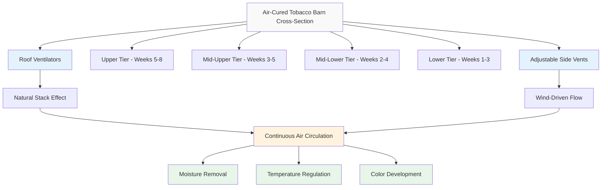

## Air-Cured Tobacco Barn Systems

Air-curing represents the oldest and most natural method of tobacco processing, relying entirely on controlled natural ventilation to reduce leaf moisture content from 80-90% to 15-20% over an extended period. This process develops the characteristic color, aroma, and chemical composition required for burley and cigar tobacco varieties.

## Natural Ventilation Barn Design Principles

Air-cured tobacco barns employ passive ventilation strategies that leverage natural buoyancy forces and wind-driven flow patterns to create controlled air movement through suspended tobacco leaves.

**Structural Configuration**

Traditional air-curing barns feature vertical slatted walls with adjustable openings that permit airflow regulation. The barn height typically ranges from 20 to 40 feet, providing multiple tiers (4-8 levels) for hanging tobacco sticks. The tier spacing of 3.5 to 4 feet allows adequate air circulation around each leaf surface.

The ventilation opening area must be calculated based on barn volume and local climate conditions:

$$A_v = \frac{V_b \times N}{3600 \times v_a}$$

where $A_v$ is the required ventilation opening area (ft²), $V_b$ is the barn volume (ft³), $N$ is the desired air changes per hour (typically 0.5-2 ACH), $v_a$ is the average air velocity through openings (ft/s).

**Stack Effect Utilization**

The natural stack effect provides the primary driving force for air movement. The buoyancy-induced airflow rate can be estimated by:

$$Q = C_d A \sqrt{2gh\frac{\Delta T}{T_o}}$$

where $Q$ is the volumetric flow rate (ft³/s), $C_d$ is the discharge coefficient (0.6-0.65 for barn openings), $A$ is the opening area (ft²), $g$ is gravitational acceleration (32.2 ft/s²), $h$ is the vertical distance between inlet and outlet (ft), $\Delta T$ is the temperature difference between inside and outside (°F), $T_o$ is the outside absolute temperature (°R).

## Curing Duration and Phases

Air-curing typically requires 4 to 8 weeks, depending on initial leaf moisture content, ambient conditions, and tobacco type. The process proceeds through distinct physiological phases that demand specific ventilation management.

| Curing Stage | Duration | Target RH | Ventilation Rate | Color Change | Critical Parameters |
|--------------|----------|-----------|------------------|--------------|---------------------|
| Yellowing | 3-7 days | 80-85% | Minimal (0.5 ACH) | Green → Yellow | Maintain high humidity |
| Color Fixation | 7-14 days | 70-75% | Low (0.75 ACH) | Yellow → Tan/Brown | Gradual moisture reduction |
| Drying - Leaf | 14-21 days | 60-65% | Moderate (1.0-1.5 ACH) | Brown development | Uniform moisture loss |
| Drying - Stem | 14-28 days | 55-60% | Higher (1.5-2.0 ACH) | Brown fixed | Complete stem drying |
| Conditioning | 3-7 days | 65-70% | Reduced (0.5-1.0 ACH) | Stable brown | Equilibration |

## Ventilation Management During Curing Phases

**Initial Phase (Days 1-7)**

During yellowing, ventilation openings remain nearly closed to maintain high relative humidity (80-85%). This prevents excessive drying that would arrest chlorophyll breakdown and enzymatic activity essential for color development. Opening adjustments occur only during periods of high ambient humidity or precipitation threats.

**Intermediate Phase (Days 8-28)**

Gradual opening of ventilation ports allows controlled moisture removal. The barn operator adjusts side vents and roof openings based on ambient conditions, targeting a drying rate of 2-3% moisture loss per day. Excessive ventilation during this phase causes case hardening—a condition where leaf surfaces dry while interior tissues retain moisture.

**Final Phase (Days 29-56)**

Maximum ventilation accelerates stem drying, the rate-limiting step in air-curing. Complete stem desiccation is essential for mold prevention during storage. The moisture gradient between leaf lamina and stem drives continued drying:

$$\frac{dM}{dt} = k(M_s - M_e)$$

where $\frac{dM}{dt}$ is the drying rate, $k$ is the drying constant (influenced by ventilation rate), $M_s$ is the stem moisture content, $M_e$ is the equilibrium moisture content.

## Color Development Requirements

Air-cured tobacco quality depends critically on controlled color transition. Proper color development requires:

- **Slow initial drying**: Maintains enzymatic activity for 7-10 days
- **Temperature moderation**: Ambient temperatures of 60-90°F optimize chemical reactions
- **Humidity control**: Prevents excessive drying that arrests color change
- **Light exclusion**: Dark barn interiors prevent chlorophyll retention

The desired brown color results from oxidation of polyphenols and carotenoid degradation, processes that require 3-4 weeks under controlled conditions.

## Moisture Monitoring During Cure

Accurate moisture assessment guides ventilation decisions throughout the curing cycle. Operators monitor:

**Leaf Moisture Content**

Physical inspection provides qualitative assessment—properly cured leaves exhibit crisp texture with slight pliability. Quantitative measurement requires sampling and oven-drying to constant weight:

$$MC = \frac{W_w - W_d}{W_d} \times 100\%$$

where $MC$ is moisture content (%), $W_w$ is wet weight, $W_d$ is dry weight.

**Ambient Conditions**

Daily monitoring of temperature and relative humidity informs ventilation adjustments. A psychrometric analysis determines the moisture removal capacity of ambient air.

## Burley and Cigar Tobacco Specific Requirements

**Burley Tobacco**

Burley varieties demand 6-8 weeks curing time with careful ventilation control. The light air-cured leaf requires uniform brown color without green remnants. Barn loading density must not exceed 600-800 pounds per 1,000 ft³ to ensure adequate air circulation. Burley's lower sugar content (1-2%) makes it more susceptible to mold during slow drying phases.

**Cigar Tobacco**

Cigar wrapper, binder, and filler tobaccos require 4-6 weeks air-curing with emphasis on color uniformity. Wrapper tobacco demands the most careful treatment—any color variation or physical damage significantly reduces value. Barn densities remain lower (400-600 lb/1,000 ft³) to prevent leaf contact and mechanical damage. Cigar tobacco often undergoes additional fermentation after air-curing.

**Ventilation Adjustments**

Burley tobacco benefits from slightly higher ventilation rates during the stem drying phase due to thicker stem structure. Cigar wrapper tobacco requires more conservative ventilation to preserve delicate leaf integrity and prevent tearing.

## Operational Considerations

Successful air-curing depends on operator experience in reading environmental conditions and tobacco response. Modern operations supplement traditional methods with electronic sensors monitoring temperature, humidity, and moisture levels at multiple barn locations. This data-driven approach improves consistency while respecting the fundamental reliance on natural ventilation principles that have defined air-curing for centuries.

Proper barn maintenance—including structural integrity, vent operability, and exclusion of precipitation—remains essential for producing high-quality air-cured tobacco meeting market specifications.
