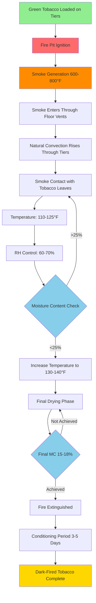

Dark-fired tobacco curing represents one of the oldest and most distinctive tobacco processing methods, utilizing controlled smoke exposure and elevated temperatures to develop characteristic flavor profiles. This process requires specialized barn designs and careful management of fire, smoke, and environmental conditions over extended curing periods.

## Fire Curing Process and Smoke Exposure

The dark-fired curing process combines heat, smoke, and time to transform green tobacco into a finished product with distinctive aromatic and flavor characteristics.

**Curing Phases:**

1. **Yellowing phase (3-5 days):** Initial moisture reduction at 90-100°F with minimal smoke exposure
2. **Color fixing (5-7 days):** Gradual temperature increase to 100-110°F with light smoke introduction
3. **Main firing (20-30 days):** Sustained temperatures of 110-125°F with continuous smoke exposure
4. **Final drying (5-10 days):** Temperature elevation to 130-140°F to complete moisture removal

The smoke generation system must provide consistent, low-temperature smoke from hardwood fires maintained in earthen pits or dedicated fireboxes located along the barn perimeter. Optimal smoke production occurs at wood combustion temperatures between 600-800°F, which generates smoke without excessive tar deposition on tobacco leaves.

**Smoke Exposure Requirements:**

Total smoke exposure duration: 480-720 hours (20-30 days) of continuous or intermittent smoke application. The smoke imparts color transformation from yellow-brown to dark brown or black, depending on variety and market requirements.

## Temperature and Humidity Control During Firing

Maintaining stable temperature and humidity conditions presents the primary control challenge in dark-fired tobacco curing.

**Temperature Control:**

The heat load requirement for a typical 24' × 24' barn housing 3,000-4,000 lbs of green tobacco is:

$$Q_{total} = Q_{evap} + Q_{air} + Q_{structure}$$

Where evaporation load dominates:

$$Q_{evap} = \frac{m_{water} \times h_{fg}}{\Delta t}$$

For removing 2,400 lbs of water over 40 days:

$$Q_{evap} = \frac{2400 \text{ lb} \times 1,060 \text{ Btu/lb}}{40 \text{ days} \times 24 \text{ hr/day}} = 2,650 \text{ Btu/hr}$$

**Humidity Management:**

Relative humidity must be controlled within specific ranges throughout the curing cycle:

- Yellowing phase: 80-85% RH maintains leaf turgidity
- Color fixing: 70-75% RH allows controlled drying
- Main firing: 60-70% RH balances moisture removal with smoke absorption
- Final drying: 50-60% RH completes case hardening

Humidity control is achieved through ventilation management rather than mechanical dehumidification, as smoke circulation requirements dictate substantial air movement.

## Ventilation Management for Smoke Distribution

Effective smoke distribution ensures uniform curing throughout the barn volume while preventing excessive tar accumulation.

**Natural Ventilation Design:**

- Lower intake vents: 4-6 ft² per 1,000 ft³ barn volume
- Upper exhaust vents: 6-8 ft² per 1,000 ft³ barn volume
- Adjustable dampers on all openings for airflow control

**Smoke Circulation Pattern:**

Smoke enters through floor-level openings near fire pits, rises through tobacco-laden tiers by natural convection, and exits through ridge vents. The temperature differential between smoke inlet (125°F) and barn interior (110-115°F) drives circulation at approximately 1-2 air changes per hour during active firing.

**Ventilation Rate Calculation:**

$$ACH = \frac{Q_{smoke}}{V_{barn}} = \frac{A_{vent} \times v_{air} \times 60}{V_{barn}}$$

For effective smoke distribution:

$$v_{air} = \sqrt{2 \times g \times H \times \frac{\Delta T}{T_{avg}}}$$

Where $H$ is the barn height and $\Delta T$ is the temperature differential.

## Curing Barn Design for Dark-Fired Tobacco

Dark-fired tobacco barns incorporate specific design features to accommodate fire management and smoke circulation.

**Structural Configuration:**

| Component | Specification | Purpose |
|-----------|--------------|---------|
| Floor plan | 20' × 20' to 30' × 30' | Accommodates fire pits and tobacco capacity |
| Height | 16-20 ft to peak | Provides smoke stratification and tier spacing |
| Tier levels | 4-6 horizontal tiers | Maximizes capacity while maintaining access |
| Tier spacing | 3.5-4.0 ft vertical | Allows smoke circulation and uniform exposure |
| Wall construction | Vertical board siding | Provides adjustable ventilation through gaps |
| Fire pits | 2-4 earthen or masonry pits | Positioned along opposing walls for distribution |

**Material Considerations:**

- Fire-resistant foundation and lower walls (masonry or concrete to 3 ft height)
- Wooden upper structure treated with fire retardant coatings
- Metal or tile roofing to prevent ignition from sparks
- Concrete or earthen floor for fire pit containment

## Safety Considerations for Open Fire Curing

Fire curing operations present significant safety hazards requiring rigorous management protocols.

**Fire Safety Measures:**

1. **Fire pit containment:** Masonry or earthen pits minimum 12 inches deep with 18-inch clearance from combustible materials
2. **Ember screens:** Wire mesh barriers prevent ember escape from fire pits
3. **Fire extinguishing equipment:** Class A extinguishers and water supply accessible at all barn entrances
4. **Clearance zones:** 25 ft minimum cleared perimeter around barn structures
5. **Monitoring requirements:** Attended fire tending every 2-4 hours during active firing

**Personnel Safety:**

- Carbon monoxide detection and monitoring (maintain <35 ppm in occupied areas)
- Respiratory protection for workers entering smoke-filled barns
- Heat stress prevention during summer curing operations
- Proper lifting techniques for tobacco handling (50-60 lb hands)

## Quality Factors Affected by Curing Process

The dark-fired curing process directly influences multiple quality parameters that determine market value and end-use suitability.

**Physical Quality Attributes:**

- **Color uniformity:** Consistent dark brown to black coloration throughout leaf
- **Body and texture:** Firm, resilient leaves with appropriate oil content
- **Stem integrity:** Properly dried stems without brittleness or excess moisture

**Chemical Composition Changes:**

- Nicotine content: Typically 2.5-4.5% (higher than air-cured varieties)
- Sugar reduction: Starches convert to sugars then metabolize during extended curing
- Polyphenol oxidation: Creates characteristic dark color and astringent flavor

**Flavor Development:**

Smoke exposure imparts distinctive smoky, creosote-like aromas from phenolic compounds in hardwood smoke. Temperature and humidity control during firing affect:

- Intensity of smoke flavor absorption
- Development of aged, fermented characteristics
- Balance between smokiness and natural tobacco flavor

Optimal curing achieves a final moisture content of 15-18%, uniform dark coloration, and the characteristic smoky aroma profile demanded by manufacturers of chewing tobacco, snuff, and specialty smoking products.

## Comparison of Tobacco Curing Methods

| Parameter | Dark-Fired | Air-Cured | Flue-Cured | Dark Air-Cured |
|-----------|------------|-----------|------------|----------------|
| **Duration** | 40-60 days | 45-60 days | 5-8 days | 30-45 days |
| **Temperature** | 110-140°F | Ambient | 120-180°F | Ambient |
| **Smoke Exposure** | Continuous | None | None | None |
| **Humidity Control** | Ventilation | Natural | Controlled | Natural |
| **Energy Source** | Hardwood fires | None | Gas/oil furnaces | None |
| **Final Color** | Dark brown/black | Light brown | Yellow/orange | Dark brown |
| **Nicotine Content** | 2.5-4.5% | 1.5-3.5% | 1.0-2.5% | 2.0-4.0% |
| **Primary Use** | Chewing tobacco, snuff | Cigars, chewing | Cigarettes | Cigars, pipe |
| **Labor Intensity** | Very high | Moderate | High | Moderate |
| **Fire Risk** | High | Low | Moderate | Low |

This comparison highlights the unique position of dark-fired curing as the most labor-intensive and highest-risk method, justified by the distinctive product characteristics it produces for specialized market segments.
