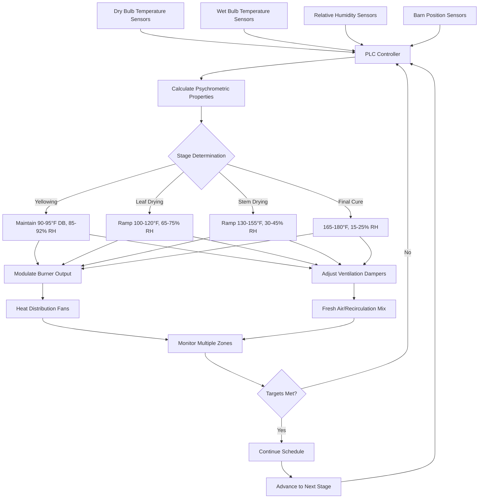

Temperature and humidity control represents the most critical aspect of tobacco curing operations, directly determining leaf quality, color development, chemical composition, and market value. Proper control requires precise understanding of psychrometric relationships and implementation of sophisticated automation systems.

## Curing Stage Temperature and Humidity Requirements

The curing process follows a precise schedule with distinct temperature and humidity targets for each stage:

| Curing Stage | Duration | Dry Bulb Temp (°F) | Wet Bulb Temp (°F) | Relative Humidity (%) | Wet Bulb Depression (°F) |
|--------------|----------|--------------------|--------------------|----------------------|--------------------------|
| Yellowing | 36-48 hrs | 90-95 | 88-92 | 85-92 | 2-3 |
| Leaf Drying | 24-36 hrs | 100-120 | 92-98 | 65-75 | 8-22 |
| Stem Drying | 24-48 hrs | 130-155 | 98-105 | 30-45 | 32-50 |
| Final Cure | 12-24 hrs | 165-180 | 100-110 | 15-25 | 65-70 |

## Psychrometric Relationships

The relationship between dry bulb temperature, wet bulb temperature, and relative humidity governs moisture removal rates. The wet bulb depression (difference between dry and wet bulb temperatures) indicates the drying potential:

$$\Delta T_{wb} = T_{db} - T_{wb}$$

where $\Delta T_{wb}$ is wet bulb depression, $T_{db}$ is dry bulb temperature, and $T_{wb}$ is wet bulb temperature.

The moisture removal rate from tobacco leaves follows:

$$\dot{m}_w = h_m A_s (W_s - W_a)$$

where $\dot{m}_w$ is moisture evaporation rate, $h_m$ is mass transfer coefficient, $A_s$ is leaf surface area, $W_s$ is humidity ratio at leaf surface, and $W_a$ is humidity ratio of air.

The specific humidity relationship:

$$W = 0.622 \frac{P_v}{P_{atm} - P_v}$$

where $W$ is humidity ratio (lb water/lb dry air), $P_v$ is partial pressure of water vapor, and $P_{atm}$ is atmospheric pressure.

## Temperature Control Requirements

### Yellowing Stage Precision

During yellowing, temperature must remain within ±2°F of setpoint. Higher temperatures (>98°F) cause premature drying before chlorophyll degradation completes, resulting in green tobacco. Lower temperatures (<88°F) slow enzymatic activity, extending cure time and increasing fuel costs.

The yellowing process requires maintaining high relative humidity (85-92%) to prevent leaf drying while allowing metabolic processes to convert starches to sugars and degrade chlorophyll. Temperature control accuracy of ±1°F optimizes these biochemical reactions.

### Leaf Drying Temperature Ramping

Temperature increases from 100°F to 120°F must occur gradually at 2-3°F per hour. Rapid temperature increases create case hardening—dried leaf surfaces that trap internal moisture, causing spoilage during storage.

The controlled temperature ramp allows moisture migration from leaf interior to surface at rates matching evaporation capacity:

$$\frac{dT}{dt} \leq k \cdot f(W_{leaf})$$

where $\frac{dT}{dt}$ is temperature ramp rate, $k$ is empirical constant (2-3°F/hr), and $f(W_{leaf})$ is function of leaf moisture content.

### Stem Drying High Temperature Control

Stem drying requires temperatures from 130-155°F with careful monitoring. Exceeding 160°F causes chemical degradation—scorching reduces quality and market value significantly. Temperature uniformity within ±3°F throughout the barn ensures consistent curing across all tobacco.

## Humidity Control Strategies

### Ventilation Management

Humidity control relies on precise ventilation air mixing. Fresh air intake reduces barn humidity during high-moisture stages, while recirculation maintains humidity during yellowing:

$$\dot{m}_{OA} = \dot{m}_{total} \cdot X_{OA}$$

where $\dot{m}_{OA}$ is outside air mass flow, $\dot{m}_{total}$ is total airflow, and $X_{OA}$ is outside air fraction (0-100%).

During yellowing: $X_{OA}$ = 10-20%
During leaf drying: $X_{OA}$ = 40-60%
During stem drying: $X_{OA}$ = 70-90%

### Wet Bulb Depression Control

Maintaining proper wet bulb depression ensures optimal drying rates. Insufficient depression (<2°F during yellowing) prevents moisture removal. Excessive depression (>4°F during yellowing) causes rapid drying and green tobacco.

Controllers modulate ventilation dampers to maintain target wet bulb depression by adjusting outside air fraction based on continuous psychrometric measurements.

## Automated Control Systems

### Sensor Placement and Accuracy

Temperature sensors must achieve ±0.5°F accuracy with placement at multiple vertical levels (bottom, middle, top) and horizontal positions. Wet bulb sensors require continuous water supply to wicking material and protection from direct heat radiation.

Relative humidity sensors (capacitive or resistive) provide backup measurements with ±2% RH accuracy. Redundant sensors in critical locations prevent curing failures from sensor malfunction.

### PLC Control Algorithms

Modern systems employ proportional-integral-derivative (PID) control:

$$u(t) = K_p e(t) + K_i \int_0^t e(\tau)d\tau + K_d \frac{de(t)}{dt}$$

where $u(t)$ is control output, $e(t)$ is error from setpoint, $K_p$ is proportional gain, $K_i$ is integral gain, and $K_d$ is derivative gain.

Separate PID loops control burner firing rate (temperature) and ventilation damper position (humidity), with cross-limiting to prevent conflicting actions.

## Quality Impacts of Improper Control

### Temperature Deviations

**High Temperature During Yellowing:** Produces green tobacco—leaves dry before chlorophyll degrades, reducing value by 30-50%.

**Low Temperature During Stem Drying:** Incomplete moisture removal causes stem rot during storage, total crop loss.

**Temperature Spikes >180°F:** Scorching creates brown, brittle leaves with harsh smoke characteristics.

### Humidity Control Failures

**Excessive Humidity (>95% RH):** House burn—bacterial growth during extended yellowing destroys entire barn.

**Insufficient Humidity During Yellowing:** Case hardening traps moisture, causing mold and bacterial spoilage.

**Rapid Humidity Reduction:** Leaf shattering—brittle, broken leaves reduce grading quality.

## Ventilation for Humidity Adjustment

Ventilation rates must match moisture evolution from tobacco. Peak moisture removal occurs during leaf drying stage, requiring maximum fresh air intake:

$$\dot{V}_{req} = \frac{\dot{m}_{water}}{\rho_{air}(W_{exhaust} - W_{intake})}$$

where $\dot{V}_{req}$ is required ventilation rate (CFM), $\dot{m}_{water}$ is moisture removal rate (lb/hr), $\rho_{air}$ is air density, $W_{exhaust}$ is exhaust humidity ratio, and $W_{intake}$ is intake humidity ratio.

Typical barns require 8,000-12,000 CFM capacity with variable speed fans responding to real-time humidity measurements. Insufficient ventilation creates excessive barn humidity, while excessive ventilation wastes heat energy and extends cure time.

Proper temperature and humidity control transforms a biological process into a predictable, repeatable manufacturing operation, maximizing tobacco quality and economic return
