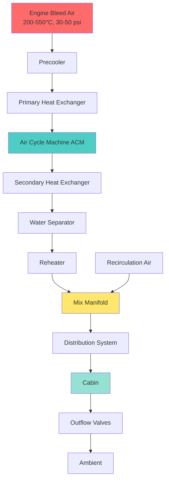
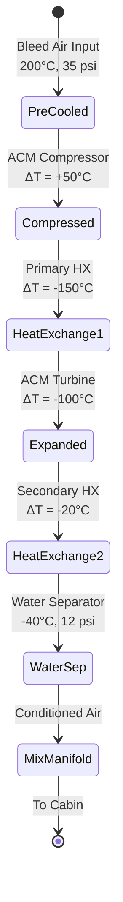

# Aircraft Environmental Control Systems

Aircraft Environmental Control Systems (ECS) provide critical life support functions for passengers and crew while operating in extreme atmospheric conditions. These systems maintain cabin pressure, temperature, humidity, and air quality from sea level to cruise altitudes exceeding 40,000 feet where ambient temperatures reach -56°C and atmospheric pressure drops to 0.2 atmospheres.

## ECS System Architecture

Modern aircraft ECS integrate multiple subsystems to deliver conditioned air under varying flight conditions. The primary architecture depends on aircraft size, mission profile, and powerplant configuration.

## Bleed Air Systems

Bleed air extraction from engine compressor stages provides the primary air source for ECS. High-pressure, high-temperature air (200-550°C at 30-50 psi) requires careful conditioning before distribution.

**Bleed Air Sources:**

- **Low-Stage Bleed:** 5th-9th compressor stage, lower temperature and pressure
- **High-Stage Bleed:** 10th-14th stage, higher energy content
- **APU Bleed:** Ground operations and emergency backup

The bleed air system architecture balances engine performance impact against ECS requirements. Each 1% bleed air extraction reduces engine thrust by approximately 1-1.5%, creating optimization challenges during critical flight phases.

## Air Cycle Machine Operation

The Air Cycle Machine (ACM) forms the core refrigeration component in most commercial aircraft ECS. Unlike vapor-compression systems, ACMs use thermodynamic expansion for cooling without refrigerants.

### Three-Wheel Bootstrap Cycle

The industry-standard bootstrap air cycle incorporates three turbomachines on a common shaft:

1. **Compressor:** Increases bleed air pressure before heat exchange
2. **Turbine:** Expands air to produce cooling and shaft power
3. **Fan:** Drives ram air through heat exchangers

**Thermodynamic Process:**

The bootstrap cycle achieves temperatures as low as -40°C through staged heat rejection and expansion. Air entering the ACM compressor at 200°C undergoes compression (pressure ratio 1.5-2.0), heat exchange with ram air, expansion through the turbine (pressure ratio 2.5-3.5), and secondary heat exchange before water separation.

## Cabin Pressurization Control

Pressurization systems maintain cabin altitude between 6,000-8,000 feet during cruise flight at 35,000-43,000 feet. This requires continuous pressure differential management across the fuselage structure.

**Key Parameters:**

| Parameter | Typical Value | Design Limit |
|-----------|---------------|--------------|
| Cabin Altitude | 6,000-8,000 ft | 8,000 ft max |
| Pressure Differential | 8.5-9.1 psi | 9.4 psi max |
| Climb Rate | 300-500 fpm | 500 fpm max |
| Descent Rate | 300-500 fpm | 300 fpm max |

Pressurization control systems modulate outflow valves to maintain scheduled cabin altitude throughout flight. Digital controllers adjust valve position based on aircraft altitude, climb/descent rate, and selected landing elevation.

## Temperature Control Systems

Zonal temperature control provides passenger comfort across multiple cabin regions. Commercial aircraft typically divide the cabin into 2-4 temperature zones with individual trim air control.

**Temperature Control Method:**

Cold air from the ACM (approximately 2°C) mixes with hot bleed air bypass through electrically-controlled trim air valves. This mixing achieves zone temperatures between 18-30°C with ±1°C control accuracy.

**Heat Load Components:**

- Solar radiation: 50-150 W/m² depending on sun angle and window area
- Metabolic heat: 75-100 W per passenger
- Equipment heat: 25-50 W per passenger (galley, IFE, lighting)
- Infiltration: 0.1-0.3 ACH through door seals and pressurization outflow

## Humidity and Air Quality Management

Aircraft cabin humidity naturally remains low (5-15% RH) due to the moisture-free air supplied from the ECS. Water vapor from passengers and galleys provides the only humidity source.

**Ventilation Requirements per SAE ARP1270:**

- Fresh air: 10 CFM per occupant minimum
- Total air: 15-20 CFM per occupant
- Recirculation ratio: 50% typical (varies by aircraft)
- HEPA filtration: 99.97% efficiency at 0.3 μm for recirculated air

## SAE Aerospace Recommended Practices

Aircraft ECS design follows SAE Aerospace Recommended Practices (ARP) for standardization:

- **SAE ARP85:** Air conditioning systems for subsonic airplanes
- **SAE ARP1270:** Aircraft cabin air quality
- **SAE ARP4418:** Thermal management systems
- **SAE ARP4754:** Development of civil aircraft systems

These standards establish environmental limits, testing procedures, and safety requirements for certification under FAA Part 25 or EASA CS-25 regulations.

## System Reliability and Redundancy

Commercial aircraft ECS incorporate dual or triple redundancy for critical functions. Typical configurations include:

- Two independent air conditioning packs (each 100% capacity)
- Multiple bleed air sources (left engine, right engine, APU)
- Dual pressurization controllers with automatic failover
- Backup oxygen systems for emergency depressurization

This redundancy ensures continued safe operation following any single system failure, meeting dispatch reliability requirements exceeding 99.5%.

## Performance Optimization

ECS operation significantly impacts aircraft fuel consumption. Optimization strategies include:

1. **Bleed air modulation:** Minimum extraction during climb and cruise
2. **Pack operation modes:** Single-pack operation when feasible
3. **Ram air utilization:** Maximum use during descent and ground operations
4. **Preconditioned air:** Ground connection to avoid APU operation

Advanced aircraft like the Boeing 787 employ electrically-driven compressors instead of bleed air extraction, improving overall propulsion efficiency by 3-5% while maintaining identical cabin environmental performance.

## Future Developments

Next-generation ECS architectures emphasize:

- Electric vapor-compression systems eliminating bleed air extraction
- Advanced materials for heat exchanger efficiency improvement
- Integrated thermal management combining ECS and electronics cooling
- Enhanced air quality monitoring and adaptive ventilation control

These developments continue the evolution toward more efficient, lighter, and more reliable environmental control systems supporting the demanding requirements of modern aviation.
